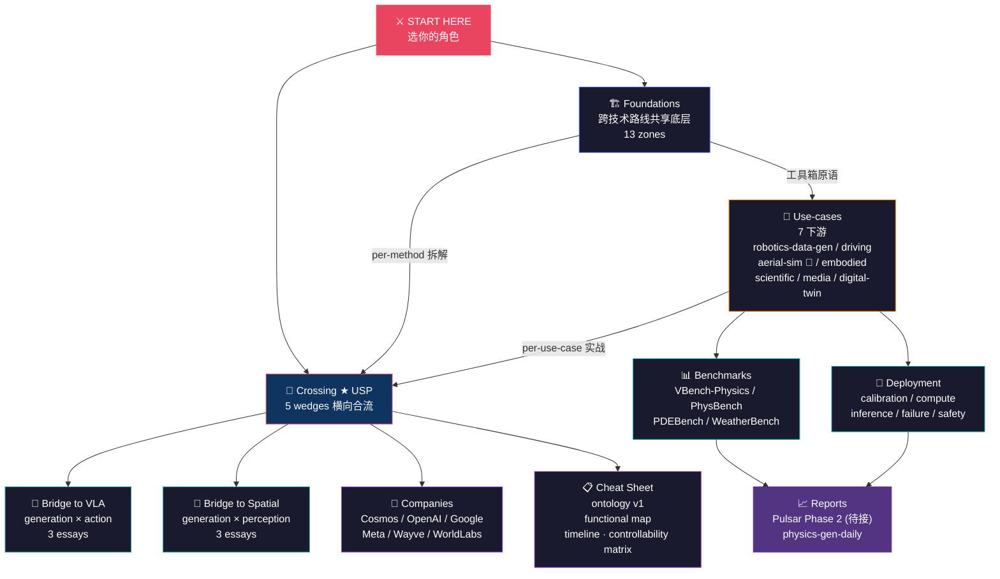

# Physics-Controllable Generation Handbook

> **The first cross-line handbook for physics-as-conditioning generative models** — comparing pixel-video, latent world-models, differentiable simulators, neural PDE surrogates, and 3D-aware generation under one 5-axis ontology, with §8 GitHub-validated pitfall logs on every dissection.
>
> **从 Sora 到 Genesis，从 GraphCast 到 GAIA** — 影片生成圈不讀 PDE solver 圈，diff-sim 圈不讀 latent WM 圈，自駕 closed-loop 圈和神經 surrogate 圈各自閉門造 conditioning。**本 handbook 做一件事：把這 5 條技術路線各自如何「把物理灌進生成」攤在桌上橫向對比，並標註誰違反守恆律、誰能 closed-loop、誰能拿 force 當輸入。**

[](#status)
[](./LICENSE)
[](./cheat-sheet/functional_map.md)
[](./foundations/overview.md)
[](./cheat-sheet/ontology.md)
[](./AUDIT_2026-05-26-v2.md)
[](#三册一体vla--spatial--physics-gen-的分工)

| | |
|---|---|
| 📖 **讀線上版** | 🚧 Mintlify deploy 待 Phase 2 — 目前直接讀 repo markdown，所有內鏈 root-relative 已對齊 Mintlify schema |
| 🚪 **5 分鐘 onboarding** | [`ONBOARDING.md`](./ONBOARDING.md) — 5 條快速分流路徑（A.VLA · B.自駕 · C.影片 · D.PDE · E.landscape）； 細粒度 8-persona 表在下方 🎭 區 |
| 🧭 **5-axis ontology v1** | [`cheat-sheet/ontology.md`](./cheat-sheet/ontology.md) — output × injection × controllability × temporal × domain（每篇 dissection header 強制 enforce） |
| 🤖 **AI access via MCP** | 待 Mintlify Phase 2 部署後自帶 `/mcp` endpoint（與 [Spatial MCP](https://kensou.mintlify.app/mcp) 同 schema） |
| 🌉 **三冊一體 · 姊妹倉** | [VLA-Handbook](https://github.com/sou350121/VLA-Handbook)（action 端）· [Spatial-Intelligence-Handbook](https://github.com/sou350121/Spatial-Intelligence-Handbook)（perception 端，[live](https://kensou.mintlify.app)）· **本倉 = generation 端** |

&nbsp;

<a name="status"></a>
## 📌 Status & Roadmap

| Phase | 內容 | 狀態 |
|---|---|---|
| **Phase 1** — Skeleton + Anchor | 13 zones + **7 use-cases** + 5 USP wedges + **35 anchor dissections** + 5-axis Ontology **v2.0** | ✅ **完成 (2026-05-26)** — audit GREEN + aerial + physics-conditioning USP 5 + Wave 2 (4 empty zones filled) + **Wave 3: 8 more anchors** (SVD · GGS · ContactGen · AnimateDiff · GenCast · PhysBench · DiffTaichi · π0/π0.5) — **all 13 foundations zones + 1 use-case have anchors** |
| **Phase 2** — Mintlify + Pulsar Daily | Mintlify Hobby tier 部署（live URL + /mcp）+ Pulsar 每日 arxiv 抓取 → qwen 評級 → `reports/physics-gen-daily/` | 🚧 規劃中 |
| **Phase 3** — 30+ Dissection + Cross-handbook | 第二批 18 篇 dissection（PhysGen / ContactGen / Decart / DriveDreamer / PangU / NeuralMPM 等）+ 三冊 cross-handbook insight cron | ⏳ 待 Phase 2 完成後啟動 |

&nbsp;

## 三句话说清楚这个 Handbook 的价值

1. **不只是综述**：每篇 dissection 頂帶 5-axis ontology header（output × injection × controllability × temporal × domain），列 2-3 個同軸對手，並附 §8 GitHub-validated pitfall log —— "讀懂論文" 和 "踩過坑" 之間的距離被顯式標出來。
2. **跨 5 條技術路線橫切**：pixel-video（Sora/Veo）· latent WM（Genie/V-JEPA）· diff-sim（Genesis/MJX）· neural surrogate（GraphCast/FNO）· 3D-aware gen —— 市場上所有 generative-physics 綜述都是單一路線閉門寫，本倉是第一本把這 5 條路線上的 physics injection 機制橫向對比的。
3. **活的知识库**：Phase 2 起 Pulsar 自動每日抓 arxiv（cs.CV / cs.LG / cs.GR / cs.RO + physics.flu-dyn / cond-mat.soft）→ qwen 評 ⚡/🔧/📖/❌ → 每日落地到 `reports/physics-gen-daily/`，不是六個月沒人維護的靜態文檔。

&nbsp;

---

&nbsp;

## 🎭 你是谁？

> *选你的角色 → 跳到对应入口。整本 handbook 的 13 條技術路線 · 7 個下游應用 · 5 個 USP wedge 都有自己的旗艦。*

| | 角色 | 你的背景 | 👉 推荐起点 |
|:---:|------|---------|-----------|
| 🤖 | **VLA / robot policy 工程師** | 想用合成資料替代真實 demo | → [Cosmos WFM](./foundations/foundation-physics-models/cosmos-wfm.md) + [V-JEPA-2](./foundations/latent-world-models/v-jepa-2.md) + [`crossing/sim-vs-gen-data/`](./crossing/sim-vs-gen-data/) |
| 🚗 | **自駕 closed-loop sim 工程師** | GAIA / Cosmos-Drive / Wayve 線 | → [GAIA-2](./foundations/video-world-models/gaia-2.md) + [`foundations/long-horizon-rollout/`](./foundations/long-horizon-rollout/) + [`use-cases/autonomous-driving-sim/`](./use-cases/autonomous-driving-sim/) |
| 🚁 | **無人機 autonomy 工程師** | Aerial Gym / Flightmare / Swift / Dream-to-Fly | → [`use-cases/aerial-sim/`](./use-cases/aerial-sim/) ★ + [Aerial Gym](./foundations/differentiable-simulators/aerial-gym.md) + [Champion-Level Drone Racing](./use-cases/aerial-sim/champion-level-drone-racing.md) + Spatial-Handbook `embodiments/aerial/` |
| 🎬 | **影片生成工程師** | Sora / Veo / Kling 路線 | → [Sora](./foundations/video-world-models/sora.md) + [Veo](./foundations/video-world-models/veo.md) + [`crossing/conservation-violation-atlas/`](./crossing/conservation-violation-atlas/) |
| 🧠 | **物理 conditioning 研究者** | PINN · HNN/LNN · PhysDiff · Force Prompting 線 | → [`foundations/physics-conditioning/`](./foundations/physics-conditioning/) ★★ — 整 zone 5 篇 anchor 是本倉 USP 核心 |
| 🌊 | **神經 PDE / surrogate 研究者** | GraphCast / FNO / 氣象 / 流體 | → [GraphCast](./foundations/neural-surrogates/graphcast.md) + [FNO](./foundations/neural-surrogates/fno.md) + [`use-cases/scientific-discovery/`](./use-cases/scientific-discovery/) |
| 🎮 | **互動式 latent WM 工程師** | Genie / Decart / V-JEPA / Dreamer | → [Genie-2](./foundations/latent-world-models/genie-2.md) + [DreamerV4](./foundations/latent-world-models/dreamer-v4.md) + [`crossing/pixel-vs-latent-physics/`](./crossing/pixel-vs-latent-physics/) |
| 🧪 | **Diff-sim 工程師** | MuJoCo MJX / Genesis / Warp | → [Genesis](./foundations/differentiable-simulators/genesis.md) + [MuJoCo MJX](./foundations/differentiable-simulators/mujoco-mjx.md) + [`crossing/sim-vs-gen-data/`](./crossing/sim-vs-gen-data/) |
| 🔬 | **找下一個 paper idea 的研究者** | 想看哪些 niche 沒人解 | → [`crossing/`](./crossing/overview.md) ★ — 5 個 wedge 即 5 條 paper-idea 礦脈（pixel-vs-latent · sim-vs-gen · controllability-vs-fidelity · 守恆律違反地圖 · text-action-trajectory 譜系）|
| 🏗️ | **多領域系統架構師** | 平台/公司同時做 robotics + driving + sim | → [`cheat-sheet/ontology.md`](./cheat-sheet/ontology.md) + [Cosmos WFM](./foundations/foundation-physics-models/cosmos-wfm.md) + [`companies/`](./companies/) |

> 不接受 "HR / 招聘" 入口——這是技術 handbook，不是產業地圖（產業地圖見 [`companies/`](./companies/)）。

&nbsp;

---

&nbsp;

## 🌍 世界地图



> **读图方式**：`foundations/` 是 13 条技术路线的工具箱（任何 use-case / crossing wedge 都会回引用它）；`crossing/` 是把这 13 条线横切的 USP 视角（市面上没有的内容）；`use-cases/` 是下游应用 lane（不是 embodiments — physics-gen 是 upstream pipeline，同一套生成模型服务多个下游）；两条 `bridge-to-*/` 把本仓显式接到 sister handbook 的契约面；其余 5 个目录是支撑层。Pulsar daily reports 接在 benchmarks + deployment 下游，尚未上线。

&nbsp;

---

&nbsp;

## 🏛️ 11 顶层目录

&nbsp;

<details open>
<summary><h3>🏗️ 1. <code>foundations/</code> — 跨技术路线共享底层 &nbsp;<code>13 zones</code></h3></summary>

**一句话**：把「物理可控生成」拆成 13 条独立技术路线 — 从 pixel video WM 到 latent WM、physics conditioning、可微 simulator、neural surrogate、3D-aware gen — 每条线是一个工具箱 zone，所有 use-case 与 crossing wedge 都会回到这里。

**为什么这目录存在**：学术界关于「物理 + 生成」的资源是按*单一方法*（PINN 综述、video diffusion 综述、neural PDE 综述）切的，且彼此不互相引用。本目录把 13 条线统一收齐并对齐到 5-axis ontology（output × injection × controllability × physics-fidelity × domain），让 `use-cases/` 与 `crossing/` 不必各自重造轮子。

| 推荐入口 | 说明 |
|---------|------|
| [`video-world-models/`](./foundations/video-world-models/) | 直接生成像素，物理 implicit — Sora · Veo · Cosmos-Predict · GAIA · SVD anchors |
| [`latent-world-models/`](./foundations/latent-world-models/) | 在 latent 空间 rollout，省 compute、贴 agent control — V-JEPA-2 · DreamerV4 · Genie-2 anchors |
| [`physics-conditioning/`](./foundations/physics-conditioning/) ★★ | 物理规律「怎么进」模型 — **本仓真正的 USP zone**（5 篇 anchor：[PINN](./foundations/physics-conditioning/pinn.md) · [Hamiltonian/Lagrangian NN](./foundations/physics-conditioning/hamiltonian-lagrangian-nn.md) · [PhysGen](./foundations/physics-conditioning/physgen.md) · [PhysDiff](./foundations/physics-conditioning/physdiff.md) · [Force Prompting + NewtonGen](./foundations/physics-conditioning/force-prompting.md)） |
| [`differentiable-simulators/`](./foundations/differentiable-simulators/) | 可微 sim 作为 oracle / loss / 数据源 — MuJoCo MJX · Genesis · Warp · Brax |
| [`neural-surrogates/`](./foundations/neural-surrogates/) | NN 替代 PDE solver，最强物理 inductive bias — GraphCast · FNO · PDE-Refiner |
| [`evaluation-physics/`](./foundations/evaluation-physics/) | 怎么判断生成「物理合理」— VBench-Physics · PhysBench · conservation-violation |
| [`foundation-physics-models/`](./foundations/foundation-physics-models/) | 朝「物理 FM」整合的尝试 — Cosmos 锚点拆解在此 |

其余 6 zones：`diffusion-physics/` · `controllability-mechanisms/` · `3d-aware-generation/` · `long-horizon-rollout/` · `material-and-dynamics/` · `data-engine/`。

📂 **完整 13 zones 导览**：[`foundations/overview.md`](./foundations/overview.md) — 含 ontology 对齐说明 + dissection 密度规划（目标 30+ in 6 个月）

</details>

&nbsp;

<details>
<summary><h3>🎯 2. <code>use-cases/</code> — 7 个下游应用 &nbsp;<code>NOT embodiments</code></h3></summary>

**一句话**：7 条下游 lane — robotics-data-gen / autonomous-driving-sim / **aerial-sim 🚁** / embodied-policy-rollout / scientific-discovery / media-and-content / digital-twin，每条是「生成模型给谁用」的实战切片。

**为什么这目录存在**：跟 Spatial-Handbook 按 *embodiment*（aerial / manipulation / marine）切不一样 — 物理可控生成是 **upstream pipeline**，下游可以是不同 embodiment、不同行业。同一套 video WM 既可以给 robotics 当数据引擎，也可以给 driving 当 closed-loop sim、还可以给 media 做镜头。按 use-case 切才能写清「这套生成模型在这个下游会遇到什么物理约束、什么验收指标」。

| 子目录 | 主轴 | 关联 zone |
|--------|------|------|
| [`robotics-data-gen/`](./use-cases/robotics-data-gen/) | 生成 video/latent/sim 替代真实 demo | video-WM · latent-WM · diff-sim · data-engine |
| [`autonomous-driving-sim/`](./use-cases/autonomous-driving-sim/) | Closed-loop driving WM | video-WM · long-horizon · controllability |
| [`aerial-sim/`](./use-cases/aerial-sim/) ★ | 無人機 closed-loop sim + 合成 aerial footage | diff-sim · long-horizon · data-engine |
| [`embodied-policy-rollout/`](./use-cases/embodied-policy-rollout/) | WM-as-policy / MPC-on-WM | latent-WM · long-horizon · evaluation |
| [`scientific-discovery/`](./use-cases/scientific-discovery/) | Neural surrogate 替代 PDE solver | neural-surrogates · material-and-dynamics |
| [`media-and-content/`](./use-cases/media-and-content/) | 影片 / 广告 / 电影 | video-WM · diffusion-physics · controllability |
| [`digital-twin/`](./use-cases/digital-twin/) | 工厂 / 手术 / 工业 | diff-sim · 3d-aware · data-engine |

> 与 sister handbook 对应：`robotics-data-gen` / `embodied-policy-rollout` ↔ VLA-Handbook；`autonomous-driving-sim` ↔ Spatial-Handbook driving embodiment；**`aerial-sim` ↔ Spatial-Handbook `embodiments/aerial/` ★**（spatial 最深 embodiment）；`digital-twin` / `scientific-discovery` 是本仓独有下游。

</details>

&nbsp;

<details>
<summary><h3>🔭 3. <code>crossing/</code> ★ — 5 USP wedge &nbsp;<code>本书 USP</code></h3></summary>

**一句话**：把 13 条 foundations 路线横切后的对比视角 — 这是市场上所有物理生成资源都没有的内容。

**为什么这目录存在**：foundations/ 写「这条路线是什么」，任何人都能写；crossing/ 写「这条路线跟那条路线在什么维度冲突 / 互补」— 别处看不到。Physics-gen 不是单一方法、而是一束竞争中的路线（pixel vs latent、sim data vs gen data、text vs action vs trajectory 作为 conditioning），这些选择题没人系统对比过。

| 子目录 | 一句话 |
|--------|------|
| [`pixel-vs-latent-physics/`](./crossing/pixel-vs-latent-physics/) | 什么时候该在 pixel 学物理、什么时候该在 latent 学 |
| [`sim-vs-gen-data/`](./crossing/sim-vs-gen-data/) | 机器人资料：合成 sim / 生成模型 / 真实 demo，哪个赢 |
| [`controllability-vs-fidelity/`](./crossing/controllability-vs-fidelity/) | 加越多 conditioning 为什么 fidelity 越烂 — Pareto |
| [`conservation-violation-atlas/`](./crossing/conservation-violation-atlas/) | 主流方法 × 5 守恒律的失败地图 |
| [`text-action-trajectory-spectrum/`](./crossing/text-action-trajectory-spectrum/) | Controllability input 的光谱 — 为什么 text 不够、action 不够、需 multi |

**写入门槛极高**：每个 wedge 需要明确 thesis、跨 ≥2 条技术路线、≥3 个 anchor 方法的失效实测、一张对比表、不写 paper summary。详见 [`crossing/overview.md`](./crossing/overview.md)。

</details>

&nbsp;

<details>
<summary><h3>🌉 4. <code>bridge-to-vla/</code> — generation × action 边界 &nbsp;<code>3 essays</code></h3></summary>

**一句话**：本仓是 generation 端、VLA-Handbook 是 action 端 — 这目录写两端的明确交界。

**为什么这目录存在**：物理可控生成最大的下游是 VLA（生成 demo 训 policy、把 WM 当 policy、用 video pretrain latent 接 action head）。但两端契约（数据 schema、坐标系、是否 grounded action token）必须显式写出来，不能放在 foundations/ 也不能放在 use-cases/。

| 篇 | 主题 |
|---|---|
| [`generative-data-for-vla.md`](./bridge-to-vla/generative-data-for-vla.md) | 生成资料能否替代真实 demo 训 VLA |
| [`world-model-as-policy.md`](./bridge-to-vla/world-model-as-policy.md) | DreamerV4 / V-JEPA-2 直接当 policy 的范式 |
| [`video-pretraining-for-action.md`](./bridge-to-vla/video-pretraining-for-action.md) | 用 video pre-train 出 latent embedding 再接 action head |

> 刻意保持 3 篇稀疏 — bridge 不该变成第二个 foundations。新增需满足：跨 generation × action 明确设计问题 + 两冊都不能单独完整覆盖 + ≥2 anchor 方法。

</details>

&nbsp;

<details>
<summary><h3>🌉 5. <code>bridge-to-spatial/</code> — generation × perception 边界 &nbsp;<code>3 essays</code></h3></summary>

**一句话**：本仓是 generation 端、Spatial-Handbook 是 perception 端 — 这目录写两端的明确交界。

**为什么这目录存在**：三冊一体（Physics-gen + VLA + Spatial）的设计是 — generation 端管「世界怎么演化」、perception 端管「世界长什么样」、action 端管「身体怎么动」。两个 bridge 目录（unlike Spatial 只有 1 个 bridge）是因为本仓同时是两端的 upstream：往下接 VLA（生成数据 / WM-as-policy），往侧接 Spatial（3D-aware video gen / spatial conditioning）。

| 篇 | 主题 |
|---|---|
| [`3d-aware-video-gen.md`](./bridge-to-spatial/3d-aware-video-gen.md) | 3DGS / NeRF 重建表征如何条件化影片生成 |
| [`nerf-3dgs-meet-world-model.md`](./bridge-to-spatial/nerf-3dgs-meet-world-model.md) | 3DGS-based world model（显式 3D 表征的 WM） |
| [`spatial-controllability.md`](./bridge-to-spatial/spatial-controllability.md) | Spatial structure 作为 conditioning（occupancy / depth / pose 怎么进生成） |

> 写作 rule：任何在 Spatial-Handbook 已覆盖的主题，本仓只写「generation 端视角差异」；§6 cross-line synthesis 必须 link 到 spatial 对应 dissection。

</details>

&nbsp;

<details>
<summary><h3>📋 6. <code>cheat-sheet/</code> — 30 分钟掌握全景 &nbsp;<code>ontology v1 + 3 速查表</code></h3></summary>

**一句话**：四张表，从 5-axis ontology 到 controllability matrix，一条读完即懂 landscape。

**为什么这目录存在**：13 zones × 6 use-cases × 5 wedges 的组合空间大，新读者需要一个「我有 X 需求 → 该看哪条路线」的入口。`ontology.md` 同时是每篇 dissection header 的标签来源 — 让全仓 30+ dissection 用同一组标签系统对齐。

| 档 | 用途 |
|---|---|
| [`ontology.md`](./cheat-sheet/ontology.md) | 5-axis taxonomy — 每篇 dissection header 标签来源 |
| [`functional_map.md`](./cheat-sheet/functional_map.md) | 「我有 X 需求 → 该看哪条技术路线」一张表 |
| [`timeline.md`](./cheat-sheet/timeline.md) | 2023→2026 路线演化、谁被谁取代、谁还活着 |
| [`controllability_input_matrix.md`](./cheat-sheet/controllability_input_matrix.md) | 主流方法 × 9 种 controllability input 的支援度矩阵 |

> `physics_violation_atlas` 移到 [`crossing/conservation-violation-atlas/`](./crossing/conservation-violation-atlas/)（跨方法比较更适合放 crossing）。

</details>

&nbsp;

<details>
<summary><h3>🔧 7. <code>deployment/</code> — 把生成模型送上线 &nbsp;<code>5 lanes</code></h3></summary>

**一句话**：从 paper 到生产部署的工程坑全在这。

| 子目录 | 内容 |
|--------|------|
| [`calibration/`](./deployment/calibration/) | 物理感校准：人工 vs auto eval；rating thresholds |
| [`compute-budget/`](./deployment/compute-budget/) | 训练 / 推理 GPU 预算估算（每类模型） |
| [`inference-cost/`](./deployment/inference-cost/) | Latency / throughput / batch trade-off |
| [`failure-modes/`](./deployment/failure-modes/) | 部署实测失效汇整（连到 crossing/conservation-violation-atlas） |
| [`safety-guardrails/`](./deployment/safety-guardrails/) | Misuse / deepfake / 物理错误误导 |

</details>

&nbsp;

<details>
<summary><h3>📊 8. <code>benchmarks/</code> — 评测 benchmark 拆解 &nbsp;<code>5 类</code></h3></summary>

**一句话**：每条技术路线有自己的 benchmark 生态，刷榜数字不等于下游能跑。

**为什么这目录存在**：对应 ontology Axis 1 (output) × Axis 5 (domain) 的主要交点。VBench-Physics / PhysBench / PDEBench / WeatherBench 已被反复刷榜，"VBench-Physics 95%" 不等于真能给 robotics 训出 policy。本目录拆 benchmark 的 *条件 + 失败模式 + 下游 gap*。

| 子目录 | Benchmark |
|---|---|
| [`video-physics/`](./benchmarks/video-physics/) | VBench-Physics · PhysBench · PhyGenBench |
| [`world-model/`](./benchmarks/world-model/) | WorldModelEval · DreamerSimEval |
| [`robot-data/`](./benchmarks/robot-data/) | Generated data → policy success rate 量测 |
| [`scientific/`](./benchmarks/scientific/) | PDEBench · WeatherBench |
| [`controllability/`](./benchmarks/controllability/) | Controllability-fidelity Pareto bench |

</details>

&nbsp;

<details>
<summary><h3>🏢 9. <code>companies/</code> — 产业地图</h3></summary>

**一句话**：物理可控生成在工业界谁在做什么、谁的 stack 值得抄。

| 厂商 | 角度 |
|------|------|
| NVIDIA Cosmos | World Foundation Model 全栈（Predict + Reason）— 旗舰 |
| OpenAI Sora | pixel video gen — implicit-physics 旗舰 |
| Google DeepMind | Veo · Genie · GraphCast · GenCast — 跨 video+latent+surrogate 三线 |
| Meta FAIR | V-JEPA / V-JEPA-2 — LeCun latent 派旗舰 |
| World Labs | 3D scene gen — 3D-aware 旗舰 |
| Wayve | GAIA driving WM — driving sim 旗舰 |
| Decart | Real-time interactive WM — latent rolling WM |
| Physical Intelligence (PI) | VLA + data engine — robotics-data-gen 接口 |
| Genesis Embodied | 统一可微 sim — diff-sim 新兴 |
| Runway / Pika / Kling / Hunyuan / Wan | 影片商业线 — media use-case |
| ECMWF / DeepMind weather | Surrogate prod — scientific 旗舰 |

> 与 Spatial-Handbook companies 重叠的 4 家（nvidia_cosmos / wayve / world_labs / physical_intelligence），本仓用「生成端」视角重写 — 强调 Cosmos 的 Predict 线、World Labs 的 3D gen 而非 reconstruction。§6 cross-line synthesis 必须交叉链接 sister repo。

</details>

&nbsp;

<details>
<summary><h3>📈 10. <code>reports/physics-gen-daily/</code> — Pulsar 自动产出 &nbsp;<code>待接</code></h3></summary>

**一句话**：每个 weekday 的 arxiv keyword-filtered 拆评 — 由 [Pulsar pipeline](https://github.com/sou350121/Pulsar-KenVersion) Phase 2 部署后自动生成。

**为什么这目录存在**：物理可控生成的 arxiv 流（cs.LG / CV / GR / RO + physics.flu-dyn + cond-mat.soft）每日有信号，但单看每篇没有路线维度。Pulsar 抓取 → LLM 评 ⚡/🔧/📖/❌ + 一句话 takeaway → 90 天 retention，让 zone-level 趋势可见。

| 项目 | 状态 |
|------|------|
| `physics-gen-daily/YYYY-MM-DD.md` | **待接** — Phase 2 scripts 移植完成后开始 |
| 评级语义 | ⚡ 重大 / 🔧 工程有料 / 📖 值得知道 / ❌ 不收 |

> 第一笔预计在 Pulsar Phase 2 部署后产出 — 目前不是 live。详见 [`reports/physics-gen-daily/README.md`](./reports/physics-gen-daily/README.md)。

</details>

&nbsp;

<details>
<summary><h3>📚 11. <code>docs/</code> + 🛠️ <code>scripts/</code> — 工程支撑</h3></summary>

**一句话**：Mintlify 站点 + MCP 接口 + Pulsar 移植记录，加上 audit / 自动化脚本。

**为什么这目录存在**：本仓是三冊一体的一环，需要跟 sister handbook 共用 Mintlify docs.json schema、MCP server tool 命名空间、Pulsar cron 时序。把工程细节集中到 `docs/` 与 `scripts/`，避免污染内容目录。

| 子档 | 用途 |
|------|------|
| [`docs/mintlify-deployment.md`](./docs/mintlify-deployment.md) | Mintlify 站点配置 / 锚点 / 跨仓链接 |
| [`docs/mcp-integration.md`](./docs/mcp-integration.md) | MCP server tool 命名空间（与 VLA / Spatial 区隔） |
| [`docs/pulsar-integration.md`](./docs/pulsar-integration.md) | Pulsar Phase 2 移植：cron 时序 / RSS 源 / LLM prompt |
| [`scripts/pulsar/`](./scripts/pulsar/) | Pulsar 子集脚本（arxiv 抓取 + rating + dedup） |
| [`scripts/README.md`](./scripts/README.md) | Audit-driven workflow 入口（参考 [`AUDIT_2026-05-25.md`](./AUDIT_2026-05-25.md)） |

</details>

&nbsp;

---

&nbsp;
## 📍 先看这几篇（30 分钟建立框架）

按依赖顺序排列——每一篇回答上一篇读完后自然产生的问题。

**第一层：foundations 是什么、为什么物理可控生成 2024-2026 成立（~15 min）**

1. **[Cosmos WFM dissection](./foundations/foundation-physics-models/cosmos-wfm.md)** `5 min` — 先建立全局图：为什么需要 **World Foundation Model** 这个概念、Cosmos 一家就要跨 Predict / Reason / Drive / Robotics 4 条子线，「物理基础模型」到底要长什么样。
2. **[Sora dissection](./foundations/video-world-models/sora.md) + [V-JEPA-2 dissection](./foundations/latent-world-models/v-jepa-2.md)** `10 min` — 同一个问题（视频里的物理规律该在哪学），**pixel 端**（Sora：DiT + spacetime patch，hallucinate first, fix later）和 **latent 端**（V-JEPA-2：joint-embedding，不在像素上算 loss）给出完全对立的答案。先把这两端的张力吃透，后面所有 crossing 都是这个张力的展开。

**第二层：crossing wedge — handbook 的 USP（~10 min）**

3. **[crossing/pixel-vs-latent-physics](./crossing/pixel-vs-latent-physics/)** `5 min` — 把第一层那个对立写成范式之争：**LeCun line（latent 派）vs scale-pill line（pixel 派）**，谁会赢、用什么判据判、当下 evidence 落在哪一侧。这是这本 handbook 的代表性 wedge。
4. **[crossing/conservation-violation-atlas](./crossing/conservation-violation-atlas/)** `5 min` — 各家方法（Sora / Veo / Cosmos / GAIA-2 / V-JEPA-2 / Genie-2 / Genesis / GraphCast）在 **5 条守恒律**（质量 / 动量 / 能量 / 不可穿透 / 因果方向）上的违反地图。读完你会知道「物理感」这种模糊词在工程上能拆成什么。

**第三层：对接 sister handbooks（按需深入）**

5. **[bridge-to-vla](./bridge-to-vla/)** `5 min` — Physics-Gen 这边生出来的合成数据怎么接到 VLA-Handbook 那边的 action policy：两端的契约是什么、哪些 sim2real gap 必须在生成端就处理、哪些可以推到 policy 端。

&nbsp;

---

&nbsp;

## ⚡ Speed Runs

> *按目标选一条最短路线。*

&nbsp;

### 🤖 给 VLA pre-train 补数据（4 篇）

```
foundations/foundation-physics-models/cosmos-wfm →
foundations/latent-world-models/v-jepa-2 →
crossing/sim-vs-gen-data →
bridge-to-vla/
```

[开始 →](./foundations/foundation-physics-models/cosmos-wfm.md) — 先建 WFM 全局观，再看 latent 派的 data efficiency 立论，然后用 crossing 判断「合成 vs 仿真」哪一端给的数据更好用

&nbsp;

### 🚗 自驾 closed-loop sim（4 篇）

```
foundations/video-world-models/gaia-2 →
foundations/long-horizon-rollout/ →
companies/ (Wayve / NVIDIA Cosmos-Drive) →
crossing/controllability-vs-fidelity
```

[开始 →](./foundations/video-world-models/gaia-2.md) — GAIA-2 是 driving WM 像素端的代表，long-horizon rollout 是它落 closed-loop 必须解决的问题，最后用 crossing 看「可控 vs 高保真」trade-off

&nbsp;

### 🚁 無人機 autonomy（4 篇）

```
use-cases/aerial-sim/overview →
foundations/differentiable-simulators/aerial-gym →
use-cases/aerial-sim/champion-level-drone-racing →
Spatial-Handbook embodiments/aerial/ (cross-ref)
```

[开始 →](./use-cases/aerial-sim/) — 先看 aerial-sim use-case 全景（Aerial Gym / Flightmare / Swift / Dream-to-Fly），再 deep-dive Aerial Gym diff-sim 與 Swift sim-to-real，最後跨倉到 Spatial-Handbook 的 aerial embodiment 看 VIO / dynamics

&nbsp;

### 🎬 视频生成 + 物理感（3 篇）

```
foundations/video-world-models/sora →
foundations/video-world-models/veo →
crossing/conservation-violation-atlas
```

[开始 →](./foundations/video-world-models/sora.md) — 先吃透两家旗舰像素 WM 的设计，再用守恒律 atlas 看「物理感」到底是哪条规律没违反

&nbsp;

### 🌊 神经 PDE 替代 solver（3 篇）

```
foundations/neural-surrogates/graphcast →
foundations/neural-surrogates/fno →
use-cases/scientific-discovery/
```

[开始 →](./foundations/neural-surrogates/graphcast.md) — GraphCast 是 production-grade（ECMWF 已用）的神经 surrogate，FNO 是 operator learning 的范式起点，最后看科学发现侧的真实 use case

&nbsp;

### 🎮 互动式 WM / agent control（3 篇）

```
foundations/latent-world-models/genie-2 →
foundations/latent-world-models/dreamer-v4 →
crossing/pixel-vs-latent-physics
```

[开始 →](./foundations/latent-world-models/genie-2.md) — Genie-2 把 WM 推到「per-frame action conditioning」，Dreamer-v4 是 RL latent WM 的延续，最后回到 pixel vs latent 的范式之争看 controllability 落点

&nbsp;

### 🧪 Diff-sim → 生成模型的桥（3 篇）

```
foundations/differentiable-simulators/genesis →
foundations/differentiable-simulators/mujoco-mjx →
crossing/sim-vs-gen-data
```

[开始 →](./foundations/differentiable-simulators/genesis.md) — Genesis 喊 150× speedup 的争议要先看清楚，MuJoCo MJX 是 JAX 端的 mature baseline，最后用 crossing 判断「diff-sim 出来的数据」和「生成模型出来的数据」该怎么配比

&nbsp;

### 🔬 找下一个 paper idea（3 篇）

```
crossing/conservation-violation-atlas →
crossing/text-action-trajectory-spectrum →
crossing/controllability-vs-fidelity
```

[开始 →](./crossing/conservation-violation-atlas/) — 三条 crossing wedge 各自有一打 "无人占坑" 的 atlas cell / spectrum 中段 / Pareto 前沿点

&nbsp;

### 🧠 物理 conditioning 深度（5 篇 + overview）

```
foundations/physics-conditioning/overview (6 injection 對比 + 5 代演化) →
foundations/physics-conditioning/pinn (aux-loss 鼻祖) →
foundations/physics-conditioning/hamiltonian-lagrangian-nn (hard-constraint 鼻祖) →
foundations/physics-conditioning/physdiff (guidance-gradient + sim-in-loop-infer) →
foundations/physics-conditioning/physgen + force-prompting (2024-25 新潮)
```

[开始 →](./foundations/physics-conditioning/) ★★ — 整本 handbook 的 USP zone：5 種 injection 機制橫向對比，從 PINN (2017) 到 NewtonGen (2025) 完整演化線；包含 anti-pattern atlas 與 5 代演化 timeline

&nbsp;

### 🏗️ 系统设计：5-axis ontology（3 篇）

```
cheat-sheet/ontology.md →
cheat-sheet/ontology-v1.1-review.md →
foundations/overview.md
```

[开始 →](./cheat-sheet/ontology.md) — v1 給你完整 5 軸定義，v1.1 review 把 canonical refs / critique / 修正建議一次列齊，最後回 foundations overview 驗證落點。**這是想自己加 dissection 必讀**。

&nbsp;

---

&nbsp;

## 🏆 Achievements

读完一篇就算解锁。看看你能拿几个？

| | 成就 | 解锁条件 |
|:---:|------|---------|
| 🥉 | **First Blood** | 读完任意 1 篇 dissection |
| 🎓 | **Pixel + Latent + Sim** | 读完 Sora + V-JEPA-2 + Genesis 三篇 |
| 🌍 | **Cross-Line Tour** | 跨 5 條主路線（video-WM · latent-WM · diff-sim · neural-surrogate · 3D-aware-gen）各讀 ≥ 1 篇 |
| 🧠 | **Injection Atlas Master** | 讀完 physics-conditioning 5 篇 anchor（PINN · HNN/LNN · PhysDiff · PhysGen · Force Prompting）+ overview 的 anti-pattern atlas |
| 🔭 | **USP Hunter** | 读完 5 个 crossing wedge overview |
| 🐉 | **Boss Hunter** | 读完 boss monsters 中的 3 篇（见下表） |
| ⚡ | **Speed Runner** | 完成任意一条 Speed Run |
| 🧮 | **Ontology Master** | 读 ontology v1 + v1.1 review + 从 5 轴各取 ≥ 1 篇代表作 |
| 👑 | **Handbook Master** | 11 个顶层目录（foundations / crossing / use-cases / companies / benchmarks / cheat-sheet / bridge-to-vla / bridge-to-spatial / deployment / reports / docs）各读 ≥ 1 篇 + 完成 ≥ 3 条 Speed Run |

<details>
<summary>🐉 Boss Monsters（整本 handbook 最难的 5 篇）</summary>

| 文章 | Why It's Hard |
|------|---------------|
| [crossing/conservation-violation-atlas](./crossing/conservation-violation-atlas/) | 5 条守恒律 × N 种方法的完整 atlas，每 cell 都要 paper-level evidence + 工程数字 |
| [crossing/pixel-vs-latent-physics](./crossing/pixel-vs-latent-physics/) | LeCun line vs scale-pill line 的范式之争，要看懂两边判据、当下 evidence 落点、未来 falsifier |
| [foundations/foundation-physics-models/cosmos-wfm](./foundations/foundation-physics-models/cosmos-wfm.md) | 一篇要跨 Cosmos 4 条子线（Predict / Reason / Drive / Robotics），「物理基础模型」这个概念到底成不成立 |
| [foundations/differentiable-simulators/genesis](./foundations/differentiable-simulators/genesis.md) | Genesis 150× 速度的争议要拆清楚，diff-sim 在 generation 时代的差异化定位 |
| [foundations/physics-conditioning/hamiltonian-lagrangian-nn](./foundations/physics-conditioning/hamiltonian-lagrangian-nn.md) | hard-constraint 線最深學術 — Hamilton 動力學 → autograd 鏈式法則 → 為什麼 2020 後停滯 |
| [foundations/physics-conditioning/pinn](./foundations/physics-conditioning/pinn.md) | NTK 失效分析（Wang 2022）+ 8 條 DeepXDE issue 的踩坑路徑 |
| [cheat-sheet/ontology-v1.1-review](./cheat-sheet/ontology-v1.1-review.md) | 5 轴 ontology 的完整 critique + canonical references + 修正建议——这本 handbook 的 spine |

</details>

&nbsp;

---

&nbsp;

## 三册一体（VLA · Spatial · Physics-Gen 的分工）

三本 handbook 各自独立，但互引——同一条 paper 在不同册里读出的结论不一样。穿越时走对应 `bridge-to-*` 目录。

| 内容类型 | 主入口 | 其他册的处理 |
|---|---|---|
| Action policy（diffusion / flow matching） | **VLA-Handbook** | Physics-Gen 只引结论 |
| 3D representation（3DGS / VGGT / depth） | **Spatial-Handbook** | Physics-Gen 经 [bridge-to-spatial](./bridge-to-spatial/) 引用 |
| Sensor 物理 / SWaP-C | **Spatial-Handbook** | Physics-Gen 不收 |
| World model 作为生成器（Cosmos-Predict / Sora / Veo） | **Physics-Gen** | 两个 sister handbook 引结论 |
| Differentiable simulator（Genesis / MuJoCo MJX） | **Physics-Gen** | VLA 经 bridge-to-vla 引 |
| Driving WM 像素端（GAIA-2 / Cosmos-Drive） | **Physics-Gen** | Spatial 经 bridge-to-spatial 引 |
| 無人機 sim（Aerial Gym / Flightmare） + sim-to-real 範式 | **Physics-Gen** | Spatial `embodiments/aerial/` ★ 引動力學/VIO 側 |
| Neural PDE surrogate（GraphCast / FNO） | **Physics-Gen** | 其他册不收 |
| Sim2real（动力学侧） | **VLA-Handbook** | Physics-Gen 引 representation 侧的处理 |

&nbsp;

---

&nbsp;

## 许可证与贡献

Apache 2.0 · 欢迎 Issue 和 PR：补 dissection · WFM 实测 · benchmark 复现 · crossing wedge 新单元格

- 看 [`AGENTS.md`](./AGENTS.md) — dissection 模板 + 文档分层 + audit 规则
- 看 [`CONTRIBUTING.md`](./CONTRIBUTING.md) — PR 流程
- 维护者 / 路线图 / 风险对冲：[`MAINTAINER.md`](./MAINTAINER.md)
- AI 整合：[`docs/mcp-integration.md`](./docs/mcp-integration.md) · Mintlify 部署：[`docs/mintlify-deployment.md`](./docs/mintlify-deployment.md) · Pulsar 整合：[`docs/pulsar-integration.md`](./docs/pulsar-integration.md)

&nbsp;

---

&nbsp;

[→ Foundations (工具箱)](./foundations/overview.md) · [→ Crossing ★ USP](./crossing/overview.md) · [→ Use Cases](./use-cases/overview.md) · [→ Bridge to VLA](./bridge-to-vla/overview.md) · [→ Bridge to Spatial](./bridge-to-spatial/overview.md) · [姊妹仓：VLA-Handbook](https://github.com/sou350121/VLA-Handbook) · [Spatial-Intelligence-Handbook](https://github.com/sou350121/Spatial-Intelligence-Handbook)
