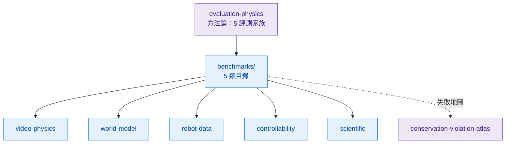

# Benchmarks

> 物理可控生成的 **benchmark 目錄**——按 5 類切，每類是一張「測什麼 / metric / 已知缺陷」的全景表。**怎麼量**的方法論（五個評測家族 + 共通陷阱）在 [foundations/evaluation-physics](../foundations/evaluation-physics/overview.md)；這裡是**有哪些 benchmark、各自的坑**。

## 5 類索引

| 類 | 測什麼 | 代表 benchmark | 一句話缺口 |
|---|---|---|---|
| [video-physics](./video-physics/overview.md) | 生成影片的物理可信度 | Physics-IQ · VideoPhy(-2) · PhyGenBench · VBench(-2.0) · PhysBench | 視覺真 ≠ 物理真（Physics-IQ r=−0.46 不顯著） |
| [world-model](./world-model/overview.md) | WM 預測保真 / 長程一致 / 下游 control 收益 | WorldModelBench · IntPhys 2 · LikePhys · DreamerV3 協議 | long-horizon 一致性無公認 metric；互動 WM 無公開協議 |
| [robot-data](./robot-data/overview.md) | 生成/合成機器人資料的價值 = 下游 policy 成功率 | LIBERO · RoboCasa · SIMPLER · DreamGen · RoboArena | sim 成功 ≠ real 成功；real eval 貴又難復現 |
| [controllability](./controllability/overview.md) | 輸出服從 condition 多少、損多少保真度 | ObjMC · ControlNet 指標 · Cosmos-Transfer1 · CFG Pareto | 無公認 controllability-fidelity Pareto benchmark |
| [scientific](./scientific/overview.md) | neural-surrogate 的 PDE 精度 / 天氣 skill / 守恆誤差 | PDEBench · WeatherBench(2) · GenCast · The Well | skill score ≠ 物理一致；守恆很少當主指標 |

## 為什麼分這 5 類

對應 ontology Axis 1（output）× Axis 5（domain）的主要交點：video-physics = pixel-video × generalist；world-model = latent/pixel × agent；robot-data = action × robotics；controllability = 跨 output × control 軸；scientific = field × fluid/weather。五類合起來就是「物理可控生成」會被量到的所有面。

## 怎麼讀這些分數（先看方法論）

全部 benchmark 都帶 [evaluation-physics](../foundations/evaluation-physics/overview.md) 講的五個陷阱，最該記三條：

- **視覺真 ≠ 物理真**——高 perceptual 分不代表懂物理（Physics-IQ）。
- **Goodhart / reward-hacking**——優化某指標 ≠ 改善物理；至少兩類交叉驗證。
- **沒有單一 benchmark 覆蓋全部 5 守恆軸**——失敗全景看 [conservation-violation-atlas](../crossing/conservation-violation-atlas/overview.md)；終極真相是下游遷移（[robot-data](./robot-data/overview.md)）。

## 現況

5 類目錄已從 stub 升為 source-grounded 全景（各帶 arXiv + 已知缺陷）。**最大的領域缺口**：① 沒有 controllability-fidelity 的統一 Pareto benchmark；② long-horizon WM 一致性沒有公認 metric；③ 守恆/物理一致很少被當科學 benchmark 的主指標。這三個正是 [crossing/](../crossing/overview.md) 幾個 wedge 指出的同一批硬骨頭。
