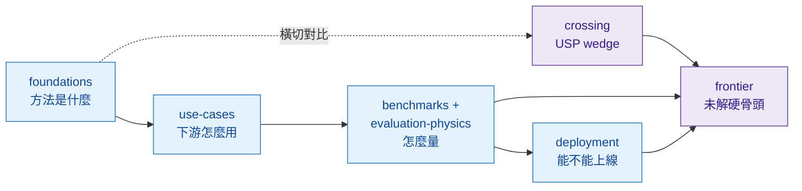

# Cheat-sheet — 30 分鐘掌握全景

這頁是全書的最頂層地圖。先看下圖抓住六個 tab 怎麼接、該照什麼順序讀，再用底下四張表深入細節。

*全書讀法：[foundations](../foundations/overview.md)（方法是什麼）→ [use-cases](../use-cases/overview.md)（下游怎麼用）→ [benchmarks](../benchmarks/overview.md)/evaluation（怎麼量）→ [deployment](../deployment/overview.md)（能不能上線）；[crossing](../crossing/overview.md) 橫切做方法對比，[frontier](../frontier/overview.md) 收斂所有未解的硬骨頭。*

四張表，從 ontology 到 violation atlas，一條讀完即懂 landscape。

| 檔 | 用途 |
|---|---|
| [ontology.md](ontology.md) | 5-axis taxonomy — 每篇 dissection 的 header 標籤來源 |
| [functional_map.md](functional_map.md) | 「我有 X 需求 → 該看哪條技術路線」一張表 |
| [timeline.md](timeline.md) | 2023→2026 路線演化、誰被誰取代、誰還活著 |
| [controllability_input_matrix.md](controllability_input_matrix.md) | 主流方法 × 9 種 controllability input 的支援度矩陣 |

`physics_violation_atlas` 物件搬到 [`/crossing/conservation-violation-atlas/`](../crossing/conservation-violation-atlas/overview.md)（因為跨方法比較更適合放 crossing）。

## 讀法

1. 不熟 landscape → 從 [`functional_map.md`](functional_map.md) 進
2. 要落到 dissection → 從 [`ontology.md`](ontology.md) 找 axis 值對應的章節
3. 想看誰先誰後 → [`timeline.md`](timeline.md)
4. 評估自家系統能不能塞某 method → [`controllability_input_matrix.md`](controllability_input_matrix.md)
