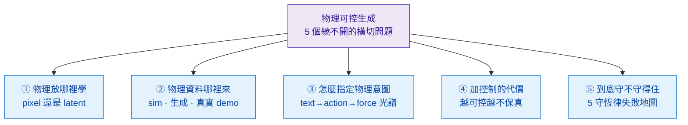

# Crossing — 5 個 USP wedge

> **這是 handbook 真正的獨家**。foundations/ 任何人都能寫（「這條路線是什麼」）；crossing/ 是把多條技術路線**橫切**後的對比視角——別處看不到。

## 5 個 wedge = 物理可控生成的 5 個橫切問題

要做物理可控生成，繞不開五個問題。每個都跨多條技術路線、各有一個 Pareto 或一張失敗地圖——這五個切面就是本區：

| 軸 | 問題 | Wedge | 一句話結論 |
|---|---|---|---|
| **放哪** | 物理規律該在 pixel 還是 latent 學？ | [pixel-vs-latent-physics](pixel-vs-latent-physics/overview.md) | 不是保真度之爭，是 affordance 取捨——要 agent control 走 latent、要視覺即產品走 pixel，DreamerV4 走 hybrid |
| **哪來** | 物理資料用 sim、生成、還是真實 demo？ | [sim-vs-gen-data](sim-vs-gen-data/overview.md) | 主流共識不是純派勝出，而是 **real 主幹 + sim 鎖物理 + gen 補長尾** 的混用（π0 預訓 90.9% 真實 / 9.1% 開源） |
| **怎麼指定** | 怎麼把物理意圖餵進去？ | [text-action-trajectory-spectrum](text-action-trajectory-spectrum/overview.md) | 9 種 conditioning input 的光譜；robotics 真正稀缺的是 **text+action+force+contact 同時接** 的接口 |
| **什麼代價** | 加 conditioning 要付什麼？ | [controllability-vs-fidelity](controllability-vs-fidelity/overview.md) | 控制與保真度搶同一份生成預算——guidance scale 拉高、controllability 升、保真度掉（CFG 量化曲線可證） |
| **守不守得住** | 生成結果到底守不守物理？ | [conservation-violation-atlas](conservation-violation-atlas/overview.md) | 主流方法 × 5 守恆律的失敗地圖；Physics-IQ 實證「視覺真 ≠ 物理真」（Pearson r=-0.46，不顯著） |

*圖：五個 wedge 不是並列的雜項，而是同一件事（物理可控生成）必答的五個橫切問題——表徵放哪、資料哪來、介面怎麼指定、控制付什麼代價、結果守不守得住。*

## 五個 wedge 之間怎麼串

它們不是獨立的：

- **③ 介面**選得越精細（往 force / contact 端走），**④ 代價**越重（多模態 conditioning 互相壓制、保真度掉），但 **⑤ 守恆**才有機會改善——三者是同一條權衡鏈。
- **② 資料來源**決定 **⑤ 守不守得住**的上限：純生成資料把隱式物理偏差也學進去（atlas 裡 video-WM 那排幾乎全違反），sim 資料守恆但有 sim2real gap。
- **① 表徵**決定 **⑤ 怎麼測**：pixel-WM 可直接量質量 / 動量 / 穿透（atlas 適用），latent-WM 的守恆在表徵空間不可視（atlas 標 N/A）。
- **⑤ conservation-violation-atlas 是裁判**：其他四個 wedge 的取捨，最終都要回到「這樣選，物理到底守不守得住」來驗收。每篇 dissection 的 §8 都應標出它在 atlas 上的位置。

## 寫作標準

每個 wedge 需要：
- **明確的 thesis statement**（一行）
- 跨 ≥ 2 條技術路線的比較
- 至少 3 個 anchor 方法的失效實測（**source-grounded 或標 `UNVERIFIED`**，不捏造數字）
- 一張 ASCII / markdown 對比表（或安全配方的 mermaid）
- 不寫 paper summary

## 與 foundations/ 的關係

foundations/ 寫「這條路線是什麼」；crossing/ 寫「這條路線跟那條路線在什麼維度衝突 / 互補」。一篇 dissection 屬於某條路線；一個 wedge 橫跨多條路線取一個對比軸。兩者互補：讀完 foundations 知道有哪些工具，讀完 crossing 才知道工具之間怎麼選、選了要付什麼。
