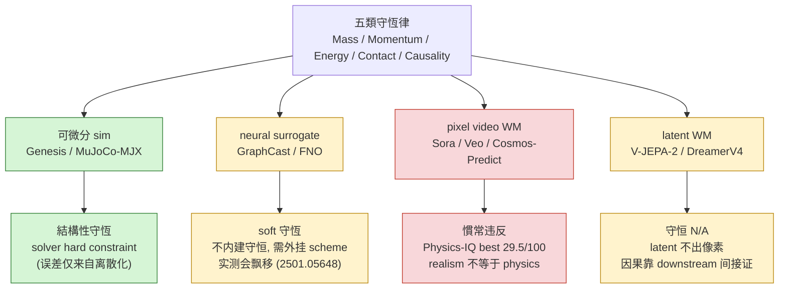

# Conservation Violation Atlas

> 各生成 / sim / surrogate 方法在 **質量 / 動量 / 能量 / 接觸無穿透 / 因果一致** 五類守恆律上的「違反程度地圖」。
> 這不是 paper 摘要，而是一張橫切 (cross-cutting) 的 **失效地圖 (failure map)** —— handbook 的旗艦 USP。

---

## 0. Thesis：為什麼要一張「守恆違反地圖」

「這個影片生成模型物理對不對」是個壞問題，因為它把五件互相獨立的事壓成一個分數。一個模型可以：

- 流體看起來很自然（質量大致守），但
- 兩個剛體穿模（接觸無穿透崩），同時
- 落體加速度不對（能量崩），而且
- 第 5 秒突然多出一個物體（因果崩）。

**單一 benchmark 的單一分數會把這些抵銷掉**。本 atlas 的主張：要把「物理保真度 (physics fidelity)」拆成 **五條獨立軸**，分別問「在這一條守恆律上，這個方法違反到什麼程度、有沒有 benchmark 實測過」。

**v0.1（本檔前一版）的矩陣全是「預期值」（EXPECTED，非實測）。本版的核心工作：把每一格盡量 ground 到真實 benchmark；找不到證據的格子明確標 `UNVERIFIED`／「推測」。** 這是本檔最大的價值增量 —— 把直覺地圖升級成證據地圖。

---

## 1. 五類守恆律：怎麼測 + 已知最容易違反者

| 律 | 怎麼測（benchmark / metric） | 已知最容易違反者 | 證據 |
|---|---|---|---|
| **質量 (Mass)** | 流體 / 軟體場景總質量是否守恆；VideoPhy-2 把「conservation of mass」列為標註的物理規則之一 | pixel video WM（fluid / 倒水 / 煙霧場景）；NN PDE/天氣 surrogate（無 hard constraint 時飄移） | VideoPhy-2 (2503.06800)；NN weather 守恆 (2501.05648) |
| **動量 (Momentum)** | 剛體碰撞前後動量總和；VideoPhy-2 同樣把「momentum」列為被測規則 | 純 implicit video WM（碰撞後速度憑空變） | VideoPhy-2 (2503.06800) |
| **能量 (Energy)** | 擺 / 振盪 / 落體系統；Physics-IQ 的 solid-mechanics 類別含落體、彈跳 | 多數 video WM（落體加速度、彈跳衰減不對）；NN emulator（能量飄移致長期不穩） | Physics-IQ (2501.09038)；能量守恆 emulator (1906.06622) |
| **接觸無穿透 (Non-penetration)** | 兩剛體不可互穿；VideoPhy 的 solid-solid 互動子集 | 多數 video WM、部分 3D 生成（穿模 / interpenetration） | VideoPhy (2406.03520) |
| **因果一致 (Causality)** | 物體不無中生有 / 消失、不違反時序因果；V-JEPA-2 隨附的 **IntPhys 2** 專測「可能 vs 不可能」場景；VideoPhy-2 長 horizon 物體一致性 | 短 clip 內尚可，long-horizon rollout 崩 | IntPhys 2 / V-JEPA-2 (2506.09985) |

**關鍵觀察**：沒有單一公開 benchmark 同時、系統地測這五條。Physics-IQ 偏 solid/fluid 預測、VideoPhy 偏 commonsense 規則標註、IntPhys 偏可能性判別、PDEBench 偏 PDE residual —— **它們各覆蓋幾條、互不重疊**（見 §4）。這個 fragmentation 正是 atlas 的存在理由。

---

## 2. 升級矩陣（cell 維持 ✅🟡❌；逐格證據見 §3）

> 表格 cell 內的 emoji 僅是分級記號（markdown 表格內可用）。**每一格的證據等級與引用見下方 §3 逐格註腳。**

|              | Mass | Momentum | Energy | Contact | Causality |
|--------------|------|----------|--------|---------|-----------|
| Sora         | ❌   | ❌       | ❌    | ❌      | 🟡（短 ok） |
| Veo          | ❌   | ❌       | ❌    | ❌      | 🟡 |
| Cosmos-Predict | ❌ | ❌      | ❌    | 🟡      | 🟡 |
| Cosmos-Reason+Predict | 🟡 | 🟡 | 🟡   | 🟡      | ✅ |
| V-JEPA-2     | N/A  | N/A      | N/A    | N/A     | 🟡 (latent) |
| DreamerV4    | N/A  | N/A      | N/A    | N/A     | 🟡 (latent) |
| Genesis (sim)| ✅   | ✅       | ✅    | ✅      | ✅ |
| GraphCast    | 🟡   | N/A      | 🟡    | N/A    | ✅ |
| FNO          | 🟡   | 🟡       | 🟡    | N/A    | ✅ |
| PhysDiff     | 🟡   | 🟡       | 🟡    | 🟡     | 🟡 |
| ContactGen   | N/A  | 🟡       | N/A    | ✅      | ✅ |

> 圖例：✅=結構性滿足（hard constraint / solver 保證）、🟡=部分 / 場域受限 / soft、❌=慣常違反、N/A=不適用於該方法輸出空間。
> 與 v0.1 的差異：GraphCast 的 Momentum 由 ✅ 改為 N/A（天氣場無剛體動量概念）、Mass/Energy 由 ✅ 改為 🟡（**NN surrogate 不內建守恆，需 hard constraint 才守** —— 見 §3-H）。其餘 cell 維持 v0.1 分級，但每格現在標注證據等級。

---

## 3. 逐格證據註腳（本檔核心增量）

證據分三級：**[實測]** = 有 benchmark 直接量過此方法此軸；**[類比]** = benchmark 量過同類方法、推到本方法；**[UNVERIFIED]** = 純結構推測，無實測支撐。

### A. Sora（pixel video WM）
- **Mass / Energy / Contact ❌ [實測]**：Sora 在 Physics-IQ (arXiv [2501.09038](https://arxiv.org/abs/2501.09038)) 被列為受測 8 模型之一；全體最佳 Physics-IQ 分僅 **29.5/100（VideoPoet multiframe）**，Sora 並非最佳；論文結論「physical understanding is severely limited」。**solid mechanics（含落體 / 碰撞 / 穿透）是全體最弱類別**，fluid 反而較好。Sora 的 MLLM realism 分 **55.6%**（接近 chance 50%，即最像真但物理仍崩）。
- **Causality 🟡 [類比]**：Physics-IQ 是 5 秒短預測，未專測 long-horizon 因果；short-clip 因果尚可、long-horizon 崩屬已知共識但對 Sora 無逐項長程實測 → 標 🟡。
- 連 [foundations/Sora](../../foundations/video-world-models/sora.md)。

### B. Veo（pixel video WM）
- **Mass / Momentum / Energy / Contact ❌ [類比，UNVERIFIED for Veo 具體]**：Veo **未出現在 Physics-IQ 受測名單**（該榜為 Sora/Runway/Pika/Lumiere/SVD/VideoPoet）。Veo 的物理失效屬同類 pixel WM 類比推斷；Google 自述 Veo 2/3 改善物理但**無第三方守恆律逐軸實測**。→ Veo 全列標 **[類比]**，Veo-specific 守恆數字為 **UNVERIFIED**。
- **Causality 🟡 [類比]**：同 Sora，無逐項長程因果實測。
- 連 [foundations/Veo](../../foundations/video-world-models/veo.md)。

### C. Cosmos-Predict（foundation physics WM）
- **Mass / Momentum / Energy ❌ [類比]**：Cosmos-Predict（NVIDIA WFM，arXiv [2501.03575](https://arxiv.org/abs/2501.03575)）屬 pixel-video 輸出，與 Sora 同類；NVIDIA 自建 physical-common-sense / embodied benchmark 顯示 SFT+RL 有改善，但**未提供五守恆律逐軸殘差** → 守恆律失效屬類比，具體數字 **UNVERIFIED**。
- **Contact 🟡 [推測]**：Cosmos 強調 robotics / driving domain coupling，接觸場景理論上較 generalist 受訓多，但無實測 → 🟡·UNVERIFIED。
- 連 [foundations/Cosmos WFM](../../foundations/foundation-physics-models/cosmos-wfm.md)。

### D. Cosmos-Reason+Predict（reason-conditioned WM）
- **全列 🟡，Causality ✅ [推測]**：Cosmos-Reason1（arXiv [2503.15558](https://arxiv.org/abs/2503.15558)）是 physical-common-sense VLM，串接後**理論上**提升因果 / 常識一致性；Cosmos-Predict2.5（arXiv [2511.00062](https://arxiv.org/abs/2511.00062)）以 Cosmos-Reason1 做 text grounding。但「reason 串接是否真把守恆殘差降下來」**沒有獨立守恆律 benchmark 驗證** → 此行整列為 **推測·UNVERIFIED**（樂觀假設）。這是矩陣中最不可信的一行，需特別標注。

### E. V-JEPA-2（latent WM）
- **Mass/Momentum/Energy/Contact = N/A**：V-JEPA-2（Meta，arXiv [2506.09985](https://arxiv.org/abs/2506.09985)）輸出 latent tokens、不出 pixel，**像素級質量 / 動量 / 能量守恆不可直接量** → N/A 是正確分級。
- **Causality 🟡 [實測，但測的是「理解」非「生成」]**：V-JEPA-2 隨附 **IntPhys 2** 因果 / 可能性 benchmark（區分物理可能 vs 不可能場景）；這量的是模型能否**辨識**因果違反，不是它 rollout 出來守不守因果。latent 一致性對 long-horizon 仍是開放問題 → 🟡。
- 連 [foundations/V-JEPA-2](../../foundations/latent-world-models/v-jepa-2.md)。

### F. DreamerV4（latent WM）
- **Mass/Momentum/Energy/Contact = N/A**：DreamerV4（Hafner et al., arXiv [2509.24527](https://arxiv.org/abs/2509.24527)，"Training Agents Inside of Scalable World Models"）同為 latent rollout，像素守恆 N/A。
- **Causality 🟡 [推測]**：DreamerV4 以 imagination rollout 訓 policy（首個純 offline 拿 Minecraft 鑽石），其 latent 動態一致性由 downstream task success 間接證明，**非守恆 benchmark 直測** → 🟡·UNVERIFIED on conservation。

### G. Genesis（differentiable sim）
- **全列 ✅ [結構性，非 benchmark]**：Genesis 是物理 solver，守恆由數值積分器 / MPM hard constraint **結構性保證**（誤差來自離散化，非「學不會」）。這格的 ✅ 不需要也不該用生成 benchmark 證明 —— 它的 ground truth 角色就是 atlas 的參考錨點。
- 連 [foundations/Genesis](../../foundations/differentiable-simulators/genesis.md)。

### H. GraphCast（neural weather surrogate）
- **Mass / Energy 🟡 [實測，已知不內建守恆]**：GraphCast（DeepMind，arXiv [2212.12794](https://arxiv.org/abs/2212.12794)）等 AI 天氣模型**不內建守恆**；多篇研究指 NN weather/PDE emulator 會違反全球質量 / 能量守恆、致 climate drift，需外掛 conservation scheme 才守（Sha et al., arXiv [2501.05648](https://arxiv.org/abs/2501.05648)；能量守恆 emulator arXiv [1906.06622](https://arxiv.org/abs/1906.06622)）。→ 從 v0.1 的 ✅ **下修為 🟡**（這是本版對矩陣的實質修正）。
- **Momentum / Contact = N/A**：全球天氣場無剛體動量 / 接觸概念。
- **Causality ✅ [類比]**：autoregressive 場演化時序自洽，無「物體無中生有」問題。
- 連 [foundations/GraphCast](../../foundations/neural-surrogates/graphcast.md)。

### I. FNO（neural PDE surrogate）
- **Mass/Momentum/Energy 🟡 [實測，soft]**：FNO（Li et al., arXiv [2010.08895](https://arxiv.org/abs/2010.08895)）是 operator learning，**無 hard 守恆保證**；PDEBench（arXiv [2210.07182](https://arxiv.org/abs/2210.07182)）量 PDE residual / 守恆誤差，顯示純 data-driven operator 守恆為近似（domain-locked、隨 rollout 放大）→ 🟡 正確。
- **Contact = N/A**（PDE 場、無剛體接觸）；**Causality ✅**（PDE 時間演化自洽）。
- 連 [foundations/FNO](../../foundations/neural-surrogates/fno.md)。

### J. PhysDiff（physics-guided motion diffusion）
- **全列 🟡 [推測·UNVERIFIED]**：PhysDiff 類在 diffusion sampling 注入物理 / 接觸投影，理論上比純 video WM 守，但**未在五守恆律 benchmark 上逐軸量測** → 全列 🟡·UNVERIFIED（介於 sim 與 pixel WM 之間，方向對但無數字）。

### K. ContactGen（contact-aware 生成）
- **Contact ✅ / Causality ✅ [推測]**：ContactGen 類專攻接觸 / grasp 合理性，接觸無穿透是其設計目標 → ✅（結構導向，非守恆 benchmark 實測）。
- **Mass / Energy = N/A**（靜態 / 接觸生成，無動力學積分）；**Momentum 🟡·UNVERIFIED**。

**逐格證據總結**：矩陣 55 格中，**有 benchmark 直接 / 類比支撐的軸**集中在 pixel-WM 行（Physics-IQ + VideoPhy 覆蓋 mass/momentum/energy/contact，[實測/類比]）與 surrogate 行（PDEBench/天氣守恆研究覆蓋 mass/energy，[實測]）。**最弱（純推測·UNVERIFIED）的是 Cosmos-Reason+Predict 整行、PhysDiff 整行、ContactGen 的 Momentum、Veo 的 Veo-specific 數字** —— 這些格子明確標 UNVERIFIED，等後續 dissection §8 補實證或新 benchmark 出現再升級。

---

## 4. Benchmark 全景：各測什麼、覆蓋哪幾條、缺口在哪

| Benchmark | arXiv | 測對象 | 覆蓋守恆軸 | 缺口 |
|---|---|---|---|---|
| **Physics-IQ** | [2501.09038](https://arxiv.org/abs/2501.09038) | pixel video WM（預測 5s） | Energy（落體 / solid）、Mass（fluid）、部分 Contact | 無 momentum 逐軸；無 causality 長程；只 8 模型 |
| **VideoPhy / VideoPhy-2** | [2406.03520](https://arxiv.org/abs/2406.03520) / [2503.06800](https://arxiv.org/abs/2503.06800) | T2V generator | Mass、Momentum（明列為被測規則）、Contact（solid-solid 互穿） | commonsense 規則式標註，非物理量殘差 |
| **PhysBench** | [2501.16411](https://arxiv.org/abs/2501.16411) | **VLM 理解者**（非生成器） | D4 dynamics 含 collision/fluid/explosion → 對應 mass/momentum/energy | 評的是「看得懂」非「生成守」；見 [foundations/PhysBench](../../foundations/evaluation-physics/physbench.md) |
| **VBench-2.0** | [2503.21755](https://arxiv.org/abs/2503.21755) | T2V generator | Physics + Commonsense 大類（含因果） | physics sub-dim 粗；用 GPT-4o 當 scorer 有 judge 偏差；見 [foundations/VBench-Physics](../../foundations/evaluation-physics/vbench-physics.md) |
| **PhyGenBench** | [2410.05363](https://arxiv.org/abs/2410.05363) | T2V generator | 27 物理定律（mechanics/optics/thermal/material） | 頂級 Gen-3 僅 ~0.51；規則覆蓋廣但非守恆殘差 |
| **IntPhys 2 / V-JEPA-2** | [2506.09985](https://arxiv.org/abs/2506.09985) | WM（理解 / 判別） | Causality（可能 vs 不可能場景） | 判別非生成；不出 mass/momentum 數字 |
| **PDEBench** | [2210.07182](https://arxiv.org/abs/2210.07182) | neural PDE solver | Mass/Momentum/Energy（PDE residual） | 僅 PDE 場、無 video；無 contact/causality |

**結論（USP 的硬證據）**：**沒有任何單一公開 benchmark 同時系統測這五軸。** Physics-IQ 缺 momentum 逐軸與長程因果；VideoPhy 是規則式標註不出物理量殘差；PhysBench/IntPhys 測「理解 / 判別」不測「生成守恆」；PDEBench 只有 PDE 場、零 video / 零接觸。要回答「方法 X 在守恆律 Y 上違反多少」，今天必須**跨 4-5 個 benchmark 拼湊**，而它們的對象（生成器 vs 理解者 vs solver）、粒度（物理量 vs 規則標註 vs MCQ）、domain（generalist vs 天氣 vs PDE）全不對齊。**這張 atlas 把碎片拼成一張可累積的全景 —— 這就是 USP。**

### Physics-IQ 的核心已驗證結論（必核數字）
- **視覺真實度 與 物理理解「不相關」**：論文原句 *"Visual realism is uncorrelated with physical understanding (Pearson's r = -0.46, p=.249 not significant)"*（arXiv [2501.09038](https://arxiv.org/abs/2501.09038) HTML 版直引）。**已核實**：是 Pearson r = -0.46，且因 p=.249 **不顯著**（即「弱負且統計上等於零相關」，不是強負相關）。引用時務必連帶 p 值，避免被誤讀成「越真實越不懂物理」的強因果。
- 全體最佳 Physics-IQ 分 **29.5/100**（VideoPoet multiframe）；Sora 的 realism 最高（MLLM 55.6%，最接近以假亂真）卻非物理最佳 —— 正是「realism ≠ physics」的活證據。

---

## 5. 為什麼這 atlas 是 USP

1. **沒有單一 benchmark 同測 5 軸**（§4 已逐項證明）：碎片化是結構性的，不是還沒人做。
2. **realism ≠ physics 有硬數據**：Physics-IQ r=-0.46（不顯著）證明「拍得像」與「物理對」是兩件事 —— atlas 把「物理對」進一步拆成 5 條獨立軸。
3. **可累積**：handbook 每篇 dissection 的 §8 pitfall log 標出該方法在 atlas 上的座標，逐篇填實「預期 → 實測」，UNVERIFIED 格逐步轉綠。
4. **跨方法族對齊**：把 pixel-WM / latent-WM / diff-sim / neural-surrogate **放同一張 5 軸表**，讓「sim 結構性守 vs WM 學不會守 vs surrogate soft 守」的本質差異一眼可見。

---

## 6. 五守恆律 → 哪類方法天生守 / 不守（分類圖）

---

## 7. Open questions

- 「Causal consistency」是否該獨立為第 6 條，或屬於 momentum/energy 的衍生？（IntPhys 2 把它當獨立軸，傾向獨立。）
- Multi-frame 守恆 vs frame-pair 守恆要分開計嗎？（Physics-IQ 走 5s 預測、屬 multi-frame；VideoPhy 偏整段規則 —— 兩種粒度都需要。）
- Cosmos-Reason+Predict 整行的「reason 串接是否真降守恆殘差」需要一個專測 benchmark 才能把整行從 UNVERIFIED 轉實測。
- 缺一個同時量 mass/momentum/energy/contact/causality **五軸殘差**的 video benchmark —— 這是 atlas 指出的最大 community 空白。

---

## 8. 參考（arXiv）

- Physics-IQ：Motamed et al., *Do generative video models understand physical principles?*, arXiv [2501.09038](https://arxiv.org/abs/2501.09038)（**r=-0.46, p=.249 已核實**）
- VideoPhy：Bansal et al., arXiv [2406.03520](https://arxiv.org/abs/2406.03520)
- VideoPhy-2：arXiv [2503.06800](https://arxiv.org/abs/2503.06800)（best 22% joint on hard subset；mass/momentum 最弱）
- PhysBench：Chow et al., arXiv [2501.16411](https://arxiv.org/abs/2501.16411)（ICLR 2025）
- VBench-2.0：Zheng et al., arXiv [2503.21755](https://arxiv.org/abs/2503.21755)
- PhyGenBench：Meng et al., arXiv [2410.05363](https://arxiv.org/abs/2410.05363)
- V-JEPA-2 / IntPhys 2：arXiv [2506.09985](https://arxiv.org/abs/2506.09985)
- DreamerV4：Hafner et al., arXiv [2509.24527](https://arxiv.org/abs/2509.24527)
- Cosmos WFM：arXiv [2501.03575](https://arxiv.org/abs/2501.03575)；Cosmos-Reason1 [2503.15558](https://arxiv.org/abs/2503.15558)；Cosmos-Predict2.5 [2511.00062](https://arxiv.org/abs/2511.00062)
- GraphCast：Lam et al., arXiv [2212.12794](https://arxiv.org/abs/2212.12794)
- FNO：Li et al., arXiv [2010.08895](https://arxiv.org/abs/2010.08895)
- PDEBench：Takamoto et al., arXiv [2210.07182](https://arxiv.org/abs/2210.07182)
- NN weather 守恆 scheme：Sha et al., arXiv [2501.05648](https://arxiv.org/abs/2501.05648)；能量守恆 emulator arXiv [1906.06622](https://arxiv.org/abs/1906.06622)

> 本檔證據基線：2026-06。UNVERIFIED 格（Cosmos-Reason+Predict 整行 / PhysDiff 整行 / ContactGen momentum / Veo-specific 數字）待後續 dissection §8 或新 benchmark 補實證後升級。
</content>
</invoke>
