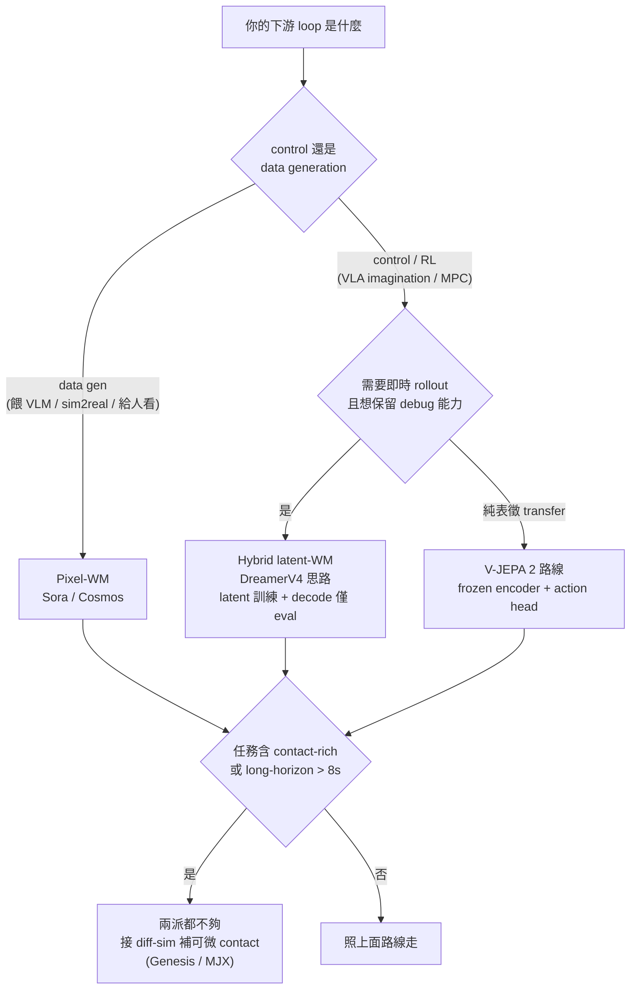

# Pixel vs Latent: Where Should Physics Live?

**Thesis**: 物理規律該在 **pixel** 空間還是 **latent** 空間學，不是一場「誰更真實」的戰爭，而是一道 **affordance 的取捨**——pixel 派買到的是「人能看、VLM 能讀、可當資料工廠」，付出的是 4 分鐘 / clip 的推理與「畫面好看但物理錯」沒有結構性防線；latent 派買到的是「16 秒 / action 進得了 control loop、sample efficiency 高一個數量級」，付出的是「失效不可視、closed action vocabulary、給人 debug / 給 VLM 看的 affordance 全丟」。**先問你的下游 loop 是 control 還是 data generation，再選空間**。

## 兩條路線的本質差異

| 路線 | 學的目標 | 代表方法 | 核心賭注 |
|---|---|---|---|
| **Pixel-WM** | 預測下一幀的**像素**（diffuse / autoregress on pixels）| Sora、Cosmos-Predict、Genie 系列的 pixel 端 | 「資料規模 + capacity → 物理自動湧現」 |
| **Latent-WM** | 預測下一步的**表徵**（在 latent 空間 rollout）| DreamerV4、V-JEPA 2 / 2-AC、Genie-2 的 latent | 「為 dynamics / imagination 而生的 latent，比重建像素更省、更可控」 |

兩條路線在 2026 的「offline video → controllable agent」主戰場正面對撞，但它們其實在解**不同的問題**：pixel 派是 data factory（給 VLM 餵訓練資料、做 sim2real 視覺增廣、給人看），latent 派是 perception / control module（VLA imagination、MPC critic）。

## 三維對比表

| 維度 | Pixel-WM | Latent-WM |
|---|---|---|
| Compute（推理）| 高：Cosmos-Predict1 7B 單 clip 5s ~2–4 min / H100（cosmos-wfm.md §inference）| 低：V-JEPA 2-AC 16s/action、DreamerV4 ≥20 FPS / 單 H100（dreamer-v4.md §inference）|
| Fidelity（保真度）| 高：最終產出即視覺，可直接給人 / VLM | 受 decoder 限制；V-JEPA 2 **刻意不重建像素**（無 decoder 可看）|
| Debug | 好：看影片即知失效（物體穿牆一眼看穿）| 難：latent 失效不可視，只能靠 readout probe / RankMe 間接量 |
| Agent control | 不適合：autoregressive pixel decode 太慢，進不了即時 rollout | 適合：latent rollout 即時、reward signal 在 latent 取，不回 pixel |
| Cross-domain | 弱：domain-specific decoder + closed weight（Sora）限制再用 | 強：latent 抽象度高，V-JEPA 2 一個 frozen encoder 接多種下游 |
| Sample efficiency | 低：需海量 video 預訓（Cosmos ~20M 小時 → 10^8 clips）| 高：DreamerV4 純 offline ~100 hr action-labeled 拿 Minecraft 鑽石、宣稱 **100×** vs VPT 全集 |

### 在 latent 學物理會丟什麼

1. **可視性（debuggability）**：pixel-WM 的失效是「物體穿牆」，肉眼一秒看穿；latent-WM 的失效是 encoder/predictor 對偶**塌到 trivial constant**（JEPA mode collapse，見 LeWorldModel [arXiv:2603.19312](https://arxiv.org/abs/2603.19312)、VICReg-JEPA [arXiv:2410.19560](https://arxiv.org/abs/2410.19560)），train loss 漂亮但表徵空了——**切勿用 train loss 選 checkpoint**，要用 RankMe / LiDAR proxy。失效在 latent 是「沉默的」。
2. **語言 conditioning 與給 VLM 看**：pixel 路線輸出影片，可直接餵 VLM 訓練、可接 language goal；V-JEPA 2-AC 目前**只接 image goal、無 language goal**（v-jepa-2.md §6.1），instruction following 是劣勢 vs Octo / RT-2。
3. **泛化邊界的硬上限**：V-JEPA 2-AC 的 7-DoF Franka action 是 **closed action vocabulary**；換 dexterous hand / mobile base 整個 action projection 要重訓。latent 的「抽象 = 強泛化」只在動作詞表之內成立。

### 在 pixel 學物理付什麼代價

1. **推理 cost 進不了 control loop**：Cosmos 4 min/action vs V-JEPA 2-AC 16s/action（~15× 慢），receding-horizon MPC 根本等不起。
2. **「畫面好看但物理錯」沒有結構性防線**：PhyWorld [arXiv:2411.02385](https://arxiv.org/abs/2411.02385)（ICML 2025）證實 data-only 路線 in-distribution 完美外推、但 **OOD（換新初始條件）全面失敗**，且泛化特徵優先序是 `color > size > velocity > shape`——模型擇近鄰 case，**根本沒在學 dynamics**。這是 structural ceiling，不是「再加 10× 資料就解」。
3. **壓縮比的反噬**：Cosmos tokenizer 2048× 壓縮讓 long sequence 跑得起，但 texture detail 不可逆丟失（cosmos-wfm.md §9.9 DV8x16x16 細紋丟失）。

## 三個 anchor 的失效實測

### 1. Sora（pixel 派，OpenAI 自述）

OpenAI 2024-02 的 Sora 1.0 tech report 在 "Limitations" 段**親自貼了失效示例**：玻璃杯掉地不碎（像橡膠彈）、咬一口餅乾後餅乾上沒有缺口（cause-effect 斷裂）、物體穿越彼此 / 穿桌、椅子被提起時形變不正確（沒把椅子當剛體）。關鍵診斷：這些 glitch **不來自資料**，來自系統「如何重建現實」的架構缺陷。PhyWorld [arXiv:2411.02385](https://arxiv.org/abs/2411.02385) 把這條 grounded 成 falsifiable 結論：DiT attention 學的是 case 匹配，不是守恆律。來源：[OpenAI Sora tech report](https://openai.com/index/video-generation-models-as-world-simulators/)。注：Sora 為 closed model，無 paper、無 model size / FLOPs 公開（`UNVERIFIED`），App 2026-04-26 關閉、API 2026-09-24 退役。

### 2. Cosmos-Predict（pixel 派，NVIDIA 自述）

Cosmos World Foundation Model（[arXiv:2501.03575](https://arxiv.org/abs/2501.03575)）的 limitations 段（autoregressive §5.2.7）明列：模型「struggles with object permanence, physics consistency, and temporal coherence in longer sequences」，且「contact dynamics and gravity-related interactions remain difficult to predict accurately」。具體表現為 **>8s long-horizon drift**：物體 disappearing / deforming、重力違反、motion instability（cosmos-wfm.md §6.1）。論文結尾自承「the world foundation model problem is still far from being solved」。模型規模：Diffusion 7B / 14B、Autoregressive 4B / 5B / 12B / 13B；這是 pixel-video 路線的**結構性 break**，不會因 scale up 自動解，要接 diff-sim（Genesis / MJX）補 contact、或退到 latent-WM。

### 3. V-JEPA 2-AC（latent 派，Meta 自述）

V-JEPA 2 / 2-AC（[arXiv:2506.09985](https://arxiv.org/abs/2506.09985)）是 LeCun「latent prediction beats pixel reconstruction」thesis 的旗艦實證——1M+ 小時 internet video 預訓 + **62 小時 Droid robot video** 後訓，在兩個未見過的實驗室、未見過的 Franka 上 zero-shot pick-and-place。但論文自述 limitations（v-jepa-2.md §6.1）暴露 latent 路線的代價：

- **Camera sensitivity**：靠 monocular RGB 隱式推 action axes，需人工擺相機；換 viewpoint 直接掉。
- **Autoregressive drift**：block-causal AR 長 horizon 退化，planning 只能短視距 + replan，不適合 long-horizon task。
- **Object OOD**：62h Droid 後訓分布窄，pick cup ~70% vs pick box ~30% grasp（v-jepa-2.md Table 2）。
- **No language goal**：只接 image goal。

sample efficiency 對比真實但 caveat 多：Octo（full Droid behavior clone 1000+ hr）grasp ~15% vs V-JEPA 2-AC（62h zero-shot）65–75%——**但不是 apples-to-apples**（Octo 是 instruction-conditioned 多任務，V-JEPA 2-AC 只跑 image-goal pick-and-place）。重點不是「latent 全面贏」，而是「latent 路線第一次有真機 demo 撐場」。

### 補充：DreamerV4（hybrid 範本，latent 訓練 + decode 僅供 eval）

DreamerV4（[arXiv:2509.24527](https://arxiv.org/abs/2509.24527)）把 actor / critic **全在 latent imagination 中訓練、不回 pixel 取 reward**，decoder 只在 eval / visualization 用——這正是本文推薦的 hybrid。它純 offline data（VPT contractor 2.5K hr、只 ~100 hr action-labeled）拿到 Minecraft 鑽石，單 H100 ≥20 FPS 互動，宣稱 **100× 資料效率** vs VPT 全集。但 latent 的代價同樣出現在自述 limitations（dreamer-v4.md §6.1）：context 限 ~9.6s「restricts very long-horizon consistency」、inventory UI elements「can be unclear or change over time」（decoder artifacts）、Minecraft Diamond offline 成功率僅 **0.7% / 60-min**，作者直言未拆解 planning / exploration / credit assignment 三者影響。注：V4 截至 2026-05 仍是 arXiv preprint、無官方 code release（`UNVERIFIED` reproduction）。

## 結論建議：對下游怎麼選

**第一性問題：你的下游 loop 是 control 還是 data generation？**

- **影片內容 / 駕駛 sim / 給 VLM 餵訓練資料**：pixel-WM 為主——visualization 即產品、language goal + 給 VLM 看是 latent 派目前沒有的 affordance。可接受 Cosmos 4 min/action 的離線 batch 生成。
- **Agent control / RL imagination / MPC critic**：latent-WM 為主——16s/action 進得了 receding-horizon、reward signal 在 latent 取質量高、sample efficiency 高一個數量級。
- **混合策略（推薦預設）**：訓 latent-WM 做 control，**僅在評估 / debug 時 decode**（DreamerV4 思路）——既拿到 latent 的速度與 sample efficiency，又保留「出事時能 decode 一段看看」的最低 debuggability。注意：decode 出來的畫面 artifact（DreamerV4 inventory UI 糊）≠ policy 品質差，別把 reconstruction quality 當 policy quality。
- **contact-rich physics（抓取 / 布料 / 流體）或 long-horizon > 8s 一致性**：**兩派都解不了**——pixel 是結構性 break、latent 是 AR drift。要接 diff-sim（Genesis / MJX）補可微 contact，這不在 pixel-vs-latent 這條軸上。

## 與 foundations 的連結

本 wedge 的三個 anchor 解構詳見：

- Sora（pixel diffusion，closed）：[`../../foundations/video-world-models/sora.md`](../../foundations/video-world-models/sora.md)
- Cosmos-WFM（pixel，open weight + 顯式 control）：[`../../foundations/foundation-physics-models/cosmos-wfm.md`](../../foundations/foundation-physics-models/cosmos-wfm.md)
- DreamerV4（latent imagination + decode 僅 eval）：[`../../foundations/latent-world-models/dreamer-v4.md`](../../foundations/latent-world-models/dreamer-v4.md)
- V-JEPA 2（latent，刻意不重建像素 + 真機 demo）：[`../../foundations/latent-world-models/v-jepa-2.md`](../../foundations/latent-world-models/v-jepa-2.md)
- Genie-2（latent，互動式 playable WM）：[`../../foundations/latent-world-models/genie-2.md`](../../foundations/latent-world-models/genie-2.md)

## 參考

- Sora — OpenAI tech report (2024-02): [Video generation models as world simulators](https://openai.com/index/video-generation-models-as-world-simulators/)（無 arXiv / model size，`UNVERIFIED`）
- Cosmos World Foundation Model Platform — [arXiv:2501.03575](https://arxiv.org/abs/2501.03575)（Predict1, 2025-01）
- V-JEPA 2: Self-Supervised Video Models Enable Understanding, Prediction and Planning — [arXiv:2506.09985](https://arxiv.org/abs/2506.09985)（Meta, 2025-06）；前作 V-JEPA [arXiv:2404.08471](https://arxiv.org/abs/2404.08471)
- Dreamer 4: Training Agents Inside of Scalable World Models — [arXiv:2509.24527](https://arxiv.org/abs/2509.24527)（2025-09，preprint）；前代 DreamerV3 [arXiv:2301.04104](https://arxiv.org/abs/2301.04104)
- PhyWorld: How Far is Video Generation from World Model — A Physical Law Perspective — [arXiv:2411.02385](https://arxiv.org/abs/2411.02385)（ICML 2025）
- JEPA mode collapse 相關：LeWorldModel [arXiv:2603.19312](https://arxiv.org/abs/2603.19312)、VICReg-JEPA [arXiv:2410.19560](https://arxiv.org/abs/2410.19560)
