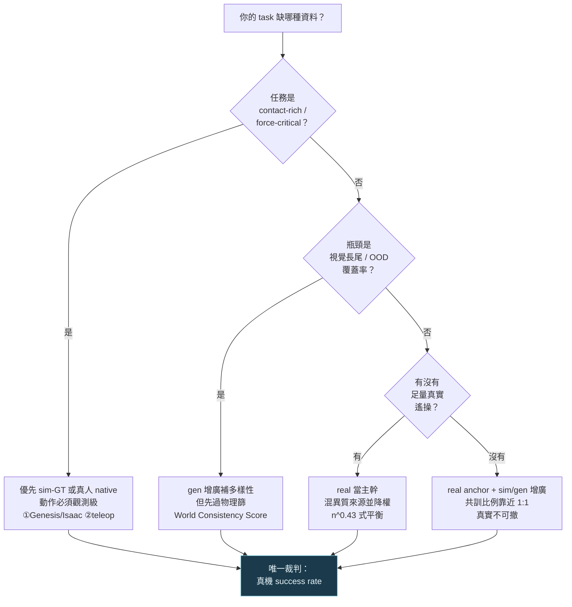

# Sim-vs-Gen Data

> **Thesis**：機器人/駕駛資料不是「sim vs gen vs real 三選一」，而是一條 Pareto 邊界——**物理 ground-truth、視覺多樣性、規模、邊際成本互相換**；2026 的主流共識（π0 / Cosmos / GR00T 管線公開可查）不是任一純派勝出，而是 **real 當動作 ground-truth 主幹、sim 補可控物理、gen 補視覺長尾** 的混用，唯一裁判是下游真機 success rate。

## 問題

「給 VLA pre-training / driving WM 該用生成資料、sim 資料、還是真實 demo？」這題之所以吵不完，是因為三派各拿著一個**真實但片面**的事實在打：

- **Sim 派**：MuJoCo / [Genesis](../../foundations/differentiable-simulators/genesis.md) / Isaac Lab 的物理 ground-truth 嚴格、可量、可參數化（force / contact / mass / friction 都是已知數），加 domain randomization 後能上真機；生成資料是「彩色雜訊」。
- **Gen 派**：真實 video 預訓的 WM 自然涵蓋長尾、光照、紋理、OOD 物件；sim 訓出來的 policy 跨不過 sim2real，而生成資料的視覺分布天生就貼著真實世界。
- **Real 派**：唯一沒有 reality gap、沒有回推誤差的就是真人遙操；[π0](../../use-cases/robotics-data-gen/physical-intelligence-pi0.md) 用 10,000h 真實遙操做到 long-horizon dexterous，這是 sim/gen 都還沒單獨複製的等級。

三派的主張都對——對在各自的維度。真正的問題不是「誰對」，而是**「在 Pareto 邊界的哪一點，混什麼比例，下游真機 success rate 最高」**。這篇把 wishlist 變成有據的討論。

---

## Pareto frontier：六維度橫切

| 維度 | Sim（Genesis / Isaac Lab / MuJoCo） | Gen（UniSim / Cosmos / DreamGen） | Real（OXE / π0 teleop） |
|---|---|---|---|
| **Physics ground-truth** | 強：force/contact/param 皆已知數 | 弱（隱式，且常崩，見失效節） | 強：物理即真實，無模型誤差 |
| **動作 label 來源** | native（sim 求解器直給 GT） | **推測**（IDM/LAPA 回推）或鎖 sim-GT | native（遙操記錄當下真動作） |
| **視覺多樣性** | 弱（需 domain randomization 補） | 強（pre-trained video prior 涵蓋長尾） | 中（受採集場景限制） |
| **可控性** | 強（任意改 param 重跑） | 弱（prompt 條件，物理難精確控） | 弱（採到什麼是什麼） |
| **規模** | 中–大（GPU env 數，Isaac Lab 數千並行） | 大（一個 init frame 長出 22 行為） | 小（10,000h 已是產業天花板） |
| **sim2real / reality gap** | 大（外觀+動力學雙重 gap） | 中（視覺貼真，但物理幻覺） | 無（本身即 real） |
| **邊際成本** | 低–中（GPU compute，可攤） | 高（生成 compute，見 DreamGen 帳） | 極高（真人時薪 × 不可攤） |

**讀法**：沒有一行三派全贏。Sim 贏在物理可控與動作 native，輸在 reality gap 與視覺貧乏；Gen 贏在視覺多樣性與規模，輸在物理幻覺與動作要回推；Real 贏在零 gap、動作最可信，輸在規模與成本。**這正是 Pareto 的定義——每一派的優勢都是另兩派的代價。** 任何宣稱「X 派全面勝出」的論述，必然在某個維度偷換了前提。

三個結構性事實把這張表釘死：

1. **動作可信度 ≠ 像素可信度。** 像素（外觀）三派都能做到逼真；但「這段影片對應的 action label 可不可信」才是 VLA 唯一在乎的。Real 的動作是觀測、Sim 的動作是求解器 GT、Gen 的動作多半是**事後回推**——可信度天差地別（細節見 [generative-video-as-data](../../use-cases/robotics-data-gen/generative-video-as-data.md) 的「三種動作來源契約」）。
2. **多樣性與保真度在 2026 仍互斥。** 你要無限新行為（Gen 的賣點）就接受動作是猜的；你要動作絕對可信（Real / 鎖 sim-GT）就變不出新行為。這條對立面是整個混比討論的根源。
3. **唯一裁判是下游真機 success rate。** sim 數字、生成數字、benchmark 數字都可能自欺；只有「policy 在真機上多成功了 N%」不會騙人。本篇所有比較都收斂到這個 metric。

---

## 三派各自的失效實測（帶引用）

抽象 Pareto 不夠，下面是三派**各自踩過的、可引用的坑**。

### Sim 派失效：reality gap 是雙重的，domain randomization 補不滿

- **Domain randomization 單獨上場，成功率掉到一半。** 純 DR 的 sim2real 在 manipulation 實測平均 **~48%** 成功率，跨物件配置落在 **36–59%** 區間，明顯低於加了真實資料修正的方法（[Fail2Progress, arXiv 2509.01746](https://arxiv.org/abs/2509.01746)）。DR 把參數隨機化到「希望真實落在分布內」，但 contact dynamics / 感測雜訊 / actuator 延遲的 gap 不是調亮度能補的。
- **駕駛域的 gap 更量化。** CARLA→真實的協同感知部署實測 **AP 掉最高 40%**（OPV2V→V2V4Real，部署雜訊下），另一組報 online 部署 **13.2 mAP drop**（[Collaborative Perception Datasets review, arXiv 2504.12696](https://arxiv.org/abs/2504.12696)；[CARLA2Real, arXiv 2410.18238](https://arxiv.org/abs/2410.18238)）。在 CARLA 跑很強的 agent（如 Roach）一上真路就因視覺/動力學/互動 mismatch 退化。
- **連 sim 自家的 co-training 都承認 sim-only 不夠。** RoboCasa 的真機實驗刻意比的是「real-only vs real+sim 共訓」而**不是 sim-only**——因為純 sim zero-shot 不是它主打的勝場；它的價值是當**共訓增廣**，不是當獨立資料源（[RoboCasa, arXiv 2406.02523](https://arxiv.org/abs/2406.02523)，§見下節）。

### Gen 派失效：影片看起來對、物理/動作標籤錯

- **瓶頸在生成端的物理合理性，不在回推頭。** DreamGen 自己提出 DreamGen Bench（Instruction Following + Physics Alignment）正是因為主要 failure 來自**影片物理崩壞**而非 IDM 解錯——換更強的回推頭救不了上游崩掉的像素（[DreamGen, arXiv 2505.12705](https://arxiv.org/abs/2505.12705)）。
- **標準感知 metric 偵測不到致命的物理錯誤。** 生成機器人影片常出現夾爪穿過物件、物件漂浮/憑空出現；FVD / PSNR 看不出來，但 IDM 會把「穿模」逆解成一個荒謬卻自洽的 action label，policy 學到「自洽的錯」（[arXiv 2601.17067](https://arxiv.org/abs/2601.17067)，提出 World Consistency Score）。
- **連「物理對不對」的自動裁判都會幻覺。** DreamGen 明說其 auto-evaluator「評物理真實性時偶爾幻覺」——這對「自動化大規模生成資料」是元級風險：錯誤資料可能整批漏過篩選（[arXiv 2505.12705](https://arxiv.org/abs/2505.12705)）。

### Real 派失效：稀缺、貴、且覆蓋不到 OOD

- **真實資料就算到 10,000h 級別，OOD 仍直接崩 0%。** π0 在第三方 in-the-wild 評估中，玻璃茶壺倒水 / 玩具廚房櫃 / 咖啡機操作 success rate **0%**——任何 backbone 沒見過的 articulation / 透明物件直接失效（[Penn PAL Lab eval](https://penn-pal-lab.github.io/Pi0-Experiment-in-the-Wild/)）。真實資料的覆蓋率受限於「採集過什麼」，而長尾天生採不全。
- **規模即天花板，成本不可攤。** 10,000h 真實遙操是當前產業上限，且每一小時都是真人時薪 × 不可複用的固定成本。這正是「為什麼需要 sim/gen」的根本動力——不是 real 不好，是 real 不夠也太貴。
- **跨 embodiment 不是免費。** OXE 雖證明 22 robot 跨 embodiment **正向 transfer**（[Open X-Embodiment, arXiv 2310.08864](https://arxiv.org/abs/2310.08864)，1M+ 軌跡 / 527 skills），但 π0 把 OXE 併進來時必須**降權**（見下節 n^0.43），說明真實資料之間的分布也不是隨便堆就有用。

---

## 最佳混比：證據怎麼說

open question 不該停在「mix ratio 是多少」這種無法回答的問法。把它拆成三個**有公開數據**的子問題：

### (1) mix ratio 的公開錨點：主流就是混用，且比例可查

| 系統 | 公開的混比 / 權重 | 來源 |
|---|---|---|
| **π0 pre-training** | **90.9% 自家真實遙操 + 9.1% 開源（OXE/Bridge/DROID）**；自家資料內按 `n^0.43` 對 over-represented 的 task-robot 組合**降權** | [arXiv 2410.24164](https://arxiv.org/abs/2410.24164) §V-A |
| **DreamGen → GR00T N1 共訓** | neural（生成）:real **= 1:1** 採樣比；兩者當不同 embodiment（分開的 action encoder/decoder） | [arXiv 2505.12705](https://arxiv.org/abs/2505.12705) |
| **Cosmos data engine** | 預訓資料 **20M 小時影片 / 9,000 兆 token**（real-world 人類/工業/機器人/駕駛混合），下游再生成增廣 | [arXiv 2501.03575](https://arxiv.org/abs/2501.03575)；[NVIDIA newsroom](https://nvidianews.nvidia.com/news/nvidia-launches-cosmos-world-foundation-model-platform-to-accelerate-physical-ai-development) |

**讀出來的共識**：

- **Real 當主幹、不當全部。** π0 的 90.9% 是真實，但它仍刻意保留 9.1% 開源 OXE——跨 embodiment 多樣性即使只佔 9%，也值得加（OXE 正向 transfer 已證）。真實資料是 anchor，但**單一來源真實資料會 over-fit，要混異質來源並降權**。
- **生成資料的最佳混比有公開數字：1:1。** GR00T N1 的 neural:real 不是「生成越多越好」，而是 **1:1** 等量混合，且把生成軌跡當**獨立 embodiment** 隔開——承認生成資料品質次於真實，不能無腦倒進同一個池。
- **降權勝過硬比例。** π0 的 `n^0.43` 比「固定百分比」更本質：混比不是常數，是**對每個資料源按樣本數開根號降權**，自動平衡 over/under-represented。這暗示「最佳 mix ratio 是常數」這個問法本身就錯——它是 task-robot 分布的函數。

### (2) diversity vs fidelity：哪個對 policy 更關鍵——分情況

證據指向**「視覺多樣性靠 gen/real 補、物理保真度靠 real/sim 鎖」的分工**，不是二選一：

- **要視覺長尾 / OOD 覆蓋 → 多樣性贏。** π0 的 0% OOD failure 證明真實資料的覆蓋率是硬瓶頸；生成/sim 增廣的價值正在補這塊（如果動作能信）。
- **要 contact-rich / force-critical → 保真度贏。** 生成影片的物理幻覺（穿模、漂浮）對 contact 任務是致命的，這類任務寧可用 sim-GT（物理鎖死）或真人 native，不碰自由生成回推。
- **量化證據：增廣是正的，但增益是「補位」級不是「翻盤」級。** RoboCasa 真機共訓在 seen objects 把成功率從 **13.6%（real-only）拉到 24.4%（real+sim）**，相對 +79%（[arXiv 2406.02523](https://arxiv.org/abs/2406.02523)）；DreamGen neural 共訓在 RoboCasa 30/100/300 data-regime 平均 **+4.2% / +8.8% / +6.8%**，GR-1 真機 8 任務平均 **+5.8%**（[arXiv 2505.12705](https://arxiv.org/abs/2505.12705)）。**注意數量級**：sim/gen 增廣是把 real 主幹再推高幾個 ~百分點到一倍，**不是替代 real**。沒有任何公開數據顯示純 sim 或純 gen 能單獨達到 real 主幹的 success rate。

### (3) 閉環 distribution shift：sim→生成→再訓 會不會自我中毒

這是 wishlist 裡最尖的問題，目前**證據不足以下定論（部分 UNVERIFIED）**，但結構性風險清楚：

- **回推誤差會被閉環放大。** 若用「生成影片→IDM 回推 action→訓 policy→再拿 policy rollout 餵生成器」，每一輪都把上一輪的物理幻覺與回推誤差當「真實」吃進去，分布逐輪偏離真機——這是經典的 compounding distribution shift，與 imitation learning 的 covariate shift 同源。**目前沒有公開的、跨多輪閉環的真機退化曲線可引用**（UNVERIFIED：閉環輪數 vs success rate 的定量關係無公開來源）。
- **主流系統刻意不做純閉環。** 注意 π0 / DreamGen / Cosmos 的公開管線都讓**真實資料當錨點留在每一輪**（π0 90.9% real、DreamGen 1:1 含 real、Cosmos 20M 小時 real 預訓）——這本身就是對閉環中毒的工程防禦：只要真實 anchor 不撤，分布就被拉住。**「能不能撤掉真實 anchor、純靠 sim+gen 自舉」目前無正面證據（UNVERIFIED）。**

---

## 一句話決策：你的 task 該用哪種資料

*圖：先問物理屬性（contact 鎖保真度）→再問瓶頸（長尾找 gen）→再問真實資料夠不夠；四條路都收斂到「真機 success rate」這個唯一裁判，且只要不是純 sim/純 gen，真實 anchor 永遠在場*

---

## 跨路線綜合

- **回 foundations（不重拆引擎）**：sim 引擎本體見 [Genesis](../../foundations/differentiable-simulators/genesis.md) 與 [MuJoCo MJX](../../foundations/differentiable-simulators/mujoco-mjx.md)；生成引擎見 [Cosmos WFM](../../foundations/foundation-physics-models/cosmos-wfm.md)；latent-WM 路線見 [DreamerV4](../../foundations/latent-world-models/dreamer-v4.md)（純 sim 訓練後 real transfer 的限制）與 [V-JEPA-2](../../foundations/latent-world-models/v-jepa-2.md)（純真實 video 預訓 + 少量 action label 的代表）。sim 資料引擎的 RoboCasa 見 [foundations/data-engine/robocasa.md](../../foundations/data-engine/robocasa.md)。
- **連 use-cases（下游證據端）**：本篇的「動作 label 可信度」契約在 [generative-video-as-data](../../use-cases/robotics-data-gen/generative-video-as-data.md) 有完整三派動作來源拆解；唯一裁判 π0 真機 success rate 見 [physical-intelligence-pi0.md](../../use-cases/robotics-data-gen/physical-intelligence-pi0.md)。
- **連 bridge-to-vla**：混比落地到 VLA 的兩端契約（action label 是 grounded 還是反推）見 [bridge-to-vla/generative-data-for-vla.md](../../bridge-to-vla/generative-data-for-vla.md)。

**一句話 take-away**：別問「sim/gen/real 哪個贏」——問「我的 task 的物理屬性、瓶頸、真實資料量是什麼」，然後讓 **real 當動作 ground-truth 主幹、sim 鎖可控物理、gen 補視覺長尾**，比例靠 `n^0.43` 式降權與 ~1:1 共訓平衡，真實 anchor 永不撤，最後用真機 success rate 裁決。2026 沒有純派的勝利，只有混比的工程。

---

## 參考

**Sim 派**
- RoboCasa — Nasiriany et al., *RoboCasa: Large-Scale Simulation of Everyday Tasks for Generalist Robots*, arXiv [2406.02523](https://arxiv.org/abs/2406.02523)（co-train 真機 13.6%→24.4%，+79% relative）
- Isaac Lab — NVIDIA, *Isaac Lab: A GPU-Accelerated Simulation Framework for Multi-Modal Robot Learning*, arXiv [2511.04831](https://arxiv.org/abs/2511.04831)（數千並行 env）
- Fail2Progress — arXiv [2509.01746](https://arxiv.org/abs/2509.01746)（domain randomization 單獨 ~48%，36–59% 區間）
- CARLA2Real — arXiv [2410.18238](https://arxiv.org/abs/2410.18238)；Collaborative Perception Datasets review — arXiv [2504.12696](https://arxiv.org/abs/2504.12696)（駕駛 sim2real 最高 40% AP drop）

**Gen 派**
- UniSim — *Learning Interactive Real-World Simulators*, arXiv [2310.06114](https://arxiv.org/abs/2310.06114)（RL/VLM policy zero-shot 真機 transfer）
- RoboGen — *Towards Unleashing Infinite Data for Automated Robot Learning via Generative Simulation*, arXiv [2311.01455](https://arxiv.org/abs/2311.01455)（propose-generate-learn 自舉）
- Cosmos World Foundation Model Platform — NVIDIA, arXiv [2501.03575](https://arxiv.org/abs/2501.03575)（data engine 20M 小時 / 9,000 兆 token）
- DreamGen / GR00T-Dreams — NVIDIA, arXiv [2505.12705](https://arxiv.org/abs/2505.12705)（neural:real 1:1 共訓；RoboCasa +4.2/+8.8/+6.8%、GR-1 +5.8%）
- 生成影片物理保真度批判 + World Consistency Score — arXiv [2601.17067](https://arxiv.org/abs/2601.17067)

**Real 派**
- Open X-Embodiment / RT-X — arXiv [2310.08864](https://arxiv.org/abs/2310.08864)（22 robots / 1M+ 軌跡 / 527 skills，跨 embodiment 正向 transfer）
- π0 — Black et al., *A Vision-Language-Action Flow Model for General Robot Control*, arXiv [2410.24164](https://arxiv.org/abs/2410.24164)（pre-train 90.9% 真實 + 9.1% 開源，`n^0.43` 降權）
- π0 in-the-wild OOD 評估 — [Penn PAL Lab](https://penn-pal-lab.github.io/Pi0-Experiment-in-the-Wild/)（OOD 物件 0%）
