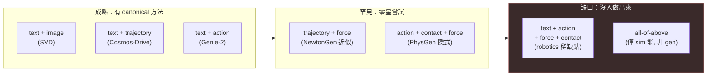

# Text-Action-Trajectory Spectrum

> Thesis：controllability input 是一條從「抽象意圖」到「具體物理量」的光譜；**現有方法各自佔住光譜上少數幾站、且只能組合相鄰幾站，而 robotics 真正要的 text+action+force+contact 同時條件，至今幾乎沒有方法接得起來** —— 這個「右半段組合缺口」才是 physics-controllable-generation 的稀缺點。

本 wedge 是一篇 cross-cutting 比較文（不是單篇 paper dissection）。它要回答三個問題：(1) 光譜上每一站「能控什麼、控不了什麼」；(2) 哪些組合成熟、哪些罕見、哪些沒人做；(3) 有沒有一個 universal conditioning interface。與 [`cheat-sheet/controllability_input_matrix.md`](../../cheat-sheet/controllability_input_matrix.md) 的分工：那張矩陣是 **method × input 的存在性**（誰原生支援哪一軸），本 wedge 是 **input 之間的 composability 與缺口**。

---

## 光譜總圖（ASCII）

```
[ 抽象 / 高層意圖 ]                                                          [ 具體 / 物理量 ]
        text  →  image-init  →  3d-init  →  action  →  trajectory  →  contact  →  force  →  param
       (Sora)      (SVD)     (WorldLabs)  (Genie-2)  (Cosmos-Drive) (ContactGen)(ForceGen) (NewtonGen)
        ↑           ↑           ↑           ↑            ↑              ↑          ↑          ↑
    語意意圖     一張起始幀    3D 結構幾何   離散互動    幾何路徑/HD-map  接觸圖/施力點 力向量/曲線  牛頓狀態/材料參數
```

| 站 | 控得了 | 控不了 | 代表方法（已驗證 arXiv） |
|---|---|---|---|
| **text** | 場景語意、風格、大致事件 | 精確物理量、力、接觸、軌跡 | Sora · SVD（text 端）|
| **image-init** | 外觀、起始狀態、首幀構圖 | 後續動力學、力、接觸 | SVD [2311.15127](https://arxiv.org/abs/2311.15127) |
| **3d-init** | 3D 幾何、可導航空間、視角 | 動態演化、力學互動 | World Labs Marble（無 arXiv，官方 blog）|
| **action** | 離散互動指令（鍵鼠/agent action） | 連續力、接觸面、材質 | Genie 2（DeepMind blog，無 paper）|
| **trajectory** | 物體/ego 走的幾何路徑 | 為什麼會這樣走（力因果） | Cosmos-Drive-Dreams [2506.09042](https://arxiv.org/abs/2506.09042) |
| **contact** | 接觸點/接觸圖（哪裡碰） | 碰多用力（力幅值） | ContactGen [2310.03740](https://arxiv.org/abs/2310.03740) |
| **force** | 力向量（位置/方向/幅值） | 接觸幾何、長鏈傳遞 | Force Prompting [2505.19386](https://arxiv.org/abs/2505.19386) · ForceGen [2310.10605](https://arxiv.org/abs/2310.10605)（蛋白質域）|
| **param** | 物理參數/牛頓狀態（質量近似、ODE 係數） | 拓撲變化、多物體碰撞 | NewtonGen [2509.21309](https://arxiv.org/abs/2509.21309) |

從左到右：抽象度下降，物理量化度上升。**互相之間有 composability 階梯**，但越往右越難取得配對訓練資料（real-world 沒有 force/contact ground truth），這正是右半段組合缺口的結構成因。

---

## 為什麼 text 不夠（左端的根本侷限）

Text 是最廣、最易標、internet-scale corpus 最大的一站，但它在物理控制上有兩個硬天花板：

1. **無法指定精確物理量。** prompt「蘋果掉到桌上」無法告訴模型「往右施 5N」「初速 2 m/s」「摩擦係數 0.3」。Force Prompting 的 motivation 直接點名這點：text-only Sora-class 出來的可能是漂浮、可能反向加速，用戶「沒有 dial 可以調力的方向/量」（[2505.19386](https://arxiv.org/abs/2505.19386)；見 [`force-prompting.md`](../../foundations/physics-conditioning/force-prompting.md) §1）。
2. **物理一致性靠 pretrained visual prior「猜」，不可保證。** PhysGen 的 motivation 同樣指出純 data-driven I2V 對「給這個物體一個 30N 水平力」這種顯式力學輸入沒有 controllability，只能從文字或起始幀猜（[2409.18964](https://arxiv.org/abs/2409.18964)；[`physgen.md`](../../foundations/physics-conditioning/physgen.md) §1）。

所以光譜的存在本身，就是 text 不夠用的證據：每往右一站，都是為了把 text 控不住的某個物理自由度顯式抽出來當條件。

## 為什麼 action 也不夠（中段的侷限）

Action（Genie 2 的鍵鼠 token、VLA 的離散動作）解決了「互動性」，但 action 不等於 force/contact：

- Action 是**離散、抽象的意圖**（「向前」「跳」），不攜帶連續力幅值或接觸幾何。Genie 2 在 ontology 上是 `control=action|image-init`、`injection=data-only`，**沒有 force/contact 條件軸**（[`genie-2.md`](../../foundations/latent-world-models/genie-2.md) §3）。
- 對 robotics，「我推這個杯子」(action) 與「我用 3N 在杯緣這一點推」(force+contact) 是不同層級的指令；前者交給 backbone 隱式湊接觸力，後者才是 contact-rich manipulation 真正需要的。
- PhysGen 的做法可看成「**用 text+action(隱式)+sim 去蘊含 force/contact**」：把 force 顯式交給 PyMunk solver、把接觸交給 rigid-body 碰撞，再把 simulated trajectory lift 回像素（[`physgen.md`](../../foundations/physics-conditioning/physgen.md) §2）。這正說明 action 層需要外掛 sim 才能補出 force/contact。

---

## 光譜逐站詳解

### 1. text — 語意意圖（最抽象）
代表：Sora（OpenAI，2024，無公開 paper；見 [`sora.md`](../../foundations/video-world-models/sora.md)）。**能控**場景、風格、大致事件序。**控不了**精確力、接觸、軌跡。矩陣裡 Sora 對 trajectory/force/contact/param 全為 `❌` 或 `🟡`（[matrix](../../cheat-sheet/controllability_input_matrix.md)）。是 composability 的「載體底座」：幾乎所有右側條件都疊在一個 text backbone 上。

### 2. image-init — 起始幀
代表：Stable Video Diffusion（SVD，[2311.15127](https://arxiv.org/abs/2311.15127)）。以單張 image 為 conditioning frame 合成後續視頻。**能控**外觀與起始狀態。**控不了**後續動力學是否守恆 —— SVD 對「我給的力」沒有接口。與 text 是最成熟的一對組合（見下節）。

### 3. 3d-init — 3D 結構/幾何
代表：World Labs **Marble**（Fei-Fei Li，2025-11 商用上線；單張 image 或 text → 可導航 persistent 3D world）。**UNVERIFIED**（無 arXiv，僅官方 blog `worldlabs.ai/blog/marble-world-model` 與媒體報導；本 handbook 以官方 blog 為準，不引具體 benchmark）。**能控**3D 幾何、可導航空間、視角一致性。**控不了**動態物理演化與力學互動 —— 它生的是「靜態可走的世界」而非「會反應你施力的世界」。矩陣裡 World Labs gen-3D 的 `3D=✅` 但 `action/force/contact/param` 全 `❌`。

### 4. action — 離散互動指令
代表：Genie 2（DeepMind，2024-12 blog，無 paper、無 weights；[`genie-2.md`](../../foundations/latent-world-models/genie-2.md)）。鍵鼠/agent action 自回歸驅動可玩 3D 環境，世界一致性約 10–60s。**能控**離散互動（移動/跳/互動）。**控不了**連續力、接觸面、材質差異。是「video gen × agent-control playground」的焊接點，但物理仍是 `data-only` 隱式。

### 5. trajectory — 幾何路徑
代表：**Cosmos-Drive-Dreams**（NVIDIA，[2506.09042](https://arxiv.org/abs/2506.09042)）。以 HDMap + 3D cuboids + text(+LiDAR depth) 條件，生成精確匹配 scene layout 與 ego 軌跡的多視角 driving 視頻。**能控**物體/ego 走的幾何路徑（geometry-aware）。**控不了**「為什麼這樣走」的力因果 —— 軌跡是 kinematic 規定，不是 dynamic 推導。底層 multi-modal control 來自 Cosmos-Transfer1 的 adaptive ControlNet 設計（[2503.14492](https://arxiv.org/abs/2503.14492)）。

### 6. contact — 接觸圖/接觸點
代表：**ContactGen**（Liu et al., ICCV 2023, [2310.03740](https://arxiv.org/abs/2310.03740)）。CVAE 建模 object-conditioned 的 contact / part / direction map 聯合分布，用於 grasp 生成。**能控**「哪裡碰、怎麼碰」的接觸幾何。**控不了**「碰多用力」—— contact map 是幾何不是力幅值。物理層級上 contact ⊂ force（force = ∫ pressure dA over contact area），但人標 contact 比標 force 容易（[`force-prompting.md`](../../foundations/physics-conditioning/force-prompting.md) §6）。注意命名衝突：另有一篇同名 ContactGen（[2401.17212](https://arxiv.org/abs/2401.17212)，人-人互動），本 handbook 指的是 grasp 的 [2310.03740](https://arxiv.org/abs/2310.03740)。

### 7. force — 力向量/施力曲線
代表：**Force Prompting**（Brown × Google DeepMind，[2505.19386](https://arxiv.org/abs/2505.19386)，NeurIPS 2025）把力向量 (location, angle, magnitude) 當 conditioning channel 注入 pretrained video diffusion；**ForceGen**（Buehler lab，[2310.10605](https://arxiv.org/abs/2310.10605)，Science Advances 2024）則在**蛋白質材料域**以非線性力學解纏（unfolding force-separation 曲線）為目標生成序列 —— 兩者都是「以力為條件」，但 ForceGen 不是視頻域（**注意 domain 跨越**：原 stub 把 ForceGen 列為 force anchor，正確但需註明它是 protein/material 而非 pixel-video）。**能控**力向量/力學目標。**控不了**接觸幾何（Force Prompting 給點力但不指定接觸面）、長鏈傳遞（推第一張骨牌不會自動 propagate，見 [`force-prompting.md`](../../foundations/physics-conditioning/force-prompting.md) §8.3）。

### 8. param — 物理參數/牛頓狀態（最具體）
代表：**NewtonGen**（Purdue，[2509.21309](https://arxiv.org/abs/2509.21309)，ICLR 2026）以 9-dim 牛頓狀態 `[x,y,vx,vy,θ,ω,s,l,a]` + Neural Newtonian ODE 解算軌跡再餵 diffusion。**能控**完整牛頓狀態、軌跡一致性。**控不了**多物體碰撞/合併（continuous ODE 不擅 event）、拓撲/材質（9-dim 不含質量/彈性/topology；見 [`force-prompting.md`](../../foundations/physics-conditioning/force-prompting.md) §8.5–8.6）。光譜最右端：最量化，但 vocabulary 最窄（12 種 motion family，超出即 OOD）。

---

## Composability 階梯：成熟 / 罕見 / 缺口

### 成熟（已有 canonical 方法）
- **text + image**：主流 I2V 的預設。SVD（[2311.15127](https://arxiv.org/abs/2311.15127)）即 image-init，text 端疊在 backbone 上。矩陣 `text=✅ image=✅` 幾乎所有方法都滿足。
- **text + trajectory**：Cosmos-Drive-Dreams（[2506.09042](https://arxiv.org/abs/2506.09042)）以 text + HDMap 軌跡，geometry-aware control。矩陣 Cosmos-Drive `trajectory=✅ multi=✅`。
- **text + action**：Genie 2（action native + image prompt）；Cosmos-Predict 的 `action=🟡`。把 video gen 與 agent control 焊起來。

### 罕見（零星嘗試、非主流，robotics 真正想要）
- **trajectory + force**：robotics 真正需要的接口（「沿這條路徑、用這個力」），但配對資料極稀。NewtonGen 算最近似：state→trajectory，但它走 param 而非顯式 force（[2509.21309](https://arxiv.org/abs/2509.21309)）。
- **action + contact + force**：sim 原生（Genesis / MuJoCo MJX 矩陣裡 `action/force/contact` 全 `✅`），但**生成模型還沒做出來**。PhysGen 用 image+force+sim 隱式蘊含 contact，是最接近的嘗試（[2409.18964](https://arxiv.org/abs/2409.18964)）。
- **force + contact 同時顯式**：物理上 contact ⊂ force，但沒有單一生成方法同時吃 contact map 與 force 向量 —— Force Prompting 只吃 force，ContactGen 只吃 contact。

### 缺口（沒人做出來）
- **all-of-above**（text+image+3d+action+trajectory+contact+force+param 全接）：理論可組，無方法落地。矩陣裡只有 sim（Genesis/MuJoCo）那一列 `multi=✅`，但那是 simulator 不是 generative model。



---

## Robotics 的真正稀缺點：text + action + force + contact 同時接

接觸密集（contact-rich）的 manipulation 同時需要四個層級：**text**（任務語意）+ **action**（離散動作）+ **force**（連續施力幅值/方向）+ **contact**（接觸幾何/接觸點）。但：

- **幾乎沒有生成方法同時吃這四軸。** 矩陣裡所有 pixel-video 生成方法的 `force` 與 `contact` 列全為 `❌`；唯一 `✅` 的是 simulator（Genesis、MuJoCo MJX），而 simulator 不生 photoreal 像素、需要 asset prep。
- **最接近的嘗試是 PhysGen。** 它用 image + 顯式 force input + rigid-body sim，讓 sim 同時產出 trajectory 與 contact（碰撞點），再 diffusion render（[`physgen.md`](../../foundations/physics-conditioning/physgen.md) §2）。但它是 **2D rigid-only**、perception cascade 易崩、material 估計弱（§8.4–8.5），且嚴格說它吃的是 `image+force`、contact 由 sim 隱式產生而非用戶顯式指定。
- **資料是結構性瓶頸。** real-world 沒有 force/contact ground truth，全靠 Blender/sim 合成配對（Force Prompting ~15k–23k 合成樣本）；產業視角是「從 robot teleop / haptic glove 抓 force-real-video pair」才可能解（[`force-prompting.md`](../../foundations/physics-conditioning/force-prompting.md) §8.8）。這解釋了為什麼右半段組合一直填不滿：不是架構難，是配對資料根本不存在。

換句話說：光譜左半段（text/image/action/trajectory）有 internet-scale 或 sim-cheap 資料，組合成熟；右半段（contact/force/param）資料稀缺，所以即便 robotics 最需要它們的組合，至今仍是缺口。

---

## 是否有 universal conditioning interface

短答：**還沒有，但有兩條收斂路徑。**

1. **Multi-ControlNet 路線（加法式）。** Cosmos-Transfer1（[2503.14492](https://arxiv.org/abs/2503.14492)）用 adaptive、spatiotemporal-weighted 的多 ControlNet branch，把 segmentation/depth/edge 等多模條件在不同時空區域動態加權。原則上可往右擴出 force/contact branch，但每加一條 branch 需要該軸的配對資料，且多條件互相壓制 fidelity（multi-conditioning interference，見 [`controllability-vs-fidelity/overview.md`](../controllability-vs-fidelity/overview.md)）。
2. **Param/state 路線（壓縮式）。** NewtonGen 把多個物理自由度壓進一個 9-dim 牛頓 state 再解 ODE（[2509.21309](https://arxiv.org/abs/2509.21309)）。優點是單一 latent 表示能蘊含位置/速度/旋轉/形變；缺點是 state vector 不含質量/材質/拓撲/接觸，且 vocabulary 窄。要成 universal interface，state 維度需擴到能編碼 contact graph 與 material —— 目前無方法做到。

兩條路線的根本張力：**universal interface 要嘛是「所有軸各一條 branch」（加法，受資料與 fidelity interference 限制），要嘛是「一個夠寬的物理 state」（壓縮，受表示能力限制）**。沒有方法解決右半段「資料不存在」的元問題前，universal conditioning interface 在 robotics 場景仍是 open。這也呼應 [`controllability-vs-fidelity/overview.md`](../controllability-vs-fidelity/overview.md) 的 open question：是否存在 fidelity-preserving 的多條件 fusion。

---

## Open questions

- Force 與 contact 能不能透過 text + action 隱式蘊含（PhysGen 嘗試用 sim 補），還是右半段註定要顯式條件 + 顯式資料？
- 是不是有 universal conditioning interface 可以同時吃所有 8–9 種 input —— 加法式（multi-ControlNet）vs 壓縮式（physical state）哪條會先打通 robotics 的 text+action+force+contact 組合？
- 右半段缺口的瓶頸是架構還是資料？若是資料，robot teleop / haptic glove 的 force-real-video pair 能否成為右半段的 internet-scale corpus 替代？

---

## 參考（exact arXiv）

- **Stable Video Diffusion (SVD)** — Blattmann et al., [2311.15127](https://arxiv.org/abs/2311.15127)（image-init anchor）
- **Genie 2** — DeepMind blog 2024-12（action anchor；無 paper/weights，見 [`genie-2.md`](../../foundations/latent-world-models/genie-2.md)）
- **Cosmos-Drive-Dreams** — NVIDIA, [2506.09042](https://arxiv.org/abs/2506.09042)（trajectory anchor）
- **Cosmos-Transfer1** — NVIDIA, [2503.14492](https://arxiv.org/abs/2503.14492)（multi-modal ControlNet）
- **ContactGen (grasp)** — Liu et al., ICCV 2023, [2310.03740](https://arxiv.org/abs/2310.03740)（contact anchor；勿與人-人互動同名 [2401.17212](https://arxiv.org/abs/2401.17212) 混淆）
- **Force Prompting** — Gillman et al., NeurIPS 2025, [2505.19386](https://arxiv.org/abs/2505.19386)（force anchor，video 域）
- **ForceGen** — Ni, Kaplan, Buehler, Science Advances 2024, [2310.10605](https://arxiv.org/abs/2310.10605)（force anchor，protein/material 域；非 pixel-video）
- **NewtonGen** — Yuan et al., ICLR 2026, [2509.21309](https://arxiv.org/abs/2509.21309)（param/state anchor）
- **PhysGen** — Liu et al., ECCV 2024, [2409.18964](https://arxiv.org/abs/2409.18964)（最接近 text+action+force+contact 的嘗試）
- **Cosmos WFM** — NVIDIA, [2501.03575](https://arxiv.org/abs/2501.03575)（多 conditioning 底座，見 [`cosmos-wfm.md`](../../foundations/foundation-physics-models/cosmos-wfm.md)）
- **World Labs Marble** — `worldlabs.ai/blog/marble-world-model`（3d-init anchor）**UNVERIFIED**（無 arXiv，僅官方 blog）

> 相關 wedge / foundations：[`controllability-vs-fidelity/overview.md`](../controllability-vs-fidelity/overview.md)（多條件 fidelity trade-off）· [`physgen.md`](../../foundations/physics-conditioning/physgen.md) · [`force-prompting.md`](../../foundations/physics-conditioning/force-prompting.md) · [`cheat-sheet/controllability_input_matrix.md`](../../cheat-sheet/controllability_input_matrix.md)（method × input 存在性矩陣）。
