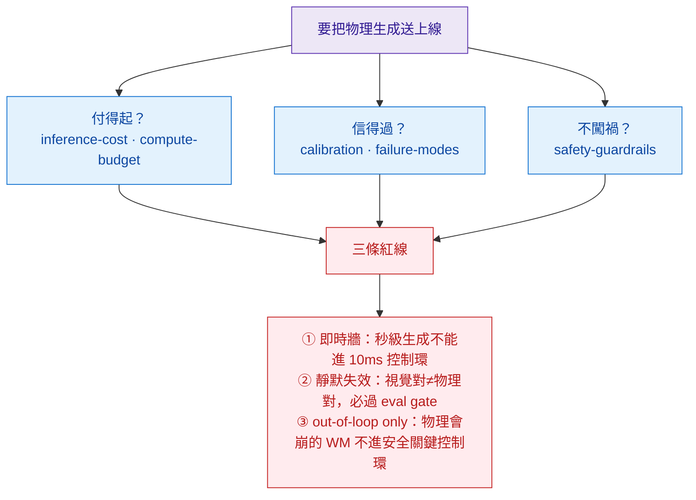

# Deployment — 把生成模型送上線

> 研究綜述講「哪個方法強」；工程手冊講「**送得上線嗎、付得起嗎、信得過嗎**」。這一層是分水嶺——本區把成本（付得起）、信任（信得過）、安全（不闖禍）三件事講清楚。

## 5 個主題

| 主題 | 一句話 | 核心結論 |
|---|---|---|
| [inference-cost](./inference-cost/overview.md) | 跑模型的成本 | **即時牆**：閉環控制要 <~100ms，video diffusion 慢 3-4 個數量級 → 是 out-of-loop 資料工廠，不是 in-loop simulator |
| [compute-budget](./compute-budget/overview.md) | 訓練 / GPU 預算 | **foundation × specialization 解耦**：預訓一次 ~21.6M H100-hr，後訓 ~100-200 GPU-hr（差 ~5 個數量級）→ 誰付得起進場 |
| [failure-modes](./failure-modes/overview.md) | 部署怎麼崩 | **「視覺對、物理錯」的靜默失效**最危險；幻覺物理 / OOD / drift / control-loop divergence |
| [safety-guardrails](./safety-guardrails/overview.md) | 不闖禍 | 紅線「**out-of-loop 資料工廠，不是 in-loop simulator**」；eval gate 當護欄；HITL；deepfake |
| [calibration](./calibration/overview.md) | 信得過嗎 | 視覺信心 **≠** 物理正確（Physics-IQ）；ensemble / 守恆殘差 / 下游遷移估不確定性 |

## 一條貫穿全區的線：生成模型是「資料工廠」不是「即時模擬器」

三個主題其實指向同一句話——當前的物理生成模型**慢**（即時牆）、**會靜默違反物理**（失效 + 校準）、所以**只能離線當資料工廠 / 評測 oracle，不能即時當控制環裡的 simulator**。要 in-loop 物理仍要回 [diff-sim](../foundations/differentiable-simulators/overview.md)（10ms 級）；生成模型補的是離線的外觀與長尾資料（見 [embodied-policy-rollout](../use-cases/embodied-policy-rollout/overview.md) 的「WM-as-policy 只在短 horizon 可信」）。

## 連到別處

- 失效的物理面 → [conservation-violation-atlas](../crossing/conservation-violation-atlas/overview.md)（誰違反哪條守恆律）
- 怎麼量「信不信得過」→ [evaluation-physics](../foundations/evaluation-physics/overview.md)（五個評測家族）
- 為什麼會 drift → [long-horizon-rollout](../foundations/long-horizon-rollout/overview.md)
- 整個領域的未解硬骨頭 → [frontier 研究前沿](../frontier/overview.md)
