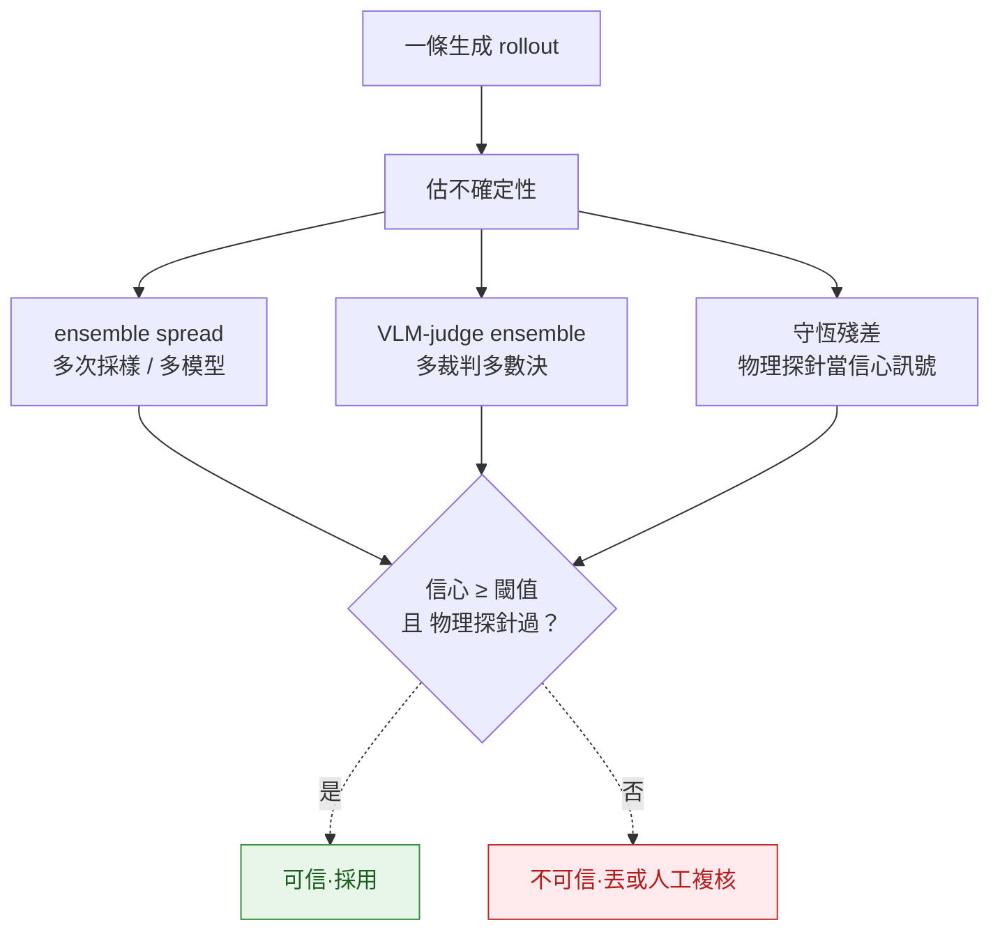

# Calibration

> 生成物理的「信心校準」：模型對自己生成內容的 confidence，到底有沒有對應到**物理正確性**？答案通常是**沒有**——視覺信心 ≠ 物理正確。這頁講怎麼估生成 rollout 的不確定性、何時可以信一條 rollout、何時該丟。評測方法在 [evaluation-physics](../../foundations/evaluation-physics/overview.md)，失效面在 [failure-modes](../failure-modes/overview.md)。

## 核心問題：信心校準到物理對不對嗎

一個校準良好的模型，「高信心」應該對應「真的對」。physics-gen 的麻煩是：模型（與 perceptual 指標）的信心**校準到視覺真實度，不是物理正確性**。Physics-IQ 量到兩者相關性 **Pearson r=−0.46 且統計不顯著**（`2501.09038`）——逼真度高不代表物理對，所以**不能用視覺信心 / FVD / CLIP-score 當「物理對」的信心代理**。要校準物理信心，得用獨立的物理探針。

## 不確定性估計與校準方法

| 方法 | 估什麼 | 校準到物理嗎 | 風險 / 注意 |
|---|---|---|---|
| **視覺信心 / 似然** | 模型對畫面的信心 | **否**——只校準到視覺真實度（r=−0.46，`2501.09038`） | 別當物理信心用；只是視覺門檻 |
| **deep ensemble / 多採樣 spread** | rollout 間的分歧 | 部分——分歧大代表不穩，但低分歧 ≠ 物理對（可一致地錯，mode collapse） | spread 過低要警惕 mode collapse（見 [failure-modes](../failure-modes/overview.md)） |
| **VLM-judge ensemble** | 多裁判對物理合理性的一致度 | 部分——多數決比單裁判穩 | **循環風險**：裁判自己物理弱（PhysBench `2501.16411`）；用 ensemble + scaffolding，別單裁判（[evaluation-physics](../../foundations/evaluation-physics/overview.md)） |
| **守恆殘差探針** | 質量/動量/能量違反量 | **是**——直接量物理，最紮實 | 需結構化場景；難用在自由生成影片；可當 reward（`2512.00425`，但會被 hack） |
| **下游遷移成功率** | 用生成資料訓的 policy/WM 成不成 | **是**（ground truth） | 最貴最間接；sim 成功率還要扣 sim2real |

口訣：**視覺信心拿來快篩，物理探針拿來定生死，VLM-judge 用 ensemble 補中間**——任何單一信心訊號都可能誤導。

## rating thresholds 與 surrogate / weather 校準

- **rating 閾值**：把「物理對不對」量化成可校準分數時，閾值會隨 domain / injection 強度漂移；跨 domain 遷移閾值要重新校準（具體閾值多為部署觀察，缺公開系統值者標 `UNVERIFIED`）。
- **科學 surrogate / 天氣的校準是成熟先例**：機率天氣模型 GenCast 用 **ensemble + CRPS**（連續分級機率分數）做機率校準，是「生成 + 已校準不確定性」的乾淨範例——可作 physics-gen 校準的參照框架（見 [scientific benchmarks](../../benchmarks/scientific/overview.md)）。注意：CRPS / ensemble 校準成熟在**有 ground-truth 觀測**的 surrogate 場景；自由生成影片缺 ground truth，這套不能直接照搬。

## 誠實框架（honest framing）

- **預設假設模型的物理信心未校準**。沒有獨立物理探針前，別信「高信心」。
- **低 spread ≠ 對**。ensemble 可以一致地錯（mode collapse / 共享 prior 偏差）；spread 是不確定性的下界不是上界。
- **VLM-judge ensemble 緩解但不消除循環**：裁判物理弱是系統性的（PhysBench），多數決降噪、不糾根本偏差。
- **CRPS / ensemble 校準的成功綁在 surrogate 有 ground truth**；自由生成沒有真值，校準只能靠物理探針 + 下游遷移近似，別把 surrogate 的校準成熟度外推到 video-gen。缺公開系統性閾值/校準曲線者一律標 `UNVERIFIED`，不捏造數字。

## 連回（cross-links）

- 評測五家族（信心訊號的來源）：[evaluation-physics](../../foundations/evaluation-physics/overview.md)
- mode collapse / 靜默失效：[failure-modes](../failure-modes/overview.md)
- eval gate 當安全護欄：[safety-guardrails](../safety-guardrails/overview.md)
- GenCast / CRPS ensemble 校準：[scientific benchmarks](../../benchmarks/scientific/overview.md)
- 守恆違反失敗地圖：[conservation-violation-atlas](../../crossing/conservation-violation-atlas/overview.md)
- 何時信一條 rollout（長程）：[long-horizon-rollout](../../foundations/long-horizon-rollout/overview.md)

## 參考

- Physics-IQ：視覺信心 vs 物理理解 r=−0.46（不顯著）`2501.09038`
- PhysBench：VLM 物理弱（VLM-judge ensemble 循環）`2501.16411`
- 守恆殘差 verifiable reward / reward-hacking `2512.00425`
- GenCast：ensemble + CRPS 機率天氣校準（見 scientific benchmarks 頁的 arXiv 錨）

---

← 回到 [deployment/ overview](../../deployment/overview.md) · [5 axis ontology](../../cheat-sheet/ontology.md)
