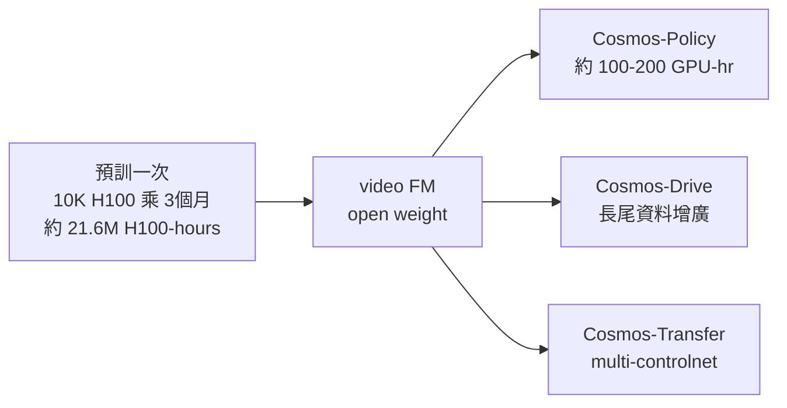

# Compute Budget

> 訓練端的 GPU 帳：按方法類別估算量級 —— 並回答那個決定性問題「誰付得起進場」。

本頁談**訓練 / 預算成本**（一次性建模代價），推理 / 單次跑的延遲見 [inference-cost](../inference-cost/overview.md)。主軸是一個結構性事實：**foundation 預訓貴到只有少數玩家燒得起，但下游 specialization 便宜到個人實驗室都做得到** —— 這個解耦定義了整個物理可控生成領域的「誰玩得起」地圖。

## 主表 — 訓練 GPU 預算（按方法類別）

| 方法類別 | 訓練成本量級 | 來源 / 條件 |
|---|---|---|
| video FM 預訓（Cosmos） | **10K H100 × 3 個月 ≈ 21.6M H100-hours**；~20M hr video → ~10^8 clips | arXiv 2501.03575 §data；cosmos-wfm §3（NVIDIA 內部 cluster）|
| video FM **後訓**（Cosmos-Policy） | **~100-200 GPU-hr**（8× A100/H100 × 1 晚）；小到几百 demos | arXiv 2601.16163；cosmos-wfm §1.2（比預訓少 ~5 個數量級）|
| latent WM（DreamerV4） | Minecraft Diamond **~17 天 × 1 A100**（社群多次驗證）；offline data 100× 效率 | dreamer-v4 §（VPT 2.5K hr，僅 ~100 hr action-labeled）|
| latent WM 小規模（Dreamer Atari） | size50m **~1× A100 一天** 到 reasonable | dreamer-v4 §GPU 預算 |
| diff-sim RL（MJX PPO） | REEM-C humanoid 8192 env × 200M PPO steps **56 分鐘 / 1× RTX 4090** | mujoco-mjx §perf（~60k env-steps/s）|
| 3DGS 重建 | 單場景重建，**單 GPU 分鐘～小時**級；無大規模預訓 | generative-gaussian-splatting；SOUS VIDE/FiGS（2412.16346）|
| neural surrogate (PDE) | 視問題；多為單 GPU/小集群，無 video-FM 級燒錢 | differentiable-simulators overview |

> 量級對照：Cosmos 預訓 ~**21.6M H100-hours** vs Cosmos-Policy 後訓 ~**100-200 GPU-hr** —— 相差約 **5 個數量級**。這不是漸進差距，是「資料中心 vs 一張顯卡」的鴻溝。

## Eureka — foundation × specialization 解耦

Cosmos 不押單一 model size，押的是 **"foundation × specialization" decoupling**（cosmos-wfm §1.2）：

- **預訓一次燒掉天價**：20M hr video、10K H100、3 個月 —— 把 implicit physics + 多模 conditioning 學進權重。
- **後訓重複利用且便宜**：下游 robotics / driving 團隊只要**几百到几千 GPU-hour** 做 post-train（Cosmos-Policy 從 Predict2-2B 單階段 SFT，8× A100/H100 一晚跑通，且論文明說「無架構修改」是 unlock；cosmos-wfm §8、arXiv 2601.16163）。
- **賭注核心**：pixel-video FM 的 implicit physics + 下游 sim-in-loop reward 比 hard PDE 路線更 scalable —— 用一次性的天價預訓換下游全民可玩。

## 誰付得起進場

| 方法 | 進場門檻 | 誰玩得起 |
|---|---|---|
| 從零訓 video FM | **>百萬美元級** GPU farm（10K H100 × 月）| 只有 NVIDIA / 大廠 / 國家級算力 |
| video FM 後訓 | ~100-200 GPU-hr（8 卡一晚）| 大學實驗室 / 中型團隊 |
| latent WM (Dreamer) | 1× A100 一天～17 天 | 個人研究者（Atari 規模）到中型團隊（Minecraft）|
| diff-sim RL (MJX) | **1× RTX 4090** 即可千環 RL | 個人 / 消費級硬體 |
| 3DGS 重建 | 單 GPU 分鐘～小時 | 個人 / 消費級硬體 |

**一句話**：預訓一個 video FM 是 **>百萬美元的賭注**，賭錯就是燒掉資料中心；但**後訓 / diff-sim / 3DGS 都在單卡～8 卡可達範圍**，是這個領域真正「人人可入場」的層。這也是為什麼開源 open-weight FM（如 Cosmos）的價值不在「比 Sora 更會做夢」，而在**把那筆天價預訓變成下游開發者可組裝的 pipeline**（cosmos-wfm §1.2）。

## 誠實框架 — 隱藏成本與 scaling 拐點

- **資料成本被藏在 GPU-hour 之外**：Cosmos 預訓的 ~20M hr video → ~10^8 clips 的**curation / tokenize / 儲存**本身就是重資產，不在 21.6M H100-hours 內。
- **後訓便宜 ≠ 免費的午餐**：後訓便宜的前提是**有人先付了預訓的錢**並 open-weight 出來；若 FM 是 closed（Sora/Veo），下游連後訓的門都進不去，只能走 API（成本 `UNVERIFIED`）。
- **diff-sim 的 scaling 拐點**：MJX 在 <64 env 時 GPU 反而比 CPU MuJoCo 慢（mujoco-mjx pitfall 8.6）—— 千環並行才划算；JIT compile 時間要攤提在百萬步上。
- **per-class 的 scaling 性質不同**：video FM 吃 data + params 雙 scaling（越大越貴）；diff-sim RL 吃 env 並行度（4090 已 8192 env）；3DGS 吃場景數（無共享預訓）。三條線的「貴」是不同維度的貴，不能直接比 H100-hour。
- **Cosmos 預訓數字條件**：10K H100 × 3 個月 為 NVIDIA 內部披露 / 論文 §data 推算的量級 anchor，非逐 step 帳單；實際隨 model variant（7B/14B Diffusion + 4B/12B AR）分攤。

## 連回（cross-links）

- 預訓 / 後訓解耦的本體解構：[foundation-physics-models / cosmos-wfm](../../foundations/foundation-physics-models/cosmos-wfm.md)（§1.2 Eureka、§3 資料 scale）
- latent WM 的訓練效率路線：[latent-world-models / dreamer-v4](../../foundations/latent-world-models/dreamer-v4.md)
- diff-sim / GPU 並行 RL 的算力性質（並行 ≠ 可微）：[differentiable-simulators / overview](../../foundations/differentiable-simulators/overview.md)
- 下游 policy 真用 WM 時的成本面：[use-cases / embodied-policy-rollout](../../use-cases/embodied-policy-rollout/overview.md)
- 推理端延遲 / 即時牆：[inference-cost](../inference-cost/overview.md)
- 部署索引：[deployment / overview](../overview.md)

## 參考（arXiv）

- Cosmos Predict1 — *Cosmos World Foundation Model Platform for Physical AI*. 2025-01 · [arXiv:2501.03575](https://arxiv.org/abs/2501.03575)
- Cosmos-Policy — *Cosmos-Policy*（video FM 直接當 policy backbone）. 2026-01 · [arXiv:2601.16163](https://arxiv.org/abs/2601.16163)
- DreamerV4 — Hafner, Yan, Lillicrap. *Training Agents Inside of Scalable World Models*. 2025-09 · [arXiv:2509.24527](https://arxiv.org/abs/2509.24527)
- SOUS VIDE (FiGS, 3DGS) — 2024-12 · [arXiv:2412.16346](https://arxiv.org/abs/2412.16346)

> 註：Cosmos 預訓 21.6M H100-hours、後訓 100-200 GPU-hr、MJX 56 分鐘 / 4090、Dreamer 17 天 / A100 等數字均為論文 / 官方 / 社群驗證 anchor。Sora / Veo 訓練成本與 closed-weight 訓練帳單 `UNVERIFIED`。預訓數字為量級 anchor 非逐 step 帳單。
