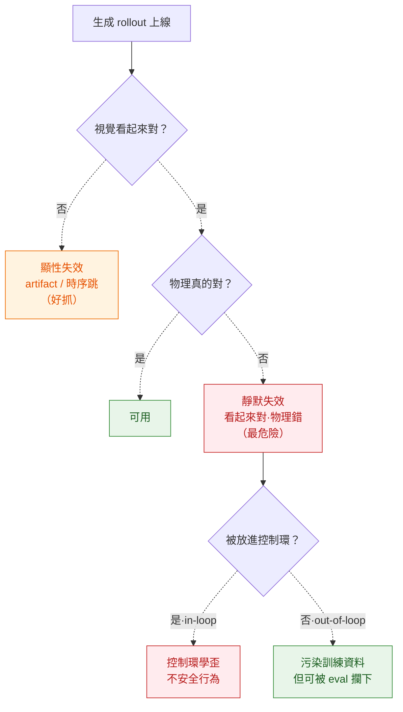

# Failure Modes

> physics-controllable generation 在 production 怎麼崩——這頁是 deployment 層的「失效字典」。不是「benchmark 分數低」那種看得見的崩，重點在**看起來對、物理其實錯**的靜默失效，以及把違反物理的 WM 放進控制環時的連鎖崩潰。評測方法在 [evaluation-physics](../../foundations/evaluation-physics/overview.md)，守恆軸失敗地圖在 [conservation-violation-atlas](../../crossing/conservation-violation-atlas/overview.md)。

## 為什麼 physics-gen 的失效特別陰

傳統生成模型崩了你看得出來（畫面糊、artifact、時序跳）。physics-gen 最危險的失效是**視覺零破綻、物理全錯**——Physics-IQ 量到視覺真實度與物理理解相關性 **Pearson r=−0.46 且統計不顯著**（`2501.09038`）：越逼真不代表越懂物理。所以 production 的失效偵測**不能只靠 perceptual 指標**，必須有獨立的物理探針。

## 失效分類表（taxonomy）

| 失效 | 何時出現 | 怎麼偵測 | 怎麼緩解 |
|---|---|---|---|
| **幻覺物理（hallucinated physics）** | 任何自由生成；模型用 data prior 補出「看似合理」運動，但守恆/接觸全錯 | 守恆律探針（質量/動量/能量殘差）；獨立物理 eval，**別只看 perceptual** | 守恆殘差當 reward/loss（`2512.00425`）；sim-in-loop 出 ground truth 再貼皮（Cosmos × diff-sim） |
| **OOD 崩潰（OOD collapse）** | 幾何/材質/相機分佈外的場景（訓練未見構型） | 與訓練分佈的距離度量；OOD 場景上守恆違反率突升 | 擴大資料涵蓋；明確標 operating envelope；OOD 時拒答而非硬生 |
| **long-horizon drift** | rollout 拉長、跨 clip 銜接時誤差累積放大（exposure bias） | FVD 隨 rollout length 曲線；守恆違反率隨時間；identity 漂移 | hierarchical / sliding-KV 架構；scheduled sampling；見 [long-horizon-rollout](../../foundations/long-horizon-rollout/overview.md) |
| **mode collapse** | 多樣性塌成少數模式；ensemble 之間過度一致 | 樣本多樣性度量；ensemble spread 異常低 | 多樣性正則；條件多樣化；檢查 guidance scale 是否壓死 spread |
| **contact-rich silent failure** | grasp / 布料 / 流體：視覺合理但 force / contact phase 崩 | 不可只看畫面；對齊 diff-sim 的 force / contact label | **不要單獨拿 pixel-video rollout 當 VLA 訓練資料**；與 diff-sim contact label 對齊（Cosmos §9.2，`2606.02800`） |
| **control-loop divergence** | 把違反物理的 WM 放進 in-loop 控制（PID/MPC/RL） | closed-loop 軌跡發散；sim 與 real 行為背離 | **out-of-loop data engine，不是 in-loop simulator**（見 [safety-guardrails](../safety-guardrails/overview.md)）；in-loop 留給 diff-sim |

## 誠實框架（honest framing）

- **靜默失效是 default，不是 edge case**。pixel-video FM 的物理是 implicit 的，「看起來對」與「物理對」結構性脫鉤——這是路線特性，scale up 不會自動解（Cosmos §9 結論：9.1 long-horizon drift / 9.2 contact-rich / 9.3 3D inconsistency 是**結構性 break**，`2606.02800`）。
- **沒有單一指標能抓全部失效**。守恆探針抓不到 mode collapse，多樣性度量抓不到接觸崩；至少兩個正交家族交叉（[evaluation-physics](../../foundations/evaluation-physics/overview.md)）。
- **最貴的失效是被放進控制環的那一刻**。同一個違反物理的 rollout，當 out-of-loop 資料只是污染（可被 eval 攔），當 in-loop 模擬器會讓控制環**學到不安全行為**。這條決定 deployment 紅線。
- 具體失效的**發生頻率/比例**多為部署觀察，缺公開系統性數字者標 `UNVERIFIED`；本頁只把可引用的（r=−0.46、Cosmos §9）綁 arXiv，不捏造比例。

## 連回（cross-links）

- 評測方法（五家族 + 五陷阱）：[evaluation-physics](../../foundations/evaluation-physics/overview.md)
- 長程漂移專章：[long-horizon-rollout](../../foundations/long-horizon-rollout/overview.md)
- 接觸崩 + in-loop 結構性 break：[cosmos-wfm](../../foundations/foundation-physics-models/cosmos-wfm.md)
- 守恆違反失敗地圖：[conservation-violation-atlas](../../crossing/conservation-violation-atlas/overview.md)
- 護欄（in-loop 紅線 / eval gate）：[safety-guardrails](../safety-guardrails/overview.md) · 信心校準：[calibration](../calibration/overview.md)
- 下游風險場景：[autonomous-driving-sim](../../use-cases/autonomous-driving-sim/overview.md) · [embodied-policy-rollout](../../use-cases/embodied-policy-rollout/overview.md)

## 參考

- Physics-IQ：視覺真實度 vs 物理理解 r=−0.46（不顯著）`2501.09038`
- Reward-hacking / 守恆殘差 verifiable reward `2512.00425`
- Cosmos WFM §9 pitfall log（contact-rich / long-horizon / 3D）`2606.02800`
- 綜述錨點 *Generative Physical AI in Vision: A Survey* `2501.10928`

---

← 回到 [deployment/ overview](../../deployment/overview.md) · [5 axis ontology](../../cheat-sheet/ontology.md)
