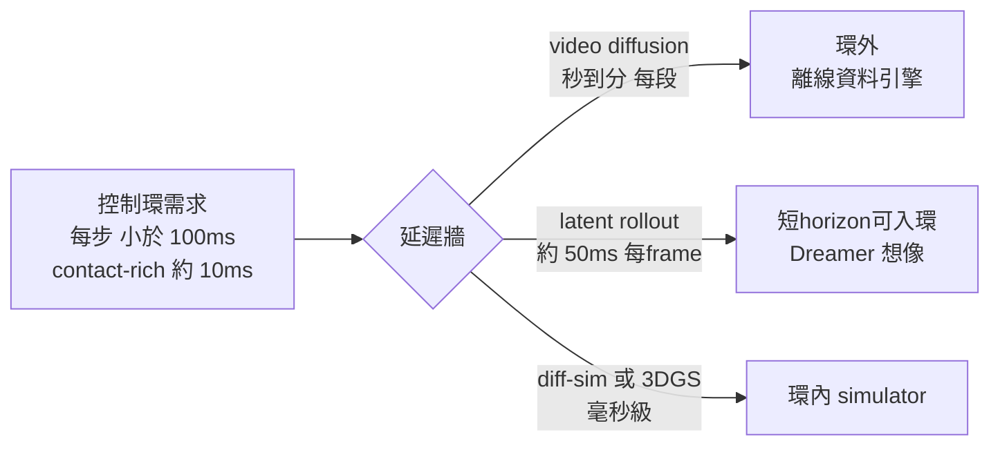

# Inference Cost

> 跑一段生成 / 一步 rollout 到底要多少時間與算力 —— 以及為什麼這個數字決定了 video WM 只能當離線資料引擎、進不了控制環。

本頁談**推理成本**（執行已訓好的模型），訓練 / GPU 預算見 [compute-budget](../compute-budget/overview.md)。核心張力只有一句：**video diffusion 的單段延遲是「秒～分」級，而閉環控制要「毫秒」級** —— 差三到四個數量級，這道牆把生成式世界模型釘死在 in-loop simulator 之外。

## 主表 — 推理延遲 / 吞吐（實測 anchor）

| 模型 / 系統 | 推理成本量級 | 硬體 | 來源 / 條件 |
|---|---|---|---|
| Cosmos-Predict 7B (Text2World) | 單段 5s clip **~2-4 分鐘** | 1× H100 80GB；fp8/bf16 ~50GB | cosmos-predict1 README 性能表（社群 reproduction）|
| Cosmos-Predict 14B (Text2World) | 更慢；A100 80GB 常 **OOM** | H100/H200 80GB(fp8) 或 2× A100 sequence-parallel | HF discussions / cosmos README（pitfall 9.5）|
| Cosmos Reason1-7B (VLM) | LLM 級 token 推理 | 1× H100 或雙 A100；vLLM | NIM endpoint 可走 API（cosmos-wfm §4）|
| DreamerV4 latent rollout | 互動 **≥20 FPS**（~50ms/frame）| 1× H100 | arXiv 2509.24527（latent imagination，非 pixel）|
| Sora / Veo 每段 cost | `UNVERIFIED` — 官方未公布 per-video 算力 / 成本 | closed weight，僅 API | 不捏造；待官方或可信第三方數字 |
| MJX 物理 rollout | humanoid 8192 env **~60k env-steps/s** | 1× RTX 4090 | mujoco-mjx §perf（200M steps / 56 min）|
| 3DGS render (SOUS VIDE / FiGS) | **~130 fps** 渲染 | 單 GPU | arXiv 2412.16346（簡化動力學 + 3DGS 耦合）|
| Isaac Sim (RTX 光追) | photoreal 渲染，非即時批量 | RTX GPU | Isaac Sim v6.0；Replicator CosmosWriter 出 RGB/depth/seg |

> 量級對照（一段 5s clip = 120 frame @24fps）：Cosmos-7B ~2-4 分鐘 → **每 frame ~1-2 秒** 的 diffusion denoising；DreamerV4 latent ~50ms/frame；3DGS render ~8ms/frame。**pixel-diffusion 比 latent rollout 慢約 20-40 倍，比 3DGS render 慢約 100-250 倍。**

## 為什麼 pixel-diffusion 這麼貴

video diffusion 的成本由**多步去噪 乘上 高維 pixel/latent grid** 決定：每生成一段要在整個時空 grid 上跑數十步 denoising，每步一次完整 UNet/DiT forward。對比之下：

- **DreamerV4** 在 latent 空間 rollout，且 shortcut forcing 把每 frame 採樣壓到 **4 步**（vs diffusion-forcing 64 步，快 ~16 倍；arXiv 2509.24527）—— 這是它能撐 ≥20 FPS 的關鍵。
- **3DGS** 根本不去噪：它是顯式幾何 + 光柵化 rasterize，render 是一次前向，所以能上 ~130 fps。

**量化 (fp8/bf16) 的作用**：把 14B Cosmos 從「A100 80GB OOM」拉回「H100/H200 單卡可跑」靠的就是 fp8；7B fp8/bf16 約 50GB 顯存（cosmos-wfm §4）。量化主要解**顯存門檻與單卡可行性**，對「秒→毫秒」的數量級鴻溝幫助有限 —— 它讓你**跑得起**，但跑不快到能進控制環。

## 誠實框架

- **即時牆 (the real-time wall)**：閉環控制（PID / MPC / RL policy）一步預算 **<~100ms**，contact-rich 高速場景要 **~10ms**。Cosmos-Predict 一段 clip 要 **2-4 分鐘** —— 慢了 3-4 個數量級。所以 video WM **不是 in-loop simulator，是 out-of-loop data engine**：它離線生成增廣資料 / rollout 給下游 policy 訓練，而不是即時餵給控制器。cosmos-wfm §8 對自駕工程師明寫「不要拿 Cosmos-Drive 當 in-loop simulator 跑 PID/MPC，它是 out-of-loop data engine」。10ms 級閉環仍要走 diff-sim（cosmos-wfm §7 falsifiable prediction 3）。
- **誰付得起跑**：跑一段 Cosmos clip 的**邊際成本**是「一張 H100 佔用 2-4 分鐘」 —— 後訓練 / 個人研究者付得起單次推理；但要**大規模生成資料集**（百萬段）就回到資料工廠等級的 GPU farm。Sora/Veo 只有 API，per-video 成本 `UNVERIFIED`。
- **隱藏成本**：(a) **JIT/編譯**：MJX 首次 JIT compile 很慢，攤提在後續百萬步才划算（少於 64 env 用 MJX 反而比 CPU MuJoCo 慢，mujoco-mjx pitfall 8.6）；(b) **顯存→可行性**：14B 在 A100 80GB OOM 不是「慢」而是「跑不了」，得 fp8 或 sequence-parallel 多卡；(c) **batch 吞吐 vs 延遲**：批次能拉高 throughput（單位算力產更多段）但**不降低單段延遲** —— 對控制環無用，對離線資料工廠才有意義。

## 連回（cross-links）

- 為什麼 video WM 是環外資料引擎不是環內模擬器：[foundation-physics-models / cosmos-wfm](../../foundations/foundation-physics-models/cosmos-wfm.md)（§8 persona 分流、§7 falsifiable prediction）
- latent rollout 的低延遲路線：[latent-world-models / dreamer-v4](../../foundations/latent-world-models/dreamer-v4.md)
- 毫秒級 in-loop simulator（diff-sim / 3DGS render）：[differentiable-simulators / overview](../../foundations/differentiable-simulators/overview.md)
- WM 真的進決策環時的可信度命題：[use-cases / embodied-policy-rollout](../../use-cases/embodied-policy-rollout/overview.md)
- 訓練端 GPU 預算（foundation × specialization 解耦）：[compute-budget](../compute-budget/overview.md)
- 部署索引：[deployment / overview](../overview.md)

## 參考（arXiv）

- Cosmos Predict1 — *Cosmos World Foundation Model Platform for Physical AI*. 2025-01 · [arXiv:2501.03575](https://arxiv.org/abs/2501.03575)
- DreamerV4 — Hafner, Yan, Lillicrap. *Training Agents Inside of Scalable World Models*. 2025-09 · [arXiv:2509.24527](https://arxiv.org/abs/2509.24527)
- SOUS VIDE (FiGS, 3DGS ~130fps) — 2024-12 · [arXiv:2412.16346](https://arxiv.org/abs/2412.16346)
- Cosmos-Policy — 2026-01 · [arXiv:2601.16163](https://arxiv.org/abs/2601.16163)

> 註：Sora / Veo 的 per-video 算力與成本均 `UNVERIFIED`（closed-weight、官方未公布）；本頁所有延遲數字為論文 / 官方 README / 社群 reproduction anchor，非合成基準。Cosmos 推理時間為社群 reproduction 區間，隨採樣步數 / 解析度 / 量化精度浮動。
