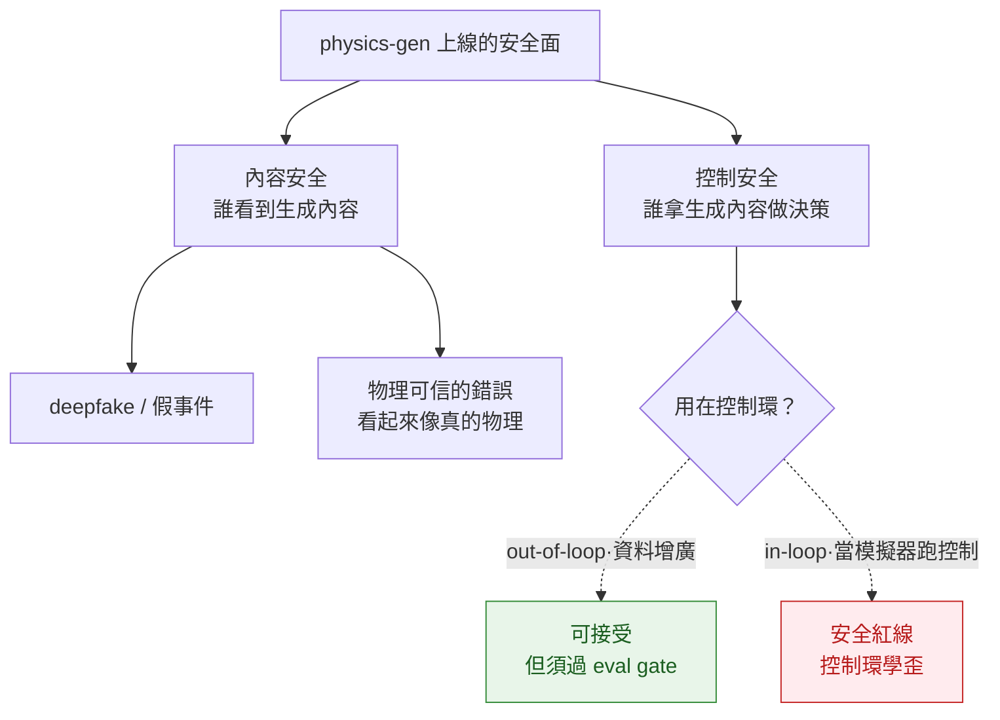

# Safety Guardrails

> physics-controllable generation 上線前要架的安全護欄。兩條軸：① **內容安全**（misuse / deepfake / 物理上以假亂真的誤導內容）；② **控制安全**——把違反物理的 WM 或生成資料放進 AV / robotics 控制環，會讓系統**學到不安全行為**。本頁的核心紅線一句話：**out-of-loop data engine，不是 in-loop simulator**。失效面在 [failure-modes](../failure-modes/overview.md)，eval gate 的方法在 [evaluation-physics](../../foundations/evaluation-physics/overview.md)。

## 兩類安全風險

## 控制安全：最關鍵的一條規則

**把違反物理的世界模型放進閉環控制（PID / MPC / RL in-the-loop）= 把錯誤的物理當成真相去學。** 控制器會利用模型的物理漏洞（reward-hacking 的控制版），在模擬裡「成功」但真實世界不安全。Cosmos 的 deployment 指引把這條寫死：Cosmos-Drive-Dreams 做 long-tail 資料增廣是 Wayve / NVIDIA Isaac 的 production pattern，但**不要拿來當 in-loop simulator 跑 PID/MPC**——long-horizon drift + 3D inconsistency 會讓控制環學歪（`2606.02800`，§7.3）。

> 規則：pixel-video FM 是 **out-of-loop data engine**（離線出資料，再過 eval 過濾），不是 in-loop simulator。10ms 級閉環控制要 in-loop sim，留給可微/可驗證的 diff-sim，不交給 implicit-physics 的生成模型。contact-rich + force-fidelity 是 pixel-video 路線結構性 break，hierarchical 解一半也不夠（`2606.02800`，§7.1）。

## 護欄清單（guardrail checklist）

| 護欄 | 防什麼 | 怎麼落地 |
|---|---|---|
| **eval gate（不過物理 eval 不上線）** | 把違反物理的內容/資料當合格品送下游 | CI 卡守恆探針 + benchmark 套件 + 下游遷移，至少兩家族交叉（[evaluation-physics](../../foundations/evaluation-physics/overview.md)）；分數帶 Goodhart 警戒 |
| **in-loop 紅線** | 控制環學到不安全行為 | 明文禁止把 generative WM 當 in-loop 模擬器；in-loop 用 diff-sim；生成模型只做 out-of-loop 增廣 |
| **human-in-the-loop** | 自動 eval 漏掉的細微/長尾物理錯誤 | 高風險場景（AV 長尾、醫療、結構）人工複核；抽樣稽核生成批次 |
| **red-teaming** | 已知幻覺物理 + OOD 構型 + 對抗條件 | 建對抗測試集（接觸/流體/罕見幾何）；定期跑 OOD 場景看守恆違反率 |
| **provenance / watermark** | deepfake、生成內容被誤當真實證據 | 內容標記/水印 + 來源標註；公開散佈場景尤需（具體方案 `UNVERIFIED`） |
| **operating envelope 標註** | 在分佈外場景被誤用 | 明確聲明適用幾何/材質/時長範圍；超出範圍拒答而非硬生 |

## 誠實框架（honest framing）

- **eval gate 是安全機制，不只是品質機制**。「視覺真 ≠ 物理真」（Physics-IQ r=−0.46，`2501.09038`）意味著沒有獨立物理 eval，再漂亮的 demo 也可能是不安全資料。
- **eval gate 自己也會被 game**。benchmark Goodhart、VLM-judge 循環（裁判自己物理弱，PhysBench `2501.16411`）會讓「過了 gate」變成假安全；護欄要 ensemble + human spot-check，別單裁判。
- **內容安全的水印/溯源** 在 physics-gen 場景缺成熟標準與公開數據，本頁標 `UNVERIFIED`，只陳述工程方向，不偽裝成已驗證機制；不捏造覆蓋率/誤報率數字。

## 連回（cross-links）

- 失效面（in-loop divergence 等）：[failure-modes](../failure-modes/overview.md)
- eval gate 方法論（五家族 + 五陷阱）：[evaluation-physics](../../foundations/evaluation-physics/overview.md)
- in-loop 結構性 break 與 deployment 指引：[cosmos-wfm](../../foundations/foundation-physics-models/cosmos-wfm.md)
- 守恆違反失敗地圖：[conservation-violation-atlas](../../crossing/conservation-violation-atlas/overview.md)
- 信心是否可信：[calibration](../calibration/overview.md)
- 高風險場景：[autonomous-driving-sim](../../use-cases/autonomous-driving-sim/overview.md) · [embodied-policy-rollout](../../use-cases/embodied-policy-rollout/overview.md)

## 參考

- Cosmos WFM：out-of-loop data engine vs in-loop sim 指引、結構性 break `2606.02800`
- Physics-IQ：視覺真實度 ≠ 物理理解 r=−0.46（不顯著）`2501.09038`
- PhysBench：VLM 物理弱（VLM-judge gate 循環風險）`2501.16411`

---

← 回到 [deployment/ overview](../../deployment/overview.md) · [5 axis ontology](../../cheat-sheet/ontology.md)
