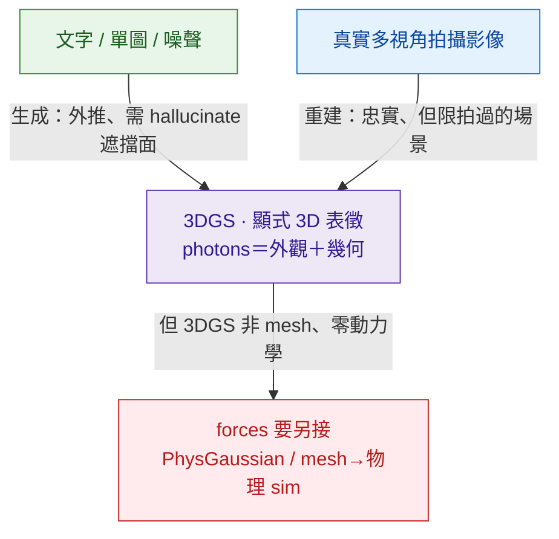
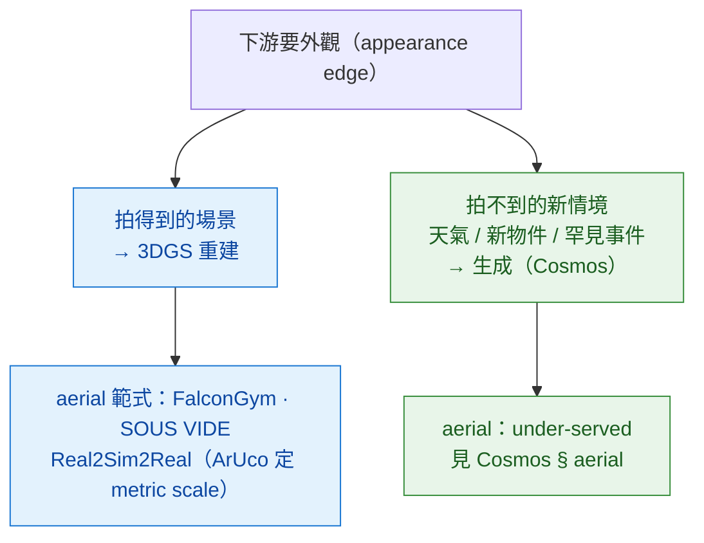

# 3D-Aware Generation

> 顯式 3D 表徵（3DGS / NeRF / mesh）＋ 時間，當生成模型的**外觀邊供應線**。本區與 [[spatial-handbook]] 的 3DGS/NeRF zone 接壤——差別在「**生成 vs 重建**」這條線（見下）。對本手冊的意義：3DGS 給你 **photons（外觀＋幾何、多視角一致、可任意重渲）**，但**不給 forces（動力學）**——物理要另接。

## 為什麼跟 video-world-models 分開

- output 是顯式 3D（3DGS / mesh / occ / SDF），不是像素——可多視角一致、可渲染任意視點、可重複使用同一場景。
- pixel-video（[Sora](../video-world-models/sora.md) / [Veo](../video-world-models/veo.md) / [Cosmos](../foundation-physics-models/cosmos-wfm.md)）看完一個 view 場景就「消失」；3DGS 的 `.splat` 場景可任意重渲。
- 物理規律可作用於顯式幾何——但 **3DGS 不是 mesh**，這個耦合不是免費的（§物理耦合）。

## 核心框架：兩個方向到同一個 3DGS 表徵

3DGS 不是一條路，是一個**表徵**，有兩個資訊方向相反的來源——這是讀本區的關鍵切分：

*圖：同一個 3DGS 表徵，兩個方向。**生成**從文字/單圖外推（必須 hallucinate 看不到的面）；**重建**從多視角拍攝忠實 fit（但只限拍過的場景）。兩者都只給外觀＋幾何，動力學都得另接。*

- **生成側（本區主收）**：從文字/單圖/噪聲**外推**出 3D。代表 [GGS](./generative-gaussian-splatting.md)（video-diffusion 中間 bottleneck）、[World Labs Marble](./world-labs.md)（商用 3D-FM）、feed-forward GS（pixelSplat / MVSplat / LGM）、SDS 線（DreamFusion→Magic3D→MVDream）。**好處**：能造沒拍過的場景。**代價**：遮擋面是猜的、domain 窄。
- **重建側（Spatial 主收，但下游 use-case 靠它）**：從多視角真實影像**忠實 fit**。代表 3DGS（Kerbl SIGGRAPH 2023）、大場景/aerial（CityGaussian / VastGaussian / DroneSplat / Horizon-GS）、動態 4D（4D-GS / Deformable-3DGS）。**好處**：photoreal、metric-anchorable。**代價**：只能重現拍過的場景。

## 本區 landscape

| 方向 | 子類 | 代表 | 資訊來源 |
|---|---|---|---|
| **生成** | video-diffusion bottleneck | [GGS](./generative-gaussian-splatting.md)（`2503.13272`，ICCV 2025） | 文字/單圖 → 外推 |
| 生成 | feed-forward GS | pixelSplat（CVPR24）· MVSplat（ECCV24）· LGM（`2402.05054`）· Splatter Image（`2312.13150`） | 稀疏視角 → 前饋 |
| 生成 | SDS 蒸餾 | DreamFusion（`2209.14988`）→ Magic3D → MVDream（`2308.16512`） | 文字 → per-scene 優化（小時級） |
| 生成 | 商用 3D-FM | [World Labs Marble](./world-labs.md) | 文字/圖 → persistent 可編輯 3D |
| **重建** | 單場景 root | 3DGS（Kerbl `2308.04079`）· NeRF（`2003.08934`） | 多視角拍攝 → fit |
| 重建 | 大場景 / aerial | CityGaussian（`2404.01133`）· VastGaussian（`2402.17427`）· DroneSplat（`2503.16964`）· Horizon-GS（`2412.01745`） | 空拍 / drone → fit |
| 重建 | 動態 4D | 4D-GS（`2310.08528`）· Deformable-3DGS（`2309.13101`） | 影片序列 → 形變場（**replay 非預測**） |
| **物理耦合** | GS ＋ 物理 | PhysGaussian（`2311.12198`）· RoboGSim（`2411.11839`）· SplatSim（`2409.10161`）· GSWorld（`2510.20813`） | 補 forces |

## 物理耦合 crux：3DGS 給 photons，不給 forces

本手冊最關心的一刀——**3DGS 是一堆高斯核，不是 mesh：沒有表面、沒有碰撞幾何**。所以「在 3DGS 上做物理」不是免費的，三條路：

1. **直接在高斯核上算物理**：**PhysGaussian**（`2311.12198`，CVPR 2024）把 MPM 連續介質力學直接套在高斯核上，sim 與 render 共用同一組核、免 meshing。
2. **抽 mesh 再餵物理引擎**：SuGaR（`2311.12775`）/ 2DGS（`2403.17888`）把高斯收斂成表面 → mesh → [Genesis](../differentiable-simulators/genesis.md) / [MJX](../differentiable-simulators/mujoco-mjx.md) 跑 contact。
3. **GS 當 render primitive 接 sim**：RoboGSim / SplatSim / GSWorld 把 3DGS 當渲染層、物理另算（real2sim2real 機器人線）。

⚠ **動態 4D-GS 是 replay 不是 predict**：4D-GS / Deformable-3DGS 把形變場 fit 到**觀測過**的序列——它**內插重現**看過的動態，**不預測**新物理。要預測就回 PhysGaussian 式模擬或 diff-sim。

## 外觀邊供應線：use-case（尤其 aerial）怎麼選

下游 use-case 的外觀其實有**兩條供應線**，分工清楚：

*圖：**重建 owns「拍過的場景」外觀，生成 owns「沒拍過的新情境」**——互補不是競爭。對 [aerial-sim](../../use-cases/aerial-sim/overview.md) 這條本倉最深的 use-case，外觀的現實主力是 3DGS 重建（[GS 解構 § aerial](./generative-gaussian-splatting.md)）；生成（Cosmos）在 aerial 仍 under-served（見 [Cosmos § aerial](../foundation-physics-models/cosmos-wfm.md)）。*

## 本區 vs Spatial-Handbook 的分工

- Spatial-Handbook `foundations/3dgs-family/` 收 3D **重建**側（Kerbl / 4D-GS / SuGaR / Mip-Splatting，從機器人攝影機 fit 場景）。
- 本倉 `3d-aware-generation/` 收 3D **生成**側。
- **但**：下游 use-case 的外觀邊**多半靠重建**（aerial 的 FalconGym/SOUS VIDE 都是重建），所以本 overview 也 own「重建作為外觀供應線」的角色——method 解構在 Spatial，appearance-edge 的接法在這裡講。跨 ref 走 [bridge-to-spatial/3d-aware-video-gen](../../bridge-to-spatial/3d-aware-video-gen.md)。

## 本區 Dissections

- [Generative Gaussian Splatting](./generative-gaussian-splatting.md) —— 3DGS 當 video diffusion 中間 bottleneck 保 3D 一致（生成側學界 anchor）；含 § aerial（重建側 Real2Sim2Real 的接法）
- [World Labs Marble](./world-labs.md) —— 從 image/text 生 explorable 3D scene（生成側商用 anchor，closed product）

## 缺口 / 還想收

- [ ] **PhysGaussian / GS+物理** 獨立解構——「在高斯核上算物理」是 3DGS 接動力學的最直接路，值得單寫（目前只在 crux 帶過）
- [ ] **4D Gaussian / Deformable-3DGS** 動態側——replay vs predict 的界線
- [ ] **大場景 aerial 重建線**（CityGaussian / DroneSplat / Horizon-GS）——城市級空拍重建，aerial-sim 外觀的真正引擎
- [ ] DreamFusion → Magic3D → MVDream 的 SDS 演化（per-scene 優化 vs feed-forward 的取捨）

## §8 共通 pitfall

- **Multi-view consistency 仍脆**——生成側靠表徵硬保證（GGS），但 pose 退化 / 大基線仍漏；重建側 sparse-view / 大基線出 artifact（DroneSplat 的 motivation）。
- **3D 表徵 → 物理規律的 coupling 不明確**——3DGS 不是 mesh，加 contact 要先 mesh-extract 或走 PhysGaussian；`injection=data-only` 的天花板就在這。
- **metric-scale 陷阱**——SfM/3DGS 重建是**尺度模糊**的；要拿來做控制（drone 的推力/重力/速度都按真實公尺）必須補 metric scale。aerial 範式用 **ArUco fiducial**（FalconGym 2.0 / SOUS VIDE）取代昂貴 mocap。
- **動態是 replay 不是 predict**——4D-GS 重現看過的動態，不外推新物理；別把它當世界模型用。
- **推理 / 重建 cost**——多視角 ＋ 時間維；大場景 GS 仍可能 OOM，需 LoD / 分塊（CityGaussian / VastGaussian）。
