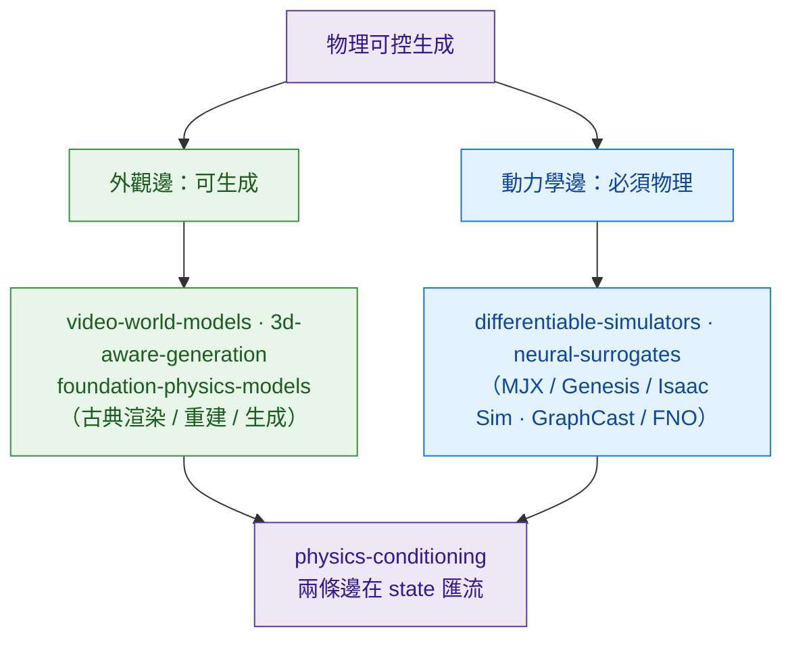

# Foundations — 13 個技術 zone

每 zone 對應一個獨立的「物理可控生成」技術路線。每篇 dissection 需要在 zone 內歸位，並在五軸 ontology 中明確標籤。

這 13 個 zone 並非一字排開，而是沿本書的中心命題分成「兩條邊」：[外觀邊](3d-aware-generation/)（appearance，可生成）負責像素與幾何，[動力學邊](differentiable-simulators/)（dynamics，必須物理）負責守恆與演化，兩邊在 [physics-conditioning](physics-conditioning/) 這個注入層匯流到同一個 state。

*外觀邊可生成（video-world-models / 3d-aware-generation / foundation-physics-models，含古典渲染、重建、生成三條供應線），動力學邊必須物理（differentiable-simulators / neural-surrogates），兩條邊在 physics-conditioning 注入層匯流到同一個 state。*

| Zone | 核心問題 | Anchor methods |
|---|---|---|
| [video-world-models](video-world-models/) | 直接生成像素影片，物理 `data-only`（v2） | Sora · Veo · Cosmos-Predict · GAIA · SVD |
| [latent-world-models](latent-world-models/) | 在 latent 空間 rollout，省 compute、貼 agent control | V-JEPA · V-JEPA-2 · DreamerV4 · MuZero-line |
| [physics-conditioning](physics-conditioning/) | 物理規律「怎麼進」模型 — 本倉真正的 USP zone | PINN · PhysGen · EBM-physics · Hamiltonian-NN |
| [diffusion-physics](diffusion-physics/) | Diffusion score function 加物理梯度 / classifier guidance | PhysDiff · ContactGen-diffusion · ForceGen-diffusion |
| [differentiable-simulators](differentiable-simulators/) | 可微 simulator 作為訓練 oracle / loss / 資料源 | MuJoCo MJX · Genesis · Warp · Brax · DiffTaichi |
| [neural-surrogates](neural-surrogates/) | 用 NN 替代 PDE solver；最強物理 inductive bias | GraphCast · MeshGraphNet · FNO · PDE-Refiner |
| [controllability-mechanisms](controllability-mechanisms/) | 9 種 conditioning input 怎麼接進模型 | ControlNet-physics · action-token · trajectory-cond |
| [evaluation-physics](evaluation-physics/) | 怎麼判斷生成的影片/場景「物理合理」 | VBench-Physics · PhysBench · conservation-violation |
| [3d-aware-generation](3d-aware-generation/) | 顯式 3D 表徵 + 時間 — 與 Spatial-Handbook 交界 | World Labs · GaussianAnything · Gaussian-video |
| [long-horizon-rollout](long-horizon-rollout/) | drift / error accumulation / 跨 clip 銜接 | Genie-2 sliding · DreamerV4 hierarchical |
| [material-and-dynamics](material-and-dynamics/) | 流體 / 剛體 / 軟體 / 顆粒 / 布料的生成 | NeuralMPM · ContactGen · MeshDiffusion |
| [data-engine](data-engine/) | Sim→Gen→Real 的資料閉環 | NVIDIA Cosmos pipeline · RoboCasa · PI data engine |
| [foundation-physics-models](foundation-physics-models/) | 朝「物理 FM」的整合嘗試 | Cosmos · AlphaFold-physics · 通用 simulator |

## 為什麼這 13 個 zone

- 跟 ontology Axis 2 (injection) 對齊：每種 injection 都有對應 zone
- 跟 Axis 1 (output) 對齊：每種 output space 都有對應 zone
- 跟 Axis 5 (domain) 對齊：material-and-dynamics 收 fluid/rigid/soft/granular，scientific 部分往 use-cases 拉

## Dissection 預計分布

- 高密度：video-world-models (8-10), latent (5-7), neural-surrogates (5), diff-sim (4-5)
- 中密度：physics-conditioning (4), diffusion-physics (3), controllability (3), long-horizon (3)
- 低密度（先 1-2 篇 anchor）：foundation-physics-models, data-engine

目標 30+ dissection in 6 個月。
