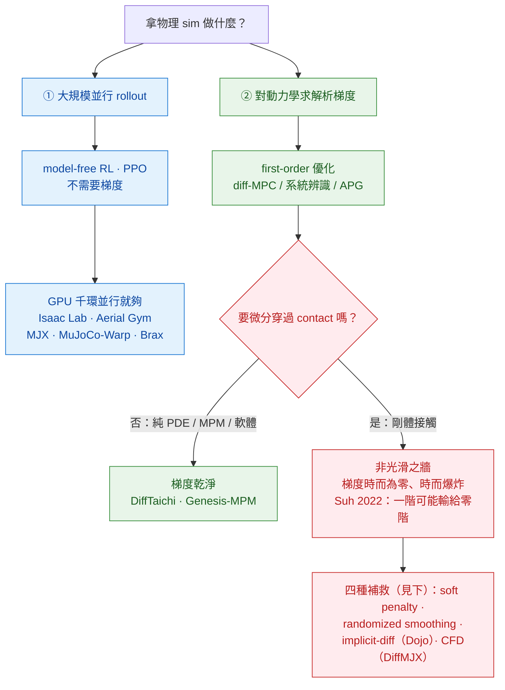
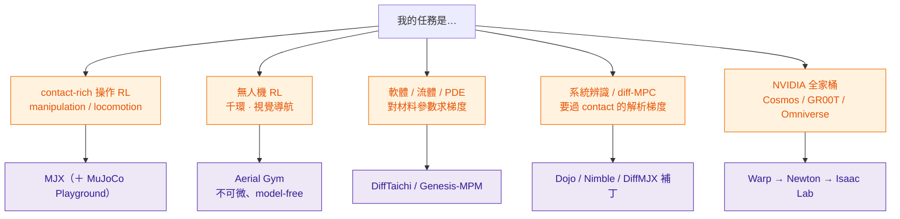

# Differentiable Simulators

> 可微 simulator 不是「生成模型」——但它是生成模型的 oracle、loss 來源、訓練資料工廠。本區從一個容易被忽略的角度切：**「可微」其實是光譜，也常是陷阱**。多數人用這些工具其實是為了 GPU 大規模並行（model-free RL，根本不用梯度）；真要解析梯度的人，則幾乎一律撞上同一道牆——**contact 非光滑**。先把這兩件事分清楚，再選 sim。

## 在本手冊的角色

本倉講「物理可控生成」。生成模型負責像素 / 外觀，但下游每條線都有一塊「不能憑空生成、要靠物理」的硬核（動作 GT、動力學、可驗證基準）。可微 / GPU sim 就是補這塊硬核的工具：它自己 `output=N/A`（不產像素），但**生產 ground-truth state / contact / video 餵生成模型**，或當生成結果的物理裁判。

## 定調：兩個被混為一談的理由 + contact 之牆

「differentiable simulator」一詞把兩個**不同**的能力混在一起，選錯工具多半源於沒分清這兩件事：

- **理由①——GPU 大規模並行 rollout**：跑幾千上萬個環境、用 model-free RL（PPO 等零階方法）。**你根本不需要、也不會用到解析梯度**。Isaac Lab、Aerial Gym、MJX、MuJoCo-Warp、Brax 主要是賣這個（Isaac Gym 開創的 NeurIPS 2021 賣點就是「GPU 千環吞吐」，**全文沒提可微**）。
- **理由②——對動力學求解析梯度**：diff-MPC、系統辨識、analytic policy gradient（APG），要真的微分穿過動力學。DiffTaichi、Genesis-MPM、Warp auto-adjoint、Dojo / Nimble 在這。

**「GPU 並行」≠「可微」。** Aerial Gym 是 65k 環並行但**完全不可微**（作者親自 close issue #58）；MuJoCo-Warp 為了速度**放棄可微**（forward-only，issue #500）。反過來，可微的那條一旦碰 **contact（剛體接觸）**，就撞上 differentiable simulation 的中心難題：接觸是**非光滑**的（沒接觸時梯度近零、撞擊瞬間未定義或爆炸），解析梯度因此**病態**——這正是 Suh et al.（ICML 2022 Outstanding Paper）的結論：在 stiff / 不連續系統上，一階（解析）梯度估計的偏差與方差會大到**輸給零階（RL）估計**。

*圖：選 sim 的第一刀——先問「我要的是並行吞吐還是解析梯度」。走梯度這條，純 PDE / 軟體乾淨好微分；一碰剛體接觸就撞非光滑之牆，得靠下面四種補救之一。*

## 可微是光譜，不是 yes / no

把上面那條牆攤平來看，本區八套系統落在一條光譜上——「能不能拿到有用的梯度」遠比「官網有沒有寫 differentiable」重要：

| 系統 | GPU 並行 | 可微 | contact / 材料 | 2026 現況 |
|---|---|---|---|---|
| **Isaac Gym** | 強（千環 RL 開創） | 否 | PhysX 剛體 | 已 deprecated → Isaac Lab |
| **Isaac Lab** | 強 + photoreal | 否（可微待 Newton 整合） | PhysX 剛體 | 現役；可微仍是 roadmap |
| **[Aerial Gym](./aerial-gym.md)** | 65k 環 / 4.43M steps·s⁻¹ | 否（issue #58） | 剛體（drone）+ Warp ray-cast | 仍綁 Isaac Gym（老牆） |
| **[MuJoCo MJX](./mujoco-mjx.md)** | 強（千環） | 是，**但 contact 梯度病態** | MuJoCo soft contact | 現役主力 |
| **MuJoCo-Warp** | 最強（252–475× vs JAX） | 否（forward-only，issue #500） | MuJoCo contact | alpha；出 alpha 併回 MJX |
| **Brax** | 強 | 是（APG 模式） | spring / positional（**簡化**） | env 線 wind-down → MuJoCo Playground |
| **[Genesis](./genesis.md)** | 強（自稱 10–80× MJX，有爭議） | 部分（**僅 MPM / tool solver**） | rigid+soft+fluid 統一 | 現役 |
| **[DiffTaichi](./difftaichi.md)** | 中 | 是（PDE / MPM 乾淨） | 接觸發散（billiards 多峰） | 已併入 Taichi 主線、實質凍結 |
| **Newton** | 強（Warp backend） | 是 | MuJoCo-Warp 為主後端 | v1.x GA（GTC 2026）；2026 收斂點 |
| **Dojo / Nimble** | 弱（CPU 為主） | 是（implicit-diff LCP / NCP） | 硬接觸解析梯度 | 學術參考實作 |

> 一句話讀法：要**並行吞吐**往上半段挑（MJX 是 contact-rich manipulation 的預設、Aerial Gym 是 drone 的預設）；要**乾淨梯度**且不碰接觸往 DiffTaichi / Genesis-MPM；要**過接觸的解析梯度**只能走 Dojo / Nimble / DiffMJX 那套專門補救。NVIDIA 全家桶（Cosmos / GR00T / Omniverse）的官方路徑是 Warp → Newton → Isaac Lab。

## contact 之牆：四種補救

「怎麼從非光滑的接觸裡擠出可用梯度」目前就四個流派，各有代價：

| 補救 | 做法 | 代價 | 代表 |
|---|---|---|---|
| **① soft / penalty contact** | 用 spring-damper 軟化硬接觸 → loss 平滑、梯度可用 | 物理保真度下降（接觸變軟、stiffness 拉高又回到噪聲） | MJX 預設 soft contact、Brax spring |
| **② randomized smoothing** | 對不連續 loss 加噪卷積，還原一個可用的「梯度束（gradient bundle）」 | 要採樣、引入偏差 | Bundled Gradients（[2109.05143](https://arxiv.org/abs/2109.05143)）、[2206.11884](https://arxiv.org/abs/2206.11884) |
| **③ implicit-diff 穿過接觸求解** | 把硬接觸寫成 LCP / NCP，用隱函數定理對 solver 求解析梯度 | solver 重、規模受限、偏 CPU | Dojo（[2203.00806](https://arxiv.org/abs/2203.00806)）、Nimble（[2103.16021](https://arxiv.org/abs/2103.16021)） |
| **④ contact-from-distance / 自適應步長** | backward 只用「未接觸前的距離」給訊號 + 自適應積分，不動 forward sim | 是工程補丁、非通解 | DiffMJX / CFD（[2506.14186](https://arxiv.org/abs/2506.14186)） |

選法：要**物理保真**留 ③（但慢、規模小）；要**塞進大規模 RL loop** 多走 ① / ②；MuJoCo 生態內想救梯度看 ④。

## 5-axis 預設

整區共享的本體論定位（個別 dissection 會微調）：

- `output=N/A`——自己不是生成模型，但生產 ground-truth video / state / contact
- `injection=sim-in-loop`（可微者另帶 `hard-constraint` flavor）
- `control=action | trajectory | force | contact | param`（最完整的一條控制軸）
- `temporal=streaming`（一步步 forward；可微者可 backward through time）
- `domain=robotics | rigid | soft | fluid`

## 與生成模型接的 3 種模式

1. **作為訓練資料源**——sim rollout 出 (state, RGB, depth, action, contact) 配對資料餵 video / latent WM。NVIDIA 線是 Isaac Sim Replicator → Warp 物理 rollout → Omniverse 渲染 → [Cosmos-WFM](../foundation-physics-models/cosmos-wfm.md) 訓練資料；aerial 視角則用 [Aerial Gym](./aerial-gym.md) 的 Warp ray-cast depth / RGB 補 [Cosmos](../foundation-physics-models/cosmos-wfm.md) 稀缺的空拍資料。
2. **作為訓練 loss / oracle**——sim-in-loop：讓 NN-WM 的 latent rollout 跟 sim rollout 對齊（[DreamerV4](../latent-world-models/dreamer-v4.md) 式 KL / MSE）。可微 sim 還允許把梯度 BPTT 進 encoder——但**過 contact 要小心上面那道牆**，長 rollout 的 chaotic 梯度方差會爆。
3. **作為推理 oracle**——拿 sim 當「物理裁判」評生成 video 的物理合理性（Cosmos-Reason 式）；或先用 sim 大量 rollout 蒸餾出 [FNO](../neural-surrogates/fno.md) / MeshGraphNet 類 neural surrogate，推理時用 surrogate 取代 inner-loop sim 加速。

## 子路線圖：你該拿哪個？

*圖：把上面的概念落到實際任務——五類典型需求各自的預設工具。注意 M2（無人機 RL）刻意停在「不可微」：要 first-order 才轉 RotorPy / Brax-quadrotor。*

## 本區 Dissections

- [MuJoCo MJX](./mujoco-mjx.md) —— MuJoCo 移植 JAX / XLA，contact-rich rigid GPU 並行；可微但 contact 梯度有 known noise
- [Genesis](./genesis.md) —— rigid+soft+fluid 統一的 Taichi-backed 引擎；可微僅限 MPM / tool solver（含 10–80× 速度爭議）
- [NVIDIA Warp](./nvidia-warp.md) —— Python-first GPU sim + auto-adjoint，NVIDIA Physical-AI stack 的黏合層（上接 Newton / 下接 Cosmos）
- [DiffTaichi](./difftaichi.md) —— 可微物理 sim 的學術錨點與方法論模板，Genesis 的直接父代
- [Aerial Gym](./aerial-gym.md) —— drone-only、65k 環 GPU sim（Isaac Gym backbone，**非可微**），aerial 的 vision data factory

## 缺口 / 還想收

- [ ] **Dojo / Nimble**——implicit-diff 過硬接觸的 LCP / NCP 引擎（contact 梯度的「正解派」，本區目前只在牆的補救表帶過）
- [ ] **Newton**——2026 GTC GA 的 Warp-based 可微引擎，是 MuJoCo-Warp / Isaac Lab 的收斂點，值得獨立一篇追蹤
- [ ] **Brax**——JAX-first、有 APG 可微模式但 env 線正 wind-down，與 MJX / MuJoCo Playground 的分工
- [ ] Sim-in-loop training 對 video WM 的**實測**收益（目前多是 anchor 數字，缺端到端對照）

## §8 共通 pitfall

- **contact 非光滑是全區共病**：解析梯度在接觸處病態（零 / 爆炸），long-horizon BPTT 方差更會炸；做 first-order 控制前先確認你的任務真的需要梯度（很多時候 model-free RL 更穩，見 Suh 2022）。
- **「可微」是行銷詞，≠ 你拿得到有用的梯度**：Aerial Gym 不可微、MuJoCo-Warp forward-only、Genesis 僅 MPM 可微、MJX 的 `dof_frictionloss` 梯度甚至恆為零。落地前一定逐項確認「哪一段真的有梯度」。
- **GPU 並行的 cost model 反直覺**：MJX 的 contact 成本 ∝ `nconmax`（possible）而非 active 接觸數；多物件場景線性炸。並行收益要 thousand-env scale 才出得來。
- **sim2real 反噬**：sim-in-loop 訓出來的 WM 在真實場景物理感**反而可能下降**——sim 的捷徑被學進去了。
- **跨機 / 跨 backend 不 bit-exact**：Warp 是 GPU / CUDA-only（AMD / Apple 不支援）；reproduce 要 pin GPU 型號 + driver + sim commit。

## 參考（跨切面，個別 dissection 另有完整列表）

- Suh, Simchowitz, Zhang, Tedrake, *Do Differentiable Simulators Give Better Policy Gradients?*, ICML 2022 Outstanding Paper, [2202.00817](https://arxiv.org/abs/2202.00817) —— 一階 vs 零階梯度的偏差/方差分析；contact 之牆的權威結論
- Suh, Pang, Tedrake, *Bundled Gradients through Contact via Randomized Smoothing*, RA-L 2022, [2109.05143](https://arxiv.org/abs/2109.05143)
- Howell et al., *Dojo: A Differentiable Physics Engine for Robotics*, [2203.00806](https://arxiv.org/abs/2203.00806) —— implicit-diff 過 NCP 硬接觸
- Werling et al., *Fast and Feature-Complete Differentiable Physics for Articulated Rigid Bodies with Contact*（Nimble）, RSS 2021, [2103.16021](https://arxiv.org/abs/2103.16021)
- Paulus et al., *Differentiable Simulation of Hard Contacts with Soft Gradients*（DiffMJX / CFD）, [2506.14186](https://arxiv.org/abs/2506.14186)
- Makoviychuk et al., *Isaac Gym: High Performance GPU-Based Physics Simulation for Robot Learning*, NeurIPS 2021 D&B, [2108.10470](https://arxiv.org/abs/2108.10470) —— 「GPU 並行 ≠ 可微」的代表（賣吞吐、不談梯度）
- Mittal et al., *Isaac Lab*, [2511.04831](https://arxiv.org/abs/2511.04831)；Newton（Linux Foundation 2025-09，Warp-based，differentiable，GTC 2026 GA）；Brax, [2106.13281](https://arxiv.org/abs/2106.13281)
