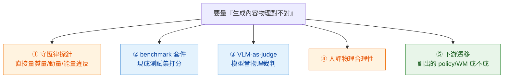

# Evaluation: Physics

> 怎麼判斷「生成的影片 / 場景 / 軌跡物理合理」——**這個 zone 是整本 handbook 的 ground truth**。全書的命題是「生成模型違反物理、所以 physics-controllability 重要」；這命題只有在你**能量測物理正確性**時才成立。這頁講「怎麼量」的方法論，實際 benchmark 目錄在 [benchmarks/](../../benchmarks/overview.md)。

## 物理評測的五個家族

量「物理正確性」不是單一指標，是五種互補的取法——便宜的淺、紮實的貴：

| 家族 | 做法 | 量到什麼 | 代價 / 風險 | 代表 |
|---|---|---|---|---|
| **① 守恆律探針** | 在結構化場景直接算守恆量誤差 | 質量/動量/能量/無穿透/因果的**違反量**（物理最紮實） | 需要可量測的結構化場景；難用在自由生成影片 | PDEBench cRMSE/bRMSE/fRMSE（`2210.07182`）· [conservation-violation-atlas](../../crossing/conservation-violation-atlas/overview.md) |
| **② benchmark 套件** | 現成測試集 + 自動打分 | 物理常識 / 屬性多維分數 | **最易 game**（Goodhart）；分數與真物理理解可能脫鉤 | Physics-IQ · VideoPhy · PhysBench · VBench · PhyGenBench（見 [video-physics](../../benchmarks/video-physics/overview.md)） |
| **③ VLM-as-judge** | 用 VLM/LLM 當物理裁判打分 | 可規模化的「看起來合不合理」 | **循環風險**——裁判自己可能不懂物理（PhysBench 證 VLM 物理弱） | VideoScore（`2406.15252`）· PhyGenEval · Cosmos-Reason（`2503.15558`） |
| **④ 人評** | 人工評「物理上對不對」 | 接近金標的合理性判斷 | 貴、主觀、噪聲大、偏 perceptual、漏細微違反 | VideoPhy 人評（`2406.03520`，最佳僅 39.6% 雙通過） |
| **⑤ 下游遷移** | 用生成資料訓 policy/WM，看真實任務成功率 | **終極真相**：物理夠不夠用到能撐起控制 | 最貴、最間接、混淆因子多 | RoboCasa co-train 13.6→24.4%（`2406.02523`）· DreamGen（`2505.12705`）（見 [robot-data](../../benchmarks/robot-data/overview.md)） |

> **新興第六類·verifiable-reward 殘差探針**：把物理殘差（運動學/守恆殘差）算成標量 reward 拿來**訓練**而非只打分（`2512.00425` "Post-Training Newton's Laws with Verifiable Rewards"、VJEPA-2-reward `2510.21840`）。本質是 ① 的 video-native 版，但用途是 RL 訊號。⚠ 它也最早暴露 reward-hacking（見下）。

## 三層評估（舊框架）對應到五家族

本 zone 原本的「三層」仍成立，五家族把它說得更細：

- **Perceptual quality**（FVD / IS / CLIP-score）——傳統視覺，**不測物理**，只是門檻。
- **Physics plausibility**——= 家族 ①②③④（守恆探針 + 套件 + VLM-judge + 人評）。
- **Downstream task**——= 家族 ⑤，**才是 ground truth**，但成本最高。

口訣：**往下越貴越接近真相**。便宜的 ② 拿來快篩，貴的 ⑤ 拿來定生死；中間用 ①③④ 交叉驗證。

## 為什麼物理評測特別難（五個共通陷阱）

1. **視覺真實度 ≠ 物理理解**——Physics-IQ 的招牌發現：兩者相關性 **Pearson r=−0.46、統計不顯著**（`2501.09038`）。**越逼真不代表越懂物理**；這是全 zone 最該記的一句，引用時務必帶「不顯著」。
2. **Benchmark Goodhart / reward-hacking**——優化指標 ≠ 改善物理。`2512.00425` 實證：只獎勵運動學殘差、不獎勵質量守恆，模型會**直接把運動幅度壓到趨近零**來騙低殘差（教科書級 reward-hacking）。緩解：多問題聚合 reward、ensemble-VLM 多數決。
3. **VLM-judge 循環**——拿 VLM 當物理裁判，但 PhysBench（`2501.16411`，75 個 VLM）證明 **VLM 自己物理就弱**；裁判物理 naive，分數不可信（PhysAgent 加 scaffolding 才 +18.4%）。
4. **人評貴又吵**——VideoPhy 之所以要做自動 evaluator，正因人評不 scale；物理合理性的 inter-rater 一致性難保證（具體不一致數字 `UNVERIFIED`）。
5. **覆蓋缺口**——**沒有單一 benchmark 同時覆蓋全部 5 條守恆軸**（這正是 [conservation-violation-atlas](../../crossing/conservation-violation-atlas/overview.md) 的 USP；作為本倉觀點而非已被引用的事實）。各套件只覆蓋一片：PhyGenBench 27 條律 / PhysBench 4 域 / Physics-IQ 66 場景。

## 怎麼選（決策）

- 要**快篩一批模型** → 家族 ②（benchmark 套件），但讀分數帶上面五個陷阱。
- 要**物理上站得住的數字**（流體/剛體/PDE）→ 家族 ①（守恆探針），需結構化場景。
- 要**規模化但接受噪聲** → 家族 ③（VLM-judge），且**換 ensemble、別單裁判**。
- 要**定生死** → 家族 ⑤（下游遷移），sim 成功率還要看 sim2real（[robot-data](../../benchmarks/robot-data/overview.md)）。
- 永遠**至少兩個家族交叉**——任何單一指標都可被 game。

## 本區 Dissections

- [VBench / VBench-2.0 / PhysBench](./vbench-physics.md) —— eval suite landscape，三家 benchmark 分工
- [PhysBench](./physbench.md) —— 考 VLM 自己懂不懂物理（ICLR 2025）

## 連到實際 benchmark 目錄

方法論在這頁；**各類 benchmark 的全景表 + 已知缺陷** 在 [benchmarks/](../../benchmarks/overview.md)：[video-physics](../../benchmarks/video-physics/overview.md) · [world-model](../../benchmarks/world-model/overview.md) · [robot-data](../../benchmarks/robot-data/overview.md) · [controllability](../../benchmarks/controllability/overview.md) · [scientific](../../benchmarks/scientific/overview.md)。失敗地圖見 [conservation-violation-atlas](../../crossing/conservation-violation-atlas/overview.md)。綜述錨點：*Generative Physical AI in Vision: A Survey*（`2501.10928`）。

## §8 共通 pitfall

- **Benchmark Goodhart**——高分模型在新場景仍崩；別只信一個 benchmark。
- **Human eval 噪聲大 + 偏 perceptual**——物理感判斷不可靠，要配 ①③。
- **VLM-judge 循環**——裁判自己物理弱（PhysBench）；用 ensemble + scaffolding。
- **Downstream task 才是 ground truth**——但成本最高；sim 成功率還要扣 sim2real。
- **視覺真 ≠ 物理真**——Physics-IQ r=−0.46 不顯著；這條貫穿全書。
