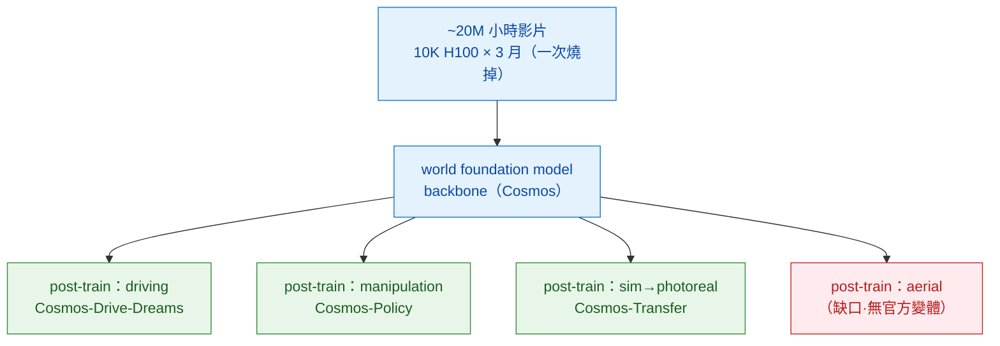
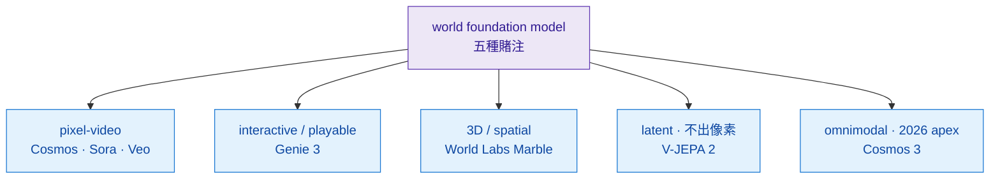

# Foundation Physics Models

> 本區是整本手冊的 **apex 上遊**——「物理版的 world foundation model（WFM）」。下游每個 use-case（aerial-sim / driving / robotics-data-gen…）幾乎都不是從零訓，而是**從這裡的 backbone post-train 下去**。等價於影片版的 GPT moment，再加一層物理感。

## 什麼是 world foundation model

WFM 與「一次性的 video generator」差在三件事：

1. **pretrain-once × post-train-per-domain 解耦**——天價預訓只燒一次（Cosmos: ~20M 小時、10K H100 × 3 月），下游每個 domain 只花幾百~幾千 GPU-hour 把它 post-train 成 Drive / Policy / Transfer 各自的 vertical。
2. **一個 backbone 餵多 domain**——不是「最會做夢」，是「可被分眾微調的骨幹」。Cosmos 3 已實證同一 backbone 跨 robotics / AV / media 共用。
3. **物理是 implicit-from-data**——賭「資料規模 + capacity 自動湧現物理」（vs hard-PDE 路線）。這是本區的核心賭注，也是它的結構性破綻（contact / 長時穩定打臉，見下）。

*圖：WFM 的工程實質＝「foundation × specialization」解耦。預訓貴到只能燒一次→變成共用骨幹→各 domain 廉價 post-train。注意 aerial 那格是紅的：目前沒有官方 aerial 變體（見下「為什麼是上遊」）。*

## WFM 全景：五種賭注（輸出形態不同）

「foundation physics model」不是只有一條路。當前五種賭注，差別在**輸出形態**與**物理從哪來**：

| 賭注（輸出形態） | 代表 | 開放 | 物理來源 | 備註 |
|---|---|---|---|---|
| **pixel-video** | [Cosmos-Predict](./cosmos-wfm.md) · [Sora 2](../video-world-models/sora.md) · [Veo 3](../video-world-models/veo.md) | Cosmos 開 / 其餘閉 | data-only 隱式 | 最主流；本區 anchor |
| **interactive / playable** | Genie 3（DeepMind，2025-08） | 閉（blog-only，無 paper） | data-only | 即時 24fps·720p·分鐘級一致 |
| **3D / spatial** | World Labs Marble（李飛飛，2025-11） | 閉（產品） | 顯式 3D 重建 | persistent 可編輯 3D 世界 |
| **latent（不出像素）** | [V-JEPA 2](../latent-world-models/v-jepa-2.md)（Meta，`2506.09985`） | 部分 | data-only 表徵 | V-JEPA-2-AC zero-shot Franka 控制 |
| **omnimodal** | **Cosmos 3**（NVIDIA，2026-06，`2606.02800`） | 開 | data-only + 動作 | 文/圖/影/音/動作單一雙塔 MoT，subsumes VLM+video-gen+world-sim+world-action |

## Cosmos 家族地圖（2026，本區唯一 open 全家桶）

NVIDIA Cosmos 是唯一把整條 WFM stack 開出來的，所以是本區 anchor。家族成員（細節見 [Cosmos WFM 解構](./cosmos-wfm.md)）：

| 成員 | 角色 | 來源 |
|---|---|---|
| **Predict 1 / 2 / 2.5** | world model 本體（T2W/I2W/V2W） | `2501.03575`（P1）· `2511.00062`（P2.5，單一 flow 主幹 + Reason1 當 text encoder） |
| **Transfer 1 / 2.5** | 多模 ControlNet（depth/seg/edge → 影片），sim→real 貼皮 | `2503.14492`（T1）· T2.5 在 `2511.00062`（比 T1 小 ~3.5×） |
| **Reason 1 / 2** | 物理 CoT 推理 VLM（當 text encoder + 物理裁判） | `2503.15558`（R1，7B/56B）· R2（CES 2026，2B/8B，256K context，無 standalone paper `UNVERIFIED`） |
| **Tokenize1** | 連續/離散 video tokenizer（最高 ~2048×） | `2501.03575` |
| **Policy** | 把 Predict2 post-train 成 visuomotor policy | `2601.16163`（LIBERO/RoboCasa/ALOHA-2 SOTA） |
| **Drive-Dreams** | 駕駛長尾合成資料 | `2506.09042` |
| **Cosmos 3** | 2026 apex：omnimodal 單模型，含 world-action | `2606.02800`（Super/Nano/Edge） |

## 物理怎麼注入（本區的 USP 切面）

本手冊的 USP 是 ontology 第 2 軸（physics injection）。WFM 在這軸有三種注法，**一個 pipeline 常三種並用**：

1. **data-only 隱式**——賭 scale 湧現物理。便宜、通用，但 contact-rich / >8s 長時 / 3D 一致是結構性破綻（不會因 scale up 自動解）。
2. **sim-in-loop-infer**——sim（[Genesis](../differentiable-simulators/genesis.md) / [MJX](../differentiable-simulators/mujoco-mjx.md) / Isaac）出粗糙但**物理正確**的 rollout → Cosmos-Transfer 用 depth+seg 當 control 貼 photoreal 皮，**保住 sim 的 ground-truth**。這是把第 2 軸從 data-only 跳到 sim-in-loop 的 production 標準 pattern。
3. **Reason-as-judge**——Cosmos-Reason 當「物理 CoT 裁判」評生成結果的物理合理性（NVIDIA Physical AI Data Factory 藍圖用法），或當 Predict2.5 的 text encoder 把物理常識灌進條件。

## 為什麼是「上遊」+ aerial 連結

下游 use-case 的**外觀邊**多半源於本區：driving / robotics 直接 post-train Cosmos。但 **aerial 是 under-served domain**——這對本手冊重要，因為 [aerial-sim](../../use-cases/aerial-sim/overview.md) 是最深的 use-case、且把 cosmos-wfm 列為 #1 上遊：

- Cosmos **沒有 aerial 官方變體**（有 Drive-Dreams，無「Aerial-Dreams」），預訓 9 類分布也**無 aerial 類**（見 cosmos-wfm § Cosmos × aerial）。
- aerial 的外觀 gap 目前主要靠 **3DGS / NeRF 重建**在解（FalconGym `2503.02198` / SOUS VIDE `2412.16346` / Aerial-GS）——是 reconstruction 不是 Cosmos 式 generation。
- 所以 aerial 工程師讀本區要帶著這個落差：Cosmos-Transfer 是理論上的 aerial sim→photoreal 路徑，但**尚無 aerial 驗證**；現實解法在 [3DGS 重建](../3d-aware-generation/generative-gaussian-splatting.md)。

## 本區 Dissections

- [NVIDIA Cosmos WFM](./cosmos-wfm.md) —— open-weight generalist 多模 conditioning video FM stack（Predict / Transfer / Reason / Tokenize / Policy / Cosmos 3）；本手冊外觀邊的 anchor 上遊

## 缺口 / 還想收

- [ ] **Cosmos 3 獨立解構**（`2606.02800`）——omnimodal 雙塔 MoT 是 2026 apex，值得從家族裡拆出來單寫
- [ ] **Genie 3**（interactive/playable WFM）——與 pixel-video 路線的根本差異（可玩、即時、記憶）
- [ ] **World Labs / Marble**（3D/spatial FM）——與本倉 [[spatial-handbook]] 的接點，顯式 3D vs Cosmos 隱式
- [ ] **跨 domain transfer 實測**——一個 backbone 真能同時做 robotics + driving + media？（Cosmos 3 宣稱，待第三方 ablation）

## §8 共通 pitfall

- **「FM」名詞被 hype 推高**——很多自稱 WFM 的其實是單 domain；判準是「能否 pretrain-once + post-train-多 domain」。
- **Closed FM 無法被獨立驗證物理感**——Sora / Veo / Genie 3 / Marble 都 blog-only 或閉權重，物理宣稱不可第三方復現；本區只有 Cosmos 開到可驗。
- **data-only 的結構性破綻不會自動解**——contact-rich / >8s 長時 drift / 3D 一致，scale up 救不了，要靠第 2 軸補 sim-in-loop 或換 latent / diff-sim。
- **LLM(Reason) + WM(Predict) layered 之間訊號傳遞瓶頸**——目前靠 caption + CoT 對齊，非 end-to-end，長 horizon 一致性受限。
