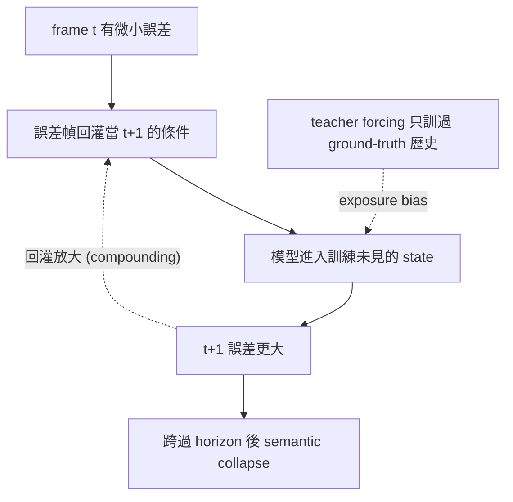

# Long-Horizon Rollout

> 生成隨時間崩壞 —— drift / error accumulation / >8s 塌掉。這是**全書最普遍的失敗模式**：影片 WM、latent WM、physics-gen 三條路全部撞同一面牆，每篇 video-WM dissection 都引它。本區只做一件事：把「為什麼會崩、怎麼修、怎麼量、還缺什麼」一次講清楚，dissection 留給 [TECO](./teco.md)。

## 為什麼是全書最普遍的失敗模式

不管 output 是 pixel-video（[video-WM](../video-world-models/overview.md)）、latent-tokens（[latent-WM](../latent-world-models/overview.md)）還是 physics-conditioned，只要是**自回歸 rollout**（拿自己上一步的輸出當下一步的條件），誤差就會沿時間累積。短 clip（5-8s）看起來都好，跨過某個 horizon 後**一定**塌：物體 morph、identity 漂移、重力違反、空間不一致。Cosmos 自述 [>8s 後 motion instability 顯著](../foundation-physics-models/cosmos-wfm.md)（arXiv [2501.03575](https://arxiv.org/abs/2501.03575) §Limitations 明列 object permanence / gravity / fluid violation）；Genie 2 也是 ~10-20s 可看、越過 1 分鐘後物理鬆散。這不是哪個模型的 bug，是 rollout 範式的結構性病。

## 為什麼會 drift（機制）

核心是兩個彼此放大的東西，arXiv-grounded：

- **Exposure bias（曝光偏差）**：訓練用 teacher forcing（拿 ground-truth 歷史當條件），推理時卻只能拿**自己生成的、有誤差的**歷史當條件。train/test 分佈不一致 → 模型沒見過自己的錯誤狀態 → 進到沒訓過的 state 就亂走。Self-Forcing（arXiv [2506.08009](https://arxiv.org/abs/2506.08009)）把這稱為 train-test gap，明確指認為 AR video diffusion 的長年病根。
- **Compounding error（複利誤差）**：最大似然訓練等價於 behavior cloning，一旦在自己的 rollout 上執行，小誤差會**逐步累積**（線性甚至指數放大），最終 semantic collapse。序列越長放得越凶 —— 所以「長 horizon」本身就是病的觸發器，不是另一個獨立問題。

## 五~六個修法家族

無單一銀彈；實務常組合多家族。每行至少一個 arXiv-grounded 代表：

| 家族 | 做法 | 代價 | 代表（arXiv） |
|---|---|---|---|
| 1. 架構：AR vs joint/clip-parallel | joint 一次生整段、跨幀 bidirectional attention 攤平誤差；AR 走 KV-cache streaming 滾動 | joint 把長度**寫死**、跨 clip 銜接靠 image-init 不穩；AR 省記憶體但放大 exposure bias | TECO joint-clip [2210.02396](https://arxiv.org/abs/2210.02396)；Genie-2 streaming-cache（[dissection](../latent-world-models/genie-2.md)）|
| 2. Diffusion Forcing | 每個 token 給**獨立 noise level**，因果 next-token + full-sequence diffusion 合一；能 rollout 超過訓練 horizon 而 baseline 發散 | 訓練/取樣 schedule 複雜；理論未完全打通 | Chen et al. [2407.01392](https://arxiv.org/abs/2407.01392)（NeurIPS 2024）|
| 3. History-guided / rolling diffusion | 後面的幀給**更多 noise**（反映未來不確定性），sliding-window 局部去噪；可變長歷史條件 + history guidance | window 設計敏感；history dropout（CFG 式）反而變差 | Rolling Diffusion [2402.09470](https://arxiv.org/abs/2402.09470)；History-Guided / DFoT [2502.06764](https://arxiv.org/abs/2502.06764)（單圖 rollout 862 幀）|
| 4. 訓練解：self-forcing / scheduled sampling | 訓練時就**讓模型 condition on 自己生成的歷史**（autoregressive rollout + KV-cache），用 video-level holistic loss 直接縫 train-test gap | 訓練更貴（要跑 rollout）；需 gradient truncation 控成本 | Self-Forcing [2506.08009](https://arxiv.org/abs/2506.08009)；shortcut forcing（[DreamerV4](../latent-world-models/dreamer-v4.md)，arXiv 2509.24527 UNVERIFIED）|
| 5. Memory / long-context | 把更久的歷史塞進 context / 顯式記憶，物件離開視野再回來仍一致 | 顯式長 context 推理貴；記憶上限仍只到「分鐘」級 | Genie 3（DeepMind blog 2025，UNVERIFIED；自報視覺記憶 ~1 分鐘、互動數分鐘）|
| 6. State-space / linear-attention 長 context | 用 SSM（block-wise scan）+ dense local attention，O(n) 把時間記憶拉長而不爆 attention 成本 | block-wise scan **犧牲空間一致性**換時間記憶 | Long-Context State-Space Video WM [2505.20171](https://arxiv.org/abs/2505.20171) |
| 7. 層次化 rollout（slow-plan + fast-frame） | 兩層時間尺度：慢的 reasoning/planning 定方向、快的 frame 模型補細節；長 horizon 由高層 latent 撐 | 兩層訓練收斂難；高層若錯則整段歪 | TECO hierarchical latent（[2210.02396](https://arxiv.org/abs/2210.02396)，36→300 幀）；Cosmos Reason+Predict（Reason1 [2503.15558](https://arxiv.org/abs/2503.15558) 規劃 + Predict 生成）|

## 怎麼量

連 [world-model benchmarks](../../benchmarks/world-model/overview.md)。WM 評測分三層，drift 屬**第 2 層「長程一致性」—— 目前最弱、最缺公認 metric**：

- **FVD-over-time**：FVD 隨 rollout length 增長的曲線（不是單點 FVD，要看斜率）。
- **守恆律違反率隨時間**：能量/動量/permanence 違反隨幀數攀升。
- **Identity drift**：物體外觀/身份隨時間漂移，離開視野再回來變內容。
- **跨 clip 銜接 perceptual gap**：joint/clip-parallel 路線特有的接縫。

警告（見 benchmarks overview）：多數 benchmark 只測得到第 1 層「預測保真度」，拿它代理第 2 層長程一致性**會被 game** —— 重建漂亮 ≠ 長 rollout 不塌。

## 與其他 zone 的關係（共病）

- **video-WM ↔ latent-WM 共病**：兩條路撞同一面牆。pixel 路（Cosmos）[>8s drift 是結構性 break](../foundation-physics-models/cosmos-wfm.md)，scale up 不自動解；latent 路（[DreamerV4](../latent-world-models/dreamer-v4.md)）用 latent rollout + shortcut forcing 把 context 推到 ~9.6s、但仍是同一病的另一種緩解。
- **TECO 是學術祖先**：本區唯一 dissection [TECO](./teco.md) 的 hierarchical latent rollout（家族 7）正是 Cosmos Reason+Predict 兩層架構的前身；想看「層次化怎麼實作」直接讀它，本 overview 不重複。

## 缺口 / §8 共通 pitfall

- **無共識 metric**：長程一致性沒有公認量法，論文各報各的曲線，跨工作不可比。這是 THE open wall。
- **無結構解**：上面 7 個家族全是**緩解**，沒有任何一個從根上消除 compounding error；長 horizon 仍是開放問題。
- Joint rollout 把長度寫死，跨 clip 銜接靠 image-init 不穩。
- AR rollout 的 exposure bias 在 long horizon 被放大（家族 4 縫，但縫不死）。
- Hierarchical / state-space 模型訓練收斂難，且 SSM 拿空間一致性換時間記憶。
- 用第 1 層 fidelity metric 代理第 2 層一致性 → 被 game。
