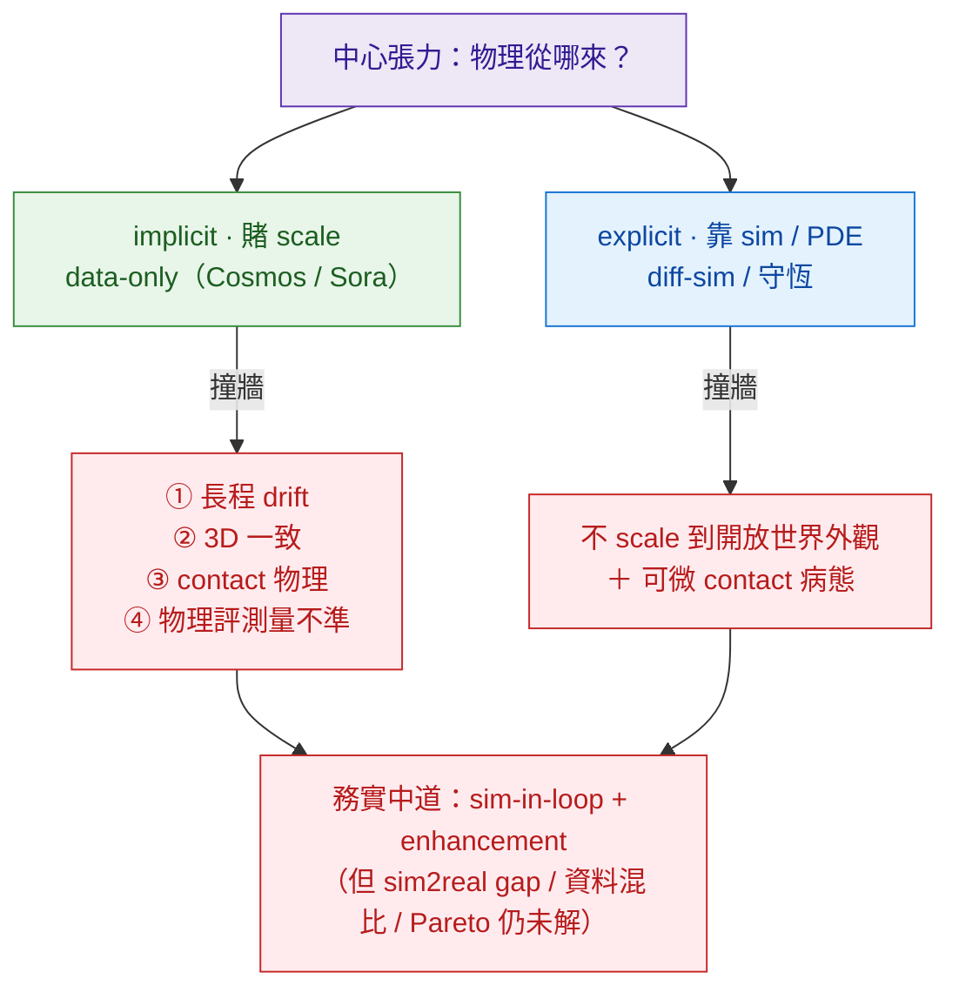
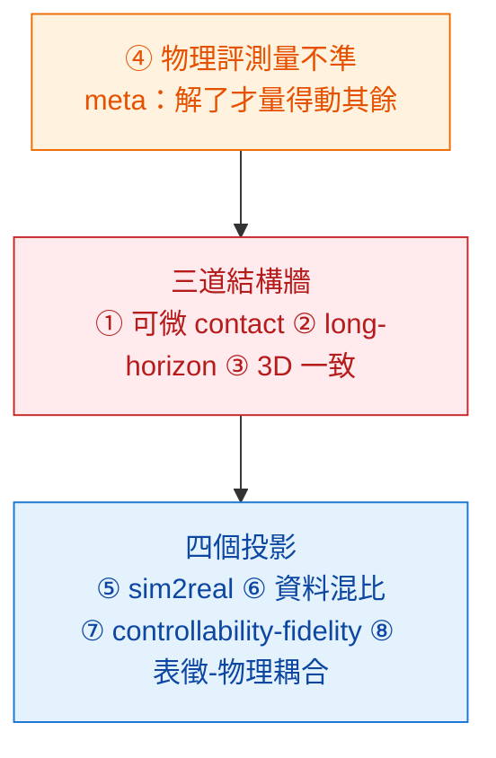

# 研究前沿：物理可控生成的硬骨頭

> 這頁把全書每個 zone 的 §8 pitfall + [crossing](../crossing/overview.md) 的 5 個 wedge 收斂成一句話能講的東西：**這領域真正未解的硬骨頭是哪幾根**。如果你要做研究、選題目，從這裡開始；每根骨頭都連回它在書裡的深入處。這也是本手冊的**觀點**——不是目錄，是判斷。

## 一個中心張力，生出所有的牆

整本書的 USP 是 ontology 第 2 軸（physics injection）。所有硬骨頭都從**同一個張力**長出來：

**物理從哪來？** 兩種賭法，各自撞牆，誰都沒贏：

- **implicit·賭 scale**（data-only：[Cosmos](../foundations/foundation-physics-models/cosmos-wfm.md) / Sora / Veo）——賭「資料規模 + capacity 自動湧現物理」。便宜、通用、能造新情境。但 **contact / 長程 / 3D 一致**反覆打臉，**不會因 scale up 自動解**。
- **explicit·靠 sim/PDE**（[diff-sim](../foundations/differentiable-simulators/overview.md) / 守恆律 / [neural-surrogate](../foundations/neural-surrogates/overview.md)）——物理紮實、可驗證。但**不 scale 到開放世界的外觀**，而且**可微 contact 本身病態**。

*圖：純 implicit 撞四道結構性牆、純 explicit 撞 scale + 可微 contact；現實是兩邊往中間靠（sim 出物理 ground-truth → 生成貼皮），但中道自己又留下 sim2real / 混比 / Pareto 三個未解。下面八根骨頭就是這張圖的細節。*

## 八根硬骨頭

每根：**問題 → 為什麼是結構性的（非 scale 可解）→ 哪裡出現 → 目前最佳補救 → 什麼結果能解**。

*圖：八根骨頭不是並列——④ 物理評測是 meta（量不準就無法優化其餘），①②③ 是三道結構牆，⑤⑥⑦⑧ 是這些牆投影到資料、控制、表徵上的結果；與本頁結尾那句一致。*

### ① 可微 contact 之牆
- **問題**：要對動力學求解析梯度（diff-MPC / 系統辨識 / first-order policy），一碰剛體接觸梯度就病態（時而為零、時而爆炸）。
- **結構性**：接觸是**非光滑**的；Suh et al. ICML22（`2202.00817`）證明近 stiff/discontinuous 接觸，一階梯度的偏差/方差大到**可能輸給零階 RL**。
- **哪裡**：[differentiable-simulators](../foundations/differentiable-simulators/overview.md)。
- **目前**：四補救（soft/penalty · randomized smoothing · implicit-diff LCP（Dojo/Nimble）· contact-from-distance（DiffMJX `2506.14186`））——都是繞，沒有通解。
- **什麼能解**：一個對 contact-rich 任務既快又無偏的可微接觸模型；目前不存在。

### ② Long-horizon drift
- **問題**：生成隨時間崩——物件 morph、重力違反、>8s 後 motion 不穩。
- **結構性**：autoregressive rollout 的 **compounding error / exposure bias**；長 rollout 是 chaotic，方差爆炸。**沒有結構解，也沒有公認 metric**。
- **哪裡**：[long-horizon-rollout](../foundations/long-horizon-rollout/overview.md)、每篇 video-WM 的 §limitations。
- **目前**：七個修法家族（Diffusion Forcing `2407.01392` · Self-Forcing `2506.08009` · history-guided/rolling · memory（Genie 3）· 層次化 slow-plan+fast-frame）——全是**緩解**。
- **什麼能解**：一個可證明 error-bounded 的長 rollout 方案 + 一個公認的長程一致性 metric。

### ③ 3D / multi-view 一致性
- **問題**：環繞鏡頭時物件 morph、同一面牆兩個 view 不一致。
- **結構性**：pixel-video 路線沒有顯式 3D，一致性靠 hallucinate。
- **哪裡**：[3d-aware-generation](../foundations/3d-aware-generation/overview.md)、Cosmos §pitfall 9.3。
- **目前**：把 3DGS 當 video diffusion 的中間 bottleneck（GGS `2503.13272`）硬保幾何一致；或顯式 3D conditioning。
- **什麼能解**：pixel-WM 原生帶 3D 表徵且不犧牲生成自由度——目前 generation vs 顯式 3D 還在拉鋸。

### ④ 物理評測量不準（meta-problem）
- **問題**：**量不出物理正確性**——量不準就無法優化，整套「physics-controllable」就不可證偽。
- **結構性**：**視覺真實度 ≠ 物理理解**（Physics-IQ：Pearson r=−0.46，**不顯著**，`2501.09038`）；benchmark 易被 game（reward-hacking `2512.00425`）；VLM-judge 自己物理弱（PhysBench `2501.16411`）；**沒有單一 benchmark 覆蓋全 5 守恆軸**。
- **哪裡**：[evaluation-physics](../foundations/evaluation-physics/overview.md)、[benchmarks](../benchmarks/overview.md)、[conservation-violation-atlas](../crossing/conservation-violation-atlas/overview.md)。
- **目前**：五個評測家族交叉、下游遷移當 ground truth。
- **什麼能解**：一個覆蓋全守恆軸、抗 Goodhart、與下游遷移相關的統一物理 benchmark。**這根解了，其餘七根才量得動。**

### ⑤ sim2real domain gap（雙面）
- **問題**：sim 與真實差兩塊——**外觀**（古典渲染「看起來假」）＋**動力學**（sim 物理 ≠ 真實殘差力）。
- **結構性**：手搭場景 ≠ 真實分布；剛體 sim 缺空氣動力/接觸殘差。
- **哪裡**：[3d-aware §外觀邊供應線](../foundations/3d-aware-generation/overview.md)、[Isaac Sim](../foundations/differentiable-simulators/isaac-sim.md)、use-cases/aerial-sim 的 sim-to-real 契約。
- **目前**：外觀 gap 走 enhancement（Carla2Real/Cosmos-Transfer）/ 重建（3DGS）/ 生成（Cosmos）；動力學 gap 走 system-ID / domain randomization / 殘差學習（NeuroBEM）。
- **什麼能解**：一個能同時 metric-anchor 外觀與殘差動力學的閉環；目前分頭打。

### ⑥ 資料引擎：最佳混比未知
- **問題**：sim / 生成 / 真實 三種資料，**最佳混比是多少、跨 task 變不變、閉環會不會 distribution shift**——都沒答案。
- **結構性**：生成資料的 diversity vs sim 資料的 physics fidelity 是 trade-off；sim→生成→再訓的閉環可能漂移。
- **哪裡**：[sim-vs-gen-data](../crossing/sim-vs-gen-data/overview.md)、[data-engine](../foundations/data-engine/overview.md)、[robot-data benchmarks](../benchmarks/robot-data/overview.md)。
- **目前**：經驗混比（π0 90.9/9.1 真實/開源）；共識是 real 主幹 + sim 鎖物理 + gen 補長尾。
- **什麼能解**：一個可預測「給定 task 的最佳混比」的理論或 scaling law。

### ⑦ Controllability-fidelity Pareto
- **問題**：加越多 conditioning，保真度越掉；多模態 conditioning 互相干擾。
- **結構性**：控制與保真度搶**同一份生成預算**（CFG guidance scale 是隱藏旋鈕）。
- **哪裡**：[controllability-vs-fidelity](../crossing/controllability-vs-fidelity/overview.md)、[controllability benchmarks](../benchmarks/controllability/overview.md)。
- **目前**：fusion 機制各有取捨；**無公認的 controllability-fidelity Pareto benchmark**。
- **什麼能解**：一個「fidelity-preserving controllability」的設計 + 一條統一的 Pareto 量法。

### ⑧ 表徵↔物理耦合（3DGS 給 photons 不給 forces）
- **問題**：顯式 3D（3DGS）給外觀+幾何，但**不是 mesh、零動力學**；把表徵接上物理不是免費的。
- **結構性**：3DGS 是高斯核、無表面/碰撞幾何。
- **哪裡**：[3d-aware §物理耦合](../foundations/3d-aware-generation/overview.md)。
- **目前**：在高斯核上算物理（PhysGaussian `2311.12198`）/ mesh-extract（SuGaR/2DGS）/ GS-as-render 接 sim。
- **什麼能解**：一個外觀與動力學共用、可微、可 scale 的統一 3D 表徵。

## 一根「工程牆」（不是研究題，但決定能不能上線）

**即時牆**：當前 video-WM 是秒級/clip，閉環控制要 <~100ms（contact-rich ~10ms）→ 生成模型只能離線當**資料工廠 / 評測 oracle**，不能即時當控制環裡的 simulator（見 [deployment/inference-cost](../deployment/inference-cost/overview.md)）。in-loop 物理仍歸 diff-sim。這不是要被「解決」的研究題，是選型時的硬約束。

## 怎麼用這頁

- **選研究題**：④（物理評測）是 meta——解了它其餘才量得動，ROI 最高；①②③ 是經典硬骨頭、競爭激烈；⑥⑦ 偏系統/實證、缺口明確。
- **判斷一篇新論文**：先問它碰的是哪根骨頭、是「真解」還是「又一個緩解」、有沒有逃避④（拿可被 game 的 benchmark 自證）。
- **判斷一個產品**：①②③⑤ 決定它能不能 in-loop；即時牆決定它是工具還是 demo。

> 收斂成一句：**這領域不是缺方法，是缺「能被信任的量測」與「能撐住長程/接觸/3D 的結構」**——前者是 ④，後者是 ①②③。其餘（⑤⑥⑦⑧）是這兩件事在資料、控制、表徵上的投影。
