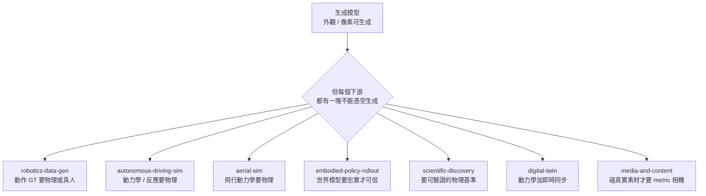

# Use Cases — 7 個下游

> 全 7 個 use-case 已深度建設，共 **20 篇一手來源 dissection**。**🚁 aerial-sim 最深（6 篇）**，也是本倉接 Spatial-Handbook 最深 embodiment 的線。

*圖：七個下游共用一條命題 —— 外觀可生成，但每個下游各有一塊「必須靠物理或真實」的硬核（這正是本倉按 use-case 而非 method 切的理由）。*

| Use case | 主軸 | 深度 | 重要 zone |
|---|---|---|---|
| [aerial-sim](aerial-sim/) 🚁 ★ | 無人機 closed-loop sim + 合成 aerial footage | **6 篇（最深）** | diff-sim · long-horizon · data-engine |
| [robotics-data-gen](robotics-data-gen/) | 用生成 video / latent / sim 替代真實 demo | 3 篇 | video-WM · latent-WM · diff-sim · data-engine |
| [autonomous-driving-sim](autonomous-driving-sim/) | Closed-loop driving WM | 3 篇 | video-WM · long-horizon · controllability |
| [embodied-policy-rollout](embodied-policy-rollout/) | WM-as-policy / MPC-on-WM | 2 篇 | latent-WM · long-horizon · evaluation |
| [scientific-discovery](scientific-discovery/) | Neural surrogate 替代 PDE solver | 2 篇 | neural-surrogates · material-and-dynamics |
| [media-and-content](media-and-content/) | 影片 / 廣告 / 電影 | 2 篇 | video-WM · diffusion-physics · controllability |
| [digital-twin](digital-twin/) | 工廠 / 手術 / 工業 | 2 篇 | diff-sim · 3d-aware · data-engine |

## 🚁 無人機線（最深，6 篇）

完整閱讀路徑見 [aerial-sim/overview.md](aerial-sim/overview.md)：
[Swift 冠軍級競速](aerial-sim/champion-level-drone-racing.md) → [Dream-to-Fly](aerial-sim/dream-to-fly.md) → [Aerial Sim Stack 七套對比](aerial-sim/aerial-sim-stack.md) → [生成航拍資料](aerial-sim/generative-aerial-data.md) → [Sim-to-Real 契約](aerial-sim/sim-to-real-contract.md) → [CARLA-Air 空地一體](aerial-sim/carla-air.md)。foundation 工具見 [Aerial Gym](../foundations/differentiable-simulators/aerial-gym.md)，跨冊資料契約見 [bridge-to-spatial/aerial-embodiment](../bridge-to-spatial/aerial-embodiment.md)。

## 為什麼是 use-cases 不是 embodiments

不像 Spatial-Handbook 按 embodiment（aerial / driving / manipulation / marine）切，本倉按「**生成模型給誰用**」切 ——
因為物理可控生成是 **upstream pipeline**，下游可以是不同 embodiment / 不同行業。

## 與 sister handbooks 的對應

- robotics-data-gen / embodied-policy-rollout ↔ VLA-Handbook
- autonomous-driving-sim ↔ Spatial-Handbook driving embodiment
- **aerial-sim ↔ Spatial-Handbook `embodiments/aerial/` ★**（spatial 最深 embodiment，本倉提供生成端視覺資料來源）
- digital-twin / scientific-discovery 是本倉獨有的下游
