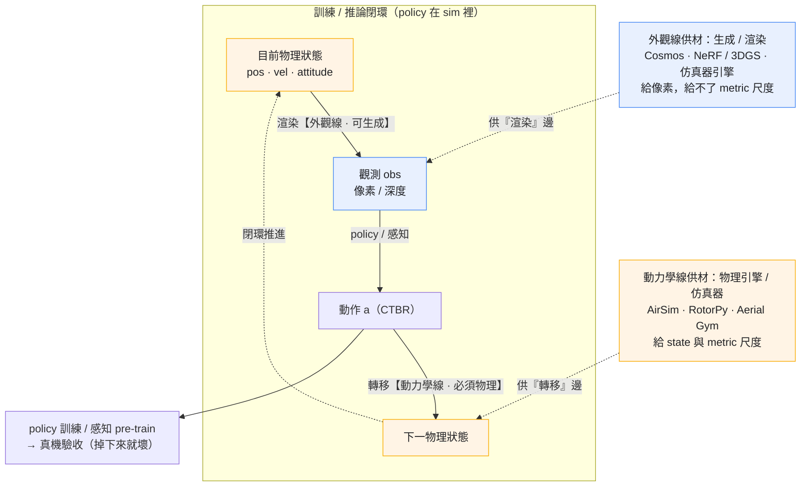
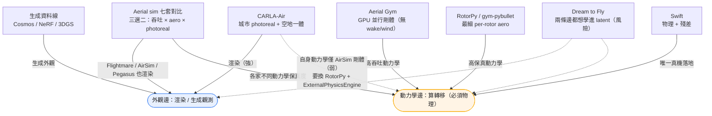
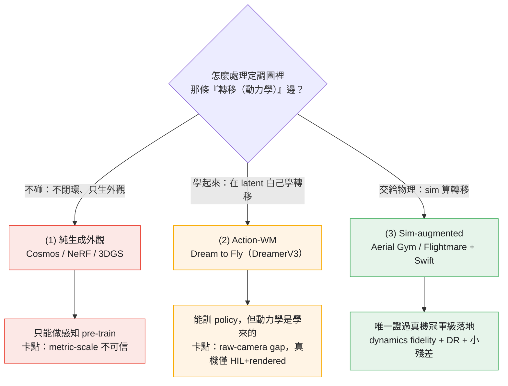

# 使用案例：無人機模擬

> 物理可控生成給無人機自主：6-DoF 自由運動 + 螺旋槳尾流 + 風擾 —— 比 driving 多兩個自由度，比 manipulation 多了「掉下來就壞」的硬性約束。Aerial 是把本 handbook 核心命題逼到極限的 use-case：**外觀可以生成，動力學不能。**

*圖（全境）：整篇就一條線 —— 命題 → 動力學邊是關鍵 → 三條打法只有「交給物理」落地 → 落地契約 → 交付 Spatial。下面三張圖分別放大其中一塊：**定調圖**＝兩條邊的閉環機制、**定位圖**＝錨點各站哪邊、**子路線圖**＝怎麼處理動力學邊。*

*圖（定調）：訓會飛的 policy = 一個閉環 —— 外觀線管「state → 觀測」的渲染（藍）、動力學線管「(state, action) → 下一 state」的轉移（橙）。外觀可生成 / 渲染，動力學必須來自物理引擎（仿真器）。為何不能讓生成代替物理做轉移：見下方 §核心張力（Physics-IQ：視覺真度 ≠ 物理理解）。*

## 核心張力：外觀靠生成，動力學靠物理

Aerial 是「外觀靠生成、動力學靠物理」這條分界最乾淨的案例 —— 也是檢驗整本手冊命題的試金石。一個 video / 3DGS 模型可以合成像真的航拍**外觀**，但它**強加不了 thrust / drag / gravity / prop-wake 這些物理**；飛行**動力學**必須來自 physics integrator，不是生成模型。

證據很硬：迄今所有**驗證過真機**的 aerial 結果，動力學都來自物理模型、生成只負責外觀 —— [SOUS VIDE/FiGS](./generative-aerial-data.md)（10-D 四旋翼模型 + 3DGS 視覺，零樣本 105 次真飛）、[FlightDiffusion](./generative-aerial-data.md)（diffusion 生 FPV video + 獨立 ORB-SLAM3 出動作）皆**架構上拆開**這兩件事。而 Physics-IQ 這個基準量化了原因：**視覺擬真度與物理理解力不相關**（Pearson r=−0.46），Sora 視覺最真卻 physics 分 8.7%。詳見 [Generative Aerial Data 解構](./generative-aerial-data.md)。

## 為什麼 aerial 自成一格

不能直接套用 driving / manipulation 子路線：

- **6-DoF 自由運動** —— 沒有車道、沒有桌面，policy 一失敗就是墜機；rollout 漂移的容忍度比 driving 低一個量級
- **感測器組合不同** —— IMU + GNSS + optical flow + 下視測距，視覺只是其一；WM 要同時生出「視覺與 IMU 一致」的軌跡（這是跨冊 [資料契約](../../bridge-to-spatial/aerial-embodiment.md) 的命脈）
- **旋翼 / 空氣動力學是死角** —— propeller wake、ground effect、旋翼間交互 在主流 video WM（Cosmos / Sora）裡基本不存在；這是 aerial 與其他 use-case 最大的物理差異，也是 [injection 軸](../../cheat-sheet/ontology.md)（本倉 USP）最該被啟用的地方
- **風 / 湍流** —— 外部擾動是第一級物理量，不是「噪聲」（[NeuroBEM](https://arxiv.org/abs/2106.08015)：高速下空氣動力學是**主導**的模型誤差）
- **HDR + 小目標** —— 天空到地面 14+ 級動態範圍；其他無人機 / 電線 / 鳥是像素級小物件，photoreal 與否直接決定能不能訓出避障 policy

## 錨點系統

| 系統 | 重點 | 解構 / 來源 |
|---|---|---|
| Aerial Gym Simulator | Isaac Gym backend，GPU 並行數萬 env（4.43M SPS @65k），ray-cast depth/seg；**非可微、無 wake/wind** | [foundation 解構](../../foundations/differentiable-simulators/aerial-gym.md) · NTNU ARL 2503.01471 |
| Aerial sim 七套對比 | Flightmare · PX4-SITL · Isaac-Pegasus · RotorPy · gym-pybullet · **AirSim**（已 archived → Cosys/Project AirSim）；三方權衡 GPU throughput × aero fidelity × photoreal —— **三選二、全員不可微** | [Aerial Sim Stack 對比](./aerial-sim-stack.md) |
| CARLA-Air | 把 AirSim 飛控塞進 CARLA 城市：**空地同物理 tick + 城市級 photoreal**（唯一空地統一）；但動力學僅 AirSim 剛體級、~20 FPS 單環境、不可微、無 sim-to-real | [解構](./carla-air.md) · arXiv 2603.28032 |
| Swift (Champion-Level Drone Racing) | Sim-trained RL，真機擊敗人類冠軍；GP perception residual + kNN dynamics residual（~1 分鐘 mocap 數據） | [解構](./champion-level-drone-racing.md) · Nature 2023 |
| Dream to Fly | DreamerV3 latent WM，raw pixel → CTBR，sim-only 訓練；**「真機」是 HIL + rendered frames**（誠實 caveat） | [解構](./dream-to-fly.md) · UZH RPG 2501.14377 |
| 生成資料線 | Cosmos FPV（demo）/ NeRF·3DGS（UAV-Sim +55.85% mAP50）/ 合成偵測資料 | [Generative Aerial Data](./generative-aerial-data.md) |
| DJI / Skydio / Autel 內部 | Closed source；OEM 公開的只有 Skydio「synthetic+real」一句 + DJI Terra 3DGS 測繪 | UNVERIFIED（見 generative-aerial-data §6） |

把這些錨點系統放回定調圖的兩條邊上，就看得出各自定位：

*圖：7 個錨點系統的定位 —— **CARLA-Air** 在外觀邊（城市 photoreal + 空地一體）強、動力學邊弱（AirSim 剛體，要換 FDM）；**Aerial sim 七套** 跨兩邊（部分能渲染 + 各家動力學保真度不同）；Swift 靠動力學邊落地，生成資料線只供外觀，Dream to Fly 想把兩條邊都學進 latent。*

> **澄清一個常見誤解：「動力學靠物理」的「物理」就是仿真器（物理引擎）。** AirSim / RotorPy / Aerial Gym 都是仿真器——**仿真器正是扛動力學的那一方**；扛不起動力學的是**生成模型**（Cosmos / NeRF 只產像素、不算物理）。但「扛動力學」不是有 / 沒有，是一條**保真度光譜**：
>
> 生成模型（動力學 0）< **剛體級 sim**（AirSim / CARLA-Air / Aerial Gym：推力 + 阻力的 6-DoF，無 wake / wind / ground effect）< **高保真 aero sim**（RotorPy：blade flapping / 時空風場；gym-pybullet：地效 / 下洗擬合真機）< **sim + 真機殘差**（Swift / Neural-Fly：標稱物理 + 量出來的殘差，最接近真機）。
>
> 所以 **CARLA-Air / AirSim 扛得起「溫和 / 準靜態」飛行的動力學，但 aggressive / 高速 / 貼地就不夠**（要 rotor wake、ground effect、風擾）——這時把飛控的 FDM 換成 RotorPy（見 [CARLA-Air §自救 A2](./carla-air.md#自救如何補強--繞過鎖死)）或加殘差 / system-ID（見 [Sim-to-Real 契約](./sim-to-real-contract.md)）。所以「**動力學邊弱**」指的是它**內建的動力學保真度在光譜低端**，不是「不做動力學」。

## 三條子路線（對齊 robotics-data-gen 切法）

三條路線的差別，就在它們**怎麼處理定調圖裡那條「轉移（動力學）」邊**——(1) 不碰、(2) 學起來、(3) 交給物理：

1. **Pure video / 3DGS gen（外觀）** —— Cosmos / Sora aerial fine-tune + NeRF/3DGS 重建真實航拍，生 FPV / overhead footage 給感知模型 pre-train。痛點：rotor wake、IMU 一致性、ground effect 不在訓練分布內，且 monocular 重建**scale-free**（gate/障礙距離不可信）。目前主要當「視覺 augmentation」，不驅動 control。→ [Generative Aerial Data](./generative-aerial-data.md)
2. **Action-conditioned aerial WM（latent 路線）** —— [Dream to Fly](./dream-to-fly.md)（DreamerV3 on quadrotor）是最清楚的代表：raw pixel + CTBR token，latent imagination 訓 policy。**但其真機部署用 HIL + rendered frames**，尚未證明吃下 raw-camera 與 aero/latency 的 sim-to-real gap —— 這是研究熱點，不是已解問題。
3. **Sim-augmented（動力學）** —— [Aerial Gym / Flightmare](./aerial-sim-stack.md) + domain randomization；[Swift](./champion-level-drone-racing.md) 是這條路唯一證明過 real-world champion-level 落地的。重點不是 photoreal，而是 **dynamics fidelity + 大規模 parallelization + 小殘差辨識**。

*圖：三條子路線＝對定調圖那條「轉移（動力學）邊」的三種處理 —— 交給物理 (3) 才落地、學進 latent (2) 卡 raw-camera gap、不碰只生外觀 (1) 只能做感知；成熟度 (3) > (2) > (1)。*

→ 所以問題收斂成一個：**(3) 要落地，那條動力學邊到底「什麼必須真、什麼可以學」？** 正是下一節契約要回答的。

## Sim-to-real 契約：什麼必須真、什麼可以學

經驗法則：**好的標稱物理 + 忠實的 low-level controller（用 CTBR）+ 小殘差，勝過重度 domain randomization**。近年 *Science Robotics* 的無人機論文把這條界線講得更具體 —— 完整逐篇讀它們的經驗（含 2026-06 那篇 gap-flight 與 RAPTOR）見 **[Sim-to-Real 契約解構](./sim-to-real-contract.md)**：

- **必須真（量錯就掉）**：**thrust↔throttle 映射 + 你這台的 actuation/感知延遲**（2026-06 Fei Gao 組那篇明說 thrust map 是「the key」，並從真機 system-ID 出延遲）、質量/慣量/推力係數（**system-ID 非 DR，對已知量做 DR 反而有害**）、真實低層控制器（Betaflight/ESC/電壓）。
- **可以學/殘差化/隨機化**：高階空氣動力學用擾動力包絡或 learned residual（[Swift](./champion-level-drone-racing.md) kNN / [NeuroBEM](https://arxiv.org/abs/2106.08015)）、風擾線上自適應（Neural-Fly，Sci. Robotics 2022）、**感知**用抽象 + 外觀隨機化或真實資料、**視覺外觀**用生成/渲染。
- **反例（RAPTOR, Sci. Robotics 2026）**：把量不準的參數 randomize 夠寬 + recurrent policy 線上**隱式辨識**，可省掉 per-drone system-ID —— 「最小隨機化」不是唯一解。

## 關鍵指標

- **Sim-to-real success rate** —— Swift head-to-head 擊敗人類冠軍（Nature 2023）；SOUS VIDE 零樣本 105 飛、novel task 85%
- **GPU 並行度 / throughput** —— Aerial Gym 4.43M SPS @65k env；對比見 [sim stack](./aerial-sim-stack.md)
- **Photorealism for vision policy** —— FPV gate detection、obstacle avoidance、小目標；photoreal 決定 perception backbone 能否 transfer
- **Dynamics fidelity** —— ground effect / rotor wake / IMU bias / wind gust 是否建模；多數 video WM 在這欄是 **0 分**（Physics-IQ 量化）
- **Metric scale** —— monocular 生成/重建 scale-free，gate/障礙絕對距離需 LiDAR / metric-depth 對齊

## 與姊妹手冊的橋接

這是本 handbook **第一個**直接餵到 [Spatial-Handbook `embodiments/aerial/`](https://github.com/sou350121/Spatial-Intelligence-Handbook/tree/main/embodiments/aerial) 的 use-case（aerial 是 Spatial 最深的 embodiment）。生成端是**資料生產者**，Spatial 是**消費者**（VIO / 動力學 / 避障）：

- **6-DoF dynamics** —— Spatial 的 [`dynamics_and_control_primer.md`](https://github.com/sou350121/Spatial-Intelligence-Handbook/blob/main/embodiments/aerial/dynamics_and_control_primer.md) 提供四旋翼動力學/控制基礎；本側生成的軌跡必須符合那邊的約束（video model 無法 enforce）
- **VIO ground truth** —— Spatial 的 [`vio/`](https://github.com/sou350121/Spatial-Intelligence-Handbook/tree/main/embodiments/aerial/vio) 是消費端；aerial WM（本側）是 VIO 訓練/驗證資料的生成端 —— **兩邊必須對齊同一套 IMU 噪聲模型 + camera-IMU extrinsic，否則生成的 VIO 資料是負資產**
- **VLA for drones** —— 若 Spatial 規劃 aerial-VLA，pre-training 資料瓶頸走這裡子路線 (1) / (2)

→ 完整契約見 **[橋接：Aerial Embodiment（生成端造資料 × 感知端消費資料）](../../bridge-to-spatial/aerial-embodiment.md)**

## 本區解構

- [Swift — Champion-Level Drone Racing](./champion-level-drone-racing.md) — 首個真機比賽擊敗人類冠軍的自主無人機；GP+kNN 殘差跨 sim-to-real（Nature 2023）
- [Dream to Fly — DreamerV3 Aerial World Model](./dream-to-fly.md) — latent WM 從 raw pixel 學會飛；及其 HIL-rendered-frames 的誠實邊界
- [Aerial Sim Stack 對比](./aerial-sim-stack.md) — Flightmare / PX4-SITL / Isaac / RotorPy / Aerial Gym：throughput × aero fidelity × photorealism 三選二
- [Generative Aerial Data — 外觀靠生成、動力學靠物理](./generative-aerial-data.md) — 生成航拍資料的契約、驗證過的證據（SOUS VIDE / FlightDiffusion / UAV-Sim）與 metric-scale 陷阱
- [Sim-to-Real 契約（無人機篇）](./sim-to-real-contract.md) — 讀近年 Science Robotics 的無人機論文（含 2026-06 gap-flight、RAPTOR、Neural-Fly），逐條讀出「什麼必須真、什麼可以學」
- [CARLA-Air — 空地一體城市模擬](./carla-air.md) — 把 AirSim 飛控塞進 CARLA 城市，空中+地面共用一個物理 tick；唯一「城市 photoreal + 空地統一」的公開基座

## 未來前沿

前述 4 篇已覆蓋 sim stack / action-WM / 生成資料 / Swift。真正未解、兩冊都還空白的：

- **Swarm / 多機** —— rotor-rotor 空氣動力學交互 + 多機資料生成；Spatial `swarm/` 與 Aerial Gym 都標為未解前沿
- **合成 event-stream** —— event camera 是 Swift #1 失效（lighting OOD）的解，Spatial 有 [event-camera 解構](https://github.com/sou350121/Spatial-Intelligence-Handbook/blob/main/embodiments/aerial/event-camera/event_camera_for_aerial_dissection.md)，但**生成端完全無人合成 event 資料** —— 乾淨機會
- **Raw-camera 視覺 gap** —— Dream to Fly 只證了 rendered-frame HIL；真相機部署的 visual sim-to-real 仍未有公開解（UNVERIFIED）
- **Injection 軸進階** —— 把 rotor 空氣動力學以 `architecture-bias-soft` GNN / `neural-surrogate` CFD / `aux-loss` 注入生成 —— 展示本倉相對 Spatial 的 USP；目前 aerial 各檔仍只用 `sim-in-loop-train` / `data-only`
