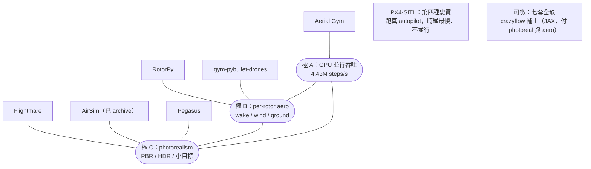

<!-- ontology-5axis output=N/A injection=sim-in-loop-train control=action|trajectory|force|param temporal=streaming domain=robotics|rigid -->

# Aerial Sim Stack — Flightmare / PX4-SITL / Isaac / RotorPy 對比解構

> 你已經 ship 過 drone autonomy 或 RL policy，知道「sim 訓得漂亮、上機就掉」是常態。這篇不講 feature list，講**三角拉扯**：**GPU-parallel RL throughput × per-rotor aerodynamic fidelity × photorealism — 沒有一套 aerial sim 三項全拿**。Aerial Gym 用幾何（不是像素）換 4.43M samples/s，RotorPy 用單機 CPU 換最細的 per-rotor aero，PX4-SITL 用「跑真實 autopilot」換最慢的時鐘，Flightmare/AirSim/Pegasus 用 Unity/Unreal 換 photoreal 但 aero 退回 rigid-body。**七套裡沒有一套可微**，所以 first-order policy gradient / diff-MPC 這條全員出局 —— escape hatch 是 crazyflow（JAX）。**為什麼進 aerial-sim anchor 名單**：因為這七套定義了「dynamics 物理層」的可選空間，而本 handbook 的 generative appearance layer（Cosmos / video-WM）正是要疊在這層之上 —— 不先把 substrate 的取捨講清楚，appearance 疊在哪都說不準。


*圖：三選二的物理根源 —— 每套 sim 靠近它換取的那一極；可微與 controller-path 是三角外的另兩種忠實*

---

## 1. TL;DR — the "pick two of three" law

- **核心定律**：aerial sim 的三個你最想要的東西 —— **(A) GPU-parallel RL throughput、(B) per-rotor aero fidelity（prop wash / ground effect / blade flapping / wind）、(C) photorealism** —— **任選兩個，第三個付代價**。沒有反例。
- **三個角的代表**：
  - 要 **(A) throughput** → **Aerial Gym**（65,536 envs / 4.43M steps·s⁻¹，但渲染是 geometric depth/seg 不是像素，aero 無 wake）。
  - 要 **(B) aero fidelity** → **RotorPy** / **gym-pybullet-drones**（最細的 per-rotor 空氣動力，但**零 photorealism**、無感知 sensor）。
  - 要 **(C) photorealism** → **Flightmare** / **AirSim** / **Pegasus**（Unity/Unreal/RTX 像素級，但底層 physics 退回 simple rigid-body）。
- **第四個隱藏軸 — controller-path sim-to-real**：**PX4-SITL** 跑的是**bit-identical 的真實 PX4 flight stack**，autopilot 在 sim 和真機上同一份二進位 —— 這是 throughput / aero / photoreal 三角之外的第四種「忠實」，代價是時鐘最慢（lockstep ~6-10× real-time，不能 GPU 並行）。
- **可微性（differentiability）橫跨七套全員缺席**。要 first-order policy gradient / differentiable-MPC / analytic gradient through dynamics → 七套都做不到。**escape hatch = crazyflow（JAX，UTIAS-DSL；§3.5 有完整 entry）**——但它付的代價是 photoreal 與 near-field aero。
- **怎麼一句話選**：vision policy 大規模訓 → Aerial Gym；空氣動力學研究 → RotorPy；photoreal 感知 → Pegasus/Flightmare；驗 autopilot → PX4-SITL。詳見 §5 決策樹。

---

## 2. The three-way trade-off — 為什麼沒有 sim 全拿

把每套 sim 投到六個軸上，就會看到「三角」是**結構性的**，不是工程懶惰：

- **aero-fidelity（空氣動力忠實度）**：per-rotor 力學 —— parasitic/induced drag、blade flapping、translational lift、prop wash、ground effect、rotor-rotor coupling、wind field。**這是最貴的軸**：細到 per-rotor + 時空風場就跑不了萬級並行（RotorPy 是純 Python ODE，CPU batched）。
- **GPU-parallel（萬級並行）**：要 4.43M steps/s 就得把 physics 壓成 GPU tensor 上的 rigid-body + 多項式 drag —— **wake / ground effect 這類 near-field 非線性項自然被砍掉**（Aerial Gym 的 drag 只有 linear+quadratic 二項）。並行度和 aero 細節在同一張 GPU 預算上互斥。
- **differentiable（可微）**：能對 dynamics 取 analytic gradient → 解鎖 first-order policy gradient / diff-MPC。**七套全 ❌**。原因：Isaac Gym / PhysX / PyBullet / Gazebo 的 solver 都不是 autodiff-traceable；RotorPy 雖是 Python ODE 但官方未暴露 autograd 路徑。
- **photorealism（像素真實感）**：PBR 渲染、HDR、小目標（電線/他機）。要 photoreal 就得掛 Unity（Flightmare）/ Unreal（AirSim）/ Omniverse RTX（Pegasus），而這些渲染後端通常**和高保真 aero 解耦** —— render 漂亮、底層 physics 退回 rigid-body。
- **RL-throughput（樣本吞吐）**：和 GPU-parallel 強相關但不等價 —— PX4-SITL 並行度 ≈ 1 但因為跑真 autopilot，「RL 樣本」這個概念本身就不適用。
- **sim-to-real-proof（落地證據）**：哪一套有**已發表的 zero-/few-shot 上機證據**。Aerial Gym（motor-control ‖e‖₂=0.09m，deploy no-fine-tune）、PX4-SITL（autopilot bit-identical，工業界最廣）、Swift via Flightmare（Nature 2023 冠軍級）三家最硬。

**三角為什麼閉不上**：(A) 要砍 near-field aero 才跑得快；(B) 要 CPU 串行 ODE 才算得細；(C) 要解耦渲染器才 photoreal，而解耦本身讓 aero 退化。三條約束兩兩相容、三者互斥 —— 這就是 "pick two" 的物理根源。

---

## 3. Comparison matrix — 8 sims × 6 axes（+ crazyflow 補上可微角）

> ●●● = best-in-set / native；●● = decent / configurable；● = minimal / absent。所有評分 grounded 於 §7 來源；超出來源的推斷標 **UNVERIFIED**。

| Sim | aero-fidelity | GPU-parallel | differentiable | photorealism | RL-throughput | sim-to-real-proof | License |
|---|---|---|---|---|---|---|---|
| **Aerial Gym** (NTNU-ARL) | ●● rigid-body + 1st-order motor (asym τ↑/↓) + lin+quad drag; **no wake/ground/rotor-rotor** | ●●● **65,536 envs / 4.43M samples·s⁻¹** (RTX 3090) | ● ❌ | ● geometric depth/seg/LiDAR/ToF, **not photoreal** | ●●● vision nav 訓 ~142 min | ●●● deploy no-fine-tune, motor ‖e‖₂=0.09m | BSD-3 |
| **Flightmare** (UZH RPG) | ● default simple rigid-body; aero 取決於 bolt-on 模型 | ●● hundreds of quads (CPU) | ● ❌ | ●●● **Unity photoreal** | ●● render ~230Hz / physics ≤~200kHz (decoupled) | ●●● Swift→Nature 2023 (via Flightmare) | MIT (**frozen, last rel. 2020-09-04**) |
| **PX4-SITL + Gazebo** | ●● Gazebo motor C_T(J)/C_P(J) advance-ratio (thrust↓ w/ airspeed) | ● no GPU parallel | ● ❌ | ● not photoreal | ● lockstep, RL 不適用 | ●●● **runs real PX4 stack (bit-identical sim↔real)** | BSD-3 (PX4) |
| **Pegasus** (PX4+Isaac Sim) | ●● linear-drag; inherits PX4 fidelity | ●● real-time multi-vehicle (**not 10⁴-env RL**) | ● ❌ | ●●● **Omniverse RTX photoreal** | ● real-time, 非大規模 RL | ●● inherits PX4 controller path | BSD-3 |
| **RotorPy** | ●●● **best-in-set**: parasitic+rotor+induced drag, blade flapping, translational lift/drag, 1st-order motor lag, **spatio-temporal wind**; no ground/wake/rotor-rotor | ●● batched ~25× CPU speedup @1000+ drones | ● ❌ (pure-Python ODE) | ● **none** (matplotlib), no perception sensors | ●●● **PPO 5M steps <4 min on MacBook Air M3** | ●● benchmarked vs real flight data | MIT |
| **gym-pybullet-drones** (UTIAS-DSL) | ●● selectable: drag + **ground effect + downwash fit to real CF 2.x** (Förster '15 / Shi '19) | ● CPU-bound | ● ❌ (→ crazyflow JAX is succ.) | ● PyBullet basic | ●● Gym-classic baseline | ●● CF 2.x 經驗擬合 | MIT |
| **crazyflow** (UTIAS-DSL, JAX) | ●● rigid-body + 非線性 motor + 2nd-order rotor/body drag; **no blade flapping/downwash** | ●●● **262k worlds / 914M steps·s⁻¹** (RTX 4090) | ●●● **唯一 ✅**：`jax.grad` 穿透全 dynamics+control | ● none (photoreal 列 future work) | ●●● 一階 PG 訓 traj policy **1.56s** | ●● sub-cm 無 DR；sim2real gap 比 gym-pybullet-drones **低 61.3%** | MIT |
| **AirSim** (Microsoft) | ● FastPhysics = rigid-body + **quadratic drag (linear term dropped)**; no wake/ground/rotor-coupling | ● 1-2 (Unreal 限) | ● ❌ | ●●● **Unreal photoreal** | ● Unreal-bound | ●● widely used pre-archive | MIT (**ARCHIVED 2022, read-only**) |

### Per-sim verdicts

- **Aerial Gym** — throughput 之王。把 drone-specific stack（多 airframe + 五層 geometric controller + Warp ray-cast depth/LiDAR）GPU 化到萬級。**買它 = 你要大規模 vision policy 且能容忍「無 wake、非 photoreal」**。已有 foundation dissection（[aerial-gym.md](../../foundations/differentiable-simulators/aerial-gym.md)），這裡不重拆。
- **Flightmare** — photoreal 的學術經典，Swift（Nature 2023）就跑在它上面。**解耦設計**（Unity render ~230Hz / physics ≤~200kHz）是亮點，但**已凍結**（last release 2020-09-04），default physics 是 simple rigid-body —— aero 全靠你 bolt-on。買它 = 要 Unity photoreal + 接受維護停擺。
- **PX4-SITL + Gazebo** — controller-path 落地的黃金標準：**sim 裡跑的 autopilot 二進位和上機完全一致**。代價是 lockstep 把時鐘鎖到 ~6-10× real-time（laptop ~3-4×），無 GPU 並行、非 photoreal。買它 = 你要驗 autopilot 行為，不是訓 vision policy。
- **Pegasus** — 「PX4 忠實度 + Omniverse RTX photoreal」的縫合：real-time 多載具，**不是 10⁴-env RL 平台**。linear-drag、不可微，physics 忠實度繼承 PX4。買它 = 你要 photoreal 感知**且**真實 autopilot 在環，但只跑少量載具。
- **RotorPy** — aero 之王。**全 set 最細的 per-rotor 空氣動力**（parasitic+rotor+induced drag、blade flapping、translational lift、時空風場），batched ~25× CPU，PPO 5M steps 在 MacBook Air M3 上 <4 分鐘。代價：**零 photorealism（matplotlib）、無感知 sensor**。買它 = 空氣動力學/控制研究，不碰 pixel。
- **gym-pybullet-drones** — 唯一**內建 ground effect + downwash 且擬合到真實 Crazyflie 2.x**（Förster 2015 / Shi 2019）。CPU-bound、不可微 —— 官方明指 GPU/可微的繼承者是 **crazyflow（JAX）**。買它 = 要近地/編隊 aero 的輕量 baseline。
- **AirSim** — 早期 Unreal photoreal 標竿，但 **2022 已 archive（read-only）**，FastPhysics 連 linear drag 項都砍掉（只剩 quadratic）。新專案請走 **Cosys-AirSim**（維護中，UE5.5，GPU-LiDAR）或 **Project AirSim**（UE5，MIT）。買它 = 不要買，看繼承者。

---

## 3.5 可微的那一角 —— crazyflow（與補上 photoreal 的 VisFly）

整份對比裡 `differentiable` 一欄原本全 ❌，而那一角現在有真東西填了。

**crazyflow**（[arXiv 2606.01478](https://arxiv.org/abs/2606.01478)，UTIAS-DSL，與 gym-pybullet-drones 同實驗室的 JAX 版、非字面 drop-in）把可微做成一等公民：`jax.grad` 穿透**整條 dynamics + control pipeline**，於是解鎖三件七套都做不到的事——

- **一階 policy gradient（BPTT）**：軌跡追蹤 policy **1.56 秒**訓完、in-flight 復原 policy **0.38 秒**（不是 typo，是秒）。
- **differentiable / NMPC**：用 CasADi 對 abstracted model 取符號梯度。
- **解析 system-ID**：用 JAX 梯度（Trust-Region Reflective）反推參數。

吞吐也頂：RTX 4090 上 **914M steps/s、262k 並行 worlds**；sub-cm 追蹤**不靠 DR**、sim2real gap 比 gym-pybullet-drones **低 61.3%**。

**但它沒有打破三角、只是換了一組代價**：crazyflow **無 photoreal 渲染**（官方列 future work）、**aero 簡化**（rigid-body + 2nd-order drag，**無 blade flapping / downwash**）、模型以 **Crazyflie 2.x** 標定為主（大機誤差略升）。換句話說——**「可微 + 吞吐」這一角，付的是 photoreal 與 near-field aero**，正好再次印證 §2 的 pick-two 定律：加一條軸（可微）沒讓你白拿，只是讓三角變成更高維的取捨。

**那「可微 + photoreal」呢？** 新一代 **VisFly**（[arXiv 2407.14783](https://arxiv.org/abs/2407.14783)）把可微物理接上 photoreal 渲染（>10,000 FPS、可匯入 Habitat-Sim 場景）——代價回到 aero 簡化。而 **VisFly-Lab**（[arXiv 2603.21123](https://arxiv.org/abs/2603.21123)）點破可微 RL 自己的坑：一階 RL 的 BPTT 會有**梯度偏差/爆炸與 horizon 初始狀態覆蓋**問題，要用 ABPT（Amended BPTT）修——**可微不是免費午餐**。

**底層基座 vs 開箱即用**：

- **MuJoCo MJX**（JAX MuJoCo，可微、massively parallel）有 Crazyflie-2 / Skydio-X2 的 MJCF（DeepMind Menagerie），**但只給「thrust + body moment」致動、沒有真 aero**——你要自己帶空氣動力模型（crazyflow 本身就用 MJX/MJCF 描述環境）。它是**可微基座、不是無人機 sim**。見 foundation [MuJoCo MJX](../../foundations/differentiable-simulators/mujoco-mjx.md)。
- **Genesis / Brax**：兩者都宣稱可微，但**無已驗證的可微 aerial 路徑**——Genesis 的 drone 範例是 PID/PPO 剛體（非可微），Brax 沒有現成 quadrotor 環境。標 `UNVERIFIED`，別假設能直接做可微 aero 飛行。見 foundation [Genesis](../../foundations/differentiable-simulators/genesis.md)。

---

## 4. 五軸定位 — 映到 handbook injection 軸

本 handbook 按 [ontology](../../cheat-sheet/ontology.md) 的 injection 軸看「物理怎麼進來」。這七套**全部是 `sim-in-loop-train`**（output=N/A，因為它們是 sim 不是生成模型），但在「sim 怎麼被用」上分四個 sub-mode：

| Sim | injection sub-mode | render 角色 | controller 在環 | differentiable |
|---|---|---|---|---|
| Aerial Gym | sim-in-loop-train | data-render (geometric depth/seg, **非 pixel**) | ✅ 五層 geometric controller | ❌ |
| Flightmare | sim-in-loop-train | data-render (Unity **pixel**, 解耦) | 取決於 bolt-on physics | ❌ |
| PX4-SITL | sim-in-loop-train | (render 次要) | ✅ **controller-in-loop**（真 PX4 stack） | ❌ |
| Pegasus | sim-in-loop-train | data-render (Omniverse **pixel**) | ✅ controller-in-loop（PX4 SITL 在環） | ❌ |
| RotorPy | sim-in-loop-train | **none**（state-only, matplotlib） | ✅ param/trajectory（含 aero） | ❌ |
| gym-pybullet-drones | sim-in-loop-train | data-render (PyBullet basic) | ✅ action/trajectory | ❌（→ crazyflow JAX） |
| AirSim | sim-in-loop-train | data-render (Unreal **pixel**) | ✅ action/trajectory | ❌ |
| crazyflow | sim-in-loop-train | **none**（state-only） | ✅ param/trajectory | ✅ **唯一可微**（jax.grad） |

讀法：
- **data-only render**（餵生成/感知模型的像素工廠）：Flightmare / Pegasus / AirSim 出 pixel；Aerial Gym 出 geometric depth/seg（非 pixel，要 photoreal 得外接）；RotorPy 完全不渲染。
- **controller-in-loop**：PX4-SITL / Pegasus 把**真實 autopilot** 塞進環 —— 這是最強的 controller-path 忠實。
- **differentiable**：七套全 ❌、**crazyflow 是唯一 ✅**（§3.5）。想要 sim-in-loop-train **且**可微梯度：crazyflow（state-only）/ MJX（自帶 aero）/ VisFly（加 photoreal）是通路。

---

## 5. How to choose — 決策樹

```
你的瓶頸是什麼？
│
├─ vision-policy-at-scale（萬級並行訓視覺導航 / 避障）
│     → Aerial Gym（geometry-render, 65k envs, 4.43M steps/s）
│        需要 photoreal pixel？ → Aerial Gym depth + 外接 Cosmos / Isaac Sim 補幀
│        需要 near-field aero（編隊/近地）？ → 退而求其次：gym-pybullet-drones（並行度低）
│
├─ aero-research（空氣動力學 / 控制 / 風擾 / lift-drag 研究）
│     → RotorPy（best per-rotor aero + spatio-temporal wind; PPO 5M <4min M3）
│        需要 ground effect / downwash 且擬合真機？ → gym-pybullet-drones（CF 2.x fit）
│        需要可微梯度做 diff-MPC / 一階 PG？ → crazyflow（JAX，§3.5）；也要 photoreal → VisFly
│
├─ photoreal-perception（gate detection / 小目標 / sim2real vision backbone）
│     → 要真實 autopilot 在環 → Pegasus（Omniverse RTX + PX4 SITL）
│        純 photoreal racing/research → Flightmare（Unity；接受 frozen 2020）
│        舊專案遷移 → 不用 AirSim（archived）→ Cosys-AirSim / Project AirSim
│
└─ validate-autopilot（驗 PX4 行為 / HIL / mission logic / failsafe）
      → PX4-SITL + Gazebo（bit-identical autopilot, controller-path 黃金標準）
         要同時 photoreal → Pegasus（PX4 SITL + RTX）
```

**一條鐵律**：如果你的選擇同時需要「萬級並行 **+** per-rotor aero **+** photoreal」，停下 —— 那是 "pick three"，物理上不存在（§2）。重排優先序，砍掉最不痛的那個軸。

---

## 6. Cross-line synthesis — dynamics substrate 與 appearance layer 的分工

- **這七套是「dynamics 的物理」substrate**：它們提供 6-DoF 剛體 + 馬達 + （部分）空氣動力的**運動忠實度**，但**外觀（appearance）忠實度**要嘛沒有（RotorPy / Aerial Gym geometric），要嘛靠掛載的遊戲引擎（Flightmare/AirSim/Pegasus）。本 handbook 的 generative appearance layer（Cosmos / video-WM）正是補後者：**把 Aerial Gym 的 geometric depth/seg 當 ground-truth，餵 Cosmos 條件生成 photoreal aerial 幀** —— substrate 給軌跡與幾何，generation 給像素。
- **differentiability**：七套全 `sim-in-loop-train` 但全不可微；**crazyflow 把這角補上**（§3.5：`jax.grad` 全穿透，解鎖一階 PG / diff-MPC / 解析 system-ID），代價是 photoreal 與 near-field aero；要「可微 + photoreal」看 VisFly。可微梯度沒打破 "pick two"，只是再加一條可換軸。
- **與 4 條 generation 路線怎麼接**：
  - **pixel-WM**：Flightmare/Pegasus/AirSim 的 Unity/Unreal/RTX 幀可直接當 video-WM 訓練資料；Aerial Gym 走「geometric → Cosmos 補 photoreal」。
  - **latent-WM**：Aerial Gym 64k-env rollout 餵 Dreamer-style latent（呼應 [Swift](./champion-level-drone-racing.md) 與 Dream to Fly 路線）。
  - **diff-sim**：七套 ❌ → crazyflow / MJX / VisFly（§3.5）；對應本倉可微 sim 之 [Genesis](../../foundations/differentiable-simulators/genesis.md) / [MuJoCo MJX](../../foundations/differentiable-simulators/mujoco-mjx.md)，但那兩套的「可微 aerial」路徑未驗證（§3.5）。
  - **neural surrogate**：把 RotorPy 級的高保真 aero 蒸成快 NN —— 這正是 [NeuroBEM](https://arxiv.org/abs/2106.08015)（BEM + NN 殘差、誤差砍 ~50%）與 [Neural-Fly](https://www.science.org/doi/10.1126/scirobotics.abm6597)（線上自適應風模型）在做的事：把 per-rotor / 風 aero 學成快模型，等於把 (B) 的細節搬進 (A) 的吞吐裡，是繞過三角的一條工程路。
- **與 sister handbook 接**：這七套**隱藏**的東西（wake、ground effect、IMU bias、wind gust 在多數 sim 裡不全）正是真機上機翻車點 —— 對齊 Spatial 的 [aerial real-flight gotchas](https://github.com/sou350121/Spatial-Intelligence-Handbook/blob/main/embodiments/aerial/real_flight_production_gotchas.md) 與 [dynamics primer](https://github.com/sou350121/Spatial-Intelligence-Handbook/blob/main/embodiments/aerial/dynamics_and_control_primer.md) 對照閱讀，能直接定位「哪個 sim 砍了哪個項 → 上機會在哪炸」。

---

## 6.5 另一類：不在這三角裡比的 sim —— CARLA-Air

上面七套比的是「純空中」的三角。還有**一類不在這個三角裡比**的模擬器值得單獨拉出來：**[CARLA-Air](./carla-air.md)** —— 它把 Microsoft AirSim 的多旋翼飛控塞進 **CARLA 的 photoreal 城市世界**，讓**空中無人機與地面車流／行人共用同一個物理 tick、同一個渲染器**。

它的賣點**不在**動力學精度或吞吐（飛行動力學就是 AirSim 剛體級、~20 FPS 單環境、無 GPU 並行、不可微），而在 **domain × 外觀**：它是目前唯一同時提供「城市級 photoreal + 空地統一」的公開基座，對**空地協同 / 跨視角感知 / 具身導航（VLN-VLA）/ 低空經濟**這些題目對口。一句話分流：**要純空中高保真動力學 → 回這七套；要城市空地場景與多模態資料 → 走 CARLA-Air。** 完整拆解見 [carla-air.md](./carla-air.md)。

---

## 7. References

**Anchor sims（canonical）**
- **Aerial Gym** — Kulkarni et al. "Aerial Gym Simulator." arXiv [2503.01471](https://arxiv.org/abs/2503.01471) (v2) / [2305.16510](https://arxiv.org/abs/2305.16510) (v1). Docs: https://ntnu-arl.github.io/aerial_gym_simulator/ · 已有 foundation dissection [aerial-gym.md](../../foundations/differentiable-simulators/aerial-gym.md)
- **Flightmare** — Song et al. "Flightmare: A Flexible Quadrotor Simulator." CoRL 2020. arXiv [2009.00563](https://arxiv.org/abs/2009.00563) · https://github.com/uzh-rpg/flightmare
- **PX4-SITL + Gazebo** — PX4 simulation docs: https://docs.px4.io/main/en/simulation/
- **Pegasus** — Jacinto et al. "Pegasus Simulator." arXiv [2307.05263](https://arxiv.org/abs/2307.05263) · https://pegasussimulator.github.io/PegasusSimulator/
- **RotorPy** — Folk, Tao, Cohen. "RotorPy: A Python-based Multirotor Simulator with Aerodynamics." arXiv [2306.04485](https://arxiv.org/abs/2306.04485) · https://github.com/spencerfolk/rotorpy
- **gym-pybullet-drones** — Panerati et al. arXiv [2103.02142](https://arxiv.org/abs/2103.02142) · https://github.com/utiasDSL/gym-pybullet-drones
- **AirSim** — Microsoft (archived 2022, read-only): https://github.com/Microsoft/AirSim · successors: Cosys-AirSim, Project AirSim
- **crazyflow** — Schuck et al. "Crazyflow: An Accurate, GPU-Accelerated, Differentiable Drone Simulator in JAX." arXiv [2606.01478](https://arxiv.org/abs/2606.01478) · https://github.com/utiasDSL/crazyflow （MIT、JAX 可微，§3.5）
- **VisFly** — "An Efficient and Versatile Simulator for Training Vision-based Flight." arXiv [2407.14783](https://arxiv.org/abs/2407.14783)（可微物理 + photoreal）· **VisFly-Lab**（一階 RL / ABPT）arXiv [2603.21123](https://arxiv.org/abs/2603.21123)
- **MuJoCo MJX** — JAX MuJoCo（可微基座，thrust-only，自帶 aero）；Crazyflie-2 / Skydio-X2 MJCF 見 [DeepMind Menagerie](https://github.com/google-deepmind/mujoco_menagerie)

**aero / sim-to-real grounding（per-rotor 模型來源）**
- Förster (2015) — Crazyflie thrust/drag system-ID（gym-pybullet-drones ground-effect/downwash fit 依據）
- Shi et al. (2019) "Neural Lander" — downwash / ground-effect 真機擬合（gym-pybullet-drones 依據）
- Kaufmann et al. "Champion-level drone racing using deep reinforcement learning." Nature 2023 (Swift, via Flightmare) — 見 [champion-level-drone-racing.md](./champion-level-drone-racing.md)
- **NeuroBEM** — Bauersfeld et al. "NeuroBEM: Hybrid Aerodynamic Quadrotor Model." RSS 2021. arXiv [2106.08015](https://arxiv.org/abs/2106.08015)（BEM + NN 殘差，誤差砍 ~50%；§6 neural-surrogate 路線的範本）
- **Neural-Fly** — O'Connell et al. *Science Robotics* 2022 [10.1126/scirobotics.abm6597](https://www.science.org/doi/10.1126/scirobotics.abm6597)（DAIML 線上自適應風模型）— 亦見 [sim-to-real-contract](./sim-to-real-contract.md)

**Handbook 內部**
- Aerial-sim overview: [overview.md](./overview.md) · ontology（5 軸定義）: [../../cheat-sheet/ontology.md](../../cheat-sheet/ontology.md)

**Sister handbook（這些 sim 隱藏了什麼）**
- Spatial aerial real-flight gotchas: https://github.com/sou350121/Spatial-Intelligence-Handbook/blob/main/embodiments/aerial/real_flight_production_gotchas.md
- Spatial aerial dynamics primer: https://github.com/sou350121/Spatial-Intelligence-Handbook/blob/main/embodiments/aerial/dynamics_and_control_primer.md

---

## §8 Pitfall log

> 每條：嚴重度 · 來源 · workaround。標 **UNVERIFIED** 者超出 §7 列示來源，僅供方向參考、未經一手核驗。

| # | Pitfall | Severity | Source | Workaround |
|---|---|---|---|---|
| 8.1 | **把 "pick two" 當成 "pick three"** —— 同時要萬級並行 + per-rotor aero + photoreal | **High**（選型） | §2 結構性論證 | 重排優先序，砍掉最不痛的軸；或走 §6 surrogate 路把 RotorPy aero 蒸進並行網絡 |
| 8.2 | **誤以為某套可微** → 想做 first-order policy gradient / diff-MPC | **High**（路線） | 七套全 ❌（matrix §3） | 跳到 crazyflow（JAX）；或改 model-free RL |
| 8.3 | **Aerial Gym 無 wake/ground/rotor-rotor** → 近地/編隊 sim2real gap 爆 | **High**（physics） | arXiv 2503.01471（drag 僅 lin+quad） | racing/open-air 影響有限；近地/編隊外掛 surrogate aero 或改 gym-pybullet-drones |
| 8.4 | **Aerial Gym render 非 photoreal**（geometric depth/seg）→ 直接訓 RGB perception 會 domain gap | Medium | arXiv 2503.01471 | depth/seg 套 Cosmos / Isaac Sim 補 photoreal 幀 |
| 8.5 | **Flightmare 已凍結**（last release 2020-09-04），default physics = simple rigid-body | Medium | https://github.com/uzh-rpg/flightmare | aero 自行 bolt-on；長期維護考慮改 Pegasus |
| 8.6 | **AirSim 已 archive（2022, read-only）**，FastPhysics 連 linear drag 都砍（只剩 quadratic） | **High**（維護） | https://github.com/Microsoft/AirSim | 改 Cosys-AirSim（UE5.5, GPU-LiDAR）或 Project AirSim（UE5, MIT） |
| 8.7 | **PX4-SITL lockstep 慢**（~6-10× real-time desktop, ~3-4× laptop），無 GPU 並行 | Medium | https://docs.px4.io/main/en/simulation/ | 它本就不是 RL throughput 工具；驗 autopilot 用它，訓 policy 另選 |
| 8.8 | **Pegasus 不是 10⁴-env RL 平台**（real-time multi-vehicle，linear-drag） | Medium | arXiv 2307.05263 | 大規模 RL 走 Aerial Gym；Pegasus 用於 photoreal + 真 autopilot 在環的少量載具 |
| 8.9 | **RotorPy 零 photorealism / 無感知 sensor**（matplotlib, state-only） | Medium | arXiv 2306.04485 | 純 aero/control 研究用它；要 pixel perception 另接渲染 sim |
| 8.10 | **gym-pybullet-drones 的 ground-effect/downwash 只擬合到 Crazyflie 2.x** | Medium | Förster 2015 / Shi 2019（arXiv 2103.02142） | 換機型須重新 system-ID；大機 / 不同 prop 不可直接套 |
| 8.11 | **Gazebo C_T(J)/C_P(J) advance-ratio 係數要正確標定**，否則高速段 thrust 估錯 | **UNVERIFIED**（係數需逐機標定，超出 §7 列示細節） | PX4 docs（advance-ratio 模型存在；逐機標定影響未由一手 benchmark 核驗） | 用真機/風洞數據標 C_T(J)/C_P(J)；低速段影響小、巡航/俯衝段須校 |
| 8.12 | **把 crazyflow 當 photoreal/aero 全能** → 它無 photoreal 渲染、aero 無 blade flapping/downwash、以 CF 2.x 標定 | Medium | arXiv 2606.01478 | 可微+吞吐用它；要 photoreal 接 VisFly，要近地 aero 另接 surrogate |
| 8.13 | **以為 Genesis / Brax 能直接做可微 aerial** | **UNVERIFIED** | Genesis drone 範例為 PID/PPO 剛體（非可微）；Brax 無現成 quadrotor 環境 | 用 crazyflow / MJX（自帶 aero）/ VisFly；別假設 Genesis/Brax 可微 aero |
| 8.14 | **以為一階（可微）RL 是免費午餐** → BPTT 梯度偏差/爆炸、horizon 初始覆蓋不足 | Medium | VisFly-Lab arXiv 2603.21123（ABPT 修正） | 用 ABPT 類修正；長 horizon 退 model-free RL 或截斷 BPTT |

> 註：matrix 評分與 issue 狀態截至來源 fetch 時點（2026-06）；繼承者專案（Cosys-AirSim / Project AirSim / crazyflow）版本可能演進。
