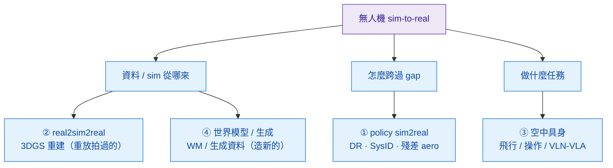
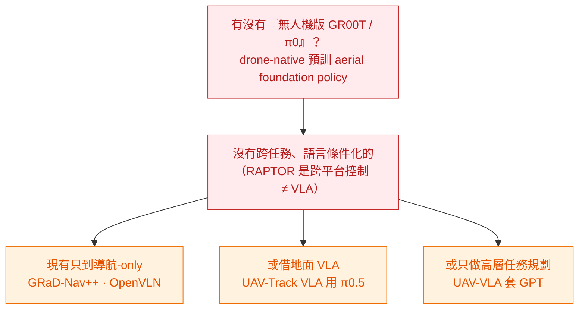

<!-- ontology-5axis output=N/A injection=sim-in-loop-train control=action|trajectory|camera temporal=streaming domain=robotics -->

# 空中具身 sim-to-real：研究地景（2024–2026）

> 這頁不是方法解構，是**研究地景綜述**——把「無人機/aerial 具身的 sim-to-real」整個領域(2024–2026)收斂成一張**可決策的地圖**：哪些**已成熟可用**、哪些是 **buildable-but-novel 缺口**、哪些是**結構性難題**。它把本倉的 aerial-sim 線([Swift](./champion-level-drone-racing.md) / [Dream-to-Fly](./dream-to-fly.md) / [生成航拍資料](./generative-aerial-data.md) / [CARLA-Air](./carla-air.md) / [Carla2Real-2026](./carla2real-2026.md))放進它所屬的大圖,讀者(尤其無人機公司)可據此選研發方向。
>
> **產出方式**：deep-research skill 的 13-agent 方法論(系統檢索 → 來源核驗 → 綜合 → devil's advocate);**每個 arXiv ID 經核驗存在**,捏造條目已剔除。誠實標 `UNVERIFIED`(數字來自全文非摘要、或無法獨立確認時)。
>
> **三桶定義**:**已成熟**＝可直接採用;**buildable-but-novel**＝工程上可做、學界尚無人占＝機會;**結構性難題**＝有物理/即時硬牆、短期無解。

## 執行摘要(三句)

1. **室內/過門的 real2sim2real(3DGS)已成熟**(FalconGym 95.8%→2.0 98.6%、SOUS VIDE 105 次真飛)——但它是**高保真重放拍過的場景、不是生成**,出不了新天氣/新內容。
2. **最大的 buildable-but-novel 缺口 = 沒有「無人機版的 GR00T / π₀」**:**不存在無人機原生、大規模、語言/語意條件化的 aerial VLA foundation policy**(⚠ 注意軸別:RAPTOR `2509.11481` 證明了**跨平台低階控制** foundation policy 可行,但 2084 參數、state-based、純控制、無視覺/語言——是另一個軸,**不是 GR00T/π₀ 那一類**;故不與本句矛盾)。現有的要嘛只做導航、要嘛**借地面 VLA**、要嘛只做高層任務規劃。
3. **世界模型給無人機,已證的是「訓練期 WM」、不是「環內 WM」**:DreamerV3 在潛在想像裡訓 policy、上機真飛(9–21 m/s),但**部署的是蒸餾出的小 actor、kHz 控制環不受 WM 速度拖累**;真正的「即時牆」只在你想把 video WM 塞進控制環當 sim 時才撞——**無人機上沒人做到**。

## 四條線怎麼分

*圖：四線各坐落在 sim2real 迴路的不同位置——② / ④ 是「資料/sim 從哪來」(重建 vs 生成)、① 是「怎麼跨 gap」(遷移機制)、③ 是「做什麼任務」(飛行/操作/語言導航)。*

## ① 無人機 policy sim-to-real

三種遷移策略,各有勝場:
- **SysID**(SimpleFlight,`2412.11764`):SysID 質量/慣量/推力係數/馬達時間常數 + 選擇性 DR → **>50% 追蹤誤差↓**(`UNVERIFIED` 五因子細節來自全文)。**平台固定可測時最強**。
- **Domain Randomization**(Deep Drone Racing `1905.09727`;跨平台 One Net `2504.21586`):動力學不確定/要一網多機時最強(代價:略慢於逐平台微調)。
- **殘差/學習空氣動力學**(NeuroBEM `2106.08015`;Neural-Fly `2205.06908`,**12m/s 風中 cm 級**):高速/強風、未建模 aero 主導時最強。

旗艦結果:Swift([champion-level](./champion-level-drone-racing.md),Nature 2023,RL + **學殘差**贏人類冠軍)· **RAPTOR**(`2509.11481`,Sci Robotics,**2084 參數** foundation policy,**zero-shot 上 10 台真機 32g–2.4kg**)· 純像素敏捷飛行(Geles `2406.12505`,40km/h)· 多智能體競速(`2512.11781` UPenn、`2605.22748` UZH superhuman)。

> **「the key」(敏捷飛行子領域的廣泛共識)**:sim2real 最硬的殘差是 **thrust↔throttle(RPM)映射 + 馬達時間常數 + 控制延遲**(SimpleFlight 把馬達時間常數 SysID 列為核心;Swift 在標稱動力學上學殘差;Ferede `2311.16948` / Eschmann `2311.13081` 直接 RPM 控制 + 學殘差)。詳見 [sim-to-real 契約](./sim-to-real-contract.md)。

## ② real2sim2real(3DGS 重建可飛 sim)

捕捉真實飛行場景 → 3DGS/NeRF 重建 → 可飛 photoreal sim → 訓 policy → 飛回真實:
- **FalconGym**(`2503.02198`,IROS25,**95.8%** 過門)→ **2.0**(`2510.02248`,NeRF→GSplat + Edit API,**98.6%** 69/70 門)。
- **SOUS VIDE / FiGS**(`2412.16346`,簡化動力學 + 3DGS **130fps**,**105 次真飛**穩健於 30% 質量/40m/s 風/60% 亮度;**metric-scale 靠 ArUco**)。
- **GRaD-Nav**(`2503.03984`,3DGS + 可微 RL)→ **GRaD-Nav++**(`2506.14009`,+VLM、**全機載**、真機 sim2real)。
- 城市級 GS(**渲染**為主、未閉環飛):CityGaussian `2404.01133` · VastGaussian `2402.17427` · DroneSplat `2503.16964`(in-wild 去動態干擾)· Horizon-GS `2412.01745`(空地統一)。資料增強:UAVTwin `2504.02158`(+2.5–13.7% mAP)。

> **結構性邊界(誠實)**:3DGS 重建是**拍過場景的高保真重放、不是生成**——對「沒拍過的城市/天氣/新物件」零幫助;**無任何 RTK-anchored 閉環論文**(metric 戶外可飛 GS = 缺口)。這正是本倉 [GS 解構](../../foundations/3d-aware-generation/generative-gaussian-splatting.md) 與 [Carla2Real-2026](./carla2real-2026.md) 講的「重建 owns 拍過的、生成 owns 新情境」。

## ③ 飛行外的空中具身(操作 / VLN-VLA)

- **空中操作**:cable-load 去中心化 MARL(`2508.01522`,**首個真機去中心化**)· 2-DOF 末端位姿控制(`2512.21085`,cm/deg 級)· 力感抓取(`2602.08599`,`UNVERIFIED` 數字)。核心 sim2real 障礙:**下洗(downwash)、欠驅動、接觸力**。
- **VLN / VLA**:AerialVLN(`2308.06735`)· CityNav(`2406.14240`,真實軌跡)· **UAV-Track VLA**(`2604.02241`,**建在地面 π₀.₅ 上**,61.76% 成功)· OpenVLN(`2511.06182`)· UAV-VLA(`2501.05014`,只做高層任務規劃)· 綜述(`2604.13654`,把 VLA+WM 整合標為「emerging」)。
- **空地協同**:[CARLA-Air](./carla-air.md)(`2603.28032`)· Griffin(`2503.06983`)· AirV2X(`2506.19283`)——資料集偏**感知**、缺操作/閉環控制標註。

*圖：對無人機公司最大的 buildable-but-novel 機會——**沒有 drone-native 的大規模預訓練 aerial foundation policy**;現有要嘛導航-only、要嘛借地面 VLA、要嘛只做高層規劃。這比再做一個 enhancer 更接近「平台級護城河」。*

## ④ 世界模型 / 生成式資料給空中具身

- **生成式資料(提升下游)**:**FlightDiffusion**(`2509.14082`,單幀→FPV 影片+動作,sim-real 無顯著差但**窄、收益溫和**)· **SynDroneVision**(`2411.05633`,WACV,**+4.8–8pp mAP** = 最強增強實證)· SkyScenes(`2312.06719`,ECCV)· FlyAwareV2(`2510.13243`)。
- **WM 當 sim**:**Dream-to-Fly**([dream-to-fly](./dream-to-fly.md),`2501.14377`,ICRA26,DreamerV3 潛在想像訓 policy,真飛 9m/s)· **SkyDreamer**(`2510.14783`,Informed Dreamer,機載 **21m/s 6g**)。
- **生成式 aerial WM**:AirScape(`2507.08885`,首個 6-DoF aerial gen WM)· ANWM(`2512.21887`)· FlyMirage(`2605.19600`,LLM+gen WM→3DGS 的 VLN 資料,$100/hr 真飛→1 GPU)。
- **Cosmos-for-aerial = 缺口**(就**公開資訊**:Cosmos 文件未列 aerial recipe、公開覆蓋未含 aerial;**內部預訓組成未公開,故是「公開資訊上的缺口」、非鐵證**;呼應 [Cosmos § aerial](../../foundations/foundation-physics-models/cosmos-wfm.md))。

> **即時牆釐清(關鍵)**:DreamerV3-drone 的 WM **只在訓練期**跑(想像 rollout),**部署的是蒸餾小 actor**,所以 kHz 內環**不受 WM 速度拖累**。「即時牆」只在你想把 **video/latent WM 塞進控制環當 sim** 時才撞——**無人機上沒人做到**(對應 [frontier 即時牆](../../frontier/overview.md))。

## 三級判斷表(給 Autel 研發決策)

| | **① policy sim2real** | **② real2sim2real(3DGS)** | **③ 空中具身(操作/VLA)** | **④ 世界模型 / 生成資料** |
|---|---|---|---|---|
| **已成熟可用** | 固定平台 state-RL + 殘差 aero(高速/風) | 室內/過門光真重放迴路 **95–99%** | VLN benchmark + 協同感知 + 窄操作 | 渲染/合成資料增強**感知**(+5–8pp mAP);DreamerV3 當**訓練期** WM 真飛 |
| **buildable-but-novel 缺口** | 一策略多機(RAPTOR/One Net)、GS 視覺 policy | **RTK/metric 戶外可飛 GS**、城市級 GS 內閉環飛 | **drone-native VLA foundation(GR00T/π₀ for drones)**、空地具身協作 benchmark | 生成式資料**真提升 policy(非僅感知 mAP)**(FlightDiffusion 是孤證)、**Cosmos aerial recipe**(= [Carla2Real-2026](./carla2real-2026.md)) |
| **結構性難題** | 通用跨平台**視覺** sim2real、致動器延遲/電壓下垂原理化、極限敏捷下安全 | GS **只重放拍過場景**(無新內容/天氣)、relighting | **接觸式靈巧空中抓取 sim2real**(下洗/欠驅動)、長程真機 VLA 可靠度(GRaD-Nav++ `2506.14009` 未見場景真機 ~50%,`UNVERIFIED` 確切數) | **video/latent WM 進 kHz 控制環**(延遲牆、無人機上沒人破;**對比:訓練期 WM 已成熟**) |

## Devil's advocate(該存疑的)

- **數字多是單一實驗室、單一賽道、小 N(~30 次)**——統計效力弱、少獨立復現;引用「95.8%/98.6%」記得只在一條過門賽道。
- **「sim-real 無顯著差」可能是檢定力不足**(FlightDiffusion F(1,16),N 小,看不到差 ≠ 沒有差)。
- **借地面 VLA(π₀.₅)≠ 真有 aerial VLA**——證明可遷移,沒證明 aerial 專屬預訓不需要。
- **real2sim2real 的「真」是重放、不是泛化**:對沒拍過的場景零幫助,別當世界合成。
- **反論(該認真對待):aerial foundation policy 也許不是瓶頸。** 既然控制策略可跨平台 zero-shot(RAPTOR)、地面 VLA 可遷移(UAV-Track 61.76%),也許真瓶頸是**物理殘差**(thrust↔throttle / 下洗 / 接觸)、不是缺一個語意先驗。**回應**:遷移只到 61.76% + 導航-only 上限,反過來正說明缺一個 aerial-native 語意泛化——但這是**判斷、非已證**,標為開放命題。

## 接回手冊

- **[Carla2Real-2026](./carla2real-2026.md) 的賭注落在「④ buildable-but-novel 缺口」**:Cosmos-aerial recipe + 生成資料真提升 policy,**都還是孤證/空白** → 做就是占無人區(也呼應 [frontier #5 sim2real](../../frontier/overview.md))。
- **手冊「aerial 外觀靠 3DGS 重建」= 線 ② 的成熟結論**;「重建只重放、生成補新情境」的互補框架被線 ② 的結構難題坐實。
- **最大的策略機會在線 ③:沒有 drone-native foundation policy**——對無人機公司,這比再做一個 enhancer 更接近平台級護城河;對接 [bridge-to-vla](../../bridge-to-vla/generative-data-for-vla.md)。

## Limitations + AI 揭露

- 範圍限 arXiv/公開來源、2024–2026 為主;企業內部未發表工作不可見。**小 N、缺獨立復現是全領域通病**。**未標 `UNVERIFIED` 的數字均自摘要/論文首屏可核;標記者來自全文深處或無法獨立確認。**
- 本頁由 **AI 研究工具(deep-research skill,13-agent 方法論)輔助產生**;每個 arXiv ID 經核驗存在,捏造條目(如「MAVEN」「Aero-World」「DiffusionCinema」)已剔除。

## 參考(核驗過 arXiv)

- **① policy sim2real**:SimpleFlight `2412.11764` · One Net `2504.21586` · Deep Drone Racing `1905.09727` · NeuroBEM `2106.08015` · Neural-Fly `2205.06908` · RAPTOR `2509.11481` · Geles `2406.12505` · Eschmann `2311.13081` · Ferede `2311.16948` · 多智能體 `2512.11781` / `2605.22748`
- **② real2sim2real**:FalconGym `2503.02198` / `2510.02248` · SOUS VIDE `2412.16346` · GRaD-Nav `2503.03984` / ++`2506.14009` · UAVTwin `2504.02158` · CityGaussian `2404.01133` · VastGaussian `2402.17427` · DroneSplat `2503.16964` · Horizon-GS `2412.01745`
- **③ 空中具身**:cable-load MARL `2508.01522` · 末端控制 `2512.21085` · AerialVLN `2308.06735` · CityNav `2406.14240` · UAV-Track VLA `2604.02241` · OpenVLN `2511.06182` · UAV-VLA `2501.05014` · 綜述 `2604.13654` · 力感抓取 `2602.08599` · CARLA-Air `2603.28032` · Griffin `2503.06983` · AirV2X `2506.19283`
- **④ 世界模型/生成**:FlightDiffusion `2509.14082` · SynDroneVision `2411.05633` · SkyScenes `2312.06719` · FlyAwareV2 `2510.13243` · Dream-to-Fly `2501.14377` · SkyDreamer `2510.14783` · AirScape `2507.08885` · ANWM `2512.21887` · FlyMirage `2605.19600`
