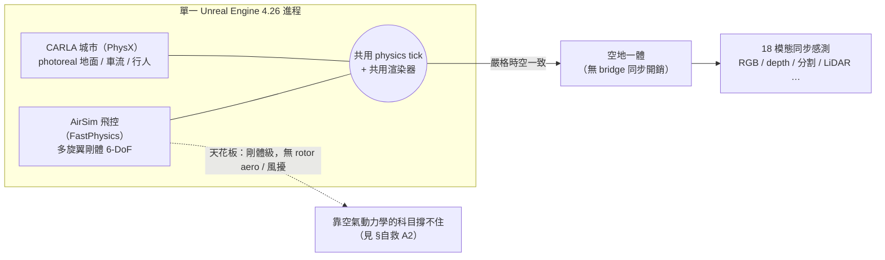
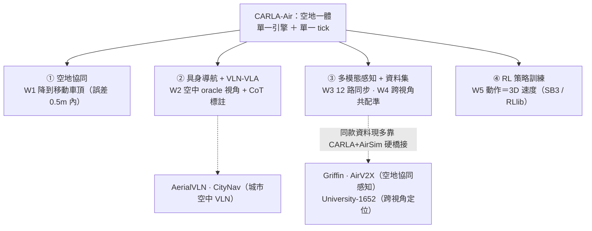
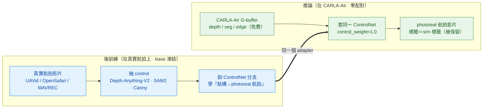
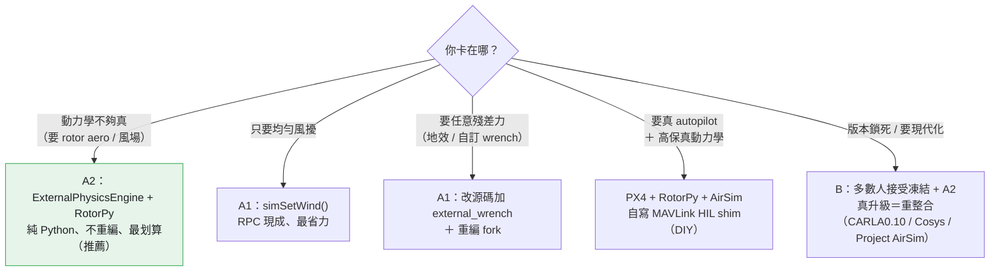
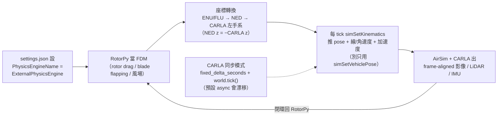

<!-- ontology-5axis output=N/A injection=sim-in-loop-train control=action|trajectory|camera temporal=streaming domain=robotics|driving -->

# CARLA-Air —— 空地一體的城市級模擬 解構

> Tianle Zeng、Yanci Wen、Hong Zhang。arXiv [2603.28032](https://arxiv.org/abs/2603.28032)（v1 2026-03-30 / v2 2026-04-22；cs.RO·cs.AI·cs.CV·cs.HC）。程式碼 [github.com/louiszengCN/CarlaAir](https://github.com/louiszengCN/CarlaAir)（2026-03-19 建立，約 991★，維護中）。專案站 [carla-air.com](https://www.carla-air.com/)。
>
> **為什麼值得收進 aerial-sim 名單**：前面七套 aerial sim（[對比見此](./aerial-sim-stack.md)）拼的是「動力學精度 × 並行吞吐 × 畫面真實感」這個三角；CARLA-Air 不在這個三角裡比，它補的是**所有純空中模擬器都缺的一塊**——把無人機放進一個**有規則車流、有社會化行人、城市級像素級真實感**的世界，而且**空中與地面共用同一個物理 tick、同一個渲染器**。對「低空經濟 / 城市空域 / 空地協同 / 跨視角感知 / 具身導航（VLN-VLA）」這些題目，它是目前最對口的公開**單引擎**基座（空地統一另有 TranSimHub / AirSimAG 等耦合式別解，見 §五軸定位）。它在 ontology 上唯一同時佔住 `domain=robotics`（空中）與 `domain=driving`（地面）兩格——這就是它的真正座標。

## 一句話總結

**CARLA-Air 不是從頭寫的新模擬器——它是一層「組合」：把 Microsoft AirSim 的多旋翼飛控組合進 CARLA 的 Unreal Engine 世界，讓無人機與地面車輛在同一進程、同一物理 tick、同一渲染器裡被嚴格時空一致地共模擬。** 它的賣點**不是**空氣動力學、**也不是**吞吐，而是**城市真實感 + 空地統一**。（⚠ 它**以完整內嵌分支形式發佈**——README 自稱「只改 3 檔 ~35 行」與 repo 內容不符，這件事對「能不能輕鬆換版本」很關鍵，見 [§自救 B](#自救如何補強--繞過鎖死)。）

但有一顆必須講清楚的星號：**它的飛行動力學就是 AirSim 原封不動的剛體 6-DoF**——論文只說「aerodynamically consistent multirotor dynamics」，**沒有**記載任何 rotor/blade-element 模型、馬達動態、阻力係數、地面效應或風擾建模。所以拿它練「貼地高速、強風、螺旋槳尾流」這類靠空氣動力學的科目，會跟單獨用 AirSim 一樣不夠（見 [generative-aerial-data](./generative-aerial-data.md) 與 [Swift 殘差法](./champion-level-drone-racing.md) 的對照）。它的吞吐也只有 **~20 FPS 單環境**，沒有 GPU 並行多環境、不可微、也沒有任何 sim-to-real 真機實證。把這顆星號看懂，才知道該拿它做什麼、不該拿它做什麼。


*圖：CARLA-Air 的核心 —— 地面像素級真實感與剛體飛控共用一個 tick，換來空地一體；但飛行動力學止於 AirSim 剛體級。*

## 怎麼運作（架構）

核心是「**兩套物理引擎、一個 Unreal 進程**」：CARLA 用 PhysX 管地面車輛與行人，AirSim 用 FastPhysics 管無人機，兩者掛在同一個 Unreal Engine 4.26 渲染迴圈裡。關鍵工程點是**時間與座標的嚴格對齊**——無人機物理跑在獨立 async 執行緒，**預設 ~333 Hz（3 ms；源碼 `SimModeWorldBase.h` 預設值，README 稱 ~1000 Hz 但內嵌的 `settings.json` 未覆寫）**，渲染約 20 Hz（每出一幀、物理約走 16 步），而 CARLA 左手座標系與 AirSim 的 NED 座標系對齊（README 宣稱 0 m 誤差，`UNVERIFIED`）。

```
   ┌──────────── 單一 Unreal Engine 4.26 進程（渲染 tick ~20 Hz）────────────┐
   │                                                                          │
   │   CARLA 0.9.16 (PhysX)                AirSim 1.8.1 (FastPhysics)         │
   │   ├ 地面車輛 / 行人 / 交通規則         ├ 多旋翼剛體 6-DoF 飛控            │
   │   └ 隨渲染 tick 同步                   └ 無人機物理 ~333 Hz（獨立 async 執行緒）│
   │            └────── 座標對齊：CARLA 左手系 ↔ AirSim NED（誤差 0 m）──────┘ │
   │                              │                                            │
   │                     共用渲染器 + 共用時間軸                               │
   │                              ▼                                            │
   │   最多 18 種同步感測：RGB / depth / 語義+實例分割 / LiDAR / radar /        │
   │                       表面法向 / IMU / GNSS / 氣壓計 …（空地同場景）       │
   │                              │                                            │
   │   對外：CARLA Python API（89/89 測試過）+ AirSim Python API + ROS2（63 topic）│
   └──────────────────────────────────────────────────────────────────────────┘
        把 AirSim 飛控組合進 CARLA 世界（實作為完整 vendored fork，非 README 稱的薄 patch）
```

三個設計選擇決定了它的性格：

- **「組合」而非「重寫」**：它不另造物理、不 fork CARLA，而是把兩個成熟堆疊接起來。好處是**兩邊的原生 Python API 與 ROS2 都零改動可用**（CARLA 89/89 API 測試通過、ROS2 跑 63 個 topic），既有 CARLA 自駕程式碼幾乎能直接搬上來、再加一架無人機；壞處是**它繼承了兩邊的所有侷限**，尤其 AirSim 的剛體飛行模型與「上游已封存（archived）」的版本鎖死問題（**這兩個都能自己補強 / 繞過，見下方 [§自救](#自救如何補強--繞過鎖死)**）。
- **單一 tick 共模擬，而非橋接（bridge）**：很多空地系統用 ROS bridge 把兩個獨立模擬器串起來，代價是同步開銷與時序漂移。CARLA-Air 把無人機直接放進 CARLA 的 Unreal 場景，**省掉跨進程同步**，換來嚴格的空地時空一致——這對「無人機看著地面車流做決策」這類跨視角任務是硬需求。
- **城市真實感免費繼承**：因為渲染器就是 CARLA 的，無人機視角直接拿到 CARLA 的像素級真實感城市（測過 Town01–05、Town10HD 等 13 張城市圖、14 種天氣預設）。這是它相對純空中模擬器最大的單點優勢。

## 拿它做什麼：空地協同的五條工作流

CARLA-Air 的價值不在「又一個無人機 sim」，而在**它讓你做的事**。論文把方向收成四條（air-ground cooperation／embodied navigation + VLN-VLA／multi-modal perception + dataset／RL），用五個工作流（W1–W5，皆 Town10HD / RTX A4000）示範：


*圖：CARLA-Air 的應用層——四方向 / 五工作流，及它們餵向的真實任務。關鍵：W3/W4 那類「空地協同感知」資料，現在的公開資料集（Griffin / AirV2X）多半是**把 CARLA 硬橋接 AirSim** 做的——這正是 CARLA-Air（單一引擎、免橋接）的存在理由。*

- **① 空地協同（W1 精準降落）**：無人機降到一台**移動中**的車頂，終端水平誤差 **0.5 m 內**（起始偏 ~6 m / 高 ~12 m、~20 s、三段控制器）。「空中看著地面動態做閉環」最乾淨的小範例。
- **② 具身導航 + VLN-VLA（W2，capability 非 benchmark）**：同場景出**空中 ＋ 地面**配對的 RGB/depth/semseg、車道級航點、加空中「oracle 俯視」+ chain-of-thought 標註——這是純地面或純空中平台給不了的**跨視角 grounding**，對口 [AerialVLN](https://arxiv.org/abs/2308.06735) / [CityNav](https://arxiv.org/abs/2406.14240)。
- **③ 多模態感知 + 資料集（W3/W4）**：W3 一次出 **12 路同步流（8 地面 ＋ 4 空中）**、用**共用 tick index 對齊**（≤1 tick、無時間戳內插）；W4 出 **500 對空拍-depth ↔ 地面-seg 共配準**、14/14 天氣過光照一致性檢查。這正是 [Griffin](https://arxiv.org/abs/2503.06983)（AAAI 2026）/ [AirV2X](https://arxiv.org/abs/2506.19283) 那類**空地協同感知**資料集在解的事——而它們**現在是 CARLA 橋接 AirSim 拼出來的**，所以 CARLA-Air 的免橋接單 tick 直接對口；跨視角定位接 University-1652。
- **④ RL 策略訓練（W5）**：Gym 式同步步進（Stable-Baselines3 / RLlib），動作＝3D 速度命令，穩定性由 **357 次 reset / 3 小時零崩潰**背書。但**單環境 ~20 FPS、無 GPU 並行萬級環境**——大規模 RL 仍回 [Aerial Gym](./aerial-sim-stack.md)。

> **驅動力（論文原話）**：低空經濟（低空经济，已入中國 2024 政府工作報告、2025 市場 ~1.5 兆人民幣）、城市空域、空地協同——都要「在同一個物理一致的世界裡同時模空中與地面」，正是它的命題。

## 五軸定位與同類對手

| 系統 | output | injection | control | temporal | domain | 一句話差異 |
|---|---|---|---|---|---|---|
| **CARLA-Air** | N/A | sim-in-loop-train | action·trajectory·camera | streaming | **robotics + driving** | **首個單一引擎 / 單一 tick** 空地共模 + 城市像素級真實感 |
| AirSim（單獨） | N/A | sim-in-loop-train | action·trajectory·camera | streaming | robotics | 有無人機像素級真實感，但無豐富地面車流生態 |
| Flightmare | N/A | sim-in-loop-train | action·trajectory | streaming | robotics | Unity 像素級真實感空中，無地面交通 |
| Isaac-Pegasus | N/A | sim-in-loop-train | action·trajectory·param | streaming | robotics | Omniverse RTX + PX4，像素級真實感但無城市駕駛生態 |
| 基底 CARLA | N/A | sim-in-loop-train | action·trajectory | streaming | driving | 純地面，沒有空中 |

> **Cross-axis 必要說明**（呼應 ontology Check 9b/9c）：CARLA-Air 是模擬器，故 `output=N/A`；它在 `domain` 軸上同時標 `robotics|driving`，是因為它真的把兩個 domain 放進同一場景共模擬——這不是含糊其辭，而是它存在的理由。它沒有用到 `generalist`（非白名單），因此不觸發 Check 9c。

它真正的對手其實不是別的 aerial sim，而是「**任何想同時要城市車流生態 + 空中視角**」的需求方案：要嘛接受 **ROS bridge 串兩個模擬器**（[Griffin](https://arxiv.org/abs/2503.06983) / [AirV2X](https://arxiv.org/abs/2506.19283) 資料集即把 CARLA 橋接 AirSim；[TranSimHub](https://arxiv.org/abs/2510.15365) 用 SUMO+Blender 耦合；[AirSimAG](https://arxiv.org/abs/2603.23079) 客製 AirSim），要嘛用 CARLA-Air 的單 tick 共模擬。**所以它的差異化不是「唯一空地統一」（那有別解），而是「首個把無人機與 CARLA 駕駛世界塞進單一引擎、單一 tick、免橋接」**——這條才站得住。

## 強在哪 / 崩在哪

**⚡ 強（真正領先的場景）**

- **空地統一、單一物理 tick**：無橋接同步開銷，空中與地面嚴格時空一致——做空地協同、跨視角（cross-view）感知、車-機協作這類任務的首選公開基座。
- **城市級像素級真實感免費繼承**：13 城市圖 × 14 天氣，無人機俯視/斜視城市場景的畫面真實感遠勝純空中模擬器。
- **多模態同步感測（宣稱最多 18；README 具名 10、論文 demo 實際 12 路 = 8 地面 + 4 空中）**：一個場景同時出 RGB/depth/分割/LiDAR/radar/IMU/GNSS… 對「建多模態資料集、餵感知或具身模型」極友善（搭 [generative-aerial-data](./generative-aerial-data.md) 看資料用途）。
- **零改動復用既有生態**：CARLA + AirSim 雙 Python API + ROS2 全保留，舊程式碼搬遷成本低。
- **讓已封存的 AirSim 飛控續命**：AirSim 上游 2022 已封存，CARLA-Air 把它的飛控接到一個仍在維護的環境裡——對還在用 AirSim 資產的團隊是一條延壽路。

**❌ 崩（已知失效邊界）**

- **飛行動力學只到 AirSim 剛體級**：無 rotor/blade-element、無馬達動態、無地面效應、無風擾建模。貼地高速、強風、尾流交互這些**靠空氣動力學的科目它撐不住**——這跟單獨用 AirSim 是同一個天花板。
- **~20 FPS、單環境、無 GPU 並行多環境**：論文實測「3 車 + 2 行人 + 1 無人機 + 8 感測器」約 19.8±1.1 FPS（純地面基準 28.4 FPS，整合開銷約 30%）。比起 Aerial Gym/Isaac 的數千並行環境，**RL 吞吐低好幾個數量級**；GPU 並行多環境是作者列的未來工作，現在沒有。
- **不可微**：別指望 first-order policy gradient / diff-MPC 這條路。
- **無 sim-to-real 實證**：驗證全在模擬內（如精準降落誤差 <0.5 m），**沒有任何真機遷移結果**。
- **工程毛邊**：換地圖要**重啟整個進程**；多無人機 >2 雖能跑但未正式驗證；高密度場景效能未充分刻畫（作者標為持續推進的工程目標）。
- **版本鎖死在老堆疊**：UE 4.26 / CARLA 0.9.16 / AirSim 1.8.1，且 AirSim 上游已封存——長期維護有風險。

## 復現

- 原始碼 + 預編譯二進位都有：Ubuntu 20.04/22.04（HuggingFace / 百度網盤）與 Windows 11 x86_64；版本 v0.1.7（2026-03）。
- 跑得起來的證據：CARLA API 89/89 測試通過、ROS2 63 topic 驗證、RL 流程 357 次 spawn/destroy 零崩潰。
- **授權需自行確認**：README 寫程式碼 MIT + CARLA 資產 CC-BY，但 GitHub 自動偵測回傳 `NOASSERTION`（沒解析出單一 SPDX）。商用前請以實際 LICENSE 檔為準（`UNVERIFIED`）。
- 論文署名單位、以及 README 自稱的「同儕審查」皆**未在公開頁面查證**（arXiv 本身是技術報告）——標 `UNVERIFIED`。

## 跨路線綜合

放回本手冊「外觀靠生成、動力學靠物理」的框架：**CARLA-Air 是『物理 + 真實外觀』那層底層的一個特例——特別之處在於它的『場景』不只是地形，而是一個有車流、有行人、有交通規則的活城市。** 因此：

- 對 **pixel-WM / 生成路線**：它是極好的**條件真值工廠**——空地同場景出 18 模態，可拿 CARLA-Air 的幀＋幾何當條件去餵 [Cosmos](../../foundations/foundation-physics-models/cosmos-wfm.md) 這類 video-WM 做像素級真實感增廣，補足純空中模擬器拿不到的「城市動態背景」。另一條更輕的外觀路是事後**增強**——CARLA2Real / EPE（駕駛端把 CARLA renderer 輸出增強成更真、標註不變）理論上可疊在 CARLA-Air 上，但只在駕駛地面視角驗證過，俯視可遷移性 `UNVERIFIED`（詳見本篇下方「把外觀邊升到 photoreal：Carla2Real」一節）。
- 對 **動力學**：它**不解決**空氣動力學問題（那仍是 AirSim 天花板）——要高保真飛行動力學，仍得回到 [RotorPy / 殘差法](./aerial-sim-stack.md) 那條路。它的價值在 domain × 外觀，不在空氣動力學。
- 對 **空地具身 / VLN-VLA**：規則車流 + 社會化行人當無人機的動態背景，是「無人機在城市裡看著人車做決策」這類任務難得的公開資料源。
- 跨冊：它生成的城市空地資料，最終要餵給 Spatial-Handbook 的感知端消費——對齊問題（尤其 IMU 噪聲模型與 camera-IMU extrinsic）見 [Bridge: Aerial Embodiment](../../bridge-to-spatial/aerial-embodiment.md)；它和純空中七套的取捨見 [Aerial Sim Stack 對比](./aerial-sim-stack.md)。

## 把外觀邊升到 photoreal：Carla2Real

CARLA-Air 的外觀來自 CARLA 的 Unreal render——城市夠豐富，但**是遊戲引擎級、不是真 photoreal**。要把那個 render **後處理升到 photoreal**，有一條現成的學習式路：**Carla2Real**（Pasios & Nikolaidis，Aristotle Univ.；arXiv [2410.18238](https://arxiv.org/abs/2410.18238)，IEEE T-ITS 2025；[code](https://github.com/stefanos50/CARLA2Real)，MIT）。

**它是什麼**：把 Intel 的 **EPE（Enhancing Photorealism Enhancement，[2105.04619](https://arxiv.org/abs/2105.04619)）移植進 CARLA**——吃 CARLA 的 RGB **+ G-buffer**（透過 `listen_to_gbuffer()`，需 **CARLA 0.9.14**），用 GAN image-to-image 把畫面拉向真實街景資料集（Cityscapes / KITTI / Mapillary Vistas，repo 另加 nuScenes）。**13 FPS @ RTX 4090**（TensorRT FP16）。

**為什麼對 CARLA-Air 有意義、關鍵在哪**：EPE 用 **LPIPS 結構損失**逼輸出**不改幾何與語意內容**——所以 enhancement 後的畫面**仍對得上原本 sim 的 ground-truth 標籤**。這是它最大價值：**免費保留標籤**，你能拿 CARLA-Air 出的多模態標籤直接訓練、只是畫面更真。實測（driving）：sim 訓練的分割器在**真 Cityscapes** 上 mIoU 約 **2.6×**（Town10HD 0.065→0.167）；但**絕對值仍低（~0.17）**，且只補**外觀**、補不了 **content gap**——區域性號誌 / 車種等仍失敗（見原文表格）。

> **⚠ 對 aerial 是一個乾淨的空缺（`UNVERIFIED`）**：Carla2Real / EPE **只在 driving 街景驗證過**（target 全是街景資料集），**目前沒有任何把它用在 aerial / CARLA-Air 上的工作**。架構上可行（同 CARLA / Unreal、同 G-buffer），但 EPE 的 discriminator 與 patch-matching 是**調在街景統計上的**，能不能轉到**俯視 / 斜視 aerial 視角**未證——這是個沒人占的乾淨機會。

**它對動力學零貢獻**：Carla2Real 是純 image-to-image 後處理，**只動外觀邊、完全不碰動力學**（動力學還是 AirSim 剛體那套，要靠 [§自救 A2](#自救如何補強--繞過鎖死) 換 RotorPy）。所以 **Carla2Real 補外觀、§自救 補動力學，兩者正交**——正是本手冊「外觀靠生成 / 渲染、動力學靠物理」的字面分工。

**放進「補外觀 gap」的三條路看**（aerial 實際用的是第二條、不是 enhancement）：

| 路 | 代表 | 給你 | 代價 |
|---|---|---|---|
| **enhancement**（後處理 sim render） | EPE / **Carla2Real** | 留標籤、便宜、保留你的 sim 幾何 | 只補外觀不補 content；per-frame 有 flicker 風險；需引擎 G-buffer；**aerial 未證** |
| **reconstruction**（重建真實場景） | NeRF / 3DGS（driving: NeuRAD；**aerial: [FalconGym](https://arxiv.org/abs/2503.02198) 95.8%、SOUS VIDE 105 飛**） | 外觀近乎完美（重放真感測） | 只限拍過的場景，難造新內容 / 新標籤 |
| **generation**（生成） | Cosmos / GAIA-2 / FlightDiffusion | 任意場景、可控、最多樣 | 幾何 / 標籤對齊最弱 |

**per-frame enhancement 的 flicker 怎麼解？→ video-to-video（時序一致版的 enhancement）**：把「逐幀翻」換成「整段一起翻」，用光流 warp + 時空判別器把時序吃進去。經典是 **vid2vid**（NVIDIA，NeurIPS 2018，[1808.06601](https://arxiv.org/abs/1808.06601)：seg 影片→photoreal 影片；後續 few-shot / world-consistent vid2vid）；現在多走 **video-diffusion**——**Cosmos-Transfer**（[2503.14492](https://arxiv.org/abs/2503.14492)，depth/seg/edge ControlNet 條件化，**sim→real 已實證**含 robotics）、結構感知去噪的「video EPE」（[2511.14719](https://arxiv.org/abs/2511.14719)）。**兩個代價**：① 算力遠高於 per-frame；② **保標籤變難**——時序一致的生成會 hallucinate / drift，幾何與標籤對不齊，EPE「免費標籤」的賣點被削弱。**而且一樣只動外觀邊、零動力學。** ⚠ **aerial 同樣是空缺（`UNVERIFIED`）**：video2video / video-diffusion 的 sim→photoreal 全在駕駛 / 桌面操作 / 人臉 / 通用場景，**沒有任何「aerial sim-render → photoreal」的時序一致工作**（FlightDiffusion 那種是「文字 / 單幀 → 生影片」、不是把 sim render 翻真，不算）——**這個沒人占的空缺，正是下面「Carla2Real-2026」要攻的**。

**到 2024 為止**，aerial 的外觀 gap 是 3DGS / NeRF 重建在解（FalconGym / SOUS VIDE 已落地），enhancement 那條只在街景、aerial 未證。**但 2026 局面變了**——後訓練一個開源 video diffusion 的結構 ControlNet，能把 enhancement 真正帶到 aerial（見下「Carla2Real-2026」），且它與 3DGS **互補**：重建 owns「拍過的真實場景」、enhancement owns「sim 裡任意可控的新場景」。CARLA-Air 因為免費給 G-buffer + 空地同場景，正是落地這條的理想基座。

## Carla2Real-2026：後訓練開源 video model，把 CARLA-Air 真正升到 photoreal

上面那套 Carla2Real 是 **2024 的 per-frame GAN**（街景訓練、有 flicker、aerial 未證）。2026 的做法本質不同：**後訓練一個開源 video diffusion 的「結構 ControlNet 分支」**，一次拿到**時序一致 + 強生成先驗 + 免配對標籤**——而且正好攻下「aerial sim→photoreal 影片增強」這個**至今沒人占的空缺**（4-scout 核：所有 learned enhancement 都是街景 Carla2Real/EPE/Cosmos-Transfer；aerial 端只有 3DGS 重建與合成資料生成，**無任何 aerial sim→real 全幀影片增強**）。

**核心招式：train on real, infer on sim（零配對）。** 這是 Cosmos-Transfer 的**真實做法**（已核源）——control 分支**在真實影片上訓**（用現成估計器從真實影片抽 depth/seg/edge），**base 凍結**；推論時餵**模擬器的**結構 → photoreal 影片。**標籤被保留**，因為輸出跟著 control map 走，而 **CARLA-Air 的 depth/seg G-buffer 本身就是標籤**（Cosmos CARLA Sim2Real cookbook 實證「語意標籤維持原樣、100% anomaly preservation」）。**CARLA-Air 是理想基座**：它免費給 depth/seg/edge G-buffer ＋ 12–18 模態，還空地同 tick——可一致地增強空中與地面兩個視角。


*圖：Carla2Real-2026 的關鍵——control 分支在「真實航拍」上學「結構→photoreal」，推論時把同一個 adapter 套到「CARLA-Air 的 sim G-buffer」上。不用 sim↔real 配對，sim 標籤 1:1 轉移。*

**買哪個 base（2026 開源菜單，已核）**：
- **首選 Cosmos-Transfer2.5-2B**——唯一 **purpose-built** 的 sim→real 多模 ControlNet（depth/seg/edge），開源權重（NVIDIA OML，**可商用**），2B 單機可後訓，官方有 Isaac-Sim / [CARLA Sim2Real](../../foundations/foundation-physics-models/cosmos-wfm.md) recipe。
- **Apache-2.0 替代：Wan2.2 + VACE**——最大開源生態（LoRA/ControlNet/ComfyUI）、all-in-one 控制；但官方訓練碼未釋出（走社群）。
- **省算力：CogVideoX-2B（Apache）/ LTX-Video**——單卡可後訓，LTX 是唯一近即時。

**後訓練怎麼做（5 步，單機 8×A100/H100 可行）**：
1. **收真實航拍影片**當「真實 look」目標：**UAVid**（4K 連續斜視城市飛掠，最貼 CARLA-Air 視角）、**OpenSafari**（2026，in-the-wild FPV、已驗相機軌跡）、MAVREC。⚠ UAVid/VisDrone 是 **CC-BY-NC-SA 學術限定**（商用阻擋），AeroScapes 可商用但只有靜圖——商用前先解授權。
2. **抽 control**：Depth-Anything-V2（depth）＋ SAM2 / GroundingDINO（seg）＋ Canny（edge），組 `{真實影片, control, caption}`（VLM 自動標 caption）。這就是「零配對」的關鍵——control 是**算出來的**、不用配對採集。
3. **訓 control 分支（base 凍結）**：Cosmos-Transfer 是 `torchrun --nproc_per_node=8`、**~5000 iter、單機 8 GPU**（對齊官方 AV / 農業 Sim2Real recipe）；或 Wan-VACE Context-Adapter / LoRA（更輕、10–50 clip 起跳）。
4. **推論餵 CARLA-Air 的 sim 結構**：把 CARLA-Air render 出的 depth/seg/edge 當 control、`control_weight≈1.0`、prompt 指定航拍域 → photoreal 航拍影片，**sim 標籤 1:1 轉移**。
5. **逐模態 / 逐區調 control_weight**（Cosmos 的 adaptive `w`）：要保幾何處調高、要 photoreal 多樣處調低。

**資料準備：要備什麼、要多少（零配對、免標註）**

你要準備的只有**一堆真實航拍影片**——而且**不用配對、不用標註**，這是這套配方最省成本的兩點：
- **不用配對**：train-on-real / infer-on-sim 的兩堆資料（真實影片 vs sim render）**各自獨立**，沒有 sim↔real 一一對應；不存在「同一場景拍真實又跑模擬」的苦差。
- **不用標註**：control（depth/seg/edge）是估計器**算出來的**，真實影片可以是**完全沒標的原始素材**。標籤只在 **sim 端**需要（CARLA-Air 免費給）＋評測用的 held-out 真實集需要。

**三個來源（按優先）**：
1. **Autel 自家飛行素材（最佳）**——有無人機就能飛能錄，拍出**正好匹配你產品相機 + 飛行包絡**的真實影片，且**自有資料、商用乾淨**。它比公開資料集更對口，因為推論時面對的就是這個分布。
2. **公開航拍影片**補多樣性——UAVid（視角最貼 CARLA-Air）/ OpenSafari（FPV）/ MAVREC / VisDrone-VID；⚠ 多為 **CC-BY-NC-SA 學術限定**，商用要另解授權。
3. **CARLA-Air sim render（免費、自己生）**——推論輸入 + 評測用，自帶 GT 標籤、無限量。

**要多少（三檔，從便宜到正規）**：

| 檔 | 真實影片量 | 算力 | 換到什麼 |
|---|---|---|---|
| **零後訓（先試）** | **0**（只要 CARLA-Air render） | 推論即可 | 用 `2511.14719` zero-shot 先量 aerial drift 有多嚴重 |
| **LoRA「調 look」** | **~10–50 段 clip（≈10 分–1 小時）** | 1–3 GPU、數小時 | 輕量風格遷移，快但弱 |
| **ControlNet 分支（正規）** | **數十～低百小時**（NVIDIA AV 分支參考＝14 萬 clip ≈ ~190 小時） | 單機 8×A100/H100、~5000 iter | 強域分支，標籤保真最好 |

> 下界（LoRA 10–50 clip、分支 tens-of-hours）多是從 NVIDIA AV recipe 與社群 LoRA 工作**外推**，aerial 無公開定數（`UNVERIFIED`）——所以**先零後訓試水 → LoRA ~1 小時 Autel 素材 → 不夠再爬到分支**，逐檔加，別一開始就堆 190 小時。

**影片規格**：720p+、切 **~5–12 秒 clip**（Cosmos 用 121-frame 窗）；每段配 VLM 自動 caption。**多樣性 > 純量**：晨/午/昏光照、天氣、高度、城市/郊區都要覆蓋；**視角要對**（中空斜視飛掠，別混純 nadir 遙測集，否則灌入域偏差）。**評測**用 held-out 有標真實航拍（如 UAVid val）＋ CARLA-Air sim（自帶 GT）跑「train-on-enhanced → test-on-real」mIoU。

**先試零後訓的快路**：[2511.14719](https://arxiv.org/abs/2511.14719)（*Zero-shot Synthetic Video Realism Enhancement via Structure-aware Denoising*，**zero-shot、不微調**、建在 Cosmos-Transfer 上）——DDIM 反演合成影片 + 結構感知去噪 + 多條件 ControlNet。**先拿它對 CARLA-Air 一試**，再決定要不要花算力後訓。

**誠實的風險（這是真難處，不是工程細節）**：
- **EPE 的「硬」標籤鎖變「軟」了**：EPE 用 LPIPS 把幾何鎖死、標籤**保證**保留；video-diffusion 的 ControlNet 是 `control_weight` 的**軟**約束，弱了就 hallucinate / drift、幾何標籤對不齊（2511.14719 自承 prompt-conflict；hybrid 法 [2605.02291](https://arxiv.org/abs/2605.02291) 自承 diffusion 造成時序不一致，且發現「**分布匹配比強幾何編輯更重要**」）。**設計縫**＝把 EPE 的硬鎖塞回 video prior：反演 + 強多條件 + 對 sim G-buffer 的 LPIPS 式一致性懲罰，同時拿到時序一致**與**免費標籤。
- **aerial 的幾何 / metric 保真是頭號風險**：高空小紋理 + 斜視透視 → depth-only 條件約束不足；diffusion 不保 metric scale。增強後的影片要還能餵 VIO / depth / policy，**目前沒有任何 aerial benchmark 證過它 metric 上仍可用**——要上真機先驗這條。
- **視角要對得上**：真實航拍多是俯視 survey，CARLA-Air 是中空斜視飛掠——target 選 UAVid / OpenSafari / MAVREC（視角對），別用純 nadir 遙測集（會灌域偏差）。

**評測**：train-on-enhanced → test-on-real-aerial 的分割 mIoU（aerial 版 Carla2Real 指標）＋ FVD vs 真實航拍 ＋ 幾何 / metric 一致性（給 VIO 用）＋ 時序一致性。

> **一句話**：building blocks 在 2026 全齊（開源結構-ControlNet video diffusion ＋ 真實航拍影片 ＋ 現成估計器），**aerial sim→photoreal 影片增強是 buildable-but-novel**——CARLA-Air 因免費給 G-buffer ＋ 空地同場景，是落地這條的最佳起點。它與 3DGS 重建**互補**（重建 owns 拍過的真實、這條 owns sim 裡可控的新場景），與 [§自救](#自救如何補強--繞過鎖死) 的動力學升級**正交**（這條補外觀、§自救 補物理）。

## 自救：如何補強 / 繞過鎖死

§4 兩個侷限（**AirSim 剛體空氣動力學** 與 **已封存版本鎖死**）**都能自己解**。以下路徑均經內嵌源碼核對（檔案路徑見 §參考）。先用決策樹定位你該走哪條：


*圖：§自救 決策樹——按你卡的點選路；絕大多數情況是「接受凍結 ＋ A2（RotorPy）」。*

### A. 把飛行動力學做高保真

**A2 —— 外掛動力學（★ 最推薦：純 Python、不改 C++、不重編，保真度最高）**

CARLA-Air 內嵌的 AirSim 裡**就帶 `ExternalPhysicsEngine` 模式**（`.../physics/ExternalPhysicsEngine.hpp`，它的 `update()` 不做任何積分、只 `updateKinematics()`）。做法四步：

1. `settings.json` 設 `"PhysicsEngineName": "ExternalPhysicsEngine"`；
2. 飛行動力學改跑**你自己的高保真模型**——首選 [RotorPy](./aerial-sim-stack.md)（有 rotor drag / blade flapping / induced drag / 空間風場），或你自己的 6-DoF 積分器、甚至 PX4 SITL HIL；
3. 每個 tick 用 **`simSetKinematics(state, …)`** 把「pose + 線/角速度 + 加速度」推進去——**用這個、別只用 `simSetVehiclePose`**（後者只設 pose，IMU/GNSS/速度 ground-truth 會不一致）；
4. AirSim + CARLA 在那個 pose 出 frame-aligned 的影像 / LiDAR / IMU。

這是 AirSim **官方支援的 FDM 接法**（upstream PR #3626 加入 `ExternalPhysicsEngine`、#4066 加 `simSetKinematics`；官方 **GazeboDrone** 就是用它把 Gazebo 當 FDM、AirSim 只出感測）。⚠ **更正前一版**：「把 RotorPy 換成 PX4 SITL 也是同一個接口」是**錯的**——**PX4 是飛控（controller）、不是 FDM**，塞不進 `ExternalPhysicsEngine` 這個 **FDM 槽**（要真 autopilot 見下方「想要真 autopilot？」）。


*圖：§自救 A2 —— ExternalPhysicsEngine 把 RotorPy 當 FDM，每 tick 經座標轉換推 state，CARLA 同步模式防漂移。*

**可跑骨架**（API 簽名已對 AirSim / RotorPy / CARLA 源碼核對；座標翻轉是實作定義，標 `UNVERIFIED`，必須自己寫 + 測）：

```python
# settings.json：{ "SettingsVersion": 1.2, "SimMode": "Multirotor",
#                  "PhysicsEngineName": "ExternalPhysicsEngine" }
import airsim
from rotorpy.vehicles.multirotor import Multirotor
from rotorpy.controllers.quadrotor_control import SE3Control   # RotorPy 內建幾何 SE(3) 控制器
from rotorpy.trajectories.minsnap import MinSnap               # 任一 trajectory 物件

client = airsim.MultirotorClient(); client.confirmConnection()
veh   = Multirotor(quad_params)            # 你的高保真機型參數
ctrl  = SE3Control(quad_params)            # 自帶控制器——不用自己寫
traj  = MinSnap(points=waypoints)          # setpoint 來源：traj.update(t) → flat_output
dt    = 0.003                              # FDM 步長 = 無人機更新率
state = {'x': x0, 'v': v0, 'q': [0,0,0,1], # RotorPy 狀態：ENU 世界 / FLU 機體 / q=[x,y,z,w]
         'w': w0, 'wind': wind0, 'rotor_speeds': rs0}

s = world.get_settings()                   # CARLA 同步模式（防空地漂移）
s.synchronous_mode = True; s.fixed_delta_seconds = dt
world.apply_settings(s)

t = 0.0
while True:
    flat    = traj.update(t)                       # x / x_dot / x_ddot / yaw / yaw_dot
    control = ctrl.update(t, state, flat)          # → dict，含 cmd_motor_speeds
    state   = veh.step(state, control, dt)         # RotorPy 積分一步（solve_ivp）

    # RotorPy(ENU, z-up) → AirSim(NED, z-down)：交換 x/y ＋ z 反號（見下方座標說明）
    x, v, w = state['x'], state['v'], state['w']
    ks = airsim.KinematicsState()
    ks.position         = airsim.Vector3r(x[1], x[0], -x[2])
    ks.linear_velocity  = airsim.Vector3r(v[1], v[0], -v[2])
    ks.angular_velocity = airsim.Vector3r(w[0], -w[1], -w[2])    # FLU→FRD（機體系）
    ks.orientation      = enu_to_ned_quat(state['q'])           # 回傳 Quaternionr(x,y,z,w)
    client.simSetKinematics(ks, True)              # ignore_collision 必填位置參數
    world.tick(); t += dt
```

> **已核對（VERIFIED，附源）**：`PhysicsEngineName=ExternalPhysicsEngine`（PR #3626，GazeboDrone 即此架構）；`simSetKinematics(state, ignore_collision, vehicle_name='')` + `KinematicsState` 欄位（PR #4066，AirSim `types.py`）；RotorPy `SE3Control.update(t, state, flat_output)`→含 `cmd_motor_speeds`、trajectory `update(t)`→flat output、`Multirotor.step(state, control, t_step)`、state `q=[x,y,z,w]`（scalar-last）、世界 z-up（重力 −z）——皆 RotorPy 源碼核對；CARLA 同步片段（CARLA docs）。
> **座標（這版已修正並補源，前一版的「只 z-flip」是錯的）**：
> - **RotorPy**：源碼只硬定 **z-up**；x/y 是否 East/North 是**慣例**（常見採 **ENU 世界 / FLU 機體**，見第三方 Duckietown；RotorPy 自身未明載）。採 ENU → RotorPy→AirSim NED 要**交換 x/y ＋ z 反號**（不只 z），body rate 另做 FLU→FRD（`w[0], −w[1], −w[2]`）。
> - **AirSim**：世界 NED（+X 北 / +Y 東 / +Z 下）；`Quaternionr` **建構子是 `(x,y,z,w)`**（w 不在前——常見陷阱，[types.py](https://raw.githubusercontent.com/microsoft/AirSim/main/PythonClient/airsim/types.py)）。
> - **AirSim↔CARLA 這段 CARLA-Air 已幫你算好**：repo [`COORDINATE_SYSTEMS.md`](https://github.com/louiszengCN/CarlaAir/blob/main/CarlaAir_Release/guide/COORDINATE_SYSTEMS.md) + 論文 Eq.1/2 給 NED↔CARLA（÷100 cm→m、z 反號、x/y 對齊、**加逐圖標定原點位移**，如 Town10HD `+172.20 / −183.86 / +27.45`）。所以 A2 你**只需做 RotorPy→AirSim NED 那一段**，AirSim 在 CARLA 的落位 CARLA-Air 自理。
> - **唯一真正 implementation-defined**：你的 RotorPy 世界原點 / yaw 基準落在地圖哪（= 上面那個逐圖位移）＋ ENU 慣例的選擇；其餘是標準可推導。

> **三個坑**：① **積分節奏由你掌握**——你的 RotorPy step → `simSetKinematics` 的頻率**就是**無人機更新率，務必開 CARLA **同步模式**（`fixed_delta_seconds` + `world.tick()`），CARLA-Air **預設 async**，不然空地會漂移；② **飛控被 ExternalPhysicsEngine 短路**——simple_flight 不再算 pose，改由你（RotorPy 自帶 `SE3Control` ＋ trajectory）閉環；③ **座標**：RotorPy(ENU)→AirSim(NED) 要**交換 x/y ＋ z 反號**（不只 z），AirSim↔CARLA 那段 CARLA-Air 已算好（見上方座標說明）。
>
> **為什麼這條最划算**：一個 `settings.json` 開關 + 一段 Python，動力學保真度直接拉到 RotorPy 級，外觀/場景照用 CARLA——這正是本手冊「**動力學靠物理、外觀靠渲染**」的字面落地。

> **想要「真 autopilot ＋ 高保真動力學」？**（= [sim-stack](./aerial-sim-stack.md) 講的 controller-path 黃金標準 ＋ RotorPy 級 aero）架構是 **PX4 SITL（飛控）→ actuator 輸出 → RotorPy（FDM）→ state → AirSim 出感測 → 回 PX4**。官方 **GazeboDrone** 正是這形（PX4 ＋ Gazebo-as-FDM ＋ AirSim 感測），但**換成 RotorPy 沒有現成 bridge（`UNVERIFIED`）**：要自己寫一個 MAVLink HIL shim（收 `HIL_ACTUATOR_CONTROLS`→餵 RotorPy，把 RotorPy state 合成 `HIL_SENSOR`/`HIL_GPS`→回 PX4，並守 PX4 lockstep），先例見 **px4xplane**（PX4 ＋ 外接 X-Plane FDM）。難度高，但這是唯一同時拿到**真飛控**與**高保真動力學**的路。

**A1 —— 殘差注入（保留 AirSim 當 nominal、加你的力）**

- **最省力：`simSetWind()`**（RPC 已有，`RpcLibClientBase.hpp:163`）。FastPhysics 原生支援風（風從 quadratic drag 項進去）。**但只給空間均勻的風擾**，不是任意力旋量（wrench）、也不是 per-rotor gust——做得了均勻風 / 亂流，做不了地面效應或 rotor-drag。
- **要真正的殘差力：必須改源碼。** FastPhysics 把淨力旋量在 `FastPhysicsEngine.hpp` 第 ~359 行組好（`next_wrench = body_wrench + drag_wrench`，drag 是純 `v²`、源碼註明線性項 b≪c 故丟棄），而**全內嵌 AirLib 沒有對外施力的 RPC**（grep 過，無 `simAddVehicleWrench` / `applyExternalForce` 之類；`PhysicsBody::setWrench()` 每 tick 被覆寫、外部塞不進去）。加一行 `next_wrench += external_wrench_`（再開一個 RPC 餵它）即可，但要：物理在**獨立 async 執行緒**跑、預設 **~333 Hz**、setter 要 thread-safe，且**得重編這個 fork**（官方 BUILD_GUIDE 自承「极为复杂」：UE4.26 + CARLA ue4-dev + 32 GB RAM + 3–4 h）。
- **真機殘差**：要上真機就走 Swift 式從真飛辨識殘差，見 [sim-to-real-contract](./sim-to-real-contract.md)。

### B. 繞過已封存 / 版本鎖死

**先認清一個被 README 掩蓋的事實**：CARLA-Air 的 repo **不是**「3 檔 / 35 行薄整合」——實測它是**完整內嵌分支**（整套 CARLA 源 + 內嵌完整 AirSim 外掛，約 2,357 檔，全樹找不到 `CARLAAirGameMode`、`MODIFICATIONS.md` 或任何 diff）。所以「換新版本」是對一個**完整分支**動刀、不是套 patch。`UNVERIFIED`：README 的 3-檔/35-行/~1000 Hz/0.0000 m 等說法與 repo 內容不符或無法從源碼證實——引用前自行核。

選項（已用 web 對 GitHub repo / 官方 docs 核對，2026-06）：

| 路線 | UE | 授權 | 維護 | API 相容 | 對 CARLA-Air 的意義 |
|---|---|---|---|---|---|
| **接受凍結（現狀）** | 4.26 | MIT | AirSim 上游已死 | 原樣 | 研究/復現多半 OK、整套可跑可重現——**大多數人該選這個 + A2** |
| **Cosys-AirSim** | 5.5（另有 5.2 LTS 分支） | MIT | **現狀交付、不主動更新**（明示） | `import cosysairsim as airsim`（呼叫面高度相容、非 100%） | UE5.5 + 豐富研究感測（GPU-LiDAR / echo / instance-seg / annotation）。**但它是獨立 UE、不是 CARLA 外掛**——「把 AirSim 接進 CARLA」那層膠水在它身上不存在，**等於重新移植、不是搬運** |
| **Project AirSim** | 5.2 / 5.7 ⚠ | MIT | **唯一主動維護**（前 MS 團隊 / IAMAI，v0.2.0 ~2026-06，DARPA 支持） | **破壞性改版**：`settings.json`→JSONC Scene/Robot config、新 client、官方 API 遷移表 | 長期最佳賭注**若你本就要離開舊 API**；代價是重寫 client + config，且**離開 CARLA 道路/交通生態** |
| **CARLA 0.10.0** | 5.5 | MIT | WIP | CARLA API（非 AirSim） | UE5.5 + Lumen/Nanite + 原生 ROS2。**但只有 Town10（+礦圖）**，無 SUMO/Chrono/Vissim 共模擬、無 V2X、無 OpenDRIVE/OSM 匯入、天氣鎖白天、~24–25 FPS；**且 AirSim 飛控沒有 UE5 對應**——仍要自己把飛控移植上 UE5.5 |

**最關鍵的一句**：**沒有任何版本升級能原樣保住 CARLA-Air**——它把「CARLA 的 UE4.26 build」和「AirSim 1.8.1 飛控」綁在一起，兩半各自往前走、而**沒有任一目的地同時保住這兩半**。每條現代化路都是**重整合專案、不是升級**：要 CARLA UE5 → 上 CARLA 0.10、丟掉多數城市/共模擬/天氣、且**自己把 AirSim 飛控移植到 UE5.5**；要維護中的 AirSim → 上 Project AirSim、**重寫所有 client + config**、但離開 CARLA 生態。連 CARLA 官方都說 **UE4.26 與 UE5.5 版本會並存**——它自己也預期用戶為了缺的功能留在 4.26。

> ⚠ `UNVERIFIED`：Project AirSim 官方文件寫「UE 5.2 與 5.7」，但 5.7 截至本文非公開引擎版本，疑為前瞻目標或文件筆誤，採用前先以實際建置驗。CARLA 0.10.0 的 **Traffic Manager 對等狀態**官方未在發行說明明列（以其功能追蹤表為準）。

**走 A2 解耦後就少依賴 AirSim**，版本鎖的痛跟著小——這也是為什麼 A2 同時是 A 和 B 的解。

**一句話分流**：絕大多數情況 → **接受凍結 + 走 A2**（RotorPy + `ExternalPhysicsEngine` 解耦動力學，純 Python 最划算）；真要徹底現代化 → 認清那是**把兩個 UE5 大型程式庫重整合的工程專案**，不是移植。

## 參考

- **CARLA-Air**（本篇主體）—— arXiv [2603.28032](https://arxiv.org/abs/2603.28032) · [github.com/louiszengCN/CarlaAir](https://github.com/louiszengCN/CarlaAir) · [carla-air.com](https://www.carla-air.com/) · [HuggingFace papers](https://huggingface.co/papers/2603.28032)
- **基底**：CARLA 0.9.16（自駕模擬）· AirSim 1.8.1（Microsoft，2022 已封存）· Unreal Engine 4.26
- **同類取捨**：[Aerial Sim Stack 對比](./aerial-sim-stack.md)（純空中七套）· [Generative Aerial Data](./generative-aerial-data.md)（資料用途）
- **Carla2Real**（把 CARLA 外觀後處理升 photoreal，appearance-edge）—— arXiv [2410.18238](https://arxiv.org/abs/2410.18238)（IEEE T-ITS 2025）· [github.com/stefanos50/CARLA2Real](https://github.com/stefanos50/CARLA2Real) · 母法 EPE [2105.04619](https://arxiv.org/abs/2105.04619)（Intel）
- **video-to-video**（時序一致的 sim→photoreal）—— vid2vid [1808.06601](https://arxiv.org/abs/1808.06601)（NVIDIA NeurIPS 2018）· Cosmos-Transfer [2503.14492](https://arxiv.org/abs/2503.14492)（depth/seg ControlNet、sim→real 實證）· 結構感知去噪「video EPE」[2511.14719](https://arxiv.org/abs/2511.14719)
- **Carla2Real-2026 配方**（後訓練開源 video model；本篇上方一節）—— base：Cosmos-Transfer2.5 [2511.00062](https://arxiv.org/abs/2511.00062) · Wan-VACE [2503.07598](https://arxiv.org/abs/2503.07598) · zero-shot 快路 [2511.14719](https://arxiv.org/abs/2511.14719) · hybrid 對照 [2605.02291](https://arxiv.org/abs/2605.02291)；真實航拍 target：UAVid [1810.10438](https://arxiv.org/abs/1810.10438) · OpenSafari [2511.22815](https://arxiv.org/abs/2511.22815) · VisDrone-VID [2001.06303](https://arxiv.org/abs/2001.06303) · MAVREC [2312.04548](https://arxiv.org/abs/2312.04548)；control 估計器：Depth-Anything-V2 · SAM2 · GroundingDINO

## §8 踩坑日誌

| # | 坑 | 嚴重度 | 來源 | 繞法 |
|---|---|---|---|---|
| 8.1 | **飛行動力學僅 AirSim 剛體級**，無 rotor aero / 地面效應 / 風擾 | 🔴 High | 論文僅稱「aerodynamically consistent」，無 aero 細節 | 高保真飛行動力學另接 RotorPy / NeuroBEM 殘差；CARLA-Air 用於場景與感知 |
| 8.2 | **~20 FPS 單環境、無 GPU 並行多環境** | 🔴 High（RL 規模） | 論文實測 19.8±1.1 FPS；GPU 並行列為未來工作 | 大規模 RL 走 Aerial Gym/Isaac；CARLA-Air 用於真實感資料與評測 |
| 8.3 | **無 sim-to-real 真機實證**（驗證全在模擬內） | 🟠 Medium | 論文僅報模擬內精準降落 <0.5 m | 真機遷移需自行補殘差辨識（參 Swift），別假設零樣本 |
| 8.4 | **換地圖要重啟整個進程**；多無人機 >2 未正式驗證 | 🟠 Medium | repo README / issues | 場景批次設計避免頻繁切圖；多機需自行壓測 |
| 8.5 | **版本鎖 UE4.26 / CARLA0.9.16 / AirSim1.8.1，且 AirSim 上游已封存** | 🟠 Medium（長期維護） | GitHub repo 依賴 | 接受凍結 + A2 解耦；現代化對比見 [§自救 B 矩陣](#自救如何補強--繞過鎖死)（每條都是重整合非升級） |
| 8.6 | **不可微** | 🟡 Low | 論文無可微分宣稱 | 需梯度走 crazyflow（JAX）等可微基座 |
| 8.7 | **授權自動偵測 NOASSERTION**（README 稱 MIT+CC-BY） | 🟡 Low | GitHub API vs README 不一致 | 商用前以實際 LICENSE 檔為準 `UNVERIFIED` |
| 8.8 | 署名單位與「同儕審查」**未公開查證** | 🟡 Low | arXiv 技術報告 | 引用時標 `UNVERIFIED`，勿當已發表期刊 |
| 8.9 | **README 數字與 repo 源碼不符**：自稱「3 檔/35 行薄整合 + CARLAAirGameMode」但實為完整內嵌分支（無該檔/diff）；「~1000 Hz」實為 ~333 Hz（`SimModeWorldBase.h` 預設 3 ms）；「0.0000 m/89-89/18 模態」皆論文/README 宣稱 | 🟠 Medium（影響「能否輕鬆換版本」判斷） | clone repo 全樹核對（見 [§自救 B](#自救如何補強--繞過鎖死)） | 以源碼為準；重接新版本是對完整分支動刀、非套 patch |
| 8.10 | **把 Carla2Real（街景訓練的 EPE）直接套 aerial 俯視 / 斜視**，假設它會 work | 🟡 Low（`UNVERIFIED`） | EPE discriminator / patch-matching 調在街景統計；無任何 aerial 工作 | 先在 aerial 視角驗證 / 微調，別假設轉移；aerial 外觀現走 3DGS 重建或 Carla2Real-2026 後訓練 |
| 8.11 | **Carla2Real-2026 的軟 control 漂移**：後訓練 video enhancer 用 `control_weight` 軟約束（非 EPE 的硬 LPIPS 鎖），弱了會 hallucinate、幾何 / metric 對不齊，增強後影片未必還能餵 VIO / policy | 🟠 Medium（`UNVERIFIED`，aerial 無 benchmark 證過 metric 可用） | 2511.14719 / 2605.02291 自承 drift / 時序不一致；aerial metric 無驗證 | `control_weight≈1.0` 起、逐區調；加對 sim G-buffer 的 LPIPS 式一致性懲罰；上真機前先驗 metric 可用性 |
