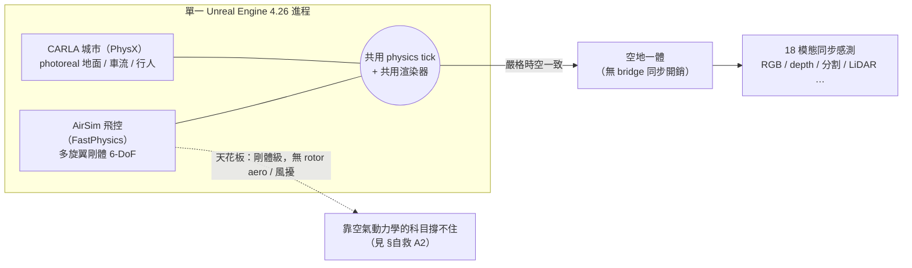
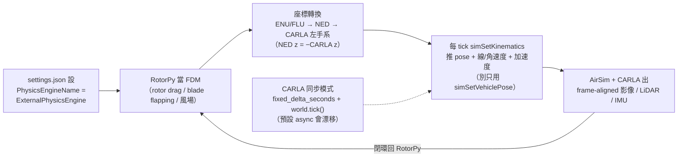

<!-- ontology-5axis output=N/A injection=sim-in-loop-train control=action|trajectory|camera temporal=streaming domain=robotics|driving -->

# CARLA-Air —— 空地一體的城市級模擬 解構

> Tianle Zeng、Yanci Wen、Hong Zhang。arXiv [2603.28032](https://arxiv.org/abs/2603.28032)（v1 2026-03-30 / v2 2026-04-22；cs.RO·cs.AI·cs.CV·cs.HC）。程式碼 [github.com/louiszengCN/CarlaAir](https://github.com/louiszengCN/CarlaAir)（2026-03-19 建立，約 991★，維護中）。專案站 [carla-air.com](https://www.carla-air.com/)。
>
> **為什麼值得收進 aerial-sim 名單**：前面七套 aerial sim（[對比見此](./aerial-sim-stack.md)）拼的是「動力學精度 × 並行吞吐 × 畫面真實感」這個三角；CARLA-Air 不在這個三角裡比，它補的是**所有純空中模擬器都缺的一塊**——把無人機放進一個**有規則車流、有社會化行人、城市級 photoreal** 的世界，而且**空中與地面共用同一個物理 tick、同一個渲染器**。對「低空經濟 / 城市空域 / 空地協同 / 跨視角感知 / 具身導航（VLN-VLA）」這些題目，它是目前最對口的公開模擬基座。它在 ontology 上唯一同時佔住 `domain=robotics`（空中）與 `domain=driving`（地面）兩格——這就是它的真正座標。

## 一句話總結

**CARLA-Air 不是從頭寫的新模擬器——它是一層「組合」：把 Microsoft AirSim 的多旋翼飛控組合進 CARLA 的 Unreal Engine 世界，讓無人機與地面車輛在同一進程、同一物理 tick、同一渲染器裡被嚴格時空一致地共模擬。** 它的賣點**不是**空氣動力學、**也不是**吞吐，而是**城市真實感 + 空地統一**。（⚠ 它**以完整 vendored fork 形式發佈**——README 自稱「只改 3 檔 ~35 行」與 repo 內容不符，這件事對「能不能輕鬆換版本」很關鍵，見 [§自救 B](#自救如何補強--繞過鎖死)。）

但有一顆必須講清楚的星號：**它的飛行動力學就是 AirSim 原封不動的剛體 6-DoF**——論文只說「aerodynamically consistent multirotor dynamics」，**沒有**記載任何 rotor/blade-element 模型、馬達動態、阻力係數、地面效應或風擾建模。所以拿它練「貼地高速、強風、螺旋槳尾流」這類靠空氣動力學的科目，會跟單獨用 AirSim 一樣不夠（見 [generative-aerial-data](./generative-aerial-data.md) 與 [Swift 殘差法](./champion-level-drone-racing.md) 的對照）。它的吞吐也只有 **~20 FPS 單環境**，沒有 GPU 並行多環境、不可微、也沒有任何 sim-to-real 真機實證。把這顆星號看懂，才知道該拿它做什麼、不該拿它做什麼。


*圖：CARLA-Air 的核心 —— 地面 photoreal 與剛體飛控共用一個 tick，換來空地一體；但飛行動力學止於 AirSim 剛體級。*

## 怎麼運作（架構）

核心是「**兩套物理引擎、一個 Unreal 進程**」：CARLA 用 PhysX 管地面車輛與行人，AirSim 用 FastPhysics 管無人機，兩者掛在同一個 Unreal Engine 4.26 渲染迴圈裡。關鍵工程點是**時間與座標的嚴格對齊**——無人機物理跑在獨立 async 執行緒，**預設 ~333 Hz（3 ms；源碼 `SimModeWorldBase.h` 預設值，README 稱 ~1000 Hz 但 vendored 的 `settings.json` 未覆寫）**，渲染約 20 Hz（每出一幀、物理約走 16 步），而 CARLA 左手座標系與 AirSim 的 NED 座標系對齊（README 宣稱 0 m 誤差，`UNVERIFIED`）。

```
   ┌──────────── 單一 Unreal Engine 4.26 進程（渲染 tick ~20 Hz）────────────┐
   │                                                                          │
   │   CARLA 0.9.16 (PhysX)                AirSim 1.8.1 (FastPhysics)         │
   │   ├ 地面車輛 / 行人 / 交通規則         ├ 多旋翼剛體 6-DoF 飛控            │
   │   └ 隨渲染 tick 同步                   └ 無人機物理 ~333 Hz（獨立 async 執行緒）│
   │            └────── 座標對齊：CARLA 左手系 ↔ AirSim NED（誤差 0 m）──────┘ │
   │                              │                                            │
   │                     共用渲染器 + 共用時間軸                               │
   │                              ▼                                            │
   │   最多 18 種同步感測：RGB / depth / 語義+實例分割 / LiDAR / radar /        │
   │                       表面法向 / IMU / GNSS / 氣壓計 …（空地同場景）       │
   │                              │                                            │
   │   對外：CARLA Python API（89/89 測試過）+ AirSim Python API + ROS2（63 topic）│
   └──────────────────────────────────────────────────────────────────────────┘
        把 AirSim 飛控組合進 CARLA 世界（實作為完整 vendored fork，非 README 稱的薄 patch）
```

三個設計選擇決定了它的性格：

- **「組合」而非「重寫」**：它不另造物理、不 fork CARLA，而是把兩個成熟堆疊接起來。好處是**兩邊的原生 Python API 與 ROS2 都零改動可用**（CARLA 89/89 API 測試通過、ROS2 跑 63 個 topic），既有 CARLA 自駕程式碼幾乎能直接搬上來、再加一架無人機；壞處是**它繼承了兩邊的所有侷限**，尤其 AirSim 的剛體飛行模型與「上游已封存（archived）」的版本鎖死問題（**這兩個都能自己補強 / 繞過，見下方 [§自救](#自救如何補強--繞過鎖死)**）。
- **單一 tick 共模擬，而非橋接（bridge）**：很多空地系統用 ROS bridge 把兩個獨立模擬器串起來，代價是同步開銷與時序漂移。CARLA-Air 把無人機直接放進 CARLA 的 Unreal 場景，**省掉跨進程同步**，換來嚴格的空地時空一致——這對「無人機看著地面車流做決策」這類跨視角任務是硬需求。
- **城市真實感免費繼承**：因為渲染器就是 CARLA 的，無人機視角直接拿到 CARLA 的 photoreal 城市（測過 Town01–05、Town10HD 等 13 張城市圖、14 種天氣預設）。這是它相對純空中模擬器最大的單點優勢。

## 五軸定位與同類對手

| 系統 | output | injection | control | temporal | domain | 一句話差異 |
|---|---|---|---|---|---|---|
| **CARLA-Air** | N/A | sim-in-loop-train | action·trajectory·camera | streaming | **robotics + driving** | 唯一空地同 tick + 城市 photoreal |
| AirSim（單獨） | N/A | sim-in-loop-train | action·trajectory·camera | streaming | robotics | 有無人機 photoreal，但無豐富地面車流生態 |
| Flightmare | N/A | sim-in-loop-train | action·trajectory | streaming | robotics | Unity photoreal aerial，無地面交通 |
| Isaac-Pegasus | N/A | sim-in-loop-train | action·trajectory·param | streaming | robotics | Omniverse RTX + PX4，photoreal 但無城市駕駛生態 |
| 基底 CARLA | N/A | sim-in-loop-train | action·trajectory | streaming | driving | 純地面，沒有空中 |

> **Cross-axis 必要說明**（呼應 ontology Check 9b/9c）：CARLA-Air 是模擬器，故 `output=N/A`；它在 `domain` 軸上同時標 `robotics|driving`，是因為它真的把兩個 domain 放進同一場景共模擬——這不是含糊其辭，而是它存在的理由。它沒有用到 `generalist`（非白名單），因此不觸發 Check 9c。

它真正的對手其實不是別的 aerial sim，而是「**任何想同時要城市車流生態 + 空中視角**」的需求方案：要嘛接受 ROS bridge 串兩個模擬器的同步開銷，要嘛用 CARLA-Air 的單 tick 共模擬。

## 強在哪 / 崩在哪

**⚡ 強（真正領先的場景）**

- **空地統一、單一物理 tick**：無 bridge 同步開銷，空中與地面嚴格時空一致——做空地協同、跨視角（cross-view）感知、車-機協作這類任務的首選公開基座。
- **城市級 photoreal 免費繼承**：13 城市圖 × 14 天氣，無人機俯視/斜視城市場景的畫面真實感遠勝純空中模擬器。
- **18 種同步多模態感測**：一個場景同時出 RGB/depth/分割/LiDAR/radar/IMU/GNSS… 對「建多模態資料集、餵感知或具身模型」極友善（搭 [generative-aerial-data](./generative-aerial-data.md) 看資料用途）。
- **零改動復用既有生態**：CARLA + AirSim 雙 Python API + ROS2 全保留，舊程式碼搬遷成本低。
- **讓 archived 的 AirSim 飛控續命**：AirSim 上游 2022 已封存，CARLA-Air 把它的飛控接到一個仍在維護的環境裡——對還在用 AirSim 資產的團隊是一條延壽路。

**❌ 崩（已知失效邊界）**

- **飛行動力學只到 AirSim 剛體級**：無 rotor/blade-element、無馬達動態、無地面效應、無風擾建模。貼地高速、強風、尾流交互這些**靠空氣動力學的科目它撐不住**——這跟單獨用 AirSim 是同一個天花板。
- **~20 FPS、單環境、無 GPU 並行多環境**：論文實測「3 車 + 2 行人 + 1 無人機 + 8 感測器」約 19.8±1.1 FPS（純地面 baseline 28.4 FPS，整合開銷約 30%）。比起 Aerial Gym/Isaac 的數千並行環境，**RL 吞吐低好幾個數量級**；GPU 並行多環境是作者列的 future work，現在沒有。
- **不可微**：別指望 first-order policy gradient / diff-MPC 這條路。
- **無 sim-to-real 實證**：驗證全在模擬內（如 precision landing 誤差 <0.5 m），**沒有任何真機遷移結果**。
- **工程毛邊**：換地圖要**重啟整個進程**；多無人機 >2 雖能跑但未正式驗證；高密度場景效能未充分刻畫（作者標為 active engineering target）。
- **版本鎖死在老堆疊**：UE 4.26 / CARLA 0.9.16 / AirSim 1.8.1，且 AirSim 上游已 archived——長期維護有風險。

## 復現

- 原始碼 + 預編譯二進位都有：Ubuntu 20.04/22.04（HuggingFace / 百度網盤）與 Windows 11 x86_64；版本 v0.1.7（2026-03）。
- 跑得起來的證據：CARLA API 89/89 測試通過、ROS2 63 topic 驗證、RL 流程 357 次 spawn/destroy 零崩潰。
- **License 需自行確認**：README 寫程式碼 MIT + CARLA 資產 CC-BY，但 GitHub 自動偵測回傳 `NOASSERTION`（沒解析出單一 SPDX）。商用前請以實際 LICENSE 檔為準（`UNVERIFIED`）。
- 論文署名單位、以及 README 自稱的「peer-reviewed」皆**未在公開頁面查證**（arXiv 本身是技術報告）——標 `UNVERIFIED`。

## 跨路線綜合

放回本手冊「外觀靠生成、動力學靠物理」的框架：**CARLA-Air 是『物理 + 真實外觀』那層 substrate 的一個特例——特別之處在於它的『場景』不只是地形，而是一個有車流、有行人、有交通規則的活城市。** 因此：

- 對 **pixel-WM / 生成路線**：它是極好的**條件 ground truth 工廠**——空地同場景出 18 模態，可拿 CARLA-Air 的幀＋幾何當條件去餵 [Cosmos](../../foundations/foundation-physics-models/cosmos-wfm.md) 這類 video-WM 做 photoreal 增廣，補足純空中模擬器拿不到的「城市動態背景」。
- 對 **動力學**：它**不解決**空氣動力學問題（那仍是 AirSim 天花板）——要高保真飛行動力學，仍得回到 [RotorPy / 殘差法](./aerial-sim-stack.md) 那條路。它的價值在 domain × 外觀，不在 aero。
- 對 **空地具身 / VLN-VLA**：規則車流 + 社會化行人當無人機的動態背景，是「無人機在城市裡看著人車做決策」這類任務難得的公開資料源。
- 跨冊：它生成的城市空地資料，最終要餵給 Spatial-Handbook 的感知端消費——對齊問題（尤其 IMU 噪聲模型與 camera-IMU extrinsic）見 [Bridge: Aerial Embodiment](../../bridge-to-spatial/aerial-embodiment.md)；它和純空中七套的取捨見 [Aerial Sim Stack 對比](./aerial-sim-stack.md)。

## 自救：如何補強 / 繞過鎖死

§4 兩個侷限（**AirSim 剛體 aero** 與 **archived 版本鎖死**）**都能自己解**。以下路徑均經 vendored 源碼核對（檔案路徑見 §參考）。

### A. 把飛行動力學做高保真

**A2 —— 外掛動力學（★ 最推薦：純 Python、不改 C++、不重編，保真度最高）**

CARLA-Air vendored 的 AirSim 裡**就帶 `ExternalPhysicsEngine` 模式**（`.../physics/ExternalPhysicsEngine.hpp`，它的 `update()` 不做任何積分、只 `updateKinematics()`）。做法四步：

1. `settings.json` 設 `"PhysicsEngineName": "ExternalPhysicsEngine"`；
2. 飛行動力學改跑**你自己的高保真模型**——首選 [RotorPy](./aerial-sim-stack.md)（有 rotor drag / blade flapping / induced drag / 空間風場），或你自己的 6-DoF 積分器、甚至 PX4 SITL HIL；
3. 每個 tick 用 **`simSetKinematics(state, …)`** 把「pose + 線/角速度 + 加速度」推進去——**用這個、別只用 `simSetVehiclePose`**（後者只設 pose，IMU/GNSS/速度 ground-truth 會不一致）；
4. AirSim + CARLA 在那個 pose 出 frame-aligned 的影像 / LiDAR / IMU。

這是 AirSim **官方支援的 FDM 接法**（upstream PR #3626 加入 `ExternalPhysicsEngine`、#4066 加 `simSetKinematics`；官方 **GazeboDrone** 就是用它把 Gazebo 當 FDM、AirSim 只出感測）。把 RotorPy 換成 PX4 SITL 也是同一個接口。


*圖：§自救 A2 —— ExternalPhysicsEngine 把 RotorPy 當 FDM，每 tick 經座標轉換推 state，CARLA 同步模式防漂移。*

**可跑骨架**（API 簽名已對 AirSim / RotorPy / CARLA 源碼核對；座標翻轉是實作定義，標 `UNVERIFIED`，必須自己寫 + 測）：

```python
# settings.json：{ "SettingsVersion": 1.2, "SimMode": "Multirotor",
#                  "PhysicsEngineName": "ExternalPhysicsEngine" }
import airsim
from rotorpy.vehicles.multirotor import Multirotor

client = airsim.MultirotorClient(); client.confirmConnection()
veh   = Multirotor(quad_params)                  # 你的高保真機型參數
dt    = 0.003                                     # FDM 步長 = 無人機更新率
state = {'x': x0, 'v': v0, 'q': [0, 0, 0, 1],     # RotorPy 狀態（世界 z-up）
         'w': w0, 'wind': wind0, 'rotor_speeds': rs0}

# CARLA 同步模式（防空地漂移）
s = world.get_settings()
s.synchronous_mode = True; s.fixed_delta_seconds = dt
world.apply_settings(s)

while True:
    control = controller(state)                   # 你的控制器（cmd_motor_speeds 或 ctbr）
    state   = veh.step(state, control, dt)         # RotorPy 積分一步（solve_ivp）

    # UNVERIFIED：RotorPy(z-up) → AirSim(NED, z-down) 翻轉 + 四元數 [x,y,z,w] → (w,x,y,z)
    #            確切翻轉矩陣是實作定義，自己寫 + 測（RotorPy 僅「z-up」可證、ENU/FLU 軸向未文件化）
    p, q_wxyz, v_ned, w_ned = to_airsim_ned(state)

    ks = airsim.KinematicsState()
    ks.position         = airsim.Vector3r(*p)
    ks.orientation      = airsim.Quaternionr(q_wxyz[1], q_wxyz[2], q_wxyz[3], q_wxyz[0])
    ks.linear_velocity  = airsim.Vector3r(*v_ned)
    ks.angular_velocity = airsim.Vector3r(*w_ned)
    client.simSetKinematics(ks, True)             # ignore_collision 為必填位置參數

    world.tick()                                  # CARLA 同步前進一步
```

> **已核對（VERIFIED，附 PR/源）**：`settings.json` 的 `PhysicsEngineName = ExternalPhysicsEngine`（AirSim docs / GazeboDrone）；`simSetKinematics(state, ignore_collision, vehicle_name='')` + `KinematicsState`（position / orientation / linear_velocity / angular_velocity / ±acceleration）欄位（AirSim `client.py` / `types.py`；upstream PR #4066）；ExternalPhysicsEngine（PR #3626，官方 **GazeboDrone** 即此架構：AirSim 出感測、外部當 FDM）；`Multirotor.step(state, control, t_step)`、state 鍵 `x/v/q/w/wind/rotor_speeds`、control 預設 `cmd_motor_speeds`（亦有 ctbr）（RotorPy `multirotor.py`）；CARLA 同步模式片段（CARLA docs）。
> **未核對（UNVERIFIED，自己定 + 測）**：RotorPy 的 ENU/FLU 確切軸向（只「z-up」可證）、四元數 `[x,y,z,w]` 順序（從源碼強推、非文件明載）、以及 RotorPy↔AirSim↔CARLA 的確切翻轉矩陣（三方 bridge 無任何專案文件化）。

> **三個坑**：① **積分節奏由你掌握**——你的 RotorPy step → `simSetKinematics` 的頻率**就是**無人機更新率，務必開 CARLA **同步模式**（`fixed_delta_seconds` + `world.tick()`），CARLA-Air **預設 async**，不然空地會漂移；② 你**接管了飛控**（`moveByXXX` / simple_flight / PX4 不再飛它，RotorPy 要自己閉環）；③ **座標**：RotorPy 是 ENU/FLU、AirSim 是 NED、CARLA 左手系（關係 `AirSim NED z = −CARLA z`），推進去前要轉。
>
> **為什麼這條最划算**：一個 `settings.json` 開關 + 一段 Python，動力學保真度直接拉到 RotorPy 級，外觀/場景照用 CARLA——這正是本手冊「**動力學靠物理、外觀靠渲染**」的字面落地。

**A1 —— 殘差注入（保留 AirSim 當 nominal、加你的力）**

- **最省力：`simSetWind()`**（RPC 已有，`RpcLibClientBase.hpp:163`）。FastPhysics 原生支援風（風從 quadratic drag 項進去）。**但只給空間均勻的風擾**，不是任意 wrench、也不是 per-rotor gust——做得了均勻風 / 亂流，做不了 ground effect 或 rotor-drag。
- **要真正的殘差力：必須改源碼。** FastPhysics 把淨 wrench 在 `FastPhysicsEngine.hpp` 第 ~359 行組好（`next_wrench = body_wrench + drag_wrench`，drag 是純 `v²`、源碼註明線性項 b≪c 故丟棄），而**全 vendored AirLib 沒有對外施力的 RPC**（grep 過，無 `simAddVehicleWrench` / `applyExternalForce` 之類；`PhysicsBody::setWrench()` 每 tick 被覆寫、外部塞不進去）。加一行 `next_wrench += external_wrench_`（再開一個 RPC 餵它）即可，但要：物理在**獨立 async 執行緒**跑、預設 **~333 Hz**、setter 要 thread-safe，且**得重編這個 fork**（官方 BUILD_GUIDE 自承「极为复杂」：UE4.26 + CARLA ue4-dev + 32 GB RAM + 3–4 h）。
- **真機殘差**：要上真機就走 Swift 式從真飛辨識殘差，見 [sim-to-real-contract](./sim-to-real-contract.md)。

### B. 繞過 archived / 版本鎖死

**先認清一個被 README 掩蓋的事實**：CARLA-Air 的 repo **不是**「3 檔 / 35 行薄整合」——實測它是**完整 vendored fork**（整套 CARLA 源 + 內嵌完整 AirSim plugin，約 2,357 檔，全樹找不到 `CARLAAirGameMode`、`MODIFICATIONS.md` 或任何 diff）。所以「換新版本」是對一個**完整 fork** 動刀、不是套 patch。`UNVERIFIED`：README 的 3-檔/35-行/~1000 Hz/0.0000 m 等說法與 repo 內容不符或無法從源碼證實——引用前自行核。

選項（已用 web 對 GitHub repo / 官方 docs 核對，2026-06）：

| 路線 | UE | License | 維護 | API 相容 | 對 CARLA-Air 的意義 |
|---|---|---|---|---|---|
| **接受凍結（現狀）** | 4.26 | MIT | AirSim 上游已死 | 原樣 | 研究/復現多半 OK、整套可跑可重現——**大多數人該選這個 + A2** |
| **Cosys-AirSim** | 5.5（另有 5.2 LTS 分支） | MIT | **as-is、不主動更新**（明示） | `import cosysairsim as airsim`（呼叫面高度相容、非 100%） | UE5.5 + 豐富研究感測（GPU-LiDAR / echo / instance-seg / annotation）。**但它是獨立 UE、不是 CARLA plugin**——「把 AirSim 接進 CARLA」那層膠水在它身上不存在，**等於重新移植、不是搬運** |
| **Project AirSim** | 5.2 / 5.7 ⚠ | MIT | **唯一主動維護**（前 MS 團隊 / IAMAI，v0.2.0 ~2026-06，DARPA 支持） | **破壞性改版**：`settings.json`→JSONC Scene/Robot config、新 client、官方 API migration 表 | 長期最佳賭注**若你本就要離開舊 API**；代價是重寫 client + config，且**離開 CARLA 道路/交通生態** |
| **CARLA 0.10.0** | 5.5 | MIT | WIP | CARLA API（非 AirSim） | UE5.5 + Lumen/Nanite + 原生 ROS2。**但只有 Town10（+礦圖）**，無 SUMO/Chrono/Vissim 共模擬、無 V2X、無 OpenDRIVE/OSM 匯入、天氣鎖白天、~24–25 FPS；**且 AirSim 飛控沒有 UE5 對應**——仍要自己把飛控移植上 UE5.5 |

**最關鍵的一句**：**沒有任何 version-bump 能原樣保住 CARLA-Air**——它把「CARLA 的 UE4.26 build」和「AirSim 1.8.1 飛控」綁在一起，兩半各自往前走、而**沒有任一目的地同時保住這兩半**。每條現代化路都是**重整合專案、不是升級**：要 CARLA UE5 → 上 CARLA 0.10、丟掉多數城市/共模擬/天氣、且**自己把 AirSim 飛控移植到 UE5.5**；要維護中的 AirSim → 上 Project AirSim、**重寫所有 client + config**、但離開 CARLA 生態。連 CARLA 官方都說 **UE4.26 與 UE5.5 版本會並存**——它自己也預期用戶為了缺的功能留在 4.26。

> ⚠ `UNVERIFIED`：Project AirSim 官方文件寫「UE 5.2 與 5.7」，但 5.7 截至本文非公開引擎版本，疑為前瞻目標或文件筆誤，採用前先以實際 build 驗。CARLA 0.10.0 的 **Traffic Manager 對等狀態**官方未在 release notes 明列（以其功能追蹤表為準）。

**走 A2 解耦後就少依賴 AirSim**，版本鎖的痛跟著小——這也是為什麼 A2 同時是 A 和 B 的解。

**一句話分流**：絕大多數情況 → **接受凍結 + 走 A2**（RotorPy + `ExternalPhysicsEngine` 解耦動力學，純 Python 最划算）；真要徹底現代化 → 認清那是**把兩個 UE5 大型 codebase 重整合的工程專案**，不是 port。

## 參考

- **CARLA-Air**（本篇主體）—— arXiv [2603.28032](https://arxiv.org/abs/2603.28032) · [github.com/louiszengCN/CarlaAir](https://github.com/louiszengCN/CarlaAir) · [carla-air.com](https://www.carla-air.com/) · [HuggingFace papers](https://huggingface.co/papers/2603.28032)
- **基底**：CARLA 0.9.16（自駕模擬）· AirSim 1.8.1（Microsoft，2022 已 archived）· Unreal Engine 4.26
- **同類取捨**：[Aerial Sim Stack 對比](./aerial-sim-stack.md)（純空中七套）· [Generative Aerial Data](./generative-aerial-data.md)（資料用途）

## §8 踩坑日誌

| # | 坑 | 嚴重度 | 來源 | 繞法 |
|---|---|---|---|---|
| 8.1 | **飛行動力學僅 AirSim 剛體級**，無 rotor aero / 地面效應 / 風擾 | 🔴 High | 論文僅稱「aerodynamically consistent」，無 aero 細節 | 高保真飛行動力學另接 RotorPy / NeuroBEM 殘差；CARLA-Air 用於場景與感知 |
| 8.2 | **~20 FPS 單環境、無 GPU 並行多環境** | 🔴 High（RL 規模） | 論文實測 19.8±1.1 FPS；GPU 並行列為 future work | 大規模 RL 走 Aerial Gym/Isaac；CARLA-Air 用於真實感資料與評測 |
| 8.3 | **無 sim-to-real 真機實證**（驗證全在模擬內） | 🟠 Medium | 論文僅報 in-sim precision landing <0.5 m | 真機遷移需自行補殘差辨識（參 Swift），別假設零樣本 |
| 8.4 | **換地圖要重啟整個進程**；多無人機 >2 未正式驗證 | 🟠 Medium | repo README / issues | 場景批次設計避免頻繁切圖；多機需自行壓測 |
| 8.5 | **版本鎖 UE4.26 / CARLA0.9.16 / AirSim1.8.1，且 AirSim 上游已 archived** | 🟠 Medium（長期維護） | GitHub repo 依賴 | 接受凍結 + A2 解耦；現代化對比見 [§自救 B 矩陣](#自救如何補強--繞過鎖死)（每條都是重整合非升級） |
| 8.6 | **不可微** | 🟡 Low | 論文無可微分宣稱 | 需梯度走 crazyflow（JAX）等可微基座 |
| 8.7 | **License 自動偵測 NOASSERTION**（README 稱 MIT+CC-BY） | 🟡 Low | GitHub API vs README 不一致 | 商用前以實際 LICENSE 檔為準 `UNVERIFIED` |
| 8.8 | 署名單位與「peer-reviewed」**未公開查證** | 🟡 Low | arXiv 技術報告 | 引用時標 `UNVERIFIED`，勿當已發表期刊 |
| 8.9 | **README 數字與 repo 源碼不符**：自稱「3 檔/35 行薄整合 + CARLAAirGameMode」但實為完整 vendored fork（無該檔/diff）；「~1000 Hz」實為 ~333 Hz（`SimModeWorldBase.h` 預設 3 ms）；「0.0000 m/89-89/18 模態」皆論文/README 宣稱 | 🟠 Medium（影響「能否輕鬆換版本」判斷） | clone repo 全樹核對（見 [§自救 B](#自救如何補強--繞過鎖死)） | 以源碼為準；重接新版本是對完整 fork 動刀、非套 patch |
