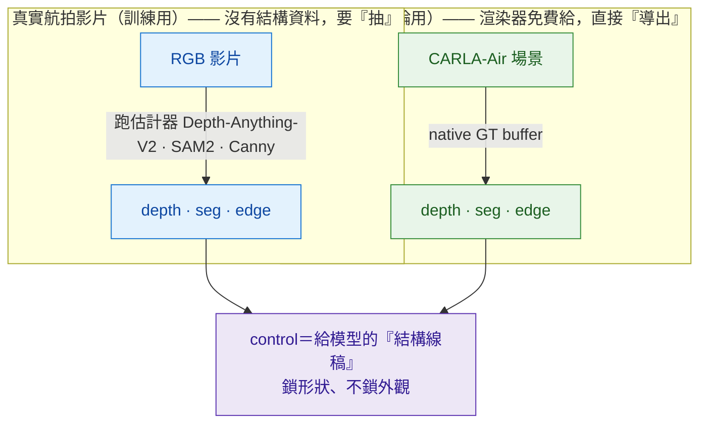
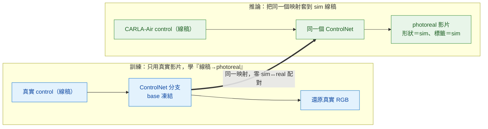
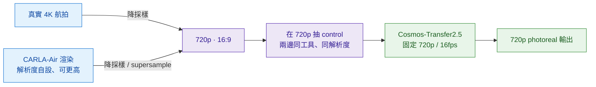
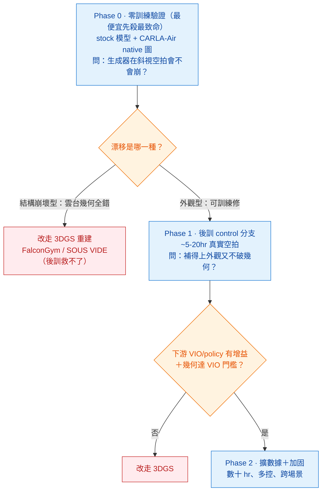
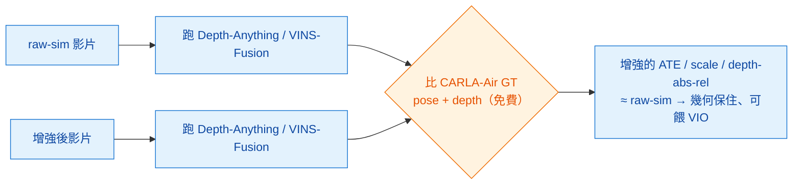
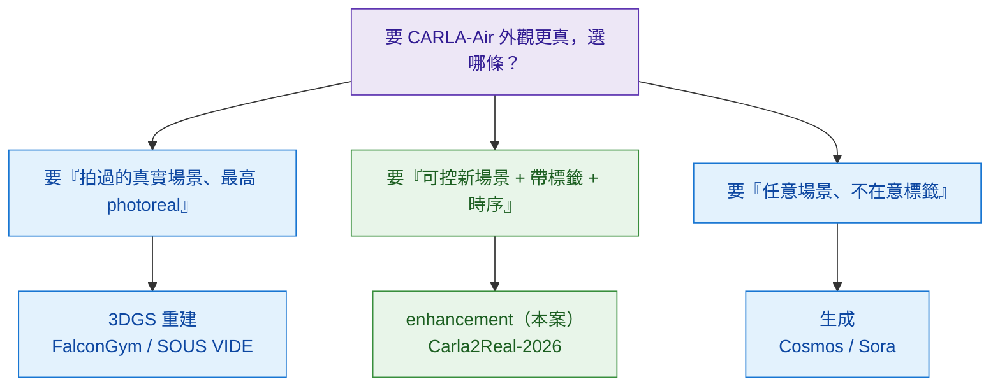

<!-- ontology-5axis output=pixel-video injection=data-only control=multi temporal=clip-parallel domain=robotics|driving -->

# Carla2Real-2026 —— 把 CARLA-Air 升 photoreal 的研發路線

> 這頁是 [CARLA-Air 解構](./carla-air.md) 裡「把外觀邊升 photoreal」的**完整研發展開**：把「後訓練一個開源 video model、把 CARLA-Air 的遊戲引擎畫面升成真 photoreal」整套**講深 + 給路線圖 + 給圖**。
> **這頁講原理 / 選型 / 資料 / 路線 / 風險 / 驗證 / 定位（不放 code）**；要可執行的命令骨架、spec、成本、幾何 harness，見 [carla-air §建置 playbook](./carla-air.md)。

## 一句話

把 CARLA-Air 的 sim render（**有完美標籤、但「看起來假」**）→ 後訓練一個結構-ControlNet video diffusion → 輸出 **photoreal 影片、標籤原封保留、時序一致**。它攻的是一個確認的空缺：**aerial 的 sim→real 影片增強至今沒人做**（學界全在駕駛）。

## 1. 原理：control 是「結構線稿」

### control 到底是什麼

一個只吃文字 prompt 的擴散模型是個自由畫家：prompt 鎖「**看起來像什麼**」（晴天城市、photoreal），但**沒東西鎖「東西在哪」**。**control** 就是補上那條空間軌道——一張 depth / segmentation / edge 圖，作用像**填色本下面的線稿**：鎖死幾何與佈局（路的邊界、車的輪廓、樓的邊），畫家只能在線內挑 photoreal 的顏色。機制是 **ControlNet**（Zhang et al. ICCV 2023 `2302.05543`）：複製凍結的擴散骨幹、用 **zero-init 卷積**把空間圖嫁接進去，不破壞十億張圖的先驗。嚴格版的線稿比喻——**純文字從整個流形採樣、control 把採樣限制在「結構吻合」的那層薄子流形**。文字條件語意、control 條件**座標**。

*圖：**「control 抽取」是什麼**——真實影片沒有結構資料，要用估計器「算出」depth/seg/edge（＝抽取）；CARLA-Air 是渲染器，結構是免費 GT，直接「導出」。兩條路都產生同一種東西：給模型的結構線稿。*

### 為什麼不用配對（train-on-real / infer-on-sim）

關鍵的優雅：**control 是從真實 RGB 自己抽出來的**。所以訓練時模型只看「（真實 RGB 抽的 control）→（同一張真實 RGB）」——兩半來自同一幀真實影像，**全程沒有 sim、不用人工配對**，它只學一個映射：**結構 → photoreal 外觀**。推論時把 **sim 自己的** depth/seg/edge 餵進這同一個映射。**系統裡從頭到尾不存在任何 sim↔real 對應。** 這跟 2024 的 EPE / Carla2Real 本質不同——EPE 沒有乾淨的「結構→外觀」映射，它跑 **unpaired GAN**，靠判別器把增強後 sim 影像的**分布**拉近真實影像的分布、還要對抗佈局分布不匹配；ControlNet 直接繞開分布對齊，只在真實資料上學一個條件生成器再重用。

*圖：標籤為什麼免費保留——輸出跟著 control 走，而 CARLA-Air 的 depth/seg 本身就是標籤，所以增強後的影片幾何/標籤跟 sim 一模一樣，只是畫面變真。*

### 軟硬之別：最關鍵的取捨（Consistency–Realism Dilemma）

標籤雖免費保留，但「保得多硬」是核心難處。EPE 用 **LPIPS 硬鎖**結構——幾何**保證**不動。ControlNet 是 **control_weight 軟約束**——幾何只是被**鼓勵**。這就生出 **一致性–真實性兩難**（Driving-with-DINO `2602.06159` 原話）：**low-level 訊號（edge/blur）精準保結構、但 bake 進合成感**；**high-level 先驗（depth/semantic）給真實感、但丟結構細節**。所以 `control_weight`（與 CFG）是個 **bias–variance 式旋鈕**：調高＝忠於結構但合成感重、多樣性低；調低＝真實但**漂移、hallucinate 脫離結構**。實證（`2511.14719`）：CFG 拉到 11 真實感升到 57.8%，但**小物件對齊持續下滑、LPIPS 從 0.36 惡化到 0.45**，最後取 CFG=7 折中。**這就是 #6 風險（軟控漂移）的根。**

> **兩個分布必須對齊**：真實端抽的 control 與 sim 端餵的 control 必須來自**同一個過程/表徵**，否則映射被 off-distribution 查詢、橋就斷（例：訓練用 MiDaS 相對視差、推論餵 CARLA 度量 z-buffer，數字意義不同 → 模型沒看過、要嘛忽略要嘛扭曲幾何）。所以實務上兩邊跑**同一估計器**，或把 sim native buffer **重映射**成估計器的表徵。

### 時序：為什麼非 video 不可

2024 Carla2Real 是 **per-frame**（EPE 式逐幀獨立增強）——每幀重擲外觀決策 → **flicker**，下游靠時序線索的感知/policy 訓練直接不可用。**video** 擴散先驗自帶 **3D／時空注意力**，把「結構→外觀」**整段聯合解**：同一棟樓還是同一棟。這是 2026 路線相對 2024 的本質升級。

## 2. 選型：用哪個開源 video model

| 角色 | 模型 | 為什麼 |
|---|---|---|
| **首選** | **Cosmos-Transfer2.5-2B** | 唯一 **purpose-built** sim→real 多模 ControlNet、**唯一有 shipped 的 depth/seg control 後訓 recipe**、開源可商用、2B 單卡 |
| Apache 替代 | Wan2.2 + VACE | 最大 LoRA/ControlNet 生態；官方訓練碼未釋出 |
| 省算力 | CogVideoX-2B / LTX-Video | 單卡可後訓、LTX 近即時 |

> **Cosmos 3 要不要等？→ 不等，現在上 Transfer2.5。** Cosmos 3 已 **2026-06-01 上市**、宣稱用單一 MoT 統一 Transfer/Predict/Reason/Policy，但**至今無 shipped 的 control 後訓 recipe**、最小 Nano 也 16B（vs 2B）。做法：把「control 影片生成」抽象成介面讓 backend 可換、**先 pin/vendor Transfer2.5 checkpoint 到本地**，Cosmos 3 control recipe 真 ship 再評估遷移。

## 3. 資料策略（細節見 [carla-air §資料準備](./carla-air.md)）

你要準備的只有**一堆真實航拍影片**——**不用配對、不用標註**（control 是算出來的，真實影片可裸素材）。來源優先：**① Autel 自拍**（最對口、商用乾淨）> ② 公開（**UAVid/VisDrone 是 CC-BY-NC-SA 學術限定不能商用**；**MAVREC CC-BY 可商用但只 ~2.5hr**；**AeroScapes 是 Autel Robotics 自家合作建的、但只靜圖**）> ③ CARLA-Air render（免費自生）。量：**零後訓 0 / LoRA 10–50 clip / 分支 數十 hr**。商用乾淨的真實航拍**影片極稀缺 → Autel 該自拍 ~20–50 hr**。

### 解析度怎麼對齊（常見誤會：720p 是模型規格，不是 CARLA-Air 的上限）

*圖：高解析度真實影片、CARLA-Air 渲染、control 抽取，全部先 resample 到 720p、對到 16:9 才進模型——它們在 720p 會合，所以「真實很大 vs sim 720p」沒有 mismatch。*

- **720p（1280×720）是 Cosmos-Transfer2.5「模型」鎖死的工作解析度**（video diffusion 在固定解析度上訓練、輸入輸出都 720p）；**不是 CARLA-Air 的上限**——CARLA / AirSim 相機解析度是你自設的（`image_size_x/y` / settings.json），要 1080p / 4K 都行（只受 GPU 限制）。
- **原則：碰模型前一切先 resample 到 720p。** 真實 4K → 降採樣 720p；CARLA-Air → 渲 720p（或更高再降）；**control 兩邊都在 720p 抽**（同工具、同解析度，否則每像素的邊緣密度 / 深度梯度統計不一致 → 橋斷）；都對到 **16:9**。高於 720p 的細節模型用不到、直接丟——**不虧**（enhancer 學的是外觀分布、不是微細節；下游感知 / VIO 也多在中等解析度跑）。
- **Trick**：CARLA-Air 渲在 1440p / 4K **再降到 720p ＝ supersampling**，給模型**更乾淨、去鋸齒**的輸入（勝過直接渲 720p）；真實 4K→720p 本身就是 supersample。
- **真要 >720p 輸出**：Transfer1 有 4K upscaler 變體（2.5 是否含 `UNVERIFIED`）/ tile-patch 推論（有接縫＋時序成本）/ 事後接 video super-resolution；但**預設 720p 通常就夠，別為了解析度先把流程搞複雜**。

## 4. 研發路線圖：三階段 go/no-go

**核心原則：用最便宜的問題，先殺掉最致命的不確定性。** 最大的風險不是「選哪種 control」，而是「**生成器在傾斜空拍視角下會不會直接崩**」——這個答案**不需要任何訓練或資料**就能取得，所以排第一。

*圖：每一階段都是下一階段的閘門，不准跳階押訓練。Phase 0 用 0 資料先驗「崩不崩」；崩壞型直接轉 3DGS（後訓不會救），外觀型才值得花資料後訓。*

- **Phase 0**（低成本，純推論）——問「stock 模型在 sim 原生圖的斜視空拍下還能用嗎」；**kill**：結構崩壞且 depth 與 control 系統性脫鉤 → 3DGS。
- **Phase 1**（中成本）——問「~5–20hr 真實空拍後訓能補外觀又不破幾何嗎」；go 標準＝**下游（非肉眼）出現可量測增益**；**kill**：幾何漂移未降到 VIO 門檻 → 3DGS。
- **Phase 2**（高成本）——擴資料/多控/跨場景；**kill**：邊際增益遞減且資料成本超過自建 3DGS。

## 5. R&D 風險登記表

| # | 風險 | 可能性 | 衝擊 | 緩解 | 早期訊號 |
|---|---|---|---|---|---|
| a | **生成器在斜視空拍 OOD**（比 control 選擇更致命） | 高 | 極高 | Phase 0 零訓練先測、先用 sim 原生圖隔離域變數 | stock 輸出屋頂線/地平線結構崩、控制脫鉤 |
| b | **幾何/metric 漂移 → 非 VIO 可用**（最大未知） | 高 | 極高 | 用 depth-reprojection 一致性當主指標、非 FID | reprojection error 隨幀累積；無空拍 benchmark 可證（`UNVERIFIED`） |
| c | CARLA-Air 空拍 sensor capture 工程缺口（未隨附） | 確定 | 中 | 列為 Phase 0 前置工程，先驗 native 圖 | capture 排期延宕、GT depth/pose 對齊出錯 |
| d | 商用乾淨空拍**影片**稀缺 | 高 | 高 | 以自採為主、MAVREC 補 | 達不到 5–20hr 商用乾淨門檻 |
| e | Transfer2.5 退場 / Cosmos-3 churn | 中 | 中 | 押有 shipped control recipe 的 Transfer2.5、抽象 backend | Cosmos-3 已上市但無 control recipe |
| f | **soft-control label drift** | 中 | 中 | 優先用 sim native GT、別在 sim RGB 上跑估計器 | 估計 depth 與 GT 系統性偏差 |

## 6. 驗證：幾何保真怎麼證（#1 風險 → 研究貢獻）

#1 風險是「增強把幾何弄漂了 → 影片不再 metric 可用、餵不了 VIO/policy」，而**沒有任何 aerial benchmark 證過它 metric 上還行**。CARLA-Air 免費給 **GT pose（IMU/GNSS）+ GT depth**，正好讓兩條硬指標直接能做：

*圖：決定性判準——對 raw-sim 與增強影片各跑一次 depth（Depth-Anything 比 GT 的 abs-rel/δ<1.25）＋ VIO（VINS-Fusion 比 GT 的 ATE+scale）；增強的數字 ≈ raw-sim 的，幾何就保住了。工具細節見 [carla-air §幾何 harness](./carla-air.md)。*

> **這正是研究貢獻所在**：現有增強論文（EPE / Carla2Real / Cosmos-Transfer）**只用語意分割保持或特徵相似度驗證，沒有人發過 depth-vs-sim-GT 的 abs-rel、或增強影片上的 VIO ATE+scale**。把 #1 風險反轉成貢獻。

## 7. 戰略定位：四條路線中的一個選擇

*圖：enhancement 不是唯一解、是**策略選擇**。它**唯一同時拿到「保留 sim 標籤 + 可控新場景 + 時序影片」三件**；3DGS 給不了新內容、生成給不了可靠標籤。要最大化重現一段真飛過的場景 → 3DGS；要大量可控、帶 GT 標籤的多樣空中影片 → enhancement。*

**競爭版圖**：外觀增強研究**高度集中於駕駛域**（EPE 2021 → Carla2Real 2024 → Cosmos-Transfer 2025 → Driving-with-DINO 2026）；**aerial 端是確認的空缺**（空中文獻全在 3DGS 重建或文生影片）。一個 **aerial-first 增強器即佔據無人區**。

## 8. 研究貢獻 + 對接前沿

- **(a) 首個 aerial 域 sim→real 影片增強器**（空缺已核實）。
- **(b) 幾何/metric 保持驗證**（§6）——沒人發過，把 #1 風險變貢獻。
- **(c) 用 CARLA-Air 免費 GT pose+depth 當驗證 oracle**——只有 sim 來源才有的不對稱優勢（駕駛端真實資料拿不到逐幀 GT）。

論文框架：「**不只增強外觀，還證明增強不破壞幾何**」——機器人場（CoRL/ICRA/IROS，賣下游 VIO/policy 可用性）或視覺場（CVPR/WACV，賣首個帶幾何保證的 sim→real 影片增強 benchmark）。對接本手冊 [研究前沿](../../frontier/overview.md)：直擊 **#4 物理評測**（把「好看」變「可量測的幾何保真」，見 [evaluation-physics](../../foundations/evaluation-physics/overview.md)）與 **#5 sim2real domain gap**；在「外觀供給三線」上是「渲染供標籤 → 增強供真實感 → 驗證供信任」的交匯。

## 參考

- **原理**：ControlNet `2302.05543` · EPE `2105.04619` · Carla2Real(2024) `2410.18238` · Consistency-Realism Dilemma（Driving-with-DINO）`2602.06159` · soft-control 漂移實證 `2511.14719`
- **模型/平台**：Cosmos-Transfer1 `2503.14492` · Cosmos-Transfer2.5 `2511.00062` · Cosmos 3 `2606.02800`（2026-06-01 上市）
- **aerial 對照**：FalconGym `2503.02198`（2.0 `2510.02248`）· SOUS VIDE `2412.16346` · FlightDiffusion `2509.14082`
- **建置細節（命令/spec/成本/harness）**：[carla-air §建置 playbook](./carla-air.md)
