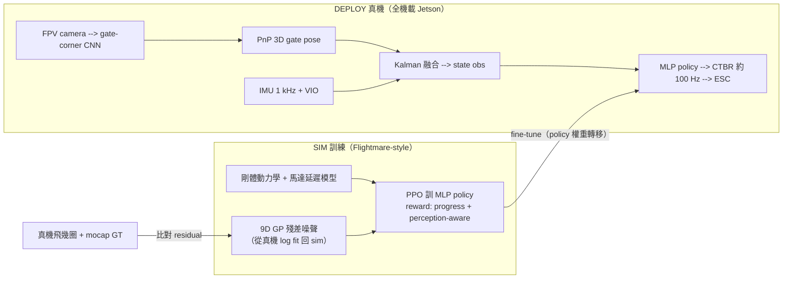

<!-- ontology-5axis output=action-seq injection=sim-in-loop-train control=action|trajectory|image-init temporal=streaming domain=robotics -->

# Swift — Champion-Level Drone Racing (UZH RPG, Nature 2023)

> Anchor 解構 · aerial-sim 的 canonical sim-to-real 案例。
> 領域註記：aerial 在本 ontology 算 `robotics` 子類；Swift 端到端輸出 collective-thrust + body-rates（`action-seq`），輸入是 onboard camera + IMU，所有感知與控制都跑在機載 NVIDIA Jetson 上。
> 前向連結：與 `overview.md`（aerial-sim use case 總圖）並寫；若該檔尚未落地，本篇先佔位。

## 1. 一句話總結

Swift 是 **第一個在實體頭對頭比賽中擊敗人類世界冠軍的自主無人機系統**（Kaufmann, Bauersfeld, Loquercio, Müller, Koltun, Scaramuzza, _Nature_ **620**, 982-987, 2023 年 8 月 30 日, DOI [10.1038/s41586-023-06419-4](https://doi.org/10.1038/s41586-023-06419-4)）。


*圖：sim↔real 的接縫 —— policy 在 sim 訓，靠「真機殘差 fit 回 GP 噪聲」補 gap，部署全跑機載*
它不是又一個 academic benchmark — 是把「sim-only RL policy 飛到能在真實 4×4 m 賽道上、贏 Alex Vanover (Drone Racing League 2019 champ)、Thomas Bitmatta (MultiGP champ)、Marvin Schaepper」三位世界冠軍級飛手的 **end-to-end 證據**。先前的缺口很具體：(a) 之前 UZH 自家 2019 AlphaPilot/sim2real_drone_racing 線是 zero-shot sim→real 但只飛固定路徑、無對抗；(b) Lockheed AlphaPilot 是 mocap-assisted，不算「機載自主」；(c) classical MPC racing 路線（Foehn et al. 2021, Time-Optimal Planning）能算出 minimum-time trajectory 但要 ground-truth state、不能跑機載；Swift 把這三個缺口一次填平。對本手冊的意義：Swift 是 **`sim-in-loop` × `streaming` × `action-seq` × `robotics`** 這個座標點目前最乾淨的 anchor — 它是 aerial-sim 路線「能 close-loop 出真實 super-human policy」的 existence proof。

## 2. 核心機制

兩個模組：**Perception** 把影像 + IMU 壓成 low-dim state observation；**Policy** 把 state 映到 collective-thrust + body-rates 三軸（CTBR，與人類飛手 stick input 同層級）。Policy 在 Flightmare-like sim 用 PPO（model-free on-policy RL）訓練；sim-to-real gap 不是靠 domain randomization 撐過去，而是先實機飛幾圈、拿 mocap ground truth 跟 onboard VIO/gate detector 比對 residual，**fit 一組九維 1D Gaussian Process** 把感知雜訊建模回 sim，再 fine-tune policy（"empirical noise model" 路線）。

```
                  TRAINING (sim)                          DEPLOY (real, onboard)
  ┌───────────────────────────────┐         ┌──────────────────────────────────┐
  │ Flightmare-style sim          │         │  Camera (FPV) ──► Gate-corner CNN│
  │   ├─ rigid-body dynamics      │         │           │           │           │
  │   ├─ motor delay model        │         │           ▼           ▼           │
  │   └─ residual VIO/gate noise  │         │       IMU 1 kHz   2D corners     │
  │       (9D Gaussian Process    │         │           │           │           │
  │        fitted from real logs) │         │           ▼           ▼           │
  │              │                │         │       VIO ───► PnP 3D gate pose  │
  │              ▼                │         │           │           │           │
  │ State = [pose, vel, gate-rel  │         │           └─────┬─────┘           │
  │           future K gates]     │         │                 ▼                 │
  │              │                │         │      Kalman fuse → state obs     │
  │              ▼                │         │                 │                 │
  │   PPO (MLP policy, on-policy) │ ──fine─►│      MLP policy (~2-layer)       │
  │   Reward: progress + safety   │  tune   │                 │                 │
  │           + perception        │         │                 ▼                 │
  │             observability     │         │     Collective thrust + body     │
  └───────────────────────────────┘         │     rates @ ~100 Hz → ESC        │
                                            └──────────────────────────────────┘
```

關鍵巧思在 reward shaping：除了 progress reward（沿軌道弧長），還加了 **perception-aware** 項，懲罰把賽門推出 FOV 邊緣 — 這逼 policy 自己學會「轉向時先看下一個 gate」，類似人類飛手的 head-on attitude。沒有這項，policy 會 exploit sim 中的 perfect state，到真實機就因為 VIO drift 撞門。

## 3. 五軸定位 + 同軸對手

| Axis | **Swift** | DJI Avata autopilot | Foehn et al. MPC (RA-L 2021) | UZH sim2real_drone_racing (2019) | EVA-Drone / SkyDreamer line |
|---|---|---|---|---|---|
| Output | `action-seq`（CTBR @ ~100 Hz） | CTBR（PID + waypoint） | `trajectory` 再 track | `action-seq`（end-to-end CNN） | 透過 latent-WM 的 `action-seq` |
| Injection | **`sim-in-loop` + empirical noise model** | 手調 + 飛行測試 | 解析模型 + identification | `sim-in-loop`（domain rand） | `sim-in-loop` + learned dynamics |
| Control | `image-init`（FPV）+ implicit gate-traj + IMU | GPS + 障礙地圖 | full state + waypoint list | 僅影像 | 影像（model-based RL） |
| Temporal | `streaming`（control loop，無 rollout） | `streaming` | `streaming`（MPC horizon ~1 s） | `streaming` | `latent-rollout` + streaming |
| Domain | `robotics`（aerial racing） | `robotics`（consumer aerial） | `robotics` | `robotics` | `robotics` |

要點：Swift 跟 Foehn-MPC 在物理 fidelity 上接近，**真正的 USP 在 Axis 2 與 Axis 3** — Foehn 要 mocap state，Swift 只要機載 VIO + gate detector，因此它是第一個把「physics-aware RL policy + 機載感知」整鏈 close 起來的方法。對比 DJI Avata 商業 autopilot，Swift 速度高一個量級但功能極窄；對比 SkyDreamer / 後續 model-based RL 線（arXiv 2510.14783, 2025），Swift 是 model-free，sample efficiency 差但 deploy 穩定。

## 4. 強在哪 / 崩在哪

⚡ **強在哪**
- **Canonical sim-to-real success**：論文報告 Swift 在 best lap time 上比最佳人類飛手快 0.5 秒，並在 25 場頭對頭比賽贏 15 場（vs Vanover/Bitmatta/Schaepper 合計）。這是 aerial domain 第一次在 **同一物理賽道、同一規則** 下達成。
- **Onboard 全部跑得動**：所有感知、定位、policy inference 都在機上 Jetson 跑，無外部 mocap、無 offboard compute。這把 Foehn-MPC 那條「fast but mocap-bound」路線打通到真實 racing 條件。
- **Reward shaping 範式**：perception-aware reward 是 generalize 出去的核心 trick，後續 UZH 系列工作（agile_autonomy、learned IMU odom）都繼承這個 idea。

❌ **崩在哪**
- **Lighting OOD**：論文與 IEEE Spectrum 後續報導都明確：訓練/校準資料幾乎都在**夜間 hangar**收集（"you can switch on the lights and you have the same conditions every time"）。Saturday morning 比賽日陽光從天窗射入時，「the vision-based drones are not performing as well as they did the night before, regularly clipping the sides of the gates and spinning out of control」 — 直接引用 IEEE Spectrum。比賽當天決賽的部分回合是在受控光照下重打。
- **單賽道、單機種**：empirical noise model 是 per-track / per-drone 量身定做的；換賽道要重新跑校準 flight。這跟 generalist VLA 是兩條路。
- **Gate-centric scope**：policy 強依賴 gate-corner CNN — 沒有 gate 的場景（free-flight、avoidance）直接退化。UZH 後續 agile_autonomy 線才開始補這塊。
- **無 contact / 無近碰撞處理**：論文把賽道接觸視為 terminal failure（不嘗試 recovery）。對比真實飛手能 brush gate 後修正姿態，Swift 是「碰到就掉」。
- **不對抗對手**：雖然叫「head-to-head」，policy 沒有把對手 drone 當 observation；race 是 time-trial 並行，不是 strategic blocking。社群（含 MonoRace 後續論文）也明確指出這點。

## 5. 復現

**重點：Swift 本身 (policy weights + race-specific empirical models) 並未開源**。Nature 論文 + supplementary 是 full method 描述；UZH RPG 開源的相關鏈條：

- [`uzh-rpg/agilicious`](https://github.com/uzh-rpg/agilicious) — open hardware + software stack（IROS 2022 Science Robotics 同團隊），是復現 Swift 等級飛行的 baseline 平台（CTBR 控制接口、onboard 計算、~30 g 規格）。
- [`uzh-rpg/agile_flight`](https://github.com/uzh-rpg/agile_flight) — sim + RL training infra（Flightmare 衍生），三層 control abstraction（SRT / CTBR / LINVEL），可重跑 obstacle-avoidance 與 racing 任務。
- [`uzh-rpg/sim2real_drone_racing`](https://github.com/uzh-rpg/sim2real_drone_racing) — 2019 年前作 zero-shot sim2real，不是 Swift 但是同 lab 路線起點。
- [`uzh-rpg/learned_inertial_model_odometry`](https://github.com/uzh-rpg/learned_inertial_model_odometry) — RA-L 2023，是 Swift 之後對 VIO 漂移問題的延伸。

最小可跑路徑：在 Flightmare 上用 PPO 訓 CTBR policy → 用 Agilicious 平台部署 → 如果要復現 sim2real noise model，需自備 mocap 室或高精度 GPS RTK。GPU 預算：訓練 ~1 GPU-day（PPO MLP 規模）；最大成本不是 compute 而是 **mocap 校準 flight 與物理 drone 維修**（crash 多）。

典型踩坑：
- Body-rate command rate 與 ESC 回應 delay 沒 model 進 sim → policy fine-tune 不收斂。
- Gate-corner CNN 在 motion blur 下 false negative；Swift 用 PnP + Kalman fuse VIO 補；忽略 PnP 噪聲會讓 policy 在過彎 high-rate 段失準。
- 全程在自家賽道收 noise model — **不能換場地直接 deploy**，這是 sim-in-loop 路線本質限制。

## 6. 跨路線綜合 — Swift 對應其他四條路線

| Line | 對應位置 |
|---|---|
| pixel-WM ([Sora](../../foundations/video-world-models/sora.md)/[Veo](../../foundations/video-world-models/veo.md)/[Cosmos-Predict](../../foundations/foundation-physics-models/cosmos-wfm.md)) | Swift 完全不出 pixel；但 Cosmos-style WM 反過來可當 Swift 的「sim renderer」候選 — 取代 Flightmare 的 GPU 渲染，給 policy 更真實的 motion blur / lighting。bottleneck 是 latency（Cosmos 不是 streaming sim）。 |
| latent-WM ([DreamerV4](../../foundations/latent-world-models/dreamer-v4.md) / [V-JEPA-2](../../foundations/latent-world-models/v-jepa-2.md)) | SkyDreamer (arXiv 2510.14783, 2025) 已做 — model-based RL 用 world model latent 出 control。比 Swift 更 sample-efficient 但 deploy 穩定性待證。 |
| diff-sim (Brax/[MJX](../../foundations/differentiable-simulators/mujoco-mjx.md)/[Genesis](../../foundations/differentiable-simulators/genesis.md), and [Aerial Gym](../../foundations/differentiable-simulators/aerial-gym.md) as drone-specific GPU sim) | Swift 沒用 differentiable sim，PPO model-free。後續「Learning on the Fly: Rapid Policy Adaptation via Differentiable Simulation」(2025) 已示範用 diff-sim 在線適配，是 Swift 的自然延伸。 |
| neural-surrogate ([FNO](../../foundations/neural-surrogates/fno.md) / [GraphCast](../../foundations/neural-surrogates/graphcast.md)) | aerial domain CFD 還沒 close 進 control loop（rotor airflow 是極端 multi-scale）。短期內不接。 |

最關鍵的 cross-line 命題：**bottleneck 是 sim fidelity 還是 RL alg？** Swift 的答案接近「fidelity」 — 它在 RL 端用 standard PPO 就贏冠軍，但花了一整套 empirical noise model 才把 sim-to-real gap 補上。這跟 NVIDIA / Wayve / 1X 把 pixel-WM 當 "renderer 升級" 的賭注一致：先把 sim 視覺與動力學變真，policy 端 method 不必太花俏。

## 7. 參考

主要文獻
- Kaufmann, E., Bauersfeld, L., Loquercio, A., Müller, M., Koltun, V., Scaramuzza, D. _Champion-level drone racing using deep reinforcement learning._ **Nature** 620, 982-987 (2023). DOI: [10.1038/s41586-023-06419-4](https://doi.org/10.1038/s41586-023-06419-4). Published 30 Aug 2023. Open access via [PMC10468397](https://www.ncbi.nlm.nih.gov/pmc/articles/PMC10468397/).
- UZH RPG 專案頁：[rpg.ifi.uzh.ch/research_drone_racing.html](https://rpg.ifi.uzh.ch/research_drone_racing.html).
- UZH 新聞稿：[news.uzh.ch/.../Drone-race.html](https://www.news.uzh.ch/en/articles/media/2023/Drone-race.html) (30 Aug 2023).

次要 / 經驗來源
- IEEE Spectrum, Evan Ackerman, "Superhuman Speed: How Autonomous Drones Beat the Best Human Racers" — 第一人稱 Swift 比賽報導；記錄了 lighting failure mode。
- ScienceDaily 30 Aug 2023 / EurekAlert / SiliconRepublic — 解禁日新聞稿，數字上可靠。

相鄰 / 背景
- Song, Y. et al. _Flightmare: A flexible quadrotor simulator._ CoRL 2020 — Swift 延伸的 sim backbone。
- Foehn, P. et al. _Time-optimal planning for quadrotor waypoint flight._ RA-L / Science Robotics 2021 — classical MPC racing baseline。
- Loquercio, A. et al. _Learning High-Speed Flight in the Wild._ Science Robotics 2021 — UZH agile_autonomy 線。
- Kaufmann, E. et al. _Beauty and the Beast: Optimal Methods Meet Learning for Drone Racing._ ICRA 2019 — UZH RPG 前作，結合 classical + learned。
- SkyDreamer (arXiv [2510.14783](https://arxiv.org/abs/2510.14783), 2025) — model-based RL 後繼工作。
- MonoRace (arXiv 2601.15222, 2026) — monocular Swift-style follow-up。

## 8. §8.x 踩坑日誌

| # | 嚴重度 | 問題 | 來源 | 解法 |
|---|---|---|---|---|
| 8.1 | High | **Lighting OOD** — 日光從天窗進入使 gate-corner CNN false negative，policy 撞門 | 論文 §"Limitations"; IEEE Spectrum interview quote | 限定夜間/受控光；race-day 改為夜間決賽；長期需 domain randomize lighting 或換 event-camera |
| 8.2 | High | **Per-track empirical noise model** — 換賽道要重新跑 mocap calibration flight | 論文 §"Methods, residual model"; supplementary | 接 online adaptation（後續 diff-sim 路線）或用 VIO drift-bound 較緊的硬體 |
| 8.3 | Medium | **Gate-only scope** — 無 gate 場景 policy 退化 | 觀察結論；agile_autonomy 為補洞而生 | 換 task formulation 或加 free-flight head |
| 8.4 | Medium | **Crash = terminal** — 無 recovery / brush-and-continue 能力 | 論文 experimental protocol | 加 recovery sub-policy，或在 sim reward 加 graceful-failure 條件 |
| 8.5 | Medium | **Non-strategic head-to-head** — 對手 drone 未進 observation | 論文 task spec; MonoRace 指出 | 加多 agent obs；目前無 public follow-up close 此 gap |
| 8.6 | Low | **VIO 漂移在連續 high-rate 過彎累積** — perception-aware reward 部分緩解但不徹底 | UZH 後續 RA-L 2023 learned IMU odom 論文 | 換 learned inertial model / event-camera |
| 8.7 | Low | **Sim CFD 缺失** — rotor downwash / 多機氣流互擾未 model；race 中對手 drone 後方紊流影響未量化 | aerial domain 通病；論文未討論 | 跨 line：等 neural-surrogate CFD 成熟接入 |
| 8.8 | Low (open) | **Code/weights 未開源** — 只有 paper + supplementary | UZH GitHub 列表清查 | 用 Agilicious + agile_flight 自行復現；非全 fidelity |

[TBD: 驗證 8.1 IEEE Spectrum quote 對應 race-day 是否官方確認，二次來源一致但 paper 本身用詞較保守]
[TBD: 驗證 8.5 是否在 Nature paper supplementary 有正式表述 — 目前依 task description 與 follow-up 二手討論]
