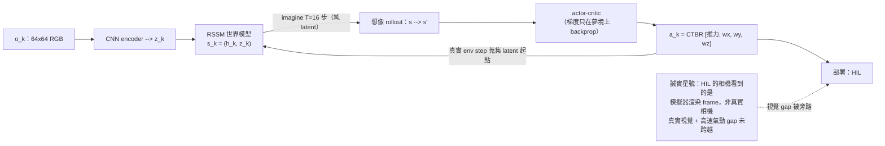

<!-- ontology-5axis output=action-seq injection=sim-in-loop-train control=image-init|action temporal=latent-rollout domain=robotics -->

# Dream to Fly — DreamerV3 Aerial World Model 解構

> Romero, Shenai, _et al._ (UZH RPG). _Dream to Fly: Model-Based Reinforcement Learning for Vision-Based Drone Flight._ arXiv [2501.14377](https://arxiv.org/abs/2501.14377)（Jan 2025；accepted ICRA 2026）· HTML 全文 [arxiv.org/html/2501.14377](https://arxiv.org/html/2501.14377)
>
> **為什麼進 aerial-sim anchor 名單**：Swift（[champion-level-drone-racing.md](./champion-level-drone-racing.md)）證明了 model-free RL + 機載感知能飛贏人類，但它是 `streaming` 控制、靠一整套 per-track empirical noise model 補 gap。Dream to Fly 是 aerial 領域第一個**用 latent world-model「在腦內做夢」訓出 agile-flight policy** 的乾淨案例 —— actor/critic 完全在 imagined latent rollout 上學，只吃 64×64 RGB、輸出 CTBR，端到端從 raw pixel 學起。它把 ontology 的 `temporal=latent-rollout` 軸座標在 aerial 上佔住了，是 [overview.md](./overview.md) sub-route (2)「action-conditioned aerial WM」的 canonical 代表。但它的「sim-to-real gap 極小」結論有一個必須講清楚的前提 —— 那是本篇的智力核心（見 §1 與 §8.1）。

## 1. TL;DR

**Dream to Fly 把 vanilla DreamerV3 直接套到四旋翼上：只給一支 64×64 RGB 機載相機（無 depth、無 state、無 IMU、無 privileged info），policy 在 world model 的「夢境」latent rollout 裡學會以 CTBR 飛 Figure-8 等軌跡，最高 9 m/s，全程 100% 在模擬器裡訓練。** 關鍵賣點是 sample efficiency：同樣的 raw-pixel 設定下 **PPO 與 SAC 直接失敗**（原文：「fail to execute any meaningful flight maneuvers」），是 DreamerV3 的 model-based 樣本效率讓「從像素學飛」變成可能。

但「最小 sim-to-real gap」這句話有一個**誠實的星號**：所謂「real-world」部署是 **hardware-in-the-loop (HIL)** —— 無人機物理上在飛，但它**看到的影像是模擬器渲染的 frame**，不是真實相機。**因此 sim↔real 視覺輸入幾乎相同，視覺 domain gap 被旁路掉了；真正困難的視覺 gap（真實相機、光度、運動模糊）與 aero/latency 動力學 gap，本文並未證明跨越，作者自己列為 future work。** 把這顆星號看懂，才看得懂這篇的貢獻邊界。


*圖：DreamerV3 想像迴路 —— actor-critic 全在 latent 夢境學；紅框標出「真機=HIL+渲染幀」的貢獻邊界*

## 2. Core mechanism

DreamerV3 的核心是 **RSSM（Recurrent State-Space Model）**：把高維像素壓成一個 latent state `s_k = (h_k, z_k)` —— `h_k` 是 deterministic recurrent 狀態（GRU 攜帶的 history），`z_k` 是 stochastic categorical latent（捕捉當下不確定性）。world model 學會在 latent 空間裡「想像」未來，**actor/critic 從不碰真實影像、只在 imagined latent rollout（horizon T=16）上訓練** —— 這就是「dream」的字面意思。

```
  ┌─────────────────── WORLD MODEL (RSSM) learned from real env steps ──────────────────┐
  │                                                                                       │
  │   o_k (64×64 RGB) ──► CNN encoder ──► z_k  (stochastic categorical latent)            │
  │                                        │                                              │
  │   [h_{k-1}, z_{k-1}, a_{k-1}] ──► GRU (2048 units) ──► h_k  (deterministic recurrent) │
  │                                        │                                              │
  │            s_k = (h_k, z_k) ──┬──► CNN decoder ──► ô_k   (reconstruct image)          │
  │                               ├──► reward predictor ──► r̂_k                           │
  │                               └──► continue predictor ──► ĉ_k  (episode-end)          │
  │   (decoder / predictors / actor / critic = 4-layer MLP, 768 units each)              │
  └───────────────────────────────────────────────────────────────────────────────────┘
                                        │
                                        ▼  no pixels past this line — pure latent
  ┌──────────────────── IMAGINATION LOOP (actor/critic trained here, T=16) ──────────────┐
  │                                                                                       │
  │   s_k ─► actor π ─► a_k ─► RSSM imagine ─► s_{k+1} ─► r̂, v̂ ... (×16 latent steps)     │
  │         actor maximizes λ-return of imagined r̂ ;  critic regresses v̂                  │
  │   a_k = CTBR = [collective thrust, ω_x, ω_y, ω_z] ∈ [−1,1]^4   (tanh + rescale)       │
  └───────────────────────────────────────────────────────────────────────────────────┘
        ▲ collect real env steps (Flightmare + Agilicious dyn + Habitat render)
        └─────────────────── close loop: world model gets better, dreams get truer ──────
```

迴路四步：**encode**（CNN 把像素壓進 latent）→ **learn world model**（RSSM 在真實 env steps 上學 dynamics + reward + continue）→ **imagine**（在 latent 裡 rollout 16 步「做夢」）→ **actor-critic**（policy 與 value 只在夢境上 backprop）。**重點是 actor/critic 的梯度從不流經真實影像 —— 真實 env step 只用來訓 world model 與蒐集 latent 起點，這是 DreamerV3 樣本效率遠勝 model-free PPO/SAC 的結構性原因。** 動作層用 CTBR 而非直接 motor speeds：**CTBR transfers better than direct motor speeds**（與 Swift、SimpleFlight 的共識一致）。

一個**沒被 reward 工程化**的湧現行為：policy 自發學會把相機**轉向 gate 的紋理豐富區域**（perception-aware steering），這不是 reward 設計出來的，是 latent dynamics 為了降低 imagination 不確定性而自然導出的 —— 與 Swift 顯式加 perception-aware reward 形成對照。

## 3. 五軸定位 + 同軸對手

| Axis | **Dream to Fly** | Swift (Nature 2023) | SkyDreamer (2025) | DreamerV4-driving / GAIA-2 (driving WM) | NeuroBEM (aero model) |
|---|---|---|---|---|---|
| Output | `action-seq`（CTBR @ ?Hz，[UNVERIFIED]） | `action-seq`（CTBR @ ~100 Hz） | `action-seq` via latent-WM | `pixel-video`（+ action cond.） | N/A（dynamics model，非生成） |
| Injection | **`sim-in-loop-train`（純模擬，無 DR）** | `sim-in-loop` + empirical noise model | `sim-in-loop` + learned WM | data-driven WM（real driving logs） | BEM physics + NN residual |
| Control | `image-init`（raw 64×64 RGB）+ `action`（CTBR） | image (FPV) + IMU + gate-traj | image (model-based RL) | image-init + action/ego-traj | full state input |
| Temporal | **`latent-rollout`（imagine T=16）** | `streaming`（control loop，無 rollout） | `latent-rollout` | `latent-rollout` + video | analytic step |
| Domain | `robotics`（aerial agile flight） | `robotics`（aerial racing） | `robotics`（aerial） | `robotics`（ground driving） | `robotics`（aerial dynamics） |

要點對齊：相對 **Swift**，Dream to Fly 是 model-based、sample-efficient（PPO/SAC 在此設定直接失敗），但代價是「真實感知 gap 被 HIL 旁路」——**Swift 用 real-camera VIO + kNN dynamics residual + GP perception residual（~1 分鐘 mocap 資料）真的把 real-camera + aero-residual gap 解了，而 Dream to Fly 把這兩個 gap 都讓給了 future work**。相對 **DreamerV4-driving / GAIA-2** 這類 driving WM：driving 在 2D 流形 + lane 約束下、輸出多偏 pixel-video 場景生成；Dream to Fly 是 6-DoF、輸出可直接執行的 control token，更接近 closed-loop policy 而非場景生成器。相對 **NeuroBEM**：它提醒我們 Dream to Fly 學到的 latent dynamics 其實**沒涵蓋高速下主導的氣動缺陷**（見 §4 / §6）。

> **Cross-axis note**：`temporal=latent-rollout` × `control=image-init` × `injection=sim-in-loop-train` × `output=action-seq` 這個座標在 aerial 上目前只有 Dream to Fly 乾淨佔住 —— 它是 latent-WM 路線在 aerial 的 anchor，與 Swift 的 `streaming` model-free 座標互補而非重疊。

## 4. ⚡ shines / ❌ breaks

⚡ **Shines**
- **Raw-pixel end-to-end 可行性證明**：64×64 RGB → CTBR，無 depth/state/IMU/map，像人類 FPV 飛手一樣把像素映到搖桿。早期 pixel-racing 需要 gate mask / imitation 起步，這篇從 raw RGB 端到端學成。
- **Sample efficiency 是 enabler**：同設定 **PPO 與 SAC 完全失敗**（「fail to execute any meaningful flight maneuvers」），DreamerV3 的 model-based imagination 是讓「從像素學飛」可行的關鍵。
- **單卡可複現規模**：~20M env steps、~240h、**單張 Quadro RTX 8000**。對學界友善，不需大型 GPU farm。
- **湧現 perception-aware 行為**：相機自發轉向紋理豐富的 gate 區，**非 reward 工程**，是 latent dynamics 的副產品 —— 與 Swift 顯式 reward 形成乾淨對照。
- **CTBR 抽象選對**：CTBR 比 direct motor speeds 更易 transfer，這在多篇 aerial sim2real 工作（Swift / SimpleFlight）反覆驗證。

❌ **Breaks**
- **「Real-world」是 HIL + rendered observation**：無人機物理飛、但**看到的是模擬器渲染影像**。所謂「minimal sim-to-real gap」**很大程度是因為視覺輸入 sim↔real 幾乎相同**。真實相機的 photometry / motion blur 視覺 gap **未被證明跨越**（作者列 future work）。這是本篇最關鍵的 caveat。
- **World model 不抓氣動與時間常數**：latent dynamics 只夠 imagination 用，**不涵蓋 motor/rotor 時間常數、aerodynamics（rotor drag / blade flapping / induced flow）、latency、battery sag、wind**。而 NeuroBEM 指出 **aerodynamics 才是高速下主導的模型缺陷**。
- **無 domain randomization**：本文未提任何 DR。HIL 設定下沒 DR 也能飛，正因為 gap 被旁路；一旦換真實相機，缺 DR 會立刻暴露。
- **平台輕、推力裕度普通**：mass 0.6 kg、max rotor thrust 4.0 N（TWR≈2.7）、arm 0.14 m。9 m/s Figure-8 在受控 sim/HIL 下漂亮，但離 Swift 的真實 racing 速度與外擾條件還有距離。
- **控制頻率未公開**：CTBR 控制頻率 Hz 在主文未述（[UNVERIFIED]），無法直接評估 latency 餘量。

## 5. Reproduction notes

**Stack**：Flightmare（sim 框架）+ Agilicious dynamics（四旋翼動力學）+ Habitat renderer（視覺），組合可達**數千 FPS**，這是 20M steps / 240h 能在單卡完成的前提。RL 端是 **vanilla DreamerV3**（無客製演算法改動）—— 復現重點在 world-model 規模與 env 接線，不在 RL trick。

- 規模參數：GRU 2048 units；decoder / reward / continue / actor / critic 皆 4-layer MLP、768 units；imagination horizon **T=16**；observation 64×64 RGB；action CTBR ∈ [−1,1]^4。
- 預算：~20M env steps，~240h，單張 **Quadro RTX 8000**。瓶頸是 renderer/sim throughput 與 world-model 訓練，不是 RL 樣本量。
- **不要試圖用 PPO/SAC 省事**：本文明證在 raw-pixel 設定下兩者直接不收斂。要 raw-pixel 學飛，model-based（Dreamer 類）是目前唯一被證可行的路。
- HIL 復現需要：能把模擬器渲染 frame 餵給真實 autopilot 的 hardware-in-the-loop 裝置 —— 注意這**不等於**真實相機部署，別把 HIL 成功讀成 full sim-to-real。
- 想真的 close 視覺 gap：參考 Swift 的 real-camera VIO + residual 路線（[champion-level-drone-racing.md](./champion-level-drone-racing.md)），或把 [Cosmos WFM](../../foundations/foundation-physics-models/cosmos-wfm.md) 當更真實的 renderer 候選（bottleneck 是 streaming latency）。

## 6. Cross-line synthesis

本 handbook 四條 generation 路線：**pixel-WM / latent-WM / diff-sim / neural-surrogate**。**Dream to Fly 就是 aerial 上的 latent-WM 路線 anchor** —— 它不出 pixel（雖然 RSSM decoder 會 reconstruct 影像，但那是 world-model 訓練的輔助 target，policy 不依賴生成的像素），而是在 latent 空間 imagine 出 control。

| Line | Dream to Fly 的對應位置 |
|---|---|
| pixel-WM（[Cosmos WFM](../../foundations/foundation-physics-models/cosmos-wfm.md) / Sora / Veo） | 不走 pixel rollout；但 Cosmos 類 WFM 可當 Dream to Fly 的「真實感 renderer」候選，替換 Habitat 去攻克它旁路掉的真實視覺 gap。bottleneck：Cosmos 非 streaming，latency 進不了 control loop。 |
| **latent-WM（[DreamerV4](../../foundations/latent-world-models/dreamer-v4.md) / [V-JEPA-2](../../foundations/latent-world-models/v-jepa-2.md)）** | **本篇就是這條路在 aerial 的代表。** RSSM latent imagination 出 CTBR；SkyDreamer (2025) 是同路後續，DreamerV4 是更強的 world-model backbone 候選。 |
| diff-sim（[Aerial Gym](../../foundations/differentiable-simulators/aerial-gym.md) / [MJX](../../foundations/differentiable-simulators/mujoco-mjx.md) / [Genesis](../../foundations/differentiable-simulators/genesis.md)） | Dream to Fly 用 Flightmare（非 differentiable），靠 model-based 樣本效率而非梯度穿透物理。SimpleFlight（arXiv [2412.11764](https://arxiv.org/abs/2412.11764)）指出 **system-ID of mass/inertia/thrust > domain randomization**，且 action-smoothness regularization 才是 aggressive flight 不炸的關鍵 —— 這是 Dream to Fly 缺的一塊（無 DR、無 system-ID 討論）。 |
| neural-surrogate（[FNO](../../foundations/neural-surrogates/fno.md) / [GraphCast](../../foundations/neural-surrogates/graphcast.md)） | aerial CFD 尚未 close 進 control loop；NeuroBEM（arXiv [2106.08015](https://arxiv.org/abs/2106.08015)）示範 BEM 物理 + NN residual 把力誤差降 ~50%，正是 Dream to Fly latent dynamics 缺的氣動項。短期可把 NeuroBEM 類 surrogate 注回 sim 動力學以提升 imagine 的物理真度。 |

最關鍵的 cross-line 命題：**Dream to Fly 證明了「latent-WM + 樣本效率」能在 aerial 把 raw-pixel policy 學出來，但它把兩個最硬的 gap（真實視覺 + 高速氣動）留給了別人。** 把它跟 Swift（解 real-camera + aero-residual）、NeuroBEM（解氣動主導缺陷）、SimpleFlight（解 system-ID + action smoothness）並讀，才拼得出 aerial sim-to-real 的完整地圖。

**HANDOFF — 給 sister Spatial-Handbook 的 data contract**：Dream to Fly 生成的軌跡必須服從 aerial 動力學約束，且其（HIL 渲染的）footage 是下游 VIO 訓練的潛在資料源。對接口見：
- 生成軌跡須服從的動力學/控制基礎：[Spatial aerial dynamics primer](https://github.com/sou350121/Spatial-Intelligence-Handbook/blob/main/embodiments/aerial/dynamics_and_control_primer.md)
- 生成 footage 的消費端（VIO）：[Spatial aerial VIO](https://github.com/sou350121/Spatial-Intelligence-Handbook/tree/main/embodiments/aerial/vio)
- 兩側 IMU 噪聲 / camera-IMU extrinsic 對齊的 data contract：[bridge-to-spatial/aerial-embodiment.md](../../bridge-to-spatial/aerial-embodiment.md)
- 5 軸 ontology 定義：[cheat-sheet/ontology.md](../../cheat-sheet/ontology.md)

## 7. References

**Primary**
- Romero, A., Shenai, A., _et al._ (UZH RPG). _Dream to Fly: Model-Based Reinforcement Learning for Vision-Based Drone Flight._ arXiv [2501.14377](https://arxiv.org/abs/2501.14377)（Jan 2025；accepted ICRA 2026）. HTML: [arxiv.org/html/2501.14377](https://arxiv.org/html/2501.14377).
- Hafner, D., _et al._ _Mastering Diverse Domains through World Models_ (DreamerV3). arXiv [2301.04104](https://arxiv.org/abs/2301.04104) — RSSM + imagination 演算法母本。

**Same-repo dissections / anchors**
- Swift（real-camera VIO + kNN/GP residual 路線，解掉本篇旁路的 gap）：[champion-level-drone-racing.md](./champion-level-drone-racing.md).
- aerial-sim use-case 總圖：[overview.md](./overview.md).
- latent-WM backbone 候選：[dreamer-v4.md](../../foundations/latent-world-models/dreamer-v4.md).
- pixel-WM renderer 候選：[cosmos-wfm.md](../../foundations/foundation-physics-models/cosmos-wfm.md).

**Contrast / context（aerial sim-to-real 地圖的其他角）**
- NeuroBEM — aerodynamics 是高速下主導模型缺陷（BEM 物理 + NN residual，力誤差降 ~50%）：arXiv [2106.08015](https://arxiv.org/abs/2106.08015).
- SimpleFlight — system-ID > domain randomization；action-smoothness regularization 救 aggressive flight；CTBR robust to sim2real：arXiv [2412.11764](https://arxiv.org/abs/2412.11764).

**Sister handbook（Spatial）handoff**
- [aerial dynamics primer](https://github.com/sou350121/Spatial-Intelligence-Handbook/blob/main/embodiments/aerial/dynamics_and_control_primer.md) · [aerial VIO](https://github.com/sou350121/Spatial-Intelligence-Handbook/tree/main/embodiments/aerial/vio).

## §8 Pitfall log

| # | Severity | Issue | Source | Workaround |
|---|---|---|---|---|
| §8.1 | 🔴 | **「Real-world」= HIL + rendered observation** —— 無人機物理飛但看到的是模擬器渲染影像，sim↔real 視覺幾乎相同，「minimal gap」結論大半來自此。真實相機 photometry / motion blur gap **未證明跨越** | arXiv [2501.14377](https://arxiv.org/html/2501.14377) §deployment / future work | 不可把 HIL 成功讀成 full sim-to-real；要真 close 視覺 gap 走 Swift real-camera VIO 路線或換真實 renderer（Cosmos） |
| §8.2 | 🔴 | **World model 不抓 aerodynamics** —— motor/rotor 時間常數、rotor drag / blade flapping / induced flow、latency、battery sag、wind 皆未建模，而氣動是高速主導缺陷 | NeuroBEM arXiv [2106.08015](https://arxiv.org/abs/2106.08015)（aero 主導）；本文未涵蓋 | 把 NeuroBEM 類 BEM+NN-residual surrogate 注回 sim 動力學；高速段尤其必要 |
| §8.3 | 🟠 | **無 domain randomization** —— HIL 下沒 DR 也能飛（因 gap 被旁路），換真實相機 / 真實動力學會立刻暴露 | 本文未提 DR；SimpleFlight arXiv [2412.11764](https://arxiv.org/abs/2412.11764) | 加 DR；但 SimpleFlight 指出 system-ID of mass/inertia/thrust 比盲目 DR 更有效，優先做參數辨識 |
| §8.4 | 🟠 | **PPO / SAC 在此設定直接失敗** —— raw-pixel 下 model-free 不收斂，誤用會浪費 GPU-days | 本文（「fail to execute any meaningful flight maneuvers」） | raw-pixel 學飛只走 model-based（Dreamer 類）；勿換 model-free 省事 |
| §8.5 | 🟡 | **控制頻率 Hz 未公開** —— 無法直接評估 latency 餘量與真實 ESC 接線可行性 | 主文未述（[UNVERIFIED]） | 復現時自行量測 / 設定並記錄；對齊 Swift ~100 Hz 量級評估 |
| §8.6 | 🟡 | **平台推力裕度普通（TWR≈2.7，0.6 kg，4.0 N）** —— 9 m/s Figure-8 在受控 HIL 漂亮，外擾 / 真實 racing 條件外推有限 | 本文平台規格 | 外推前在真實外擾下重測；勿把受控 sim 速度當真實上限 |
| §8.7 | 🟡 | **湧現 perception-aware 行為依賴 gate 紋理** —— 無紋理 / 無 gate 場景該行為可能退化（與 Swift gate-centric 同類風險） | 推論自本文 emergent steering 描述（[UNVERIFIED] 退化邊界） | free-flight / 弱紋理場景需另設 reward 或 task formulation 驗證 |

**[UNVERIFIED] 標記彙總**：(1) §3 表格與 §8.5 的 CTBR 控制頻率 Hz（主文未述）；(2) §8.7 perception-aware 行為在無紋理場景的退化邊界（推論，本文未實驗界定）。所有數值（2048 GRU / 768-unit 4-layer MLP / T=16 / 64×64 RGB / CTBR∈[−1,1]^4 / 20M steps / 240h / Quadro RTX 8000 / 0.6 kg / 4.0 N / TWR≈2.7 / 0.14 m arm / 9 m/s）均出自 primary source。
