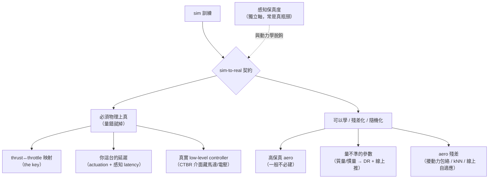
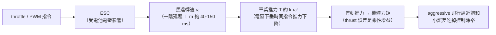
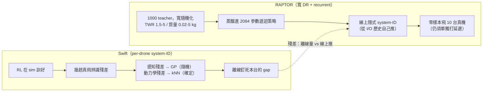
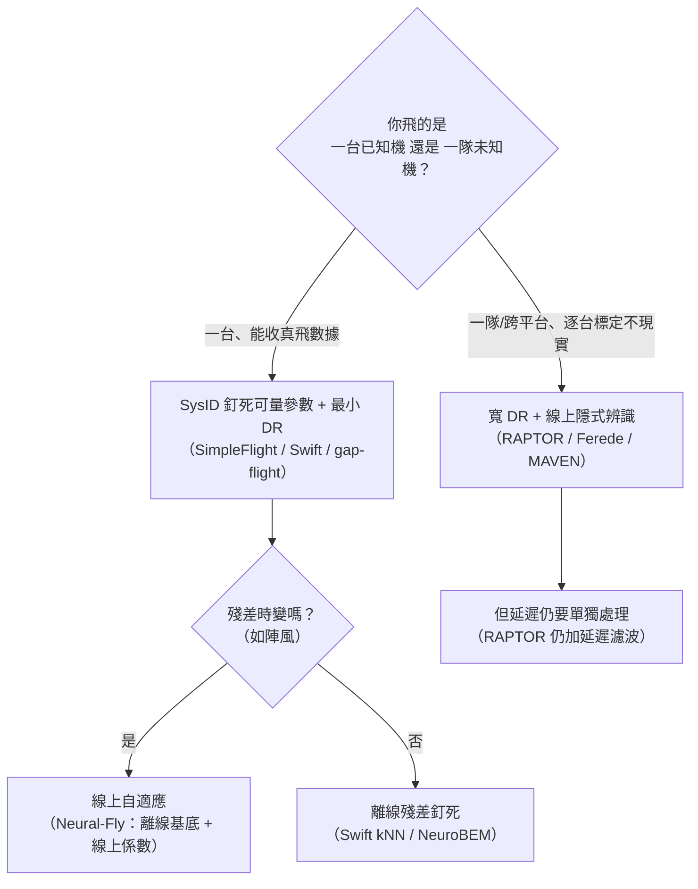

<!-- ontology-5axis output=action-seq injection=sim-in-loop-train control=action|image-init temporal=streaming domain=robotics -->

# Sim-to-Real 契約（無人機篇）—— 什麼必須真、什麼可以學

> 讀近年 *Science Robotics* 的無人機論文，把「sim 訓得漂亮、上機就掉」這件事拆成一份可操作的契約。
>
> **核心證據（Science Robotics / Nature）**：
> - **Wu, …, Fei Gao（浙大）。Precise aggressive aerial maneuvers with sensorimotor policies.** *Sci. Robotics* 11(115)，線上 2026-06-10，[10.1126/scirobotics.aeb0180](https://www.science.org/doi/10.1126/scirobotics.aeb0180) · arXiv [2604.05828](https://arxiv.org/abs/2604.05828)（**這就是你看到那篇 6 月的**，下稱 gap-flight）
> - **RAPTOR — foundation policy for quadrotor control.** *Sci. Robotics* 2026，[10.1126/scirobotics.aec1481](https://www.science.org/doi/10.1126/scirobotics.aec1481) · arXiv [2509.11481](https://arxiv.org/abs/2509.11481)
> - **Reaching the limit in autonomous racing: optimal control vs RL（Song 等）.** *Sci. Robotics* 2023，[10.1126/scirobotics.adg1462](https://doi.org/10.1126/scirobotics.adg1462) · arXiv [2310.10943](https://arxiv.org/abs/2310.10943)
> - **Neural-Fly.** *Sci. Robotics* 2022，[10.1126/scirobotics.abm6597](https://www.science.org/doi/10.1126/scirobotics.abm6597)
> - **Learning high-speed flight in the wild.** *Sci. Robotics* 2021，[10.1126/scirobotics.abg5810](https://www.science.org/doi/10.1126/scirobotics.abg5810)
> - **Fully neuromorphic vision and control.** *Sci. Robotics* 2024，[10.1126/scirobotics.adi0591](https://www.science.org/doi/10.1126/scirobotics.adi0591)
> - **SUPER（高速安全 MAV）.** *Sci. Robotics* 2025，[10.1126/scirobotics.ado6187](https://www.science.org/doi/10.1126/scirobotics.ado6187)
> - **Swift（冠軍級競速，Nature 2023）** —— 殘差法教科書範例，[champion-level-drone-racing.md](./champion-level-drone-racing.md) 已解構。
>
> **工程化機制證據（開源、可驗證 —— 用來解釋「為什麼」）**：NeuroBEM（aero 殘差，[2106.08015](https://arxiv.org/abs/2106.08015)）· SimpleFlight（SysID 勝 DR，[2412.11764](https://arxiv.org/abs/2412.11764)）· Eschmann 馬達延遲 sysID（[2404.07837](https://arxiv.org/abs/2404.07837)）· Agilicious（[2307.06100](https://arxiv.org/abs/2307.06100)）· Geles 純像素無狀態估計（[2406.12505](https://arxiv.org/abs/2406.12505)）· Ferede「One Net」跨平台 DR（[2504.21586](https://arxiv.org/abs/2504.21586)）· MAVEN meta-RL（[2603.10714](https://arxiv.org/abs/2603.10714)）。

## 0. 角度與定位（這篇在 handbook 的位置）

**它是什麼**：不是某個方法的解構——Swift 的解構在 [champion-level-drone-racing](./champion-level-drone-racing.md)、sim 工具盤點在 [aerial-sim-stack](./aerial-sim-stack.md)、latent-WM 路線在 [dream-to-fly](./dream-to-fly.md)。這一篇是一份**跨方法的遷移契約**：回答「sim 訓練的飛行 policy 要搬上真機，**什麼必須在 sim 裡物理上為真、什麼可以用學習/隨機化省掉**」。方法會換，這條界線是那個不變量。

**5 軸定位**：它坐在 `injection = sim-in-loop-train` 與真機之間的**遷移邊界**上；`domain = robotics`（aerial）、`control = action / trajectory`、`temporal = streaming`。本手冊核心命題是「外觀靠生成、動力學靠物理」（見 [overview](./overview.md)）——這篇就是「**動力學那一半要真到什麼程度**」的精算，是該命題在「部署」這一刻的落地。

**在三冊裡的分工**：動力學側的 sim-to-real 由本倉（generation 端）負責；它**刻意把感知保真度脫鉤**出去（§5），指向 [Spatial-Intelligence-Handbook](https://github.com/sou350121/Spatial-Intelligence-Handbook) 的 VIO / 狀態估計側；policy / action 的學習側指向 VLA-Handbook。所以這篇是「三冊在無人機 sim-to-real 上的**動力學分工書**」，也是 [bridge-to-spatial/aerial-embodiment](../../bridge-to-spatial/aerial-embodiment.md) 資料契約的動力學前提。

**為什麼是 aerial-sim 最關鍵的一篇**：對做無人機的人，這是唯一一頁直接回答「我的 sim policy 會不會上機就掉」——它把模糊的「sim2real gap」收斂成一份**有優先序的契約**：thrust map = the key、你這台的延遲、控制器介面（必須真）｜ aero、量不準的參數、殘差（可以學）｜ 感知（脫鉤的另一條軸）。

## 一句話總結

舊的經驗法則是：**好的標稱物理（nominal model）+ 忠實的 low-level controller + ~1 分鐘真機數據辨識出的小殘差，勝過重度 domain randomization。** 近年 *Science Robotics* 與開源工程論文**大致支持**這條，但補了三個關鍵 refinement：

1. **「必須真」的東西是具體的兩項：thrust↔throttle 映射 + 你自己這台的延遲（actuation / 感知 latency）。** 不是「整個動力學」。SimpleFlight 把這條量化成「**SysID 可量參數、且不要對它們做 DR**，效果勝過加 DR」。
2. **空氣動力學大多是『小殘差 + 隨機化包絡』，不是要你建高保真 aero 模型** —— 除非你的飛行器本身就是一張翅膀（撲翼/變形機）。NeuroBEM 量到：aero 在低速可忽略、**在高速/agile 才變成主要 model defect**。
3. **有一條有原則的反例光譜（RAPTOR / Ferede / MAVEN）**：把『量不準的參數』randomize 得夠寬 + 配一個會在線上**隱式辨識**的 recurrent policy，可以**省掉 per-drone 的 system-ID**。所以「最小隨機化」不是唯一解——這是本篇 §6 的真實張力。

外加一條獨立軸：**感知保真度是另一回事**，跟動力學脫鉤，常常才是真正的瓶頸。

*圖：契約的中心線 —— 什麼必須真（thrust map + 你的延遲），什麼可以學（高保真 aero 不必）。*

## 1. 那篇最新的（2026-06）把契約講得最具體

Fei Gao 組這篇做的是**端到端 sensorimotor policy**：機載相機（分割後的縫隙影像 320×256）+ 本體姿態（roll/pitch）**直接**映到 low-level 控制（collective thrust + body rates），讓四旋翼以 **5 cm 餘隙**穿過**傾斜到 90°** 的窄縫，**事先完全不知道縫的位置與朝向**，甚至能穿它沒訓練過的**移動縫**（≥3 m/s）。它把傳統「感知→估計→規劃→控制」整條 stack 換成一個學出來的策略。100% 在模擬裡訓（teacher–student：有特權資訊的 RL oracle 用 DAgger 蒸餾進 recurrent CNN→GRU→MLP 的 student），再加一個 model-based 規劃器做 **informed reset** 去引導 RL 探索窄縫（樣本效率 3×，沒有它 RL 卡在約 70%）。

**它對契約的貢獻是把「必須真」講到具體**——原文明說：

> *「A precise mapping from the desired thrust and the throttle is the key for restricting the sim-to-real gap introduced by thrust execution.」*

也就是：**真正要對的是 thrust↔throttle 那條執行路徑**。他們從真機飛行數據 **system-ID 出 actuation 延遲 `h` 與低通平均窗 `w`**，用 RK4 整進去；並直言「在消費級飛控上準確模擬飛控執行 + 螺旋槳力生成『far from trivial』」。

**剩下沒建模的空氣動力學，他們不去建高保真模型，而是用『擾動 + 隨機化』兜住**：persistent perturbation forces（PF，持續擾動力）、response randomization（RR，乘性 actuator 噪聲、保持數十步）、response-parameter randomization（RPR，把辨識出的延遲再隨機化），再加相機內參 / 邊緣噪聲 / 感知延遲的隨機化。實測（已 fact-check 對上 arXiv 正文）：5 cm 餘隙、90° roll / 60° pitch、60° 傾斜縫 **96.7%（29/30）**、>100 次真飛、機載 Jetson Orin NX + PX4、分割推論 ~4 ms、訓練 ~1.5 h。

**一句話**：把 thrust map 與你自己的延遲量準，剩下的不模高保真 aero，用擾動力 + actuator 噪聲 + 感知延遲隨機化，就能把一個端到端視覺策略帶上真機。

## 2. 為什麼 thrust map 是「the key」—— 執行路徑的物理（深入）

gap-flight 把 thrust↔throttle 叫「the key」，但沒展開**為什麼是它、不是別的**。把執行鏈拆開就清楚了。

**執行鏈**：`throttle / PWM → ESC（吃電池電壓）→ 馬達轉速 ω（一階延遲 T_m）→ 單槳推力 T ≈ k·ω²`。兩個非線性疊起來——ω² 的氣動 + 電壓→轉速那段——讓 **throttle→推力大致是三次關係**（Bitcraze 量測：可用 motor voltage 的三次多項式擬合好）。係數（k、T_m）跟機架（馬達 Kv、槳、ESC）綁死，**沒有通用 map**：SimpleFlight 逐台 system-ID 四個量——質量、慣量、**推力係數 k**、**馬達時間常數 T_m**。

*圖：throttle→推力的執行鏈 —— 為什麼 thrust map 是乘性的、且在 aggressive 飛行的非線性高段最致命。*

**它之所以是『the key』，有三個獨立理由**：

1. **乘性、在控制迴路內（不是加性擾動）**。機體力矩靠**差動推力**產生，所以 k 的誤差是**每一個指令力/力矩上的增益誤差**——5% 的 k 誤差≈每個指令加速度差 5%。它**汙染的是控制輸入本身**，下游觀測器/殘差補不乾淨。對照空氣動力學阻力是**加性的輸出擾動**，可以當殘差學掉（NeuroBEM：BEM + NN 殘差，預測誤差砍 **~50%**）——這正是為什麼 **aero 可以學、thrust map 不能省**。
2. **aggressive 飛行用的是 map 的非線性高段**。懸停只用到約 1/(推重比) 的推力（推重比 5 ≈ 20%），map 在那裡接近線性、誤差容易 trim 掉；aggressive 飛行掃過 ω²（與電壓三次效應）曲率最大的高段，**同樣的相對誤差→更大的絕對推力誤差**。
3. **飽和 / 控制餘裕**。aggressive 機動逼近馬達飽和（高推重比、大角加速度），此時一點 thrust 誤差吃掉**最後一截控制權威**，追蹤就發散；懸停時同樣的誤差被 trim 掉無感。Agilicious 之所以跑推重比 ≈ 5，就是為了留這截餘裕。

外加一個**時間維度的坑：電池電壓下垂讓靜態 map『單向地、隨時間變錯』**。同一個 throttle 指令，電壓掉、推力跟著掉（約隨電壓平方）——滿電標定的 map 到飛行後段會**高估推力**（懸停 throttle 一路爬升）。所以正規做法把電壓當 map 的一個輸入（RPG 控制器的 voltage-compensated thrust map；Bitcraze 量電壓 + 低通再反解 PWM）。

**延遲的量級**（為什麼 instantaneous-thrust 的 sim 假設會錯）：馬達時間常數 ~40 ms（競速級 Agilicious）→ **~72 ms（Crazyflie，實測）** → 150–250 ms（小/欠力機）；換算成 **5–25 個控制步**，大到不能忽略，policy 必須看動作歷史才追得上。gap-flight 正是從真飛數據 sysID 出延遲再 RK4 整進 sim；「Learning to Fly in Seconds」乾脆把 150 ms 馬達延遲建準、**完全不用 DR** 就遷移。

> **可驗證性**：thrust↔throttle 三次關係、ω² 推力模型、馬達一階延遲（Crazyflie ~72 ms）、SimpleFlight「SysID 勝 DR」皆有開源論文（NeuroBEM 2106.08015 / SimpleFlight 2412.11764 / Eschmann 2404.07837 / Bitcraze）。唯 **馬達加速/減速不對稱的具體秒數** 與 **單一量化的 gap「百分比預算」** 在公開文獻裡沒有乾淨來源——標 `UNVERIFIED`，不杜撰；文獻給的是「具名分量」分解（SimpleFlight 4 個 SysID 量 + NeuroBEM aero 殘差），不是一張百分比餅圖。

## 3. 殘差怎麼補 —— 三條路線

「標稱物理之外的那一截」怎麼處理，近年論文給了三個不同點：

- **離線辨識成殘差（Swift）**：RL 在 sim 訓好，再用幾趟真飛辨識 reality gap 的殘差，且**按性質拆**——**感知/VIO 殘差用 Gaussian Process（隨機性）**、**動力學殘差用 kNN（大致確定性）**。原文：「perception residuals are stochastic, while dynamic residuals are largely deterministic.」這是「小殘差」法的標準範本。
- **線上自適應（Neural-Fly）**：把空氣動力學殘差**分解**成「離線 meta-learn 的風-不變共享基底（DAIML，只用 12 分鐘飛行）」+「線上更新的低維風-特定係數」。標稱動力學扛大頭，線上只動幾個係數，公分級追蹤撐到 **12.1 m/s 風**（已 fact-check）。
- **在線上隱式辨識（RAPTOR / MAVEN，見 §6）**：根本不離線辨識，靠 recurrent / in-context policy 從觀測/動作歷史**自己推**出當前這台的潛在動力學參數。MAVEN（meta-RL）甚至宣稱零樣本 + 線上適應到 **±66.7% 質量變化、70% 單槳推力損失**（arXiv，待 peer-review，標 `DEMO`）。

三條路線的共識：**標稱物理是骨架，殘差/自適應只填那一截**；分歧在「殘差是離線量、線上自適應、還是讓策略自己在線上推」。

## 4. 必須真 vs 可以學 —— 分層契約

| 層 | 必須物理上真（量錯就掉） | 可以學 / 殘差化 / 隨機化 | 代表證據 |
|---|---|---|---|
| **執行（actuation）** | **thrust↔throttle 映射**、**你這台的 actuation 延遲** | 延遲值的隨機化包絡（RPR） | gap-flight（thrust map「the key」+ sysID 延遲）；§2 物理 |
| **剛體動力學** | 質量 / 慣量 / 推力係數（**system-ID，別對已知量做 DR**） | 量不準的就 randomize 並讓策略推（見 §6） | **SimpleFlight（SysID 勝 DR，實測 DR 反而變差）**；Swift；RAPTOR |
| **高階空氣動力學** | （一般**不需**高保真）；除非飛行器本身是翅膀 | rotor drag / blade flapping / induced：殘差（NeuroBEM/Swift kNN）或線上自適應（Neural-Fly）或擾動力包絡（gap-flight PF） | NeuroBEM（低速可忽略、高速才主導）；Neural-Fly；gap-flight |
| **低層控制器** | **建真實 low-level controller**（Betaflight/ESC/電壓），用 **CTBR** 介面 | —— | Swift；gap-flight；RAPTOR；Geles 都用 CTBR |
| **感知（見 §5）** | 你**模不真**的模態放真實資料 | 能抽象 + appearance 隨機化的放 sim | 高速 in-the-wild；neuromorphic；Geles |

**為什麼 CTBR 一再出現**：collective thrust + body rates 這個動作介面把「馬達延遲、電壓下垂」這些難模的東西**藏在真實低層控制器後面**，策略只管出 thrust 與角速度——所以 Swift、gap-flight、RAPTOR、Geles 不約而同用 CTBR 而非直接馬達轉速。**換句話說：選對動作抽象，能把一半的 sim-to-real 難題消掉。**

## 5. 感知是另一條軸（跟動力學脫鉤）

近年論文反覆顯示：**感知保真度跟動力學保真度是兩件事，而且感知常常才是綁住 sim-to-real 的那一條**。處理方式分兩種：

- **能抽象 + 隨機外觀就放 sim**：「高速 in-the-wild」把 NN 輸出設成**抽象的無碰撞軌跡**（不是原始馬達命令），對 sim-real 視覺差不敏感，純 sim + 外觀/幾何隨機化就**零樣本**飛進森林/建築（40 km/h）。更極端的 **Geles（RSS 2024）**：**像素直接→CTBR、完全不用狀態估計（無 SLAM/VIO/IMU 位姿）**，用 asymmetric actor-critic 訓、把閘門邊緣當感知抽象，agile 飛到 40 km/h / 2 g。**選一個對視覺 gap 魯棒的輸出抽象，是感知遷移的關鍵。**
- **模不真的模態放真實資料**：neuromorphic 那篇把 event-camera 視覺**用真實 event 資料自監督**訓（event 統計難模真），控制才放 sim 用演化學——**「模得真的放 sim、模不真的放真實資料」的分裂策略**。

→ 這條軸對本手冊的「生成資料」很關鍵：見 [generative-aerial-data.md](./generative-aerial-data.md)（外觀可生成，但 metric scale 與某些感測模態要小心）。

## 6. 要不要 per-drone system-ID？—— 一條真實的張力

這是整份契約裡**最重要的 nuance**，而且是一條公開的研究張力，不是定論。

**「寬隨機化」這一端（RAPTOR）**：把 **1000 個 RL teacher（各自在隨機化的 sim 四旋翼上訓）蒸餾進一個只有 2084 參數的遞迴策略**，然後**零樣本飛 10 台真實四旋翼**（**32 g**–2.4 kg、有刷/無刷、PX4/Betaflight/Crazyflie/M5StampFly 都行）。主張幾乎與「小殘差」法相反：

- **把量不準的參數 randomize 得很寬**（訓練隨機化範圍）：TWR 1.5–5、質量 0.02–5 kg、馬達上升 0.03–0.1 s / 下降 0.03–0.3 s（皆已 fact-check 對上 arXiv）。
- **靠遞迴在線上做「emergent implicit system identification」**——從觀測/動作歷史自己推出與 I/O 行為相關的那部分潛在動力學。原文：「the policy has to learn to implicitly identify the unobserved/latent dynamics variables on the fly… it only needs to infer the parts… relevant to the input/output behavior.」
- **但延遲仍要單獨處理**：對沒有 EKF 的板子，加一個加速度計積分濾波去打 10–30 ms 估計延遲。

> `UNVERIFIED` / 校正：① RAPTOR 最輕機是 **32 g 不是 31.9 g**（已對正文修正）；② **TWR 1.5–5 是訓練隨機化範圍、不是真機可飛上限**——實際部署平台的 TWR 跨度更大（約 1.75–12），別把 5 當天花板；③ 遞迴形式：正文確認是 recurrent，但**未逐字用「GRU」一詞**，本篇先前的 GRU 標註標 `UNVERIFIED`。

**同一端的旁證**：**Ferede「One Net to Rule Them All」**（跨平台 DR）直接把這條 trade-off 講白——**0% 隨機化會 sim-to-real 失敗；DR 越寬越魯棒、但越慢**。**MAVEN**（meta-RL）走 in-context 自適應，與 RAPTOR 同陣營。**Song「optimal control vs RL」（SciRob 2023）** 給了上游理由：RL 在真機競速勝過最優控制，正是因為它**能用 DR 把未建模動力學吸收掉**，而不必 commit 到一條模型受限的顯式軌跡。

**「最小隨機化 + 逐台標定」這一端（SimpleFlight / Swift / gap-flight）**：SimpleFlight 的 ablation 結論最尖銳——「**DR 不是普遍有益；用 SysID 校準動力學參數、不加 DR 的 policy，持續勝過加 DR 的**」；對能量到的質量做 DR 反而把 normal-speed 追蹤從 0.028 m 惡化到 0.041 m。

**張力怎麼讀（一條可證偽的軸）**：

| | 最小隨機化 + 逐台標定 | 寬隨機化 + 線上隱式辨識 |
|---|---|---|
| 代表 | SimpleFlight · Swift · gap-flight | RAPTOR · Ferede · MAVEN |
| 適用 | **飛一台已知機**、能收真飛數據 | **一隊/跨平台未知機**、逐台標定不現實 |
| 代價 | 每台都要 sysID + 幾趟真飛 | 要 recurrent / in-context policy + 夠寬且結構化的 DR |
| 共同前提 | 兩端**都**得單獨處理延遲；都用 CTBR 把執行藏到控制器後 | 同左 |

**可證偽的預測**：若「寬 DR + 線上辨識」真能完全取代逐台 sysID，那 RAPTOR 類方法在**單一已知機 + 同等真飛預算**下，追蹤精度應該追平 SimpleFlight；目前證據是**寬 DR 換到的是跨平台泛化、代價是峰值精度/速度**（Ferede 明說「越多 DR 越慢」）。所以 RAPTOR 沒推翻契約，它把契約裡「殘差」那一截從『離線手動辨識』換成『線上隱式辨識』。

*圖：殘差那一截 —— Swift 離線逐台標定，RAPTOR 用寬 DR 讓策略線上自己推（省 per-drone system-ID）。*

**所以你該選哪條？** 一張決策樹：

*圖：殘差策略決策樹 —— 由「一台 vs 一隊」「殘差是否時變」兩個問題分流。*

> 對照組（model-based 一端）：**SUPER**（HKU，>20 m/s、避 2.5 mm 細線，皆已 fact-check）完全不學——靠**忠實的 LiDAR 幾何感知 + 顯式安全保證**。它提醒：當感知夠真、約束寫明確，安全層**可以完全不需要學習**。契約的兩端：一端純殘差學習，一端純模型保證。

## 7. 給工程師的 checklist

1. **動作介面用 CTBR**，並**建真實 low-level controller**（含 ESC/電壓）——先把難模的執行細節藏到控制器後面。
2. **實測 thrust↔throttle 映射 + 你這台的 actuation/感知延遲**，system-ID 進 sim（別對這兩項做 DR）。**把電池電壓當 map 的輸入**（或飛行中補償），別用滿電的靜態 map 飛到沒電。
3. **質量/慣量/推力係數能量就量**（system-ID）；**量不準的（或要跨多台）才 randomize**，並考慮用 recurrent policy 讓它線上推（RAPTOR 路線）。
4. **空氣動力學別急著建高保真模型**：先用擾動力 + actuator 噪聲包絡（gap-flight），不夠再上殘差（Swift kNN / NeuroBEM）或線上自適應（Neural-Fly）。記得 aero 只在**高速/agile** 才主導。
5. **感知獨立處理**：選對視覺 gap 魯棒的輸出抽象 + 外觀隨機化；**模不真的感測模態（event/超聲波）放真實資料**。
6. **用 model-based prior 當骨架**（informed reset / 安全層），別讓學習從零硬扛動力學。

## 參考資料

- gap-flight（2026-06）— [10.1126/scirobotics.aeb0180](https://www.science.org/doi/10.1126/scirobotics.aeb0180) · arXiv [2604.05828](https://arxiv.org/abs/2604.05828)
- RAPTOR — [10.1126/scirobotics.aec1481](https://www.science.org/doi/10.1126/scirobotics.aec1481) · arXiv [2509.11481](https://arxiv.org/abs/2509.11481)
- Song「optimal control vs RL」— [10.1126/scirobotics.adg1462](https://doi.org/10.1126/scirobotics.adg1462) · arXiv [2310.10943](https://arxiv.org/abs/2310.10943)
- Neural-Fly — [10.1126/scirobotics.abm6597](https://www.science.org/doi/10.1126/scirobotics.abm6597)（arXiv 2205.06908）
- 高速 in-the-wild — [10.1126/scirobotics.abg5810](https://www.science.org/doi/10.1126/scirobotics.abg5810)（arXiv 2110.05113）
- neuromorphic vision+control — [10.1126/scirobotics.adi0591](https://www.science.org/doi/10.1126/scirobotics.adi0591)
- SUPER — [10.1126/scirobotics.ado6187](https://www.science.org/doi/10.1126/scirobotics.ado6187)
- Geles「Agile Flight from Pixels without State Estimation」(RSS 2024) — arXiv [2406.12505](https://arxiv.org/abs/2406.12505)
- NeuroBEM (RSS 2021) — arXiv [2106.08015](https://arxiv.org/abs/2106.08015)
- SimpleFlight「What Matters…」(RA-L 2025) — arXiv [2412.11764](https://arxiv.org/abs/2412.11764) · [thu-uav/SimpleFlight](https://github.com/thu-uav/SimpleFlight)
- Eschmann 馬達延遲 sysID — arXiv [2404.07837](https://arxiv.org/abs/2404.07837)
- Eschmann「Learning to Fly in Seconds」— arXiv [2311.13081](https://arxiv.org/abs/2311.13081)
- Ferede「One Net to Rule Them All」(跨平台 DR) — arXiv [2504.21586](https://arxiv.org/abs/2504.21586)
- MAVEN（meta-RL，`DEMO`/待 peer-review）— arXiv [2603.10714](https://arxiv.org/abs/2603.10714)
- Agilicious (Sci. Robotics 2022) — arXiv [2307.06100](https://arxiv.org/abs/2307.06100)
- Bitcraze「Keeping Thrust Consistent as the Battery Drains」(2025) — [bitcraze.io](https://www.bitcraze.io/2025/10/keeping-thrust-consistent-as-the-battery-drains/)
- Swift（Nature 2023）— [champion-level-drone-racing.md](./champion-level-drone-racing.md)
- 相關：[Dream to Fly](./dream-to-fly.md)（latent-WM 路線的 HIL 邊界）· [aerial-sim-stack](./aerial-sim-stack.md)（sim 隱藏了哪些項）· [generative-aerial-data](./generative-aerial-data.md)

## §8 踩坑日誌

| # | 坑 | 嚴重度 | 來源 | 繞法 |
|---|---|---|---|---|
| 8.1 | **對「已知可量」的參數做 domain randomization**（質量/慣量/thrust map） | 🔴 High | SimpleFlight 實測：DR 可量參數反而變差（0.028→0.041 m） | 量得到的就量、釘死；DR 只留給量不準的 |
| 8.2 | **以為動作直出馬達轉速也行** → 馬達延遲/電壓把 aggressive 飛行打爆 | 🔴 High | Swift / gap-flight / RAPTOR / Geles 全用 CTBR | 改 CTBR + 真實低層控制器 |
| 8.3 | **用滿電的靜態 thrust map 飛到沒電** → 後段系統性高估推力 | 🟠 Medium | thrust 約隨電壓平方下降（Bitcraze）；RPG 用 voltage-compensated map | 把電壓當 map 輸入，或飛行中補償 |
| 8.4 | **想用高保真 aero 模型一步到位** | 🟠 Medium | 無人機 aero 難建難泛化（NeuroBEM 都要 NN 殘差）；且只在高速才主導 | 先擾動力包絡，不夠再殘差/線上自適應 |
| 8.5 | **把感知 gap 當動力學 gap 一起處理** | 🟠 Medium | neuromorphic / Geles：感測模態/輸出抽象才是瓶頸 | 感知獨立軸：抽象+外觀 DR，或真實資料 |
| 8.6 | **照搬 RAPTOR 的『不用 system-ID』但漏了延遲** | 🟠 Medium | RAPTOR 仍加延遲濾波打 10–30 ms | in-context 自適應≠不管延遲；延遲仍要處理 |
| 8.7 | **把 RAPTOR 的 TWR 1.5–5 當真機可飛上限** | 🟡 Low | 那是**訓練隨機化範圍**；部署平台 TWR 跨度約 1.75–12 | 區分「隨機化範圍」與「真機能力」 |
| 8.8 | **把 arXiv / 新聞稿數字當定論**（如 Swift 峰值 ~5g、~100 km/h、MAVEN ±66.7% 質量） | 🟡 Low | 部分數字源於 press 或未 peer-review 預印本 | 引用精確數字標 `UNVERIFIED`/`DEMO`，以正文為準 |
