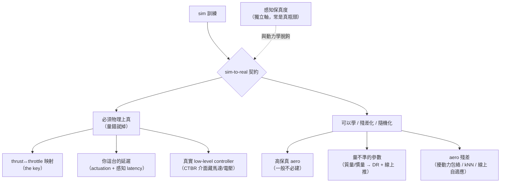
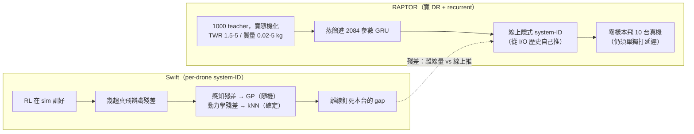

<!-- ontology-5axis output=action-seq injection=sim-in-loop-train control=action|image-init temporal=streaming domain=robotics -->

# Sim-to-Real 契約（無人機篇）—— 什麼必須真、什麼可以學

> 讀近年 *Science Robotics* 的無人機論文，把「sim 訓得漂亮、上機就掉」這件事拆成一份可操作的契約。主要證據：
> - **Wu, …, Fei Gao（浙大）。Precise aggressive aerial maneuvers with sensorimotor policies.** *Sci. Robotics* 11(115)，線上 2026-06-10，[10.1126/scirobotics.aeb0180](https://www.science.org/doi/10.1126/scirobotics.aeb0180) · arXiv [2604.05828](https://arxiv.org/abs/2604.05828)（**這就是你看到那篇 6 月的**）
> - **RAPTOR — foundation policy for quadrotor control.** *Sci. Robotics* 2026，[10.1126/scirobotics.aec1481](https://www.science.org/doi/10.1126/scirobotics.aec1481) · arXiv [2509.11481](https://arxiv.org/abs/2509.11481)
> - **Neural-Fly.** *Sci. Robotics* 2022，[10.1126/scirobotics.abm6597](https://www.science.org/doi/10.1126/scirobotics.abm6597)
> - **Learning high-speed flight in the wild.** *Sci. Robotics* 2021，[10.1126/scirobotics.abg5810](https://www.science.org/doi/10.1126/scirobotics.abg5810)
> - **Fully neuromorphic vision and control.** *Sci. Robotics* 2024，[10.1126/scirobotics.adi0591](https://www.science.org/doi/10.1126/scirobotics.adi0591)
> - **SUPER（高速安全 MAV）.** *Sci. Robotics* 2025，[10.1126/scirobotics.ado6187](https://www.science.org/doi/10.1126/scirobotics.ado6187)
> - **Swift（冠軍級競速，Nature 2023）** —— 殘差法的教科書範例，[champion-level-drone-racing.md](./champion-level-drone-racing.md) 已解構。
>
> **為什麼單獨成篇**：本手冊核心是「外觀靠生成、動力學靠物理」（見 [overview](./overview.md)）；但「物理要真到什麼程度」不是一句話講得完的。近兩年 *Science Robotics* 的無人機論文剛好把這條界線**反覆量化**了，值得把它們的經驗逐條讀出來，落成一份契約。

## 一句話總結

舊的經驗法則是：**好的標稱物理（nominal model）+ 忠實的 low-level controller + ~1 分鐘真機數據辨識出的小殘差，勝過重度 domain randomization。** 近年 *Science Robotics* 的無人機論文**大致支持**這條，但補了三個關鍵 refinement：

1. **「必須真」的東西是具體的兩項：thrust↔throttle 映射 + 你自己這台的延遲（actuation / 感知 latency）。** 不是「整個動力學」。
2. **空氣動力學大多是『小殘差 + 隨機化包絡』，不是要你建高保真 aero 模型** —— 除非你的飛行器本身就是一張翅膀（撲翼/變形機）。
3. **有一個有原則的反例（RAPTOR）**：把『量不準的參數』randomize 得夠寬 + 配一個會在線上**隱式辨識**的 recurrent policy，可以**省掉 per-drone 的 system-ID**。所以「最小隨機化」不是唯一解。

外加一條獨立軸：**感知保真度是另一回事**，跟動力學脫鉤，常常才是真正的瓶頸。

*圖：契約的中心線 —— 什麼必須真（thrust map + 你的延遲），什麼可以學（高保真 aero 不必）。*

## 1. 那篇最新的（2026-06）把契約講得最具體

Fei Gao 組這篇做的是**端到端 sensorimotor policy**：機載相機（分割後的縫隙影像 320×256）+ 本體姿態（roll/pitch）**直接**映到 low-level 控制（collective thrust + body rates），讓四旋翼以 **5 cm 餘隙**穿過**傾斜到 90°** 的窄縫，**事先完全不知道縫的位置與朝向**，甚至能穿它沒訓練過的**移動縫**（3–5 m/s）。它把傳統「感知→估計→規劃→控制」整條 stack 換成一個學出來的策略。100% 在模擬裡訓（teacher–student：有特權資訊的 RL oracle 用 DAgger 蒸餾進 recurrent CNN→GRU→MLP 的 student），再加一個 model-based 規劃器做 **informed reset** 去引導 RL 探索窄縫（樣本效率 3×，沒有它 RL 卡在約 70%）。

**它對契約的貢獻是把「必須真」講到具體**——原文明說：

> *「A precise mapping from the desired thrust and the throttle is the key for restricting the sim-to-real gap introduced by thrust execution.」*

也就是：**真正要對的是 thrust↔throttle 那條執行路徑**。他們從真機飛行數據 **system-ID 出 actuation 延遲 `h` 與低通平均窗 `w`**，用 RK4 整進去；並直言「在消費級飛控上準確模擬飛控執行 + 螺旋槳力生成『far from trivial』」。

**剩下沒建模的空氣動力學，他們不去建高保真模型，而是用『擾動 + 隨機化』兜住**：persistent perturbation forces（PF，持續擾動力）、response randomization（RR，乘性 actuator 噪聲、保持數十步）、response-parameter randomization（RPR，把辨識出的延遲再隨機化），再加相機內參 / 邊緣噪聲 / 感知延遲的隨機化。實測：5 cm 餘隙、90° roll / 60° pitch、60° 傾斜縫 **96.7%（29/30）**、>100 次真飛、機載 Jetson Orin NX + PX4、分割推論 ~4 ms、訓練 ~1.5 h。

**一句話**：把 thrust map 與你自己的延遲量準，剩下的不模高保真 aero，用擾動力 + actuator 噪聲 + 感知延遲隨機化，就能把一個端到端視覺策略帶上真機。

## 2. 殘差怎麼補 —— 三條路線

「標稱物理之外的那一截」怎麼處理，近年論文給了三個不同點：

- **離線辨識成殘差（Swift）**：RL 在 sim 訓好，再用幾趟真飛辨識 reality gap 的殘差，且**按性質拆**——**感知/VIO 殘差用 Gaussian Process（隨機性）**、**動力學殘差用 kNN（大致確定性）**。原文：「perception residuals are stochastic, while dynamic residuals are largely deterministic.」這是「小殘差」法的標準範本。
- **線上自適應（Neural-Fly）**：把空氣動力學殘差**分解**成「離線 meta-learn 的風-不變共享基底（DAIML，只用 12 分鐘飛行）」+「線上更新的低維風-特定係數」。標稱動力學扛大頭，線上只動幾個係數，公分級追蹤撐到 **12.1 m/s 風**。
- **在線上隱式辨識（RAPTOR，見 §5）**：根本不離線辨識，靠 recurrent policy 從觀測/動作歷史**自己推**出當前這台的潛在動力學參數。

三條路線的共識：**標稱物理是骨架，殘差/自適應只填那一截**；分歧在「殘差是離線量、線上自適應、還是讓策略自己在線上推」。

## 3. 必須真 vs 可以學 —— 分層契約

| 層 | 必須物理上真（量錯就掉） | 可以學 / 殘差化 / 隨機化 | 代表證據 |
|---|---|---|---|
| **執行（actuation）** | **thrust↔throttle 映射**、**你這台的 actuation 延遲** | 延遲值的隨機化包絡（RPR） | 2026-06 gap-flight（thrust map「the key」+ sysID 延遲） |
| **剛體動力學** | 質量 / 慣量 / 推力係數（**system-ID，別對已知量做 DR**） | 量不準的就 randomize 並讓策略推（見 §5） | Swift；RAPTOR；SimpleFlight |
| **高階空氣動力學** | （一般**不需**高保真）；除非飛行器本身是翅膀 | rotor drag / blade flapping / induced：殘差（NeuroBEM/Swift kNN）或線上自適應（Neural-Fly）或擾動力包絡（gap-flight PF） | Neural-Fly；Swift；gap-flight |
| **低層控制器** | **建真實 low-level controller**（Betaflight/ESC/電壓），用 **CTBR** 介面 | —— | Swift；gap-flight；RAPTOR 都用 CTBR |
| **感知（見 §4）** | 你**模不真**的模態放真實資料 | 能抽象 + appearance 隨機化的放 sim | 高速 in-the-wild；neuromorphic；Saranga |

**為什麼 CTBR 一再出現**：collective thrust + body rates 這個動作介面把「馬達延遲、電壓下垂」這些難模的東西**藏在真實低層控制器後面**，策略只管出 thrust 與角速度——所以 Swift、gap-flight、RAPTOR 不約而同用 CTBR 而非直接馬達轉速。**換句話說：選對動作抽象，能把一半的 sim-to-real 難題消掉。**

## 4. 感知是另一條軸（跟動力學脫鉤）

近年論文反覆顯示：**感知保真度跟動力學保真度是兩件事，而且感知常常才是綁住 sim-to-real 的那一條**。處理方式分兩種：

- **能抽象 + 隨機外觀就放 sim**：「高速 in-the-wild」把 NN 輸出設成**抽象的無碰撞軌跡**（不是原始馬達命令），對 sim-real 視覺差不敏感，純 sim + 外觀/幾何隨機化就**零樣本**飛進森林/建築（40 km/h）。**選一個對視覺 gap 魯棒的輸出抽象，是感知遷移的關鍵。**
- **模不真的模態放真實資料**：neuromorphic 那篇把 event-camera 視覺**用真實 event 資料自監督**訓（event 統計難模真），控制才放 sim 用演化學——**「模得真的放 sim、模不真的放真實資料」的分裂策略**。Saranga（超聲波導航）同理：綁住它的是**回波/感測保真度**，不是飛行動力學。

→ 這條軸對本手冊的「生成資料」很關鍵：見 [generative-aerial-data.md](./generative-aerial-data.md)（外觀可生成，但 metric scale 與某些感測模態要小心）。

## 5. RAPTOR 的反例：到底要不要 per-drone system-ID？

RAPTOR 是這份契約裡**最重要的 nuance**。它把 **1000 個 RL teacher（各自在隨機化的 sim 四旋翼上訓）蒸餾進一個只有 2084 參數的 GRU**，然後**零樣本飛 10 台真實四旋翼**（31.9 g–2.4 kg、有刷/無刷、PX4/Betaflight/Crazyflie/M5StampFly 都行）。它的主張幾乎與「小殘差」法相反：

- **把量不準的參數 randomize 得很寬**：TWR 1.5–5、質量 0.02–5 kg、torque-to-inertia 40–1200、馬達上升 0.03–0.1 s / 下降 0.03–0.3 s。
- **靠 GRU 的遞迴在線上做「emergent implicit system identification」**——從觀測/動作歷史**自己推**出與 I/O 行為相關的那部分潛在動力學，原文：「the policy has to learn to implicitly identify the unobserved/latent dynamics variables on the fly… it only needs to infer the parts… relevant to the input/output behavior.」
- **但延遲仍要單獨處理**：對沒有 EKF 的板子，加一個加速度計積分濾波去打 10–30 ms 估計延遲。

**和「小殘差」法怎麼調和？** —— **randomize 你『沒法逐台量』的參數（質量/慣量/TWR/馬達延遲），讓策略自己在線上推；但你『能量』的（thrust map、你自己的延遲）還是要實測釘死。** RAPTOR 沒推翻契約，它把契約裡「殘差」那一截從『離線手動辨識』換成『線上隱式辨識』，代價是要一個 in-context 自適應（recurrent）的策略 + 夠寬且結構化的隨機化。

*圖：殘差那一截 —— Swift 離線逐台標定，RAPTOR 用寬 DR 讓策略線上自己推（省 per-drone system-ID）。*

> 對照組（model-based 一端）：**SUPER**（HKU，>20 m/s、避 2.5 mm 細線）完全不學——靠**忠實的 LiDAR 幾何感知 + 顯式安全保證**。它提醒：當感知夠真、約束寫明確，安全層**可以完全不需要學習**。契約的兩端：一端純殘差學習，一端純模型保證。

## 6. 給工程師的 checklist

1. **動作介面用 CTBR**，並**建真實 low-level controller**（含 ESC/電壓）——先把難模的執行細節藏到控制器後面。
2. **實測 thrust↔throttle 映射 + 你這台的 actuation/感知延遲**，system-ID 進 sim（別對這兩項做 DR）。
3. **質量/慣量/推力係數能量就量**（system-ID）；**量不準的（或要跨多台）才 randomize**，並考慮用 recurrent policy 讓它線上推（RAPTOR 路線）。
4. **空氣動力學別急著建高保真模型**：先用擾動力 + actuator 噪聲包絡（gap-flight），不夠再上殘差（Swift kNN / NeuroBEM）或線上自適應（Neural-Fly）。
5. **感知獨立處理**：選對視覺 gap 魯棒的輸出抽象 + 外觀隨機化；**模不真的感測模態（event/超聲波）放真實資料**。
6. **用 model-based prior 當骨架**（informed reset / 安全層），別讓學習從零硬扛動力學。

## 7. 參考

- gap-flight（2026-06）— [10.1126/scirobotics.aeb0180](https://www.science.org/doi/10.1126/scirobotics.aeb0180) · arXiv [2604.05828](https://arxiv.org/abs/2604.05828)
- RAPTOR — [10.1126/scirobotics.aec1481](https://www.science.org/doi/10.1126/scirobotics.aec1481) · arXiv [2509.11481](https://arxiv.org/abs/2509.11481)
- Neural-Fly — [10.1126/scirobotics.abm6597](https://www.science.org/doi/10.1126/scirobotics.abm6597)（arXiv 2205.06908）
- 高速 in-the-wild — [10.1126/scirobotics.abg5810](https://www.science.org/doi/10.1126/scirobotics.abg5810)（arXiv 2110.05113）
- neuromorphic vision+control — [10.1126/scirobotics.adi0591](https://www.science.org/doi/10.1126/scirobotics.adi0591)
- SUPER — [10.1126/scirobotics.ado6187](https://www.science.org/doi/10.1126/scirobotics.ado6187)
- Swift（Nature 2023）— [champion-level-drone-racing.md](./champion-level-drone-racing.md)
- 相關：[Dream to Fly](./dream-to-fly.md)（latent-WM 路線的 HIL 邊界）· [aerial-sim-stack](./aerial-sim-stack.md)（sim 隱藏了哪些項）

## §8 踩坑日誌

| # | 坑 | 嚴重度 | 來源 | 繞法 |
|---|---|---|---|---|
| 8.1 | **對「已知可量」的參數做 domain randomization**（質量/慣量/thrust map） | 🔴 High | gap-flight / SimpleFlight 都強調先 system-ID | 量得到的就量、釘死；DR 只留給量不準的 |
| 8.2 | **以為動作直出馬達轉速也行** → 馬達延遲/電壓把 aggressive 飛行打爆 | 🔴 High | Swift / gap-flight / RAPTOR 全用 CTBR | 改 CTBR + 真實低層控制器 |
| 8.3 | **想用高保真 aero 模型一步到位** | 🟠 Medium | 無人機 aero 難建且難泛化（NeuroBEM 都要 NN 殘差） | 先擾動力包絡，不夠再殘差/線上自適應 |
| 8.4 | **把感知 gap 當動力學 gap 一起處理** | 🟠 Medium | neuromorphic / Saranga：感測模態才是瓶頸 | 感知獨立軸：抽象+外觀 DR，或真實資料 |
| 8.5 | **照搬 RAPTOR 的『不用 system-ID』但漏了延遲** | 🟠 Medium | RAPTOR 仍加延遲濾波打 10–30 ms | in-context 自適應≠不管延遲；延遲仍要處理 |
| 8.6 | **把 arXiv 數字當定論**（如 Swift 峰值 ~5g、~100 km/h 來自新聞稿） | 🟡 Low | 部分數字源於 press 非 paywall 正文 | 引用精確數字標 `UNVERIFIED`，以正文為準 |
