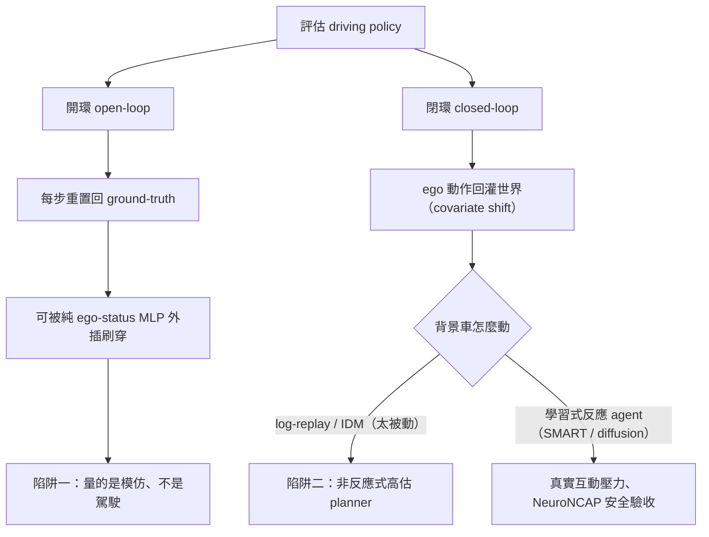
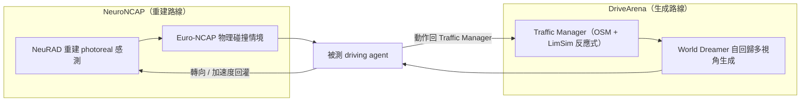

<!-- ontology-5axis output=N/A injection=sim-in-loop-infer control=action temporal=streaming domain=driving -->

# 閉環，否則白搭 —— 開環陷阱與反應式 agent 解構

> 本篇不解構某一個生成模型，而是解構一條**契約條款**：自駕 sim 的「外觀靠生成、動力學靠物理」分工裡，**動力學那一半的驗收標準到底是什麼**。主要證據：
> - **Is Ego Status All You Need for Open-Loop End-to-End Autonomous Driving?**（Zhai 等，CVPR 2024）arXiv [2312.03031](https://arxiv.org/abs/2312.03031) —— open-loop 的「刷穿」實驗。
> - **AD-MLP / DriveE2E** 閉環 benchmark —— 開環排名在閉環下**反轉**的最銳利數據點（DriveE2E 數字 `UNVERIFIED`，見 §2）。
> - **nuPlan**（Caesar 等）arXiv [2106.11810](https://arxiv.org/abs/2106.11810) —— 閉環規劃 benchmark 的三協定錨點。
> - **When Planners Meet Reality: How Reactive Agents Affect Closed-Loop Planning Benchmarks**，arXiv [2510.14677](https://arxiv.org/abs/2510.14677) —— 把 rule-based IDM 換成學習式反應 agent，重排了 14 個 planner。
> - **nuPlan-R**，arXiv [2511.10403](https://arxiv.org/abs/2511.10403) —— 用 diffusion 反應式 agent 取代 IDM。
> - **CARLA**（Dosovitskiy 等，CoRL 2017）arXiv [1711.03938](https://arxiv.org/abs/1711.03938) + **ScenarioRunner** —— 開源閉環標準。
> - **NeuroNCAP**（Ljungbergh 等，ECCV 2024）arXiv [2404.07762](https://arxiv.org/abs/2404.07762) —— 把「重建外觀 + 物理碰撞情境 + 閉環」端到端兜起來。
> - **DriveArena**，arXiv [2408.00415](https://arxiv.org/abs/2408.00415) —— 生成式對應：真閉環的 World Dreamer。
>
> **為什麼進名單**：本手冊的核心命題是「外觀靠生成、動力學靠物理」（見 [overview](./overview.md)）。但很多人把這條讀成「只要視覺夠真，sim 就成立」——**漏了動力學那一半**。動力學那一半的具體名字，就是**閉環（closed-loop）+ 反應性（reactivity）**：你的 policy 動作必須**真的改變**接下來看到的世界，而世界裡的其他車也必須**真的回應**你。本篇把這條補上，並指出它其實是**兩層陷阱**——大多數團隊只防到第一層。

## 1. 一句話總結 —— 兩層陷阱

自駕 sim 的動力學驗收，有兩個**依序**的陷阱；防住第一層不代表防住第二層。

- **第一層：開環 metric 可被刷。** open-loop 評估把每一步都餵真實的「上一刻 ground-truth」，於是模型只要**外插自己的歷史軌跡**就能拿高分。最狠的反例：一個**只吃 ego status、完全不看相機/LiDAR** 的小 MLP，在 open-loop nuScenes 上達到 SOTA 規劃（Is Ego Status…，2312.03031）。**open-loop L2 量的是「模仿駕駛記錄」，不是「會不會開」。**
- **第二層：即使閉環，非反應式 agent 仍會 flatter 你的 planner。** 把 sim 接成閉環（policy 動作回灌世界），第一層就破了——但如果背景車是 **log-replay（按錄影重播，完全不理你）** 或 **IDM（只跟前車、無視鄰道）**，它們**太被動**，於是高估你 planner 的真實能力（When Planners Meet Reality，2510.14677）。

**核心論點：閉環之所以重要，是因為 `compounding error` / `covariate shift`——open-loop 永遠把你拉回真實軌跡附近，閉環才會讓你的小誤差自己滾大。而「反應性」本身是一條獨立的保真度軸，不是預設給定的。** 一句話：**Closed-loop, or bust——而且 reactive closed-loop, or still bust.**

*圖：兩層陷阱 — 開環被 ego-status 刷穿，閉環但非反應式仍高估 planner，只有反應式閉環才算數*

| | 第一層陷阱 | 第二層陷阱 |
|---|---|---|
| 騙術 | open-loop metric 被 **ego-status 外插** 刷穿 | 閉環但 **agent 非反應式（log-replay / IDM）** 高估 planner |
| 病根 | 每步重置回 GT → 無 covariate shift | 背景車不回應 ego → 無真實互動壓力 |
| 證據 | 2312.03031（ego-only MLP SOTA）；DriveE2E 反轉 | 2510.14677（IDM 高估）；nuPlan-R |
| 解藥 | 接閉環（NeuroNCAP / DriveArena / CARLA / nuPlan） | 上學習式反應 agent（SMART / SLEDGE / diffusion） |

## 2. 第一層：開環 metric 可被刷（ego-status 實驗）

**Is Ego Status All You Need?**（2312.03031, CVPR'24）是這條陷阱最乾淨的證明。作者做了一個**只吃 ego status**（自車速度/加速度/航向/歷史，**不接任何相機或 LiDAR**）的純 MLP，在 **open-loop nuScenes** 上達到與當時 SOTA 端到端規劃器相當、甚至更好的 L2 位移誤差——把帶完整感知的重模型的 **L2 約壓低 30%** 等級的差距吃掉。更尖銳的對照：把真正的端到端模型**遮掉影像輸入**，open-loop 規劃分數**幾乎不變**。

**這說明什麼**：open-loop nuScenes 的軌跡高度可由自車運動學**外插**。模型不需要「理解場景」，只要**延續自己的動量**就能對齊 logged future。所以：

> **open-loop L2 / collision-rate 量的是「對人類駕駛記錄的模仿相似度」，而不是「駕駛能力」。** 它的排行榜可以被一個沒有感知的模型刷穿。

這也是為什麼 nuScenes open-loop planning 在 2024 後被社群當成**必須配閉環一起看**的指標，而不是單獨結論。

> **佐證（AD-MLP / DriveE2E，數字 UNVERIFIED）**：同期 **AD-MLP** 也展示了「純運動學 MLP 在 open-loop 很強」。但把同一類模型放進 **DriveE2E 閉環** benchmark，AD-MLP 的平均位移誤差據報崩到 **約 8.36 m**，而 UniAD / VAD 這類帶感知的端到端模型大幅勝出 —— **開環排行榜在閉環下直接反轉**。這是「開環陷阱」最銳利的單一數據點：同一個模型，換評估協定，名次倒過來。
> ⚠️ DriveE2E 的 **8.36 m** 與「反轉方向」依二手整理，未在本輪逐字核對原文 → 標 `UNVERIFIED`；方向性結論（open-loop 強 → closed-loop 崩）與 ego-status 論文的機制一致，可信，但**精確數字引用前請回原始 leaderboard 核對**。

## 3. 第二層：反應式才算數（IDM 高估 planner；學習式反應 agent）

接上閉環，第一層就破了——但**閉環不是只有一種**。**nuPlan**（2106.11810）把這件事講得最清楚：它是大規模閉環規劃 benchmark（1500 小時真實駕駛），定義了**三個協定**——

1. **open-loop（OLS）**：純預測，每步重置回 log（=第一層那種，會被刷）。
2. **non-reactive closed-loop（log replay）**：ego 真的閉環，但背景車**按錄影重播**，完全不理 ego。
3. **reactive closed-loop（IDM）**：背景車用 **Intelligent Driver Model** 跟車反應。

metric 是 **at-fault collision / drivable-area compliance / comfort / progress / speed-limit / driving-direction** 的組合分（CLS）；長尾用 **Test14 / Test14-Hard** 切出來。**光是這三協定的存在，就已經把「閉環不是一個 0/1 開關，而是一條譜」寫進了 benchmark 設計。**

但 IDM 還不夠。**When Planners Meet Reality**（2510.14677）做了關鍵實驗：**把 nuPlan 的 rule-based IDM 背景 agent 換成學習式反應 agent SMART**，重跑 **14 個 planner**。發現：

- **多數 planner 的分數變差了**——因為 SMART 會**真的反應**（變道、博弈、不只盯前車），互動壓力更大。
- **但在 multi-lane / 互動密集的場景，多數 planner 反而變好**——因為這些場景裡，IDM 的「只跟前車、忽略鄰道」會**製造假碰撞**（鄰道車不會讓，ego 被誤判 at-fault）；換成會反應的 agent 後，這類假陽性消失。
- 結論：**IDM 因為太被動，系統性地高估了 planner 的能力**——它既在某些場景過度寬鬆（不施加互動壓力），又在另一些場景過度嚴苛（製造假碰撞）。
- 而且 planner 之間**反應不一**：**閉環訓練（closed-loop-trained）的 planner 最穩**；**純學習式 planner 在 edge-case 驟降**；**rule-based planner 雖上限低，但仍保住基本功能**。作者主張把 **SMART-reactive 當成新的評估標準**。

**nuPlan-R**（2511.10403）把這條再推一步：用 **diffusion-based 反應式 agent** 取代 IDM，並新增 **Success-Rate** 與 **All-Core-Pass-Rate** 兩個更嚴的指標。

**反應式 agent 的譜系**（一句話）：**SimNet**（2105.12332）/ **TrafficGen** / **SMART**——從 **log-replay（非反應）** 一路演化到 **學習式反應**。這條譜系本身就是「反應性是一條可以越做越真的保真度軸」的直接證據：它不是 sim 預設送你的，是要**單獨投資**的。

> **把第二層說死**：閉環只解決了「ego 的動作會不會改變世界」；它**沒有**自動解決「世界裡的其他人會不會回應 ego」。後者是另一條軸。一個閉環但 log-replay 的 benchmark，仍然是在對著**不會還手的沙包**打分。

## 4. 把命題端到端兜起來：NeuroNCAP / DriveArena

前兩節是「拆」；這節是「合」——把**重建/生成的外觀 + 物理碰撞情境 + 閉環 + 反應**全部接在一起，看一個完整系統長什麼樣。

**NeuroNCAP**（2404.07762, ECCV'24）是**重建路線**的端到端證據。它把三件事縫起來：

- **外觀來自重建**：用 **NeuRAD**（neural rendering）從真實 log 重建 photoreal 的感測輸入（這對應 [neural-reconstruction-sim.md](./neural-reconstruction-sim.md) 那條路線）。
- **情境來自物理**：套 **Euro-NCAP 式**的**正面（frontal）/ 側向（side）/ 靜止障礙（stationary）碰撞情境**——這些是標準化的安全測試場景，不是隨機路況。
- **閉環是真的**：ego 的**轉向 / 加速度每一步都改變被渲染的感測輸入**——也就是 policy 的動作真的回灌進「它看到的世界」。這正是 `injection=sim-in-loop-infer` 的字面定義（見 §5）。

**最關鍵的發現**，也正好把本篇兩層命題收口：

> **在 open-loop nuScenes 上表現好的模型，在 NeuroNCAP 閉環下碰撞率顯著更高。**

這是在**真實感測輸入（photoreal）上、獨立於 nuPlan 的 state-based 設定**，再一次證實了開環陷阱——而且這次是在像素層面、用重建外觀做的。它同時打到兩層：open-loop 好 ≠ closed-loop 好（第一層），而且這個閉環是會撞給你看的、施加真實物理碰撞壓力的（第二層的精神）。

> ⚠️ NeuroNCAP 的**精確每情境碰撞率數字**只在 PDF 正文/表格裡；本輪只確認了**方向**（open-loop 好的模型閉環碰撞更高）。具體數值引用前請回 PDF 核對 → 標 `UNVERIFIED`。

**DriveArena**（2408.00415）是**生成式對應**——同一個命題，換成「生成」而非「重建」外觀：

- **Traffic Manager**：吃 **OpenStreetMap (OSM)** 道路圖 + **LimSim** 的**反應式**交通流——也就是它的背景車**是會反應的**（直接回應第二層）。
- **World Dreamer**：**autoregressive 多視角生成**模型，把 Traffic Manager 的 layout 渲成多相機影像，餵給被測 driving agent。
- **真閉環**：agent 的動作回到 Traffic Manager，改變下一步的 layout 與生成畫面。用 **PDMS / ADS** 評 **UniAD**。

**NeuroNCAP（重建）與 DriveArena（生成）是同一枚硬幣的兩面**：前者把真實 log 重建成可閉環的感測流，後者把交通生成成可閉環的感測流。兩條路線都同意——**閉環 + 反應 + photoreal 三者缺一，這個 sim 的動力學那一半就沒驗收。**

*圖：同一枚硬幣兩面 — 重建（NeuroNCAP）與生成（DriveArena）各自把外觀接成「閉環＋反應＋photoreal」的感測流*

> ⚠️ DriveArena 對 **VAD** 的評估數字 `UNVERIFIED`（本輪只確認對 UniAD 的評估鏈路 + PDMS/ADS 指標）。

## 5. 五軸定位（injection=sim-in-loop-infer）

本篇頂部標 `output=N/A`（不是生成模型，是契約/評估解構）。重點落在 **Axis 2 = `sim-in-loop-infer`**：

| 軸 | 值 | 為什麼 |
|---|---|---|
| Output | `N/A` | 本篇解構的是**評估協定/契約**，不交付生成物。對齊 ontology「純評測 benchmark → output=N/A」（[ontology](../../cheat-sheet/ontology.md) Axis 1 N/A 條款）。 |
| **Injection** | **`sim-in-loop-infer`** | **這正是「閉環」的 ontology 名字**：sim 在**推理時**進入 rollout 迴圈、用 ego 動作校正下一步觀測。NeuroNCAP「轉向/加速度每步改變被渲染輸入」、DriveArena「動作回灌 Traffic Manager」都是字面的 infer-time sim-in-loop。open-loop 評估則**沒有**這個迴圈 → 沒有這條 injection → 才會被刷。 |
| Control | `action` | ego policy 以**動作**（轉向/加速度/CTBR-類控制）介入；正是動作回灌使第一層陷阱失效。 |
| Temporal | `streaming` | 連續控制迴圈、逐步推進，無固定 clip 窗口。 |
| Domain | `driving` | 道路場景；非 `generalist`（白名單只給 Sora/Veo/Cosmos-Predict/Cosmos-WFM，見 9c）。 |

**一句話把 ontology 與本篇命題對齊**：**「閉環」= Axis 2 的 `sim-in-loop-infer`；「開環陷阱」= 缺了這條 injection，於是退化成 `data-only` 式的記錄模仿。** 而「反應性」目前**五軸沒有專屬格子**——它藏在「sim 迴圈裡的 agent 模型有多真」這個 sub-fidelity 裡，這正是 §8 要記的一條 ontology 缺口。

> **Injection × Temporal 相容性註記**（ontology 9b descriptive note）：`sim-in-loop-infer` 只對 **iterative paradigm** 有意義（`autoregressive` / `latent-rollout` / `streaming-cache` / 連續 `streaming` 控制）。本篇的閉環全屬連續 streaming 控制迴圈，相容；open-loop「每步重置回 GT」**不構成** iteration，因此**根本進不了** `sim-in-loop-infer`——這從 ontology 層面就解釋了為什麼開環會被刷。

## 6. 跨路線綜合（連 driving-world-models 與 neural-reconstruction-sim）

本篇是 autonomous-driving-sim 三條子線的**黏合層**——它定義驗收標準，另外兩條提供實現外觀的手段：

| 子線 | 提供什麼 | 與本篇的關係 |
|---|---|---|
| [driving-world-models.md](./driving-world-models.md)（GAIA-2 / Cosmos-Drive / DriveDreamer 等 **生成式 WM**） | **生成**的可控外觀 + trajectory/layout conditioning | WM 必須能**閉環**（policy 動作回灌、且背景**反應**）才算數；否則只是漂亮的 open-loop 影片產生器。**DriveArena 就是把生成式 WM 接成真閉環的範例。** |
| [neural-reconstruction-sim.md](./neural-reconstruction-sim.md)（NeuRAD / 3DGS 重建） | **重建**的 photoreal 感測流 | 重建提供「真到可以閉環」的外觀；**NeuroNCAP = 重建 + 物理碰撞情境 + 閉環**的端到端證據。 |
| **本篇（closed-loop-or-bust）** | **動力學那一半的驗收標準**（閉環 + 反應） | 給上面兩條設**及格線**：外觀真不真是它們的事；**動作會不會改變世界、世界會不會回應**是本篇的事。 |

**最關鍵的跨線命題**：把本手冊的 slogan 補完整——「**外觀靠生成/重建，動力學靠物理**」裡的「**動力學**」，在自駕語境下**不是車輛動力學方程**那麼簡單，而是 **(a) 你的動作閉環回灌（compounding error）+ (b) 他人對你的反應（interactive covariate shift）**。CARLA（1711.03938）+ ScenarioRunner 早就提供了「全 stack 感測→控制」的開源閉環骨架，但它的**幾何式渲染 → 感測真實感/內容多樣性的 sim-to-real gap 大**（量化緩解：**R-CARLA 砍動力學 gap 42% / 感測 gap 82%**）——這正好說明**閉環骨架（CARLA 有）與 photoreal 外觀（要靠重建/生成補）是兩件正交的事**：你要把 driving-world-models 或 neural-reconstruction 的外觀，灌進 CARLA-式的閉環骨架，才湊齊一份完整的 sim 契約。

對照本倉其他 use-case 的同形命題：aerial-sim 的 [sim-to-real 契約](../aerial-sim/sim-to-real-contract.md) 把「必須真 vs 可以學」按**動力學層**切；本篇是它在**自駕評估端**的鏡像——把「必須閉環 vs 可開環刷分」按**互動層**切。兩篇共享同一個 meta-lesson：**保真度是分層的、是要逐項投資的，不是一句『sim 夠真』就帶過。**

## 7. 參考

主要
- Zhai, J. 等. *Is Ego Status All You Need for Open-Loop End-to-End Autonomous Driving?* CVPR 2024. arXiv [2312.03031](https://arxiv.org/abs/2312.03031).
- Caesar, H. 等. *nuPlan: A closed-loop ML-based planning benchmark for autonomous vehicles.* arXiv [2106.11810](https://arxiv.org/abs/2106.11810).（三協定 OLS / non-reactive / reactive(IDM)；Test14 / Test14-Hard）
- *When Planners Meet Reality: How Reactive Agents Affect Closed-Loop Planning Benchmarks.* arXiv [2510.14677](https://arxiv.org/abs/2510.14677).（IDM→SMART，重排 14 planner）
- *nuPlan-R.* arXiv [2511.10403](https://arxiv.org/abs/2511.10403).（diffusion 反應式 agent + Success-Rate / All-Core-Pass-Rate）
- Ljungbergh, W. 等. *NeuroNCAP: Photorealistic Closed-loop Safety Testing for Autonomous Driving.* ECCV 2024. arXiv [2404.07762](https://arxiv.org/abs/2404.07762).（NeuRAD 重建 + Euro-NCAP 情境 + 閉環）
- *DriveArena: A Closed-loop Generative Simulation Platform for Autonomous Driving.* arXiv [2408.00415](https://arxiv.org/abs/2408.00415).（Traffic Manager(OSM+LimSim 反應) + World Dreamer + PDMS/ADS 評 UniAD）
- Dosovitskiy, A. 等. *CARLA: An Open Urban Driving Simulator.* CoRL 2017. arXiv [1711.03938](https://arxiv.org/abs/1711.03938).（+ ScenarioRunner；R-CARLA 砍 gap 42%/82%）

譜系 / 反應式 agent
- *SimNet.* arXiv [2105.12332](https://arxiv.org/abs/2105.12332)（log-replay → 學習式起點）· TrafficGen · SMART（學習式反應 agent）。

佐證（數字 UNVERIFIED）
- AD-MLP / **DriveE2E** 閉環 benchmark（AD-MLP 平均位移誤差 **約 8.36 m**、UniAD/VAD 勝出 → 開環排名反轉）—— 引用精確數字前回原始 leaderboard 核對。

同倉交叉
- [driving-world-models.md](./driving-world-models.md) · [neural-reconstruction-sim.md](./neural-reconstruction-sim.md) · [overview.md](./overview.md) · [../../cheat-sheet/ontology.md](../../cheat-sheet/ontology.md) · [../aerial-sim/sim-to-real-contract.md](../aerial-sim/sim-to-real-contract.md)（同形「保真度分層」命題）

## §8 踩坑日誌

| # | 坑 | 嚴重度 | 來源 | 繞法 |
|---|---|---|---|---|
| 8.1 | **拿 open-loop nuScenes L2 / collision-rate 當「駕駛能力」結論** —— 可被純 ego-status MLP 刷穿 | 🔴 High | Is Ego Status…（2312.03031）：ego-only MLP open-loop SOTA、遮影像分數幾乎不變 | open-loop 只當 sanity check；任何「會不會開」的結論一律要閉環數據背書 |
| 8.2 | **把「閉環」當 0/1 開關** —— 以為接上閉環就完事，忽略背景 agent 反不反應 | 🔴 High | nuPlan 三協定（2106.11810）；When Planners Meet Reality（2510.14677） | 明確區分 non-reactive(log-replay) / reactive(IDM) / learned-reactive(SMART)；報分時標哪一種 |
| 8.3 | **用 IDM 當反應 agent 就以為夠真** —— IDM 只跟前車、忽略鄰道，系統性高估 planner 並製造 multi-lane 假碰撞 | 🟠 Medium | 2510.14677：IDM→SMART 後多數 planner 變差、互動密集場景多數變好 | 上學習式反應 agent（SMART / nuPlan-R diffusion）；至少把 IDM 結果當**寬鬆上界**看 |
| 8.4 | **只投資 photoreal 外觀、不投資閉環 + 反應** —— 漂亮的 open-loop 影片 ≠ 可驗收的 sim | 🟠 Medium | NeuroNCAP（2404.07762）：open-loop 好的模型閉環碰撞率顯著更高；DriveArena 真閉環設計 | 外觀（重建/生成）與閉環骨架（CARLA-式）正交，兩者都要；驗收看閉環碰撞，不看 open-loop L2 |
| 8.5 | **以為 sim-in-loop-infer 對 open-loop 也適用** —— ontology 層面就不相容 | 🟠 Medium | ontology 9b note：`sim-in-loop-infer` 只對 iterative paradigm 有意義；open-loop「每步重置回 GT」非 iteration | 把「閉環 = sim-in-loop-infer」「開環 = 退化成 data-only 記錄模仿」當設計檢查項 |
| 8.6 | **CARLA 開箱即用就拿去當 photoreal sim-to-real 結論** —— 幾何式渲染感測 gap 大 | 🟠 Medium | CARLA（1711.03938）；R-CARLA 量化：動力學 gap −42% / 感測 gap −82%（=原本 gap 大） | CARLA 當閉環**骨架**，外觀層換重建/生成（NeuRAD / World Dreamer）；別把幾何渲染當 photoreal |
| 8.7 | **引用 DriveE2E 8.36 m / NeuroNCAP 每情境碰撞率 / DriveArena-VAD 數字當定論** | 🟡 Low | 本輪只確認方向，精確數值未逐字核對 → `UNVERIFIED` | 方向性結論可用；**精確數字**引用前回原始 leaderboard / PDF 表格核對，否則保留 `UNVERIFIED` 標 |
| 8.8 | **「反應性」想當第六軸塞進 ontology** —— 目前五軸無專屬格子 | 🟡 Low (open) | 本篇 §5：反應性藏在「sim 迴圈裡 agent 模型多真」的 sub-fidelity | 暫記為 ontology 缺口；用 §8 + Injection×Temporal note 描述，等 30+ dissection 後再評估是否拆軸 |

[TBD: verify 8.7 — DriveE2E 的 AD-MLP 8.36 m 與 leaderboard 反轉方向，回原始 benchmark 頁逐字核對]
[TBD: verify 8.7 — NeuroNCAP 各情境（frontal/side/stationary）精確碰撞率，回 ECCV PDF 表格]
