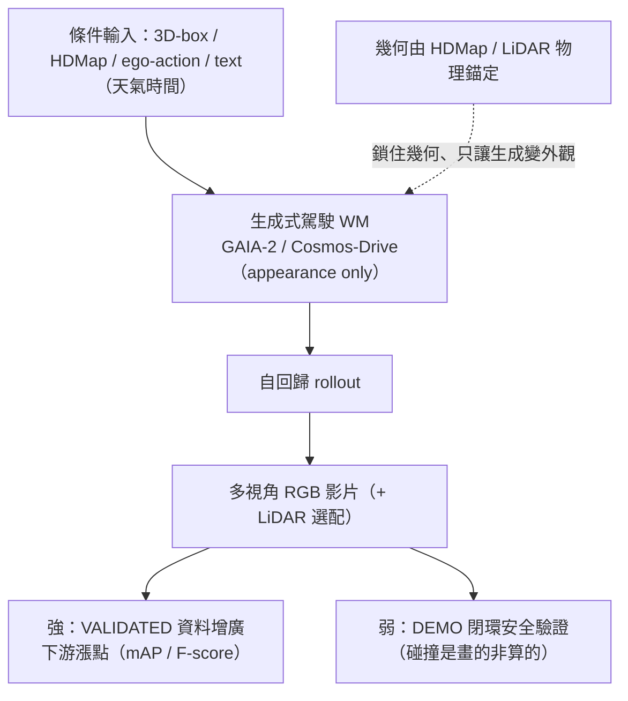

<!-- ontology-5axis output=pixel-video injection=data-only control=action|layout|text temporal=autoregressive domain=driving -->

# 生成式駕駛世界模型 —— GAIA-2 / Cosmos-Drive / Vista 解構

> **引用區**：GAIA-1 [arXiv 2309.17080](https://arxiv.org/abs/2309.17080) · GAIA-2 [arXiv 2503.20523](https://arxiv.org/abs/2503.20523) · Vista [arXiv 2405.17398](https://arxiv.org/abs/2405.17398) · DriveDreamer-2 [arXiv 2403.06845](https://arxiv.org/abs/2403.06845) · GenAD [arXiv 2403.09630](https://arxiv.org/abs/2403.09630) · MagicDrive [arXiv 2310.02601](https://arxiv.org/abs/2310.02601) · Cosmos-Drive-Dreams [arXiv 2506.09042](https://arxiv.org/abs/2506.09042)
>
> **為什麼進名單**：駕駛是「生成式世界模型」**唯一一個控制契約已經收斂**的領域 —— 整條賽道五年內從各說各話收斂到同一組條件（**3D-box + HDMap/road layout + ego-action + text(天氣/時間)**）。對 AV practitioner，這篇要回答的不是「哪個模型 FVD 低」，而是兩個工程決策：**(a) 我能餵什麼進去、拿什麼出來（可控性契約）**；**(b) 它的數字是「下游驗證過的增益」還是「論文裡的好看 demo」（VALIDATED vs DEMO）**。本手冊的乾淨命題在這個領域最鋒利：**幾何由 HDMap/LiDAR 物理錨定，生成模型嚴格只負責外觀（appearance）** —— 這正是 `injection=data-only` 為何在駕駛資料增廣上能奏效、卻不能拿來做閉環安全驗證的根因。

---

## 1. 一句話總結

- **可控性已收斂**。GAIA-2、Cosmos-Drive、DriveDreamer-2、MagicDrive 各自獨立演化，卻全部落到同一組條件介面：**3D agent boxes（位置/朝向/尺寸/類別）+ HDMap/road layout（車道/路型/限速）+ ego-action（speed/steering curvature 或 trajectory）+ text（天氣/時間）**。這不是巧合 —— 是駕駛領域的幾何約束逼出來的均衡。
- **沒有一個是「自身可信的閉環驗證 harness」**。所有公開系統都是 **open-loop 預測** 或 **action-conditioned rollout**（餵動作→生成下一段）。GAIA-2 作者把後者**描述成**「閉環＝迭代生成幀」，但這是 rollout 機制、**不是一個經過驗證的評估 harness**（沒有公開的 policy-in-the-loop 誤差校準）→ 標記 **UNVERIFIED 閉環宣稱**。
- **VALIDATED 與 DEMO 是兩種完全不同的可信度等級**。⚡ **VALIDATED = 拿生成資料做下游增廣，量到 mAP/F-score 漲**（Cosmos-Drive +6.0 F-score 3D-lane、MagicDrive nuScenes mAP 20.85、DriveDreamer-2 改善 3D 偵測+追蹤）。❌ **DEMO = 拿來做閉環安全驗證**（碰撞瞬間是「畫出來」不是「算出來」，pixel realism ≠ behavior realism）。**把 DEMO 級當 VALIDATED 用，是這個領域最貴的工程誤判。**
- **物理錨定程度決定可信度**。Cosmos-Drive 用 **HDMap + LiDAR-depth** 把幾何物理錨定，生成模型只補外觀 → 本手冊命題最乾淨的 VALIDATED-增廣案。純 `data-only`（GAIA / GenAD）在分布外（罕見物體、劇烈轉向）就崩。
- **NO-DUP**：**GAIA-2 內部架構已有 foundation 解構** → [`../../foundations/video-world-models/gaia-2.md`](../../foundations/video-world-models/gaia-2.md)；**Cosmos 引擎內部** → [`../../foundations/foundation-physics-models/cosmos-wfm.md`](../../foundations/foundation-physics-models/cosmos-wfm.md)。本篇是 **use-case 橫向視角**：控制契約收斂 + VALIDATED/DEMO 切分，不重拆它們的內部。



*圖：GAIA-2 式像素端駕駛 WM — 強在外觀與長尾增廣（VALIDATED），弱在動力學閉環驗證（DEMO）*

---

## 2. 控制契約（這領域已收斂的條件）

**核心觀察：餵進去的條件，五年內從發散收斂到下面這四類。** 任何 AV practitioner 接生成式 WM，介面就是這張圖。

```
┌─────────────────────────────────────────────────────────────────┐
│              駕駛生成式 WM 的「已收斂控制契約」                     │
│                                                                   │
│  條件輸入 (CONDITIONING)                  生成輸出 (OUTPUT)         │
│  ──────────────────────                  ──────────────────       │
│                                                                   │
│  ┌── 幾何錨 (geometry anchor) ──┐                                  │
│  │ 3D agent boxes               │  ──┐                            │
│  │   pos / orient / dim / class │    │                            │
│  │ HDMap / road layout          │    │   ┌──────────────┐         │
│  │   lanes / road-graph / 限速  │    ├──►│  生成模型     │──► 多視角│
│  └──────────────────────────────┘    │   │ (appearance  │   RGB   │
│                                       │   │  only)       │   影片   │
│  ┌── 動力學 (dynamics) ─────────┐    │   │              │  (+LiDAR │
│  │ ego-action                   │  ──┤   │ ★幾何不由它  │   選配)  │
│  │   speed / steering curvature │    │   │   決定        │         │
│  │   或 trajectory (points/time)│    │   └──────────────┘         │
│  └──────────────────────────────┘    │                            │
│                                       │   時序: autoregressive /   │
│  ┌── 語意/外觀 (semantics) ──────┐   │         clip-parallel      │
│  │ text                         │  ──┘   (一幀餵下一幀 或 整段)   │
│  │   weather / time-of-day      │                                 │
│  │ camera intrinsics/extrinsics │   ★契約鐵律: 幾何「錨定」進去, │
│  └──────────────────────────────┘      模型「只補」外觀          │
└─────────────────────────────────────────────────────────────────┘
```

**契約的四根支柱（按「物理約束強度」排序）：**

| 支柱 | 具體欄位 | 物理約束強度 | 誰最依賴 |
|---|---|---|---|
| **幾何錨** | 3D-box（pos/orient/dim/class）、HDMap、road-graph、LiDAR-depth | **強**（外部給定、模型不可違反） | Cosmos-Drive（HDMap+LiDAR）、MagicDrive（3D-box+road-map）、DriveDreamer-2（HDMap） |
| **動力學** | ego speed、steering curvature、trajectory | **中**（影響構圖，但仍是 data-driven） | GAIA-2（speed+curvature）、Vista（multi-level action） |
| **語意** | weather、time-of-day、country | **弱**（純外觀調制） | 全部 |
| **相機** | intrinsics / extrinsics、camera pose | **強**（幾何投影約束） | GAIA-2（≤5 環景）、Cosmos-Drive（多視角） |

**為什麼會收斂到這四根？** 駕駛領域的下游任務（3D 偵測、車道、追蹤、規劃）**全部吃 3D 幾何**。如果生成資料的幾何不可控（純 text-to-video），下游模型無法用 —— 因為沒有對齊的 GT label。**所以幾何必須「以 condition 形式錨定進去」，標籤才能跟著生成資料一起產出**。這是契約收斂的根本驅動力，也是 `control=layout` 在駕駛領域幾乎強制的原因（見 [`../../cheat-sheet/ontology.md`](../../cheat-sheet/ontology.md) Axis 3 的 `layout` / `trajectory` 條目，標註「GAIA-2 / Cosmos-Drive 主用」）。

---

## 3. 對比矩陣

**七個系統 × 七個維度。** 讀法：看「條件」欄就知道控制契約怎麼收斂；看「loop」欄就知道沒有一個是真閉環；看「VALIDATED 證據」欄就知道哪些是下游量過的、哪些只是 FID/FVD 好看。

| 系統 | 生成什麼 | 條件（控制契約） | loop 模式 | 關鍵數（author-reported） | VALIDATED 證據 | 主要限制 |
|---|---|---|---|---|---|---|
| **GAIA-1** (Wayve) | 單相機 RGB 影片 | text(天氣/時間) + ego-action(steer/speed) + video context | **open-loop** autoregressive | **9B**（6.5B WM-transformer over VQ tokens + 2.6B video-diffusion decoder）；4,700h 倫敦 | 無下游增益數字（demo-level） | 單視角；long-horizon drift；`data-only` |
| **GAIA-2** (Wayve)<br>★內部見 [foundation](../../foundations/video-world-models/gaia-2.md) | ≤5 環景相機 RGB（448×960 latent-diffusion） | **3D agent boxes**(pos/orient/dim/class) + ego(speed+curvature) + country/weather/time + camera intrinsics/extrinsics + CLIP | **action-conditioned rollout**（作者稱「閉環＝迭代生成幀」→ **UNVERIFIED**） | **8.4B** world model；~25M×2s clips（UK/US/DE） | 無公開下游增益數（vendor demo） | long-horizon/複雜場景「偶有時序或語義不一致」（作者自承）；`data-only` |
| **Vista** (OpenDriveLab) | 高解析長程 RGB 影片 | multi-level action control + image-init | **open-loop** predictor | 勝最佳駕駛 WM **55% FID / 27% FVD**（相對改善，author-reported） | 生成品質 metric，非下游任務增益 | action 控制粒度有限；無 3D-box 幾何錨 |
| **DriveDreamer-2** (AAAI'25) | 多視角 RGB 影片 | **LLM** 把 user text→agent 軌跡→HDMap→video | **open-loop**（text-driven 生成） | **FID 11.2 / FVD 55.7** | ⚡ **生成資料改善 3D 偵測 + 追蹤**（下游量過） | LLM 軌跡幻覺風險；nuScenes scale |
| **GenAD** (OpenDriveLab, CVPR'24) | RGB 影片預測 | image/video context（弱條件） | **open-loop** predictor | **OpenDV-2K ~2000h** YouTube+公開（最大公開駕駛影片集） | 零樣本域遷移（generalization demo，非下游 mAP） | 弱可控（無 3D-box/HDMap）；純預測 |
| **MagicDrive** (ICLR'24) | 多視角街景**圖** | **3 層幾何控制**：scene text+cam pose / foreground 3D-box / background road-map | 單幀生成（非影片 loop） | 增廣 nuScenes：**mAP 20.85、vehicle mIoU 31.05** | ⚡ **直接量到下游 mAP / mIoU** | 單幀（無時序）；街景圖非長程 rollout |
| **Cosmos-Drive-Dreams** (NVIDIA) ★引擎見 [cosmos-wfm](../../foundations/foundation-physics-models/cosmos-wfm.md) | 多視角時空一致影片 **+ LiDAR** | **HDMap + LiDAR-depth + text ControlNets** + VLM rejection sampling | **open-loop** 合成（資料工廠） | 下游 **+6.0 F-score 3D-lane**(2k clips)、霧天 **+9.4**、**bus +16.5% rel mAP** | ⚡⚡ **最強：多任務下游增益 + 物理錨定** | 重度依賴 HDMap/LiDAR 資產；生成部分嚴格只是外觀 |

**矩陣讀出的三個結論：**

1. **「條件」欄全部含幾何錨**（3D-box 或 HDMap 或兩者）—— 唯二例外是 GenAD（弱條件、純預測）和 Vista（action-only、無 box）。**這證明控制契約已收斂**：要做下游可用的資料，幾何必須錨定進去。
2. **「loop」欄沒有一個是「經驗證的閉環驗證 harness」**。最接近的 GAIA-2 是 **action-conditioned rollout**（餵動作→生成）—— 機制上是迭代，但**沒有公開 policy-in-the-loop 的誤差校準**，所以作者的「閉環」宣稱是 **UNVERIFIED**。其餘全是 open-loop。
3. **「VALIDATED 證據」欄是真正的分水嶺**。Cosmos-Drive / MagicDrive / DriveDreamer-2 **有下游任務數字**（F-score/mAP/mIoU 漲）；GAIA / Vista / GenAD **只有生成品質 metric 或 vendor demo**。FID 11.2 漂亮，但它**不等於**「下游偵測器訓練後更準」。

---

## 4. ⚡ VALIDATED（資料增廣下游增益）/ ❌ DEMO（閉環驗證還不可信）

**這節是整篇的工程重心。** AV practitioner 唯一需要記住的切分：**生成式駕駛 WM 在「資料增廣」上是 production-grade，在「閉環安全驗證」上還是 demo-grade。** 兩者差一個數量級的可信度。

### ⚡ VALIDATED —— 資料增廣有下游增益（可進生產資料管線）

| 證據 | 系統 | 數字（author-reported） | 為什麼可信 |
|---|---|---|---|
| 3D-lane 偵測 | Cosmos-Drive | **+6.0 F-score**（2k clips 增廣） | 幾何由 HDMap+LiDAR **物理錨定**，生成只補外觀 → label 對齊 |
| 惡劣天氣魯棒性 | Cosmos-Drive | 霧天 **+9.4 F-score** | 用生成補真實資料稀缺的天氣分布 |
| 罕見類別 | Cosmos-Drive | **bus +16.5% rel mAP** | 用生成補長尾類別樣本 |
| 多視角 3D 偵測 + BEV | MagicDrive | nuScenes **mAP 20.85、vehicle mIoU 31.05** | 3-層幾何控制（3D-box + road-map）→ 標籤可控 |
| 3D 偵測 + 追蹤 | DriveDreamer-2 | 改善（論文報告，未給單一 headline 數） | HDMap-conditioned，幾何錨定 |

**VALIDATED 為何成立 —— 一句話：因為幾何不是生成出來的，是錨定進去的。** Cosmos-Drive 是最乾淨的例子：HDMap 給道路幾何、LiDAR-depth 給 3D 結構，**生成模型嚴格只負責「這條已知幾何的車道，在霧天傍晚長什麼樣」**。所以產出的影片**自帶對齊的 GT label**（因為 label 就是那個 HDMap/box）。下游偵測器拿這種「外觀多樣、幾何精準」的資料訓練，自然漲點。**這對映 `injection=data-only` 在駕駛的正確用法：物理（幾何）走 conditioning 錨定，外觀走 data-only 生成。**

### ❌ DEMO —— 閉環安全驗證還不可信（不可進 safety case）

| 反例 | 系統 | 觀察 | 為什麼不可信 |
|---|---|---|---|
| 「閉環」宣稱 | GAIA-2 | 作者稱「閉環＝迭代生成幀」 | **UNVERIFIED**：是 action-conditioned rollout，**非經驗證的 eval harness**；無公開 policy-in-loop 誤差校準 |
| Long-horizon 一致性 | GAIA-2 | 複雜場景「偶有時序或語義不一致」（作者自承） | rollout drift；跨 clip 銜接是公開難題 |
| 碰撞物理 | 全部 `data-only` | 碰撞瞬間是「畫出來」不是「算出來」 | pixel realism ≠ contact dynamics；不可做 fine-grained collision validation |
| 分布外物體 | GAIA / GenAD | 動物、施工錐、異常車型 OOD 時 identity 漂 | 純 `data-only` 通病；訓練分布外即崩 |
| 純預測無動作回饋 | GenAD / Vista | open-loop predictor | 預測下一幀 ≠ 對 policy 動作的因果反應 |

**DEMO 為何不可信 —— 一句話：閉環需要「對動作的因果正確反應」，但 `data-only` 只學到「看起來對」。** 閉環安全驗證的本質是：policy 做動作 → 世界**正確地**反應（含碰撞、接觸、長尾因果）→ 驗證 policy 安全。生成式 WM 在前兩步就斷了：(1) 沒有經驗證的 policy-in-loop harness（GAIA-2 的「閉環」是 rollout，**UNVERIFIED**）；(2) 反應是「畫出來的外觀」不是「算出來的物理」。**所以拿生成 WM 做閉環 safety case，會把「視覺合理」誤當「行為安全」** —— 這是 [`./closed-loop-or-bust.md`](./closed-loop-or-bust.md) 反覆論證的核心警告。

> **一句話契約規則給 AV practitioner**：
> **生成 WM 可以告訴你「霧天傍晚那輛 bus 長怎樣」（VALIDATED 增廣），但不能告訴你「你急剎時它會不會撞上來」（DEMO 閉環）。** 前者進資料管線，後者必須回到 neural reconstruction / 可微 sim（見 §6）。

---

## 5. 五軸定位

本篇 header：`output=pixel-video injection=data-only control=action|layout|text temporal=autoregressive domain=driving`（**use-case 橫向綜合 tag**；個別系統的精確 tag 見對比矩陣與 [foundation gaia-2](../../foundations/video-world-models/gaia-2.md)，後者 GAIA-2 latent-diffusion 走 `clip-parallel`）。完整 ontology 見 [`../../cheat-sheet/ontology.md`](../../cheat-sheet/ontology.md)。

| 軸 | 本領域取值 | 理由 |
|---|---|---|
| **Axis 1 Output** | `pixel-video` | 全部交付 RGB 像素影片（Cosmos-Drive 額外配 LiDAR，但主輸出仍 pixel）。**不看內部 latent**，看下游拿到 RGB frame。 |
| **Axis 2 Injection** | `data-only` | **整個領域沒有一個用 PDE/守恆 loss 或 sim-in-loop**。物理（外觀動態）靠駕駛影片隱式學。**幾何走 conditioning 錨定**（layout/box）≠ injection 機制 —— 這是契約精妙處：injection 弱，但 control 強錨幾何。 |
| **Axis 3 Control** | `action \| layout \| text`（+ `trajectory`/`camera`/`param`） | **可控性收斂的核心軸**。`layout`（HDMap/road-graph/3D-box）在駕駛幾乎強制（見 ontology Axis 3 `layout` 條目註「Cosmos-Drive 主用」）；`action`=ego speed/curvature；`text`=天氣/時間。 |
| **Axis 4 Temporal** | `autoregressive`（GAIA-1）/ `clip-parallel`（GAIA-2/Cosmos）| 一幀餵下一幀（drift 累積）或整段 clip（長度受限、跨 clip 銜接難）。**沒有任一是經驗證的閉環時序 harness**。 |
| **Axis 5 Domain** | `driving` | 非 `generalist`（ontology Check 9c 白名單只給 Sora/Veo/Cosmos-Predict）。駕駛專屬幾何先驗是整個領域存在的理由。 |

**跨軸註記（依 ontology Check 9b/descriptive notes）：**
- **Control × Domain**：ontology 明說「`layout`/`trajectory` 通常 `driving`」—— 本領域正是該規則的 canonical 例證。
- **Injection × Temporal**：`data-only` + `autoregressive` 是合法但弱組合（Check 9b 矩陣 `pixel-video × data-only` = ✓）；弱在 long-horizon drift（§4 DEMO）。
- **無 `hard-constraint`**：駕駛 WM **沒有**在像素空間做 exact constraint（ontology Check 9b 標 `pixel-video × hard-constraint` = ✗ too high-dim）—— 這正是物理錨定走 conditioning 而非 injection 的原因。

---

## 6. 跨路線綜合

**生成式駕駛 WM 不是孤島，它在三條駕駛 sim 路線中佔一個明確且有限的位置。** AV practitioner 的系統設計，是把這三條按「可信度需求」分工。

- **× Neural reconstruction（[`./neural-reconstruction-sim.md`](./neural-reconstruction-sim.md)）—— 互補，不是替代**。重建線（3DGS / NeRF / occupancy，從 real log 重演）給**幾何 ground-truth 與可微/可重採的閉環基礎**；生成線給**多樣性與條件控制**。產線標準分工：**real log → 重建 replay 做 regression / 閉環驗證；生成 WM → 合成長尾外觀做資料增廣（VALIDATED）**。Cosmos-Drive 正是這個接縫的工程化 —— 它用 HDMap/LiDAR（重建端的資產）餵生成端，**物理錨定來自重建，外觀多樣來自生成**。

- **× Closed-loop-or-bust（[`./closed-loop-or-bust.md`](./closed-loop-or-bust.md)）—— 本篇是它的反證材料**。那篇論證「沒有可微/可快速重採的閉環，就沒有可信的安全驗證」；本篇用 §4 DEMO 提供具體證據：**生成 WM 的「閉環」（GAIA-2）是 UNVERIFIED rollout，碰撞是畫的不是算的**。結論一致：閉環安全驗證的擔子落在重建+可微 sim，不在純生成。

- **× use-case overview（[`./overview.md`](./overview.md)）**：overview 列的「三個工程問題」（long-horizon / 多視角一致 / closed-loop）—— 本篇給出現狀判定：long-horizon = drift 未解（§4）；多視角一致 = GAIA-2 ≤5 環景已做但 sharp maneuver 脆；closed-loop = **尚無經驗證 harness**（最大缺口）。

- **× foundation 內部（NO-DUP 邊界）**：GAIA-2 latent-diffusion 架構、conditioning 細節 → [`../../foundations/video-world-models/gaia-2.md`](../../foundations/video-world-models/gaia-2.md)；Cosmos WFM 引擎（tokenizer/diffusion 底座/ControlNet 機制）→ [`../../foundations/foundation-physics-models/cosmos-wfm.md`](../../foundations/foundation-physics-models/cosmos-wfm.md)。**本篇只做橫向 use-case 視角，不重拆它們內部。**

- **× Spatial 駕駛 embodiment（cross-handbook）**：姊妹手冊 Spatial-Intelligence-Handbook 的駕駛章從 **embodiment/感知** 視角切同一批系統 —— 兩冊互補：本冊問「生成什麼、控制契約、增廣是否 VALIDATED」；Spatial 問「駕駛 agent 怎麼感知 + 表徵 3D 世界」。對位閱讀見 <https://github.com/sou350121/Spatial-Intelligence-Handbook/tree/main/embodiments/driving>。

---

## 7. 參考

**Canonical（FID/FVD 皆 author-reported；閉環宣稱 tag beyond UNVERIFIED）：**

1. Hu et al. *GAIA-1: A Generative World Model for Autonomous Driving*. Wayve. arXiv:2309.17080. <https://arxiv.org/abs/2309.17080> — 9B（6.5B WM-transformer over VQ tokens + 2.6B video-diffusion decoder）、單相機 autoregressive、4,700h 倫敦、open-loop。
2. Wayve. *GAIA-2: A Controllable Multi-View Generative World Model for Autonomous Driving*. arXiv:2503.20523. <https://arxiv.org/abs/2503.20523> — ≤5 環景 448×960 latent-diffusion、8.4B、3D-box + ego(speed/curvature) + country/weather/time + camera intrinsics/extrinsics + CLIP、~25M×2s clips（UK/US/DE）。**「閉環＝迭代生成幀」= action-conditioned rollout，非經驗證 eval harness（UNVERIFIED）。** 內部架構解構見 [foundation gaia-2](../../foundations/video-world-models/gaia-2.md)。
3. Gao et al. *Vista: A Generalizable Driving World Model with High Fidelity and Versatile Controllability*. OpenDriveLab. arXiv:2405.17398. <https://arxiv.org/abs/2405.17398> — 高解析長程、multi-level action control、勝最佳駕駛 WM 55% FID / 27% FVD（author-reported 相對改善）。
4. Zhao et al. *DriveDreamer-2: LLM-Enhanced World Models for Diverse Driving Video Generation*. AAAI 2025. arXiv:2403.06845. <https://arxiv.org/abs/2403.06845> — LLM 把 user text→agent 軌跡→HDMap→video，FID 11.2 / FVD 55.7，生成資料改善 3D 偵測+追蹤（⚡ VALIDATED 下游增益）。
5. Yang et al. *Generalized Predictive Model for Autonomous Driving (GenAD)*. OpenDriveLab. CVPR 2024. arXiv:2403.09630. <https://arxiv.org/abs/2403.09630> — OpenDV-2K ~2000h YouTube+公開（最大公開駕駛影片集）、零樣本域遷移、open-loop predictor。
6. Gao et al. *MagicDrive: Street View Generation with Diverse 3D Geometry Control*. ICLR 2024. arXiv:2310.02601. <https://arxiv.org/abs/2310.02601> — 多視角街景圖、3 層幾何控制（scene text+cam pose / foreground 3D-box / background road-map）、增廣 nuScenes mAP 20.85、vehicle mIoU 31.05（⚡ VALIDATED）。
7. NVIDIA. *Cosmos-Drive-Dreams: Scalable Synthetic Driving Data Generation with World Foundation Models*. arXiv:2506.09042. <https://arxiv.org/abs/2506.09042> — 多視角時空一致影片 + LiDAR、HDMap+LiDAR-depth+text ControlNets + VLM rejection sampling、下游 +6.0 F-score 3D-lane(2k clips) / 霧天 +9.4 / bus +16.5% rel mAP（⚡⚡ 最乾淨 VALIDATED-增廣案）。引擎內部見 [cosmos-wfm](../../foundations/foundation-physics-models/cosmos-wfm.md)。

**Ontology / cross-handbook：**

8. 本倉 ontology v2.0 — [`../../cheat-sheet/ontology.md`](../../cheat-sheet/ontology.md)（Axis 3 `layout`/`trajectory`/`camera` 條目；Check 9b `pixel-video × data-only` = ✓、× `hard-constraint` = ✗）。
9. Spatial-Intelligence-Handbook 駕駛 embodiment（感知/表徵對位視角）— <https://github.com/sou350121/Spatial-Intelligence-Handbook/tree/main/embodiments/driving>。

---

## §8 踩坑日誌

> 來源：(a) 作者 paper 自承 limitation、(b) 公開 demo 可觀察破綻、(c) 數字解讀陷阱。嚴重度：H=阻止用於該用途 / M=工程可繞 / L=外觀瑕疵。**所有 FID/FVD/mAP/F-score 皆 author-reported；閉環宣稱 beyond UNVERIFIED。**

| # | 來源 | 摘錄 / 觀察 | 嚴重度 | 繞法 |
|---|---|---|---|---|
| §8.1 | GAIA-2 作者宣稱 | 「閉環＝迭代生成幀」**= action-conditioned rollout，非經驗證 eval harness**（UNVERIFIED） | **H** | 閉環安全驗證回到 neural reconstruction + 可微 sim（[closed-loop-or-bust](./closed-loop-or-bust.md)）；生成 WM 僅做增廣 |
| §8.2 | 全領域 `injection=data-only` | 碰撞瞬間是「畫出來」非「算出來」—— pixel realism ≠ contact dynamics | **H** | 不可做 fine-grained collision/safety validation；碰撞物理交給 sim-in-loop（CARLA/Genesis）或重建端 |
| §8.3 | **數字解讀陷阱（最常見誤判）** | FID 11.2 / FVD 漂亮 **≠** 下游偵測器更準。**生成品質 metric 與下游任務增益是兩回事** | **H** | 採購/選型只認 ⚡ VALIDATED（下游 mAP/F-score 漲過）；不要用 FID/FVD 拍板資料增廣價值 |
| §8.4 | GAIA-2 作者自承 | long-horizon/複雜場景「偶有時序或語義不一致」 | M | 限制 rollout 長度；複雜場景用重建 replay 補；跨 clip 銜接加 consistency 後處理 |
| §8.5 | GAIA / GenAD（`data-only`） | 罕見物體（動物/施工錐/異常車型）OOD 時 identity 漂 | M | 用 structured 3D-box/layout conditioning 注入幾何；不依賴純 text 生成長尾 |
| §8.6 | Cosmos-Drive 資產依賴 | +6.0 F-score 等增益**前提是有 HDMap + LiDAR-depth 餵進去** | M | 沒有高品質 HDMap/LiDAR 資產時增益不成立 —— 先確認重建端資產管線就緒 |
| §8.7 | DriveDreamer-2 LLM 軌跡 | LLM 生成 agent 軌跡有**幻覺**風險（不合物理/路權的軌跡） | M | 軌跡過 HDMap/road-graph 合法性檢查再餵生成；不盲信 LLM 輸出 |
| §8.8 | Vista / GenAD = open-loop predictor | 「預測下一幀」≠「對 policy 動作的因果反應」 | M | 不可當閉環反饋環節；只用於 open-loop 預測品質 / 域遷移評估 |
| §8.9 | MagicDrive 單幀 | 量到 nuScenes mAP 20.85 但**是單幀街景圖**，無時序 rollout | L | 用於影像級 BEV/偵測增廣 OK；長程時序場景需配影片級系統 |
| §8.10 | 跨系統 metric 不可比 | 各系統 FID/FVD 用不同資料集/協議 author-reported，**橫向比較無意義** | L | 只在同系統內看相對改善；跨系統只比「有無 VALIDATED 下游證據」這個二元軸 |
