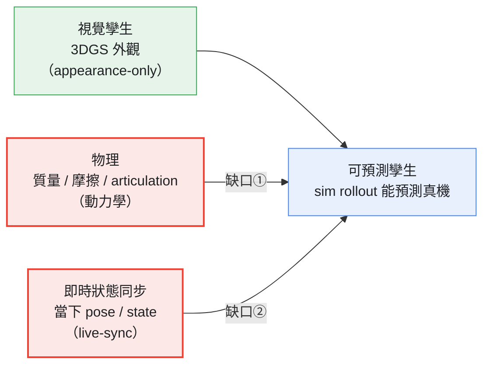
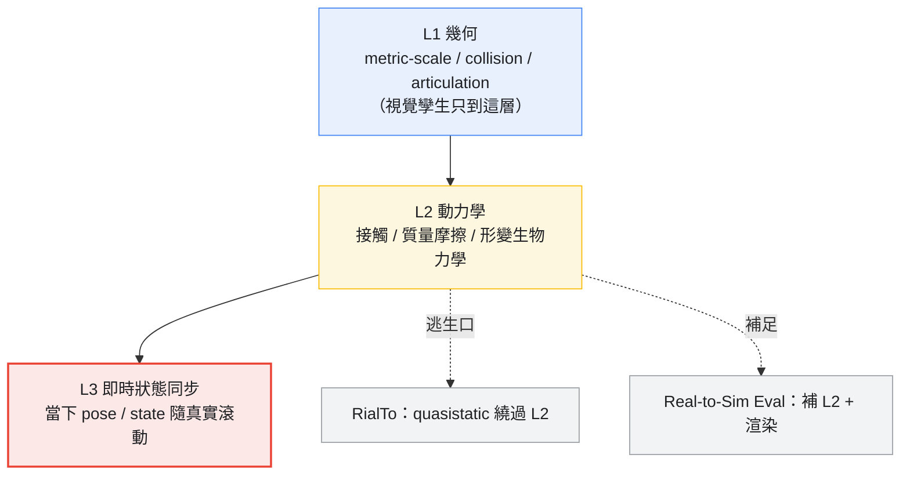

# 使用案例：數字孿生

> 工廠 / 手術 / 工業設備的數字孿生 —— Sim + Gen 混合方案。但這個用例的命題很尖：**一個 photoreal 的 3DGS 重建只是「視覺孿生」；要成為「可預測孿生」，得加上物理（動力學）+ 即時狀態同步。** 生成管外觀與場景，物理 + 同步管行為與「當下」。

*圖：缺的永遠是中間兩塊（物理 + 同步），從來不是外觀*

## 核心命題：視覺孿生 vs 可預測孿生

跨 robotics / 工業 / 手術，把重建變成孿生時，**缺的那一層一致是「動力學 + 同步」，從來不是外觀**。NeRF/3DGS/photogrammetry 都是 appearance-only：「a visual reconstruction can look photorealistic yet lack the physical grounding necessary for interactive simulation」（[綜述 2504.13159](https://arxiv.org/pdf/2504.13159)）。要可用，得補：物理（mass/density/friction）+ articulation + collision + material + **即時 dynamic state**。

## 三層保真

| 層 | 必須忠實（才可預測） | 可生成 / 近似 |
|---|---|---|
| **幾何** | metric 尺度幾何、articulation/kinematics、collision body | 細紋理、非承重視覺細節 |
| **動力學** | 接觸、質量/摩擦、形變/生物力學（任務由動力學主導時）；*RialTo 靠 quasistatic 繞過* | 材質外觀、感測器反射率（生成可補：material-GS） |
| **即時狀態同步** | 特定真實系統的當下 pose/state，在任務相關延遲內（機器人 ~200ms、術中次幀） | 歷史/裝飾性狀態 |

*圖：三層保真 stack —— 缺口在 L2 動力學與 L3 同步*

## 兩條路

1. **Real2Sim2Real（重建→模擬→部署）** —— [Real2Sim 孿生](./real2sim-twins.md)（RialTo：掃描→mesh→手工關節→USD→RL+DR→point-cloud policy，**真機 transfer-back 91/77/75% vs BC 10/0/0%**；但靠 quasistatic 繞過動力學保真度）。可預測性的硬證據來自 real-to-sim policy eval：**要渲染 + physics 兩者**才相關。
2. **保真度契約（什麼必須真）** —— [孿生保真度契約](./twin-fidelity-contract.md)：三層保真 + 工業孿生的真相（外觀/結構已產品化、**即時同步是 86% 想要但只 14% 接到 live fleet 的那塊縫**）+ 手術孿生把契約講得最清楚（preop 靜態 vs intraop 即時同步）。

## 本區解構

- [Real2Sim2Real 數字孿生](./real2sim-twins.md) — RialTo + GS/soft-body policy eval：可重模擬的場景孿生，及「視覺 vs 可預測」的界線
- [孿生保真度契約](./twin-fidelity-contract.md) — 三層保真、工業即時同步落差（86%/14%）、手術 preop/intraop 契約

## 與姊妹手冊的對應

real2sim 主題與 [robotics-data-gen 的示範生成](../robotics-data-gen/autonomous-demo-gen.md)、[駕駛的神經重建模擬](../autonomous-driving-sim/neural-reconstruction-sim.md) 同源（都是真實→可模擬）；「孿生即時同步」與 [自駕閉環可靠性](../autonomous-driving-sim/closed-loop-or-bust.md) 是同一個 `sim-in-loop-infer` 問題。

## 未來前沿

- **即時狀態同步**：把真實感測器回饋接進孿生（OPC-UA/MQTT）做即時同步——這是「可預測孿生」最沒被關上的縫。
- **physics-augmented GS**：PhysGaussian/SplatSim 等把物理 bolt 上 3DGS，是讓視覺孿生變可模擬的前緣。
- **可變形 / 液體**：RialTo 等明確排除——孿生最難的動力學在這裡。
