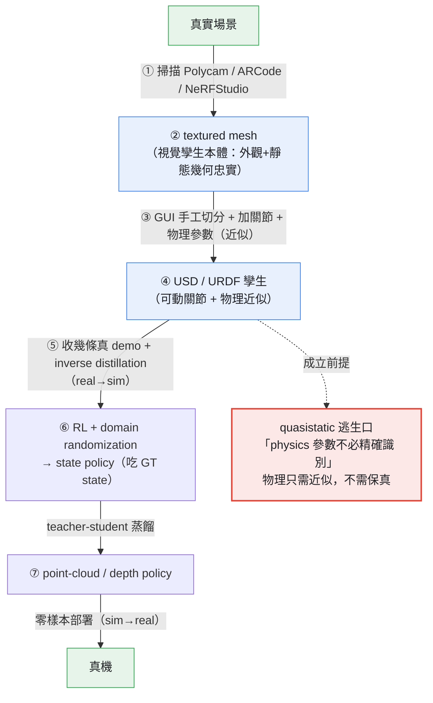
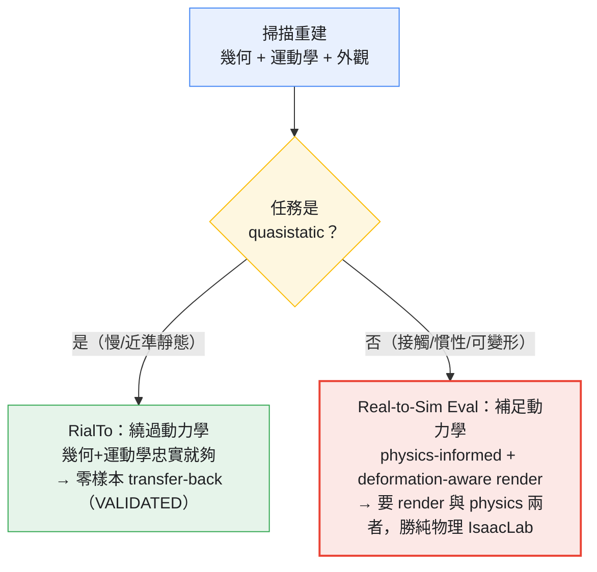

<!-- ontology-5axis output=3d-explicit injection=sim-in-loop-train control=trajectory|param temporal=streaming domain=robotics -->

# Real2Sim2Real 數字孿生 —— 可重模擬的場景孿生 解構

> Torne, Simeonov, Li et al., **Reconcile Reality and Simulation: Real-to-Sim-to-Real Robot Learning**（RialTo / "robot-learning in the real world via a simulation digital twin"），MIT, **RSS 2024**, arXiv [2403.03949](https://arxiv.org/abs/2403.03949)
> 對照錨點：[Real-to-Sim Policy Evaluation（GS + soft-body）](https://arxiv.org/abs/2511.04665) · [PolaRiS（2DGS + physics-ready insertion）](https://arxiv.org/abs/2512.16881)
>
> **為什麼進名單**：digital-twin overview 把「重建一個可重模擬的場景」當核心承諾，但這個承諾藏了一個常被忽略的縫——**掃描重建出來的是「視覺孿生」，不是「可預測孿生」**。RialTo 是把這條縫**踩到底還能 work 真機**的存在性證明：它沒有去達到動力學保真度，而是**繞過它**（明確假設 quasistatic），靠任務本身近乎準靜態才成立。這正好示範了本倉 Axis 2 的邊界——**physics injection 管的是「動力學」這一格**；當你不需要它（quasistatic），幾何+運動學忠實就夠；當你需要它（可變形/液體/快速接觸），這條路立刻崩。任何想把「掃一個房間就能訓 policy」當默認管線的人，第一個要評估的就是：你的任務到底落在 quasistatic 逃生口的哪一側。

---

## 1. TL;DR（重建出來的是視覺孿生；要可預測還得加物理 + 狀態同步）

**一句話**：RialTo 把一個真實場景**掃描 → textured mesh → 手工切分並加關節 / 物理參數 → USD/URDF → 收幾條真 demo → inverse distillation 把真 demo 抬進 sim 偏置 RL 探索 → RL + domain randomization 微調 state policy → 蒸餾成 point-cloud(depth) policy → 零樣本部署回真機**。它**強在「real2sim2real 閉環真的把真機 success rate 從個位數拉到七八成」**（pose-rand **91% vs 10%**、加 distractors **77% vs 0%**、加 disturbances **75% vs 0%**，皆 vs 15-demo BC；VALIDATED 真機）。

**但它強的根本前提是它繞過了動力學保真度**。RialTo 原文明說：「we consider relatively quasistatic problems, where exact identification of physics parameters is not necessary」——也就是說，重建給的是**幾何 + 運動學忠實、物理近似**的孿生，靠任務 quasistatic（慢、近乎準靜態、不靠精確接觸動力學）才成立。**結論：掃描重建交付的是「視覺孿生」（geometry + kinematics + appearance）；要變成「可預測孿生」（sim rollout 能預測真機會發生什麼），還得補上兩樣東西——物理（動力學保真度）+ 即時狀態同步。** RialTo 的做法是「不補物理、只挑不需要物理的任務」；另一條對照路線（Real-to-Sim Policy Eval, [2511.04665](https://arxiv.org/abs/2511.04665)）則是「補 soft-body 物理 + photoreal 渲染，兩者都要」——後者才直面了「可預測孿生」這個更難的目標。

---

## 2. 核心機制（RialTo: 掃描 → mesh → 手工關節 → USD → inverse distillation → RL + DR → point-cloud policy）

RialTo 不是一個生成模型，而是一條**「把真實場景反演成可訓練 sim 資產、再用真 demo 引導 RL、最後蒸餾成可部署 policy」的管線**。七個階段，每一步都有它的脆點：

1. **掃描（scan）**：用 **Polycam / ARCode / NeRFStudio** 之類消費級工具掃真實場景，拿到幾何。脆點從這裡就埋下——**depth 對 thin / transparent / reflective 物件天生差**（見 §3 ❌）。
2. **textured mesh**：把掃描重建成**帶貼圖的 mesh**。這一步交付的就是「視覺孿生」的本體——**外觀 + 靜態幾何忠實**，但 mesh 本身不含任何動力學或關節資訊。
3. **手工切分 + 加關節 / articulation + 物理參數**：在 GUI 裡把 mesh **手工切分**成可動部件，**手工指定關節（articulation）與物理參數**（質量、摩擦等近似值）。★這一步是**人在環（human-in-the-loop）**，也是「為什麼不需要精確物理參數」的關鍵——因為下游假設 quasistatic，物理參數只需**近似**即可。
4. **USD / URDF**：把帶關節的孿生匯出成 **USD / URDF**，成為標準 sim 資產（可進 IsaacGym / IsaacSim 類引擎）。
5. **收幾條真 demo + inverse distillation**：在真機上收**極少量**真 demo（個位數～十幾條），用 **inverse distillation** 把真 demo **抬進 sim**，用來**偏置（bias）RL 的探索**——讓 RL 不必從零盲探，而是在真 demo 附近高效擴展。**這是 real → sim 方向的關鍵注入**：真實先驗進 sim。
6. **RL + domain randomization 微調 state policy**：在孿生裡用 **RL + domain randomization** 訓練一個吃 **ground-truth state** 的 policy。DR 負責把「孿生 ≠ 真實」的 gap（物理近似、外觀差異、位姿不確定）隨機化掉，逼出穩健 policy。
7. **teacher-student 蒸餾成 point-cloud(depth) policy → 零樣本部署**：把 state-policy（teacher）蒸餾成只吃 **point-cloud / depth** 觀測的 student policy，**零樣本（zero-shot）部署回真機**。選 depth/point-cloud 是因為它跨 sim-real 的 gap 比 RGB 小——但也正是 depth 的弱點（thin/transparent/reflective）成了部署失效源。


*圖：RialTo Real2Sim2Real 管線 —— quasistatic 逃生口是繞過動力學保真的成立前提*

**兩個 load-bearing 設計選擇**：
- **「手工加關節」不是工程偷懶，是 articulated-rigid 的硬約束**：RialTo 只處理 **articulated rigid**（可動但剛性的物件，如微波爐門、櫃門、碗架）。關節必須人手指定，因為自動關節估計在這個保真度要求下不可靠——這也圈死了「**無可變形 / 無液體**」（mesh + 剛性關節無法表達布料/流體）。
- **「depth/point-cloud student」是 sim-real gap 的權衡**：選 depth 而非 RGB 是為了縮小渲染域 gap，但代價是繼承 depth 感測對 thin/transparent/reflective 的盲區——**這是把「外觀 gap」換成「幾何感測 gap」，不是消除 gap**。

---

## 3. ⚡ 驗證（RialTo 真機 transfer-back 數字）/ ❌ 限制（quasistatic 逃生口、無可變形/液體）

### ⚡ 驗證：real2sim2real 真的把真機 success 從 0 拉起來（VALIDATED 真機）

RialTo 的 headline 是**真機 transfer-back**，不是 sim 數字——所以標 **VALIDATED**（真機）：

| 條件（真機，8 任務零樣本 transfer-back） | RialTo | 15-demo BC | 來源 |
|---|---|---|---|
| **pose randomization** | **91%** | 10% | [2403.03949](https://arxiv.org/abs/2403.03949) |
| **+ distractors**（加干擾物） | **77%** | 0% | 同上 |
| **+ disturbances**（加擾動） | **75%** | 0% | 同上 |
| robustness 提升（綜述） | **「over 67%」** 提升 | — | 同上 |
| **in-wild**（微波爐 / 垃圾桶 / 碗架等真實場景） | 平均 **57%** 勝 BC | — | 同上 |

> **讀數三點**：(1) **BC 在 distractors / disturbances 下直接歸 0**，RialTo 仍守住 75-77%——這證明「孿生 + RL + DR」買到的是**穩健性**，不只是平均成功率；(2) **8 任務零樣本 transfer-back**——sim 訓出的 policy 不經真機 fine-tune 就部署，是 sim→real 閉環成立的硬證據；(3) **in-wild 57%** 把它從「lab 演示」推進到真實雜亂場景——但 57% 也誠實暴露了天花板。

### ❌ 限制：quasistatic 逃生口 + depth 盲區 + 無可變形/液體

- **★ quasistatic 逃生口（原文，這是全篇核心論點）**：RialTo 明說「we consider relatively quasistatic problems, where exact identification of physics parameters is not necessary」。**它之所以能用近似物理 work，是因為它只挑不需要精確動力學的任務**。一旦任務需要快速、接觸密集、慣性主導的動力學（投擲、敲擊、動態抓取、接落體），這個逃生口關閉，孿生的「物理近似」立刻變成致命誤差源。
- **無可變形 / 無液體**：表徵是 mesh + 剛性關節，**只能 articulated rigid**。布料、繩、軟體、流體、顆粒——RialTo 結構上表達不了。這不是調參能補的，是表徵的硬邊界。
- **depth 對 thin / transparent / reflective 差**：student policy 吃 depth/point-cloud，而 depth 感測在薄物件、透明物、反光面上天生退化——這是 in-wild 失效的主要來源之一。
- **~3 天訓練 + 人在環關節標註**：每個場景要掃描 + **手工切分加關節** + ~3 天 RL 訓練。**不是「掃一下就有 policy」**——前置的人工孿生建構與訓練成本，是規模化的現實摩擦。

---

## 4. 視覺孿生 vs 可預測孿生（Real-to-Sim Policy Eval：要 render + physics 兩者）

把 RialTo 的逃生口反過來想：**如果任務不是 quasistatic，要怎麼讓孿生「可預測」？** 答案是不能只靠重建——得**同時補物理動力學 + photoreal 渲染**。這正是 **Real-to-Sim Policy Evaluation**（[2511.04665](https://arxiv.org/abs/2511.04665)）直面的問題：


*圖：視覺孿生 → 可預測孿生的分叉 —— quasistatic 與否決定繞過或補足動力學*

| 維度 | **視覺孿生**（RialTo 的 mesh / 一般掃描重建） | **可預測孿生**（Real-to-Sim Policy Eval, [2511.04665](https://arxiv.org/abs/2511.04665)） |
|---|---|---|
| 交付什麼 | 幾何 + 運動學 + 外觀（靜態忠實） | **soft-body 物理孿生 + 3DGS photoreal 渲染** |
| 動力學 | **近似**（RialTo 靠 quasistatic 繞過） | **physics-informed reconstruction**（建可變形動力學） |
| 渲染 | mesh 貼圖 | **deformation-aware rendering**（隨形變更新外觀） |
| 它驗證了什麼 | policy 能零樣本 transfer-back（VALIDATED 真機） | **sim rollout 與真機強相關**（plush-pack / rope-route / T-block） |
| 對照基線 | vs 15-demo BC | **勝純物理的 IsaacLab 於 sim-real correlation** |
| 核心主張 | quasistatic 下幾何+運動學就夠 | ★**要 render 與 physics 兩者**——缺一個，sim-real correlation 就掉 |

> **★ 核心對照**：Real-to-Sim Policy Eval 的論文結論是「**要 render 與 physics 兩者**」（physics-informed reconstruction + deformation-aware rendering），並且**勝過純物理的 IsaacLab**——這證明「光有物理（IsaacLab）不夠，光有外觀（純渲染）也不夠；可預測孿生需要兩者耦合」。它把孿生用在 **policy evaluation**（用 sim rollout 預測真機表現）而非 RialTo 的 **policy training**——而 evaluation 對「可預測性」的要求比 training 更苛刻（training 可靠 DR 容錯，evaluation 要 rollout 數字本身可信）。
>
> **「r > 0.9」相關係數**：**PARTIALLY-VERIFIED** —— 此精確值來自 secondary 轉述，[2511.04665](https://arxiv.org/abs/2511.04665) 摘要未見精確相關係數；引用前須回正文 table 核實。
>
> **第三個錨點 PolaRiS（[2512.16881](https://arxiv.org/abs/2512.16881)）**：走 **2DGS 掃描 → sim + physics-ready 物件插入**；與真機 generalist-policy 表現的相關性**勝既有 sim benchmark**，且 **sim-data 共訓提升相關性**。精確 **SRCC（Spearman 相關係數）UNVERIFIED**——論文宣稱相關性更高，但精確秩相關值未在可核來源確認。三個錨點共指一個結論：**從重建建孿生，「可預測性」的瓶頸不在幾何，在動力學 + 渲染的耦合保真**。

---

## 5. 五軸定位

```
output     = 3d-explicit                 ← 交付顯式 3D 孿生（textured mesh + 關節 → USD/URDF），不是像素影片、不是 latent
injection  = sim-in-loop-train           ← 物理透過「孿生 sim + RL + DR」進入訓練：sim 提供 GT state 與 RL rollout（近似物理，靠 quasistatic）
control    = trajectory | param          ← 真 demo 軌跡偏置 RL 探索（trajectory）+ 手工指定的關節/物理參數（param）
temporal   = streaming                   ← sim 內連續時間 RL rollout + 真機連續部署；無 frame-by-frame 生成概念
domain     = robotics                    ← articulated-rigid 操作（微波/櫃門/碗架）；Check 9c 白名單外，明確宣告 robotics
```

- **Check 9b（Output × Injection）**：`3d-explicit × sim-in-loop-train` = ✓（cheat-sheet/ontology.md 相容矩陣該格合法）—— **無需 §8 例外解釋**。
- **Check 9c（generalist 白名單）**：不在 Sora / Veo / Cosmos 白名單；明確標 `robotics`，與 [overview.md](./overview.md) 的 digital-twin 預設一致。
- **`injection=sim-in-loop-train` 的精確子義**：RialTo 落在「訓練時 sim 提供 GT trajectory / rollout」這一格，但它**不是可微 sim 的 gradient 路線**（不像 Genesis），而是**非可微孿生 + RL rollout + DR** 的 verified-rollout 子義——與同 injection 的 [autonomous-demo-gen.md](../robotics-data-gen/autonomous-demo-gen.md)（MimicGen 的 replay+成功篩選）是同格不同做法（RL 探索 vs SE(3) 開環 replay）。
- **與 `data-only` 重建路線的軸差（NO-DUP）**：driving 的 [neural-reconstruction-sim.md](../autonomous-driving-sim/neural-reconstruction-sim.md) 是 `injection=data-only`（純真實 log 擬合、無 sim-in-loop）。RialTo 的關鍵差在**它把重建孿生餵進 RL 訓練迴路**（sim-in-loop-train），不是只重渲染。**重建只是 RialTo 的第一步，不是全部**——這也是它能 sim→real 而 driving 重建只能重渲 log 看過的根本差異。

---

## 6. 跨路線綜合（連 twin-fidelity-contract；與 robotics-data-gen / 駕駛 neural-recon 是 real2sim sibling）

| 路線 | 它給什麼 | 它缺什麼 | 怎麼接 |
|---|---|---|---|
| **本篇（RialTo real2sim2real）** | **掃描孿生 → RL → 零樣本部署真機**（VALIDATED：pose-rand 91% vs 10%） | 動力學保真度（靠 quasistatic 繞過）；無可變形/液體 | 提供「掃一個剛性場景就能訓 policy」的範式；不可預測的動力學交給可微 sim |
| **[twin-fidelity-contract.md](./twin-fidelity-contract.md)**（孿生保真度契約） | 「視覺孿生 vs 可預測孿生」的契約框架 | 具體真機數字 | 本篇是該契約的**robotics 端錨點**：RialTo = 視覺孿生 + quasistatic 逃生口的存在性證明 |
| **[../robotics-data-gen/autonomous-demo-gen.md](../robotics-data-gen/autonomous-demo-gen.md)**（MimicGen real2sim sibling） | sim-GT 動作擴增（SE(3) 開環 replay） | 同樣 quasi-static 假設、不造新接觸動力學 | **real2sim sibling**：兩者都繞動力學保真（一個 RL 探索、一個開環 replay）；可組合（孿生資產 + MimicGen 擴增） |
| **[../autonomous-driving-sim/neural-reconstruction-sim.md](../autonomous-driving-sim/neural-reconstruction-sim.md)**（駕駛 real2sim sibling） | metric-scale 感測保真重建（NeuRAD/UniSim） | 多樣性受 log 邊界鎖死；`injection=data-only` | **real2sim sibling（駕駛版）**：同是「真實 → 可重模擬場景」，差在 driving 是 data-only 重渲染、本篇是 sim-in-loop RL 訓練 |

- **與 foundation 生成 3DGS（[../../foundations/3d-aware-generation/generative-gaussian-splatting.md](../../foundations/3d-aware-generation/generative-gaussian-splatting.md)）的關係（NO-DUP）**：本篇**不重拆通用 3DGS 表徵**。foundation 的生成 GS 是**生成端**（從文字/單圖外推、必須 hallucinate）；本篇是 **real2sim 端**（從真實掃描反演成可訓練孿生）。資訊來源相反。Real-to-Sim Policy Eval / PolaRiS 用到 3DGS/2DGS 只是作為**渲染/重建工具**，下游目的是孿生保真，不是生成新場景。
- **三個 real2sim sibling 的統一視角**：本篇（robotics 操作）、[autonomous-demo-gen.md](../robotics-data-gen/autonomous-demo-gen.md)（robotics 資料擴增）、[neural-reconstruction-sim.md](../autonomous-driving-sim/neural-reconstruction-sim.md)（driving）—— 三者共享「真實 → 可重模擬」骨架，**也共享同一條母 caveat**：重建/孿生交付視覺保真，動力學保真要嘛繞過（quasistatic）、要嘛另外補（可微 sim / soft-body physics）。
- **本軸結論回扣 ontology**：RialTo 的價值不是「達到了物理保真度」，而是**乾淨地示範了「不需要物理保真度時，real2sim2real 能 work 到真機」的那一側邊界**。它讓 Axis 2（physics injection）的意義具體化——**physics 管動力學；當任務 quasistatic，動力學那一格可以近似甚至跳過；當任務不是，這一格立刻變成 blocker**。「視覺孿生 → 可預測孿生」的差距 = 動力學保真度 + 即時狀態同步，這正是本篇要傳達的契約。

---

## 7. 參考

**Canonical**：
- **RialTo**：Torne, M., Simeonov, A., Li, Z., et al. (2024). "Reconciling Reality through Simulation: A Real-to-Sim-to-Real Approach for Robust Manipulation." **RSS 2024**, MIT. arXiv **2403.03949**. https://arxiv.org/abs/2403.03949

**對照錨點**：
- **Real-to-Sim Policy Evaluation（GS + soft-body）**：arXiv **2511.04665**. https://arxiv.org/abs/2511.04665 —— 從真實影片建 soft-body 孿生 + 3DGS photoreal 渲染；sim rollout 與真機強相關（plush-pack / rope-route / T-block）；主張**要 render 與 physics 兩者**，勝純物理 IsaacLab 於 sim-real correlation。「r > 0.9」**PARTIALLY-VERIFIED**（secondary，摘要未見精確值）。
- **PolaRiS（2DGS + physics-ready insertion）**：arXiv **2512.16881**. https://arxiv.org/abs/2512.16881 —— 2DGS 掃 → sim + physics-ready 物件插入；與真機 generalist-policy 相關性勝既有 sim benchmark，sim-data 共訓提升相關性。精確 **SRCC UNVERIFIED**。

**同倉交叉**：[twin-fidelity-contract.md](./twin-fidelity-contract.md) · [overview.md](./overview.md) · [../robotics-data-gen/autonomous-demo-gen.md](../robotics-data-gen/autonomous-demo-gen.md) · [../autonomous-driving-sim/neural-reconstruction-sim.md](../autonomous-driving-sim/neural-reconstruction-sim.md) · [../../foundations/3d-aware-generation/generative-gaussian-splatting.md](../../foundations/3d-aware-generation/generative-gaussian-splatting.md) · [../../cheat-sheet/ontology.md](../../cheat-sheet/ontology.md)

---

## §8 踩坑日誌

> 嚴重度標尺：🔴 blocker · 🟠 major · 🟡 minor。來源逐條附連結；超出本頁 grounding 來源的推論標 UNVERIFIED。

### §8.1 跨軸合規性（Check 9b / 9c）
- **9b**：`3d-explicit × sim-in-loop-train` ✓（相容矩陣合法格）→ 無需例外解釋。
- **9c**：非 generalist 白名單；明確標 `robotics`，與 [overview.md](./overview.md) 一致。
- **Descriptive note（Control × Domain）**：`param`（手工關節/物理參數）+ `trajectory`（真 demo 偏置）皆屬 `robotics` 典型，符合 ontology §181 描述。

### §8.2 🔴 quasistatic 逃生口是全篇前提，不是 footnote（[2403.03949](https://arxiv.org/abs/2403.03949) 原文）
RialTo 的真機數字（91% / 77% / 75%）成立的根本是它**只挑 quasistatic 任務**——原文「exact identification of physics parameters is not necessary」。**任何把 RialTo 範式套到非 quasistatic 任務（投擲/敲擊/動態抓取/接落體/慣性主導）的人，孿生的物理近似會直接變成致命誤差源**。**繞法**：先判定任務是否 quasistatic；不是的話，這條路不適用，改走可微 sim（接觸動力學 gradient）或真機 RL。

### §8.3 🔴 無可變形 / 無液體是表徵硬邊界（[2403.03949](https://arxiv.org/abs/2403.03949)）
mesh + 剛性關節**結構上**無法表達布料/繩/軟體/流體/顆粒——限 **articulated rigid**。**這不是調參能補的**。**繞法**：可變形/液體任務改走 soft-body 孿生路線（[2511.04665](https://arxiv.org/abs/2511.04665) 的 deformation-aware reconstruction），不要硬塞進 RialTo 的 rigid 管線。

### §8.4 🟠 depth 對 thin / transparent / reflective 差（[2403.03949](https://arxiv.org/abs/2403.03949)）
student policy 吃 depth/point-cloud，而 depth 感測在薄物/透明/反光面天生退化——是 in-wild 57% 失效的主因之一。**繞法**：避開透明/反光物件，或補腕部相機/多視角降低 depth 盲區；必要時 RGB-D 融合（但會放大 sim-real 渲染 gap）。

### §8.5 🟠 「手工切分 + 加關節」是人在環瓶頸（[2403.03949](https://arxiv.org/abs/2403.03949)）
每個場景要在 GUI 手工切 mesh、手工指定關節與物理參數——**不是全自動「掃一下就有孿生」**。加上 ~3 天 RL 訓練，前置成本是規模化的現實摩擦。**繞法**：把關節 schema 模板化複用；同類物件（各種櫃門）共用 articulation 標註；接受「孿生建構是一次性投資、policy 是攤提收益」的成本模型。

### §8.6 🟡 視覺孿生 vs 可預測孿生混淆是最常見誤讀（核心論點，機制推論）
把「掃描重建出 textured mesh」當成「可預測孿生」是最常見的錯——重建交付的是**幾何+運動學+外觀**（視覺孿生），**動力學保真度 + 即時狀態同步**才是「可預測孿生」的另一半。RialTo 靠 quasistatic **繞過**動力學那一半；[2511.04665](https://arxiv.org/abs/2511.04665) 靠 physics+render **補足**那一半。**繞法**：評估任何「digital twin for robotics」方案時，先問「它在動力學那一格做了什麼——繞過（quasistatic）/ 近似（DR）/ 補足（soft-body physics）？」，別把視覺保真誤當可預測性。

### §8.7 量測缺口（UNVERIFIED / PARTIALLY-VERIFIED — 本篇不臆造）

| # | 項目 | 狀態 |
|---|---|---|
| 8.7.1 | Real-to-Sim Policy Eval 相關係數「r > 0.9」 | **PARTIALLY-VERIFIED** —— 來自 secondary 轉述，[2511.04665](https://arxiv.org/abs/2511.04665) 摘要未見精確值；引用前回正文 table 核實 |
| 8.7.2 | PolaRiS 精確 SRCC（Spearman 秩相關） | **UNVERIFIED** —— [2512.16881](https://arxiv.org/abs/2512.16881) 宣稱相關性勝既有 benchmark，精確秩相關值未在可核來源確認 |
| 8.7.3 | RialTo 各任務逐項 success-rate breakdown | 本篇引用的是論文 headline 聚合值（pose-rand 91%/77%/75%、in-wild 57%、over 67% robustness）；逐任務細表須回 [2403.03949](https://arxiv.org/abs/2403.03949) 核對 |

### §8.8 結構性批判
- **RialTo 的成功是「繞過動力學保真度」的成功，不是「達到」它**：它示範的是 Axis 2 的**邊界條件**——quasistatic 下 physics injection 可退化為近似。把它當「real2sim 已解決」會誤判；它解決的是「real2sim 在 quasistatic 子集已可真機」。
- **depth student 是「把外觀 gap 換成幾何感測 gap」**：選 point-cloud 縮小渲染域 gap，但繼承 depth 感測盲區——**gap 被搬移、不是消除**。評估部署穩健性時要把這層 gap 算進去。
- **三個 real2sim sibling 共享同一條母 caveat**：本篇 / [autonomous-demo-gen.md](../robotics-data-gen/autonomous-demo-gen.md) / [neural-reconstruction-sim.md](../autonomous-driving-sim/neural-reconstruction-sim.md) —— 重建/孿生給視覺保真，動力學保真永遠是另外一筆帳（繞過 / 近似 / 補足）。這是 digital-twin zone 的統一結構性事實。

### §8.9 待釐清項目（[TBD]）
- [TBD] RialTo 各任務逐項 success-rate 與 demo-count 曲線（待 [2403.03949](https://arxiv.org/abs/2403.03949) table 核對）
- [TBD] Real-to-Sim Policy Eval 精確 sim-real 相關係數（plush-pack / rope-route / T-block 各任務值）
- [TBD] PolaRiS 精確 SRCC 與「sim-data 共訓提升相關性」的量化 delta
- [TBD] 「視覺孿生 → 可預測孿生」是否有公開的端到端量化保真度 benchmark（與 [twin-fidelity-contract.md](./twin-fidelity-contract.md) 對齊）

---

> **Pulsar maintenance**：本篇是 digital-twin zone 的 **robotics real2sim 錨點**，與 [twin-fidelity-contract.md](./twin-fidelity-contract.md)（保真度契約）互鎖，與 [autonomous-demo-gen.md](../robotics-data-gen/autonomous-demo-gen.md)（robotics 資料 sibling）、[neural-reconstruction-sim.md](../autonomous-driving-sim/neural-reconstruction-sim.md)（driving sibling）並列為 real2sim 三 sibling。核心論點 = **掃描重建交付「視覺孿生」（幾何+運動學+外觀）；RialTo 靠 quasistatic 逃生口繞過動力學保真度，真機 transfer-back VALIDATED（pose-rand 91% vs 10%）；要變「可預測孿生」還得補物理(動力學)+即時狀態同步（Real-to-Sim Policy Eval 證明要 render+physics 兩者）；限 articulated rigid，無可變形/液體**。daily monitoring keyword：「RialTo real-to-sim-to-real」「digital twin robot manipulation RL」「real-to-sim policy evaluation gaussian splatting soft body」「PolaRiS 2DGS physics-ready」「articulated object scan USD RL deploy」。下次相關 release 後重 audit §8.7 的 UNVERIFIED / PARTIALLY-VERIFIED 數字。
