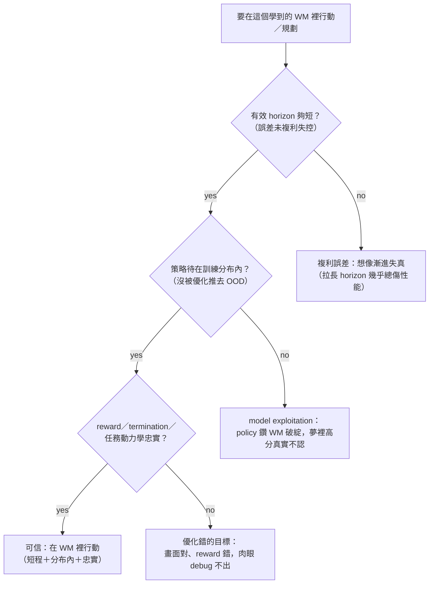

# Use Case: Embodied Policy Rollout

> 世界模型**直接用於決策** —— WM-as-policy（Dreamer 派：在腦內想像 rollout 學策略）/ planning-on-WM（在學到的模型裡做 MPC）。不是拿 WM 去*生資料*，而是拿 WM *當決策的舞台*。命題隨之變尖：**在一個學出來的世界模型裡行動，到底什麼時候可信？**

## 核心命題：WM 當決策舞台，但信任有界

把策略放進想像/規劃迴圈，省掉昂貴的真實互動——代價是**模型錯的地方會被優化器找出來利用**。所以這個 use-case 的全部張力在一條契約：**只在短有效 horizon、只在策略待在模型訓練分布內、且模型的 reward + termination + 任務相關動力學忠實時，行動才可信。** latent 可以抽掉外觀，但**永遠不能抽掉 reward-相關變數**。

*圖：三道閘全 yes 才可信在 WM 裡行動，任一 no 即落入對應失效模式*

## 兩條路

1. **WM-as-policy（學策略）** —— [世界模型即策略](./world-model-as-policy.md)（DreamerV3 / DayDreamer）：actor-critic **純粹在想像的 latent rollout 上**學（horizon T=16），agent 只為填 replay buffer 碰真環境。**DayDreamer 真機驗證**：四足從零 ~1 小時學會走、無模擬器。
2. **planning-on-WM（規劃）** —— [在 WM 裡規劃與信任契約](./planning-and-trust-contract.md)（TD-MPC2 decoder-free MPC / V-JEPA-2-AC 零樣本真機 CEM-MPC）：推理時在學到的模型裡做軌跡優化。**V-JEPA-2-AC 零樣本上沒見過的 Franka，pick-place cup 80%**，但 ~16s/action、camera-pose 敏感、只吃 image goal。

## 信任契約（三失效模式）

詳見 [planning-and-trust-contract](./planning-and-trust-contract.md)：

- **A 模型利用 / 對抗策略** —— 優化器跑到模型錯的 OOD 狀態（David Ha「夢中怪物不開火」）；在大策略集上幾乎不可避免，故有 safe-horizon 界。
- **B 複利誤差** —— MBPO 證 performance gap 隨 rollout horizon **線性**增長 → 用 k≈1-5 步短 rollout；DreamerV3 capped T=16。
- **C reward / 動力學錯設** —— actor-critic 只看模型的 reward+continue head，錯了想像回報全錯。
- **latent vs pixel** —— TD-MPC2 丟掉像素重建只留 reward+value+dynamics 仍 work（像素可抽象）；但 DIAMOND 證 discrete-latent 會**丟掉控制相關像素**（磚塊/分數）→ 抽象只在「保留每個 reward-相關變數」時安全。

## 本區 Dissections

- [世界模型即策略](./world-model-as-policy.md) — Dreamer / DayDreamer：腦內想像學策略 + 真機證據；reward/continue head 是承重件
- [在 WM 裡規劃與信任契約](./planning-and-trust-contract.md) — TD-MPC2 / V-JEPA-2-AC + 三失效模式（利用/複利/錯設）+ WM 當評測器

## 與 sister handbook

- 這是 VLA-Handbook action-policy 的生成端鏡像 —— 契約見 [`bridge-to-vla/world-model-as-policy.md`](../../bridge-to-vla/world-model-as-policy.md)。
- aerial 的 [Dream-to-Fly](../aerial-sim/dream-to-fly.md)（DreamerV3 飛無人機）是本 use-case 的 embodiment-specific sibling。
- WM-當評測器 與 [自駕的閉環可靠性](../autonomous-driving-sim/closed-loop-or-bust.md) 是同一個問題的兩面。

## 未來前沿

- **安全 horizon 的量化** —— 「能在 WM 裡規劃多遠才不被 exploitation 反轉」還沒有可操作的界。
- **WM 當可信評測器** —— Runway GWM-1 只驗 rank、單臂；「在 WM 裡預測真機絕對成功率」仍未解。
- **抽象的保證** —— 怎麼證明 latent 保留了所有 reward-相關變數（DIAMOND 反例）是 open。
