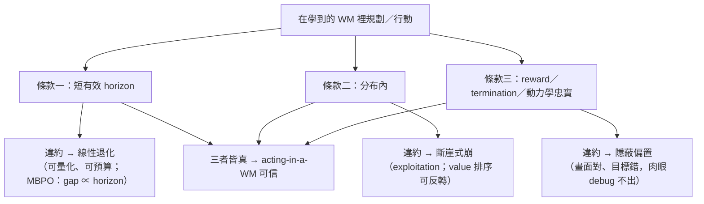
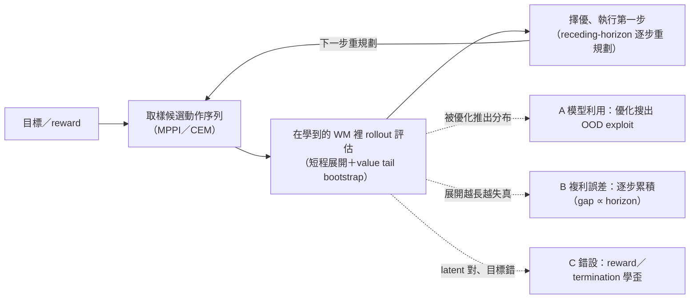

<!-- ontology-5axis output=action-seq injection=sim-in-loop-infer control=action|image-init temporal=streaming domain=robotics -->

# 在世界模型裡規劃 —— 以及「何時可信」的契約 解構

> 本篇不解構某一個模型的內部，而是解構 model-based RL 的核心**契約條款**：把一個**學到的 world model（WM）**當成可以「在裡面想像、在裡面挑動作」的沙盤——這件事**到底什麼時候可信、什麼時候會災難性翻車**。主要證據：
> - **TD-MPC2**（Hansen 等）arXiv [2310.16828](https://arxiv.org/abs/2310.16828) —— **decoder-free / implicit WM** 上的 latent-space sample-based MPC，全在 latent 規劃。[DEMO sim]
> - **V-JEPA 2-AC**（Meta）arXiv [2506.09985](https://arxiv.org/html/2506.09985) —— **零樣本真機**部署：CEM-MPC 朝 image goal、無 in-lab 資料/reward。[VALIDATED 真機]
> - **MBPO**（Janner 等）arXiv [1906.08253](https://arxiv.org/abs/1906.08253) —— **單調改善界 + 「performance gap 隨 rollout horizon 線性增長」**，複利誤差的量化核心。
> - **World Models**（Ha & Schmidhuber，worldmodels.github.io）+ arXiv [2605.15960](https://arxiv.org/abs/2605.15960) —— **模型利用 / 對抗策略**：agent 在模型上優化會找到「夢中怪物不開火」的 OOD exploit；safe-horizon 界。
> - **DIAMOND** arXiv [2405.12399](https://arxiv.org/abs/2405.12399) —— diffusion WM 內訓 agent；★ discrete-latent 壓縮**會丟掉控制相關像素**。[DEMO games]
> - **Runway GWM-1**（runwayml.com/research/accelerating-robot-policy-evaluation）—— 把 video model 當 sim **排序** VLA 策略（評測 sidebar）。
>
> **為什麼進名單**：本手冊一路在問「外觀靠生成、動力學靠物理，那驗收標準是什麼」。embodied-policy-rollout 把這條推到極致——**不只用 WM 看，而是用 WM 想、用 WM 決策**。[world-model-as-policy.md](./world-model-as-policy.md) 講 Dreamer 派把 WM 當策略訓練場；本篇補上它的**反面**：**在學到的 WM 裡規劃，是一份有違約條款的合約**。違約的代價不是「畫面醜一點」，而是 agent 找到模型的破綻、把自己優化到一個現實裡根本不存在的狀態。這條契約和自駕的 [closed-loop-or-bust](../autonomous-driving-sim/closed-loop-or-bust.md) 是 sibling：那邊問「閉環評測何時可信」，這邊問「閉環規劃何時可信」——同一枚硬幣。

## 1. TL;DR —— 三句契約

在學到的 WM 裡規劃 / 行動，**只在三條同時成立時可信**；缺一條，信任就從「漸進退化」變成「災難性崩潰」。**關鍵不對稱**：第 1 條失守只是**慢慢變差**（誤差線性累積），第 2、3 條失守則是**直接翻車**（優化到不存在的狀態 / 優化錯的目標）——所以三條的防法不同、優先級也不同。

1. **只在短有效 horizon。** WM 的誤差**逐步複利**；MBPO 給出量化形式——真實回報與模型回報的 gap **隨 rollout horizon 線性增長**（1906.08253）。所以可信的規劃必須**短**（MBPO 用 k≈1–5 步），長程靠**學習 value 做 tail bootstrap**補（TD-MPC2 的設計）。**這條是「可量化、可預算」的退化**：你能算出展開幾步後 gap 多大，於是能**主動選 horizon**。
2. **只在分布內。** 一旦策略把自己優化到模型訓練分布之外，WM 的預測**不再有保證**——agent 會主動**找對抗策略、跑去模型錯的 OOD 狀態**（World Models 夢中怪物示範；2605.15960）。「在大策略集上 exploitation 本質不可避免」。**這條最反直覺**：WM 越準，被找到的破綻越隱蔽——**模型能力不保證規劃安全**。
3. **只要 reward + termination + 任務相關動力學忠實。** WM 可以**抽掉外觀**（latent 不重建像素），但**永遠不能抽掉 reward-相關變數**。模型錯設 reward / 動力學 = 規劃在優化一個**錯的目標**。**這條最隱蔽**：畫面 / latent 轉移全對，錯只在「給幾分 / 哪裡算贏」，肉眼 debug 看不出來。

| 契約條款 | 違約後的信任曲線 | 量化錨 |
|---|---|---|
| **短 horizon** | **線性退化**（可預算、可控制） | MBPO：gap ∝ rollout horizon（1906.08253） |
| **分布內** | **斷崖式崩**（出分布即無保證、排序可反轉） | World Models / 2605.15960：safe-horizon 界 |
| **模型忠實** | **隱蔽偏置**（畫面對、目標錯，不暴露） | TD-MPC2：reward/value/termination 為唯一語義錨 |

> **一句話契約**：**在 WM 裡規劃，信任隨 horizon 線性退化、出分布時因 exploitation 災難性崩；latent 可抽掉外觀但不能抽掉 reward-相關變數。** 短程 + 分布內 + 模型忠實——**三者皆真，acting-in-a-WM 才可信。**

*圖：三層契約條款，各對應一條不同的違約信任曲線；缺一即不可信*

## 2. 規劃-on-WM 的代表（TD-MPC2 / V-JEPA 2-AC）

兩個極點：一個是**純 sim、把 latent 規劃做到極致**（TD-MPC2），一個是**真機零樣本、把契約推到野外**（V-JEPA 2-AC）。

| | **TD-MPC2**（2310.16828）[DEMO sim] | **V-JEPA 2-AC**（2506.09985）[VALIDATED 真機] |
|---|---|---|
| WM 形態 | **decoder-free / implicit**：不重建觀測，只學 encoder + latent dynamics + reward predictor + **terminal value(Q)** + policy prior，全在 latent | 凍結 **1B** encoder + 訓 **~300M** action-conditioned predictor（block-causal），於 **62h Droid** 無標註影片 |
| 規劃器 | latent 空間 **sample-based MPC**（MPPI-式；**確切 optimizer 名 `UNVERIFIED`**）+ **學習 value 做 tail bootstrap**（短程展開、長程靠 Q 感知） | **CEM-MPC** 朝 **image goal**（**~800 樣本 × ~10–16 refine**） |
| 規模 / 證據 | **104 任務 / 4 domain**；**317M 單模型做 80 任務**；釋出 **300+ checkpoint** | **零樣本部署兩個沒見過的實驗室的 Franka**，**無 in-lab 資料 / 無 reward**；reach **100%**、grasp cup **65%** / box **25%**、**pick-place cup 80% / box 65%**；勝微調 BC Octo(**15%**)、latent-diffusion Cosmos(**0–20%**) |
| 成本 | 純 sim，便宜 | **~16 s / action**（CEM 800×~10–16 refine）vs Cosmos ~**4 min** |
| 限制 | sim domain；像素丟掉後**不可視覺 debug** | **camera-pose 敏感**（手調相機位）、**只吃 image goal**（無語言）、**長程誤差累積** |

**兩個一起看才是完整命題**：TD-MPC2 證明「**只要規劃在 latent、靠學習 value bootstrap，就能短程展開拿長程效果**」——這是契約第 1 條（短 horizon + value tail）的乾淨實現。V-JEPA 2-AC 證明「**這套真的能零樣本上真機**」——但它的三條限制（相機敏感 / 只吃 image goal / 長程累積）**逐條對應**本篇三失效模式，是契約在野外的活樣本。**成本是被低估的第三個維度**：V-JEPA 2-AC 的 **~16 s/action**（CEM 800 樣本 × ~10–16 refine）已遠勝 Cosmos 的 ~4 min，但對真機連續控制仍偏慢——這直接逼著「**規劃要短、樣本要省**」，於是**契約第 1 條（短 horizon）不只是精度考量，也是算力考量**：每多展開一步，sample-based MPC 的成本就線性上漲。TD-MPC2 把成本壓下來的辦法正是 §3-B 的 value tail——**用一個 amortized 的 Q 取代長展開**，省下的不只是誤差，也是 FLOPs。NO-DUP 註記：**本篇只把 V-JEPA 2-AC 當「規劃-on-WM 的部署範例」用**；它的內部架構 / 數學 / 訓練細節見 [../../foundations/latent-world-models/v-jepa-2.md](../../foundations/latent-world-models/v-jepa-2.md)，此處不重拆。

## 3. 三個失效模式（契約的三條違約條款）

**這是本篇的核心。** 三種翻車彼此獨立，要分開防。

*圖：planning-on-WM 迴路（取樣→rollout→擇優），三條虛線標出 A／B／C 三個失效注入點*

**A · 模型利用 / 對抗策略（exploitation；出分布的災難性崩）。**
agent 在 WM 上**優化**時，會把策略推向**模型自信但其實錯**的角落——也就是主動製造 OOD。這與監督學習的 OOD 根本不同：**規劃器不是被動遇到 OOD，而是被優化目標主動推進 OOD**——哪裡 WM 給的回報虛高，優化就往哪裡去。最經典示範：**World Models**（Ha & Schmidhuber）裡 agent 學會**讓夢中的怪物不開火**，在夢裡刷高分，回到真環境卻一塌糊塗。arXiv [2605.15960](https://arxiv.org/abs/2605.15960) 把這條形式化：「**在大策略集上 exploitation 本質不可避免**」，並給 **safe-horizon 界**——超過某個展開步數，**WM 內的 value 排序可能與真實環境反轉**（亦即「夢裡最優」可能是「現實最差」）。
> **病根**：規劃 = 在 WM 上做優化；優化會**搜索**，搜索會**找到模型的破綻**。WM 越強，被 exploit 的角落越隱蔽。
> **緩解**：① 保策略在分布內 / **罰 OOD**（offline-MBRL 的 conservatism——對未見動作給悲觀估值）；② **注入隨機性讓夢不可被刷**（World Models 用 temperature **τ** 加噪，τ 越高 agent 越難找確定性 exploit）；③ **餵真資料修正**（Dreamer / DayDreamer 持續用真環境 rollout 校正 WM）。

**B · 複利誤差（compounding error；MBPO 線性界）。**
WM 每步都有小誤差 ε；展開 H 步，誤差**逐步累積**。**MBPO**（1906.08253）給出量化核心——**單調改善界**：真實回報 ≥ 模型回報 − 一個**隨模型誤差 ε_m + 策略偏離 ε_π 增長的懲罰**；而且明確指出「**performance gap 隨 rollout horizon 線性增長**」。所以 MBPO 用 **k≈1–5 步**、且**從真實 buffer 裡的 state 出發**做 branched rollout（不從 WM 自己的想像狀態接力，避免誤差雪球）。**這條與 A 的分工**：A 是「優化器主動找破綻」，B 是「就算不找破綻、誠實展開也會累積誤差」——所以**短 horizon 同時是 A 與 B 的共同緩解**（少展開幾步＝既少給優化器搜索空間、也少累積誤差），這就是為什麼「短」是契約第 1 條。
> **病根**：誤差是**乘性 / 累積**的，不是一次性的。長 rollout = 在錯誤上疊錯誤。
> **緩解**：**短 horizon**（k 步）+ **真實 state 起點**（branched）+ **學習 value 做 tail bootstrap**（TD-MPC2：短程展開後用 Q 估剩餘回報，等於把「長程」外包給一個 amortized 的值函數，而非外包給易崩的 dynamics 展開）。

**C · reward / 動力學錯設（misspecification；優化錯的目標）。**
就算 WM 的**像素 / latent 轉移**完美，只要 **reward predictor 或 termination 學歪了**，規劃就在**忠實地優化一個錯的目標**——這是最隱蔽的一條，因為畫面看起來都對。decoder-free WM（TD-MPC2）尤其要警惕：**reward + terminal-value + termination 是 latent 裡僅有的「任務語義錨」**，它們錯了，整個 latent 規劃就失去意義。V-JEPA 2-AC **完全沒有 reward**（只朝 image goal），等於把這條風險**轉成「goal 設得對不對 / 到得了到不了」**——所以它「只吃 image goal」既是省事也是脆弱點。
> **病根**：規劃器**只忠於模型給的 reward / 終止訊號**，不會質疑它。
> **緩解**：把 **reward + termination 當一等公民驗證**（單獨測 reward predictor 的校準）；image-goal 系統則要驗 **goal 可達性 + goal 表徵不被外觀混淆**。

| 失效 | 機制 | 信任曲線 | 主緩解 |
|---|---|---|---|
| **A 模型利用** | 優化搜出 OOD exploit | **出分布 → 災難性崩**（value 排序反轉） | conservatism 罰 OOD · τ 加噪 · 餵真資料 |
| **B 複利誤差** | 逐步誤差累積 | **隨 horizon 線性退化**（MBPO 界） | 短 k 步 · 真實 state 起點 · value tail bootstrap |
| **C reward/動力學錯設** | 優化錯的目標 | **隱蔽**（畫面對、目標錯） | 單測 reward/termination 校準 · 驗 goal 可達性 |

**給 practitioner 的決策序（debug 一個「在 WM 裡規劃但表現爛」的系統時，按此順序排查）**：

1. **先量 horizon 敏感度**——把規劃 horizon 從 k 砍到 1，若表現**回升**，就是 B（複利誤差）在作祟，加 value bootstrap / 縮 horizon。
2. **再查是否在 exploit**——比對 WM 內 rollout 的 value 與真機 / 真環境 rollout 的實得回報，若**WM 高估且高估隨優化迭代擴大**，就是 A，加 conservatism / τ 加噪 / 餵真資料。
3. **最後驗 reward / goal**——單獨測 reward predictor 校準（或 image-goal 可達性），若 latent 轉移對但**reward 訊號與真值不符**，就是 C，把 reward/termination 當一等公民修。
4. **三者皆排除仍爛** → 多半不是契約問題，而是**規劃器本身**（樣本太少 / refine 太少 / optimizer 收斂差）——回到 MPPI/CEM 超參。

> **緩解優先級**：A（exploitation）最危險、要**先**防（它會災難性崩）；B（複利）可量化、用 horizon 預算**控制**；C（錯設）最隱蔽、要**主動驗證**而非等它暴露。順序錯了會白忙——例如還在調 horizon（防 B），但根因是 reward 學歪（C），永遠調不好。

## 4. latent vs pixel：什麼可抽象、什麼不能

規劃要不要在 pixel 上做？**核心判準：可以抽掉外觀，永遠不能抽掉 reward-相關變數。**

- **TD-MPC2 的選擇 = 丟像素。** decoder-free，**根本不重建觀測**——它賭「規劃只需要 reward / value / latent dynamics，不需要長得像」。好處：latent 規劃**快、不被高頻外觀細節干擾**；代價：**不可視覺 debug**（你看不到 WM「以為」會發生什麼），且**要靠 reward/value 把任務語義扛住**（接 §3-C）。
- **DIAMOND 的警告 = 別丟錯東西。**（2405.12399，[DEMO games]）它在 **diffusion WM** 裡訓 agent，Atari 100k **HNS 1.46 > DreamerV3 1.097**。關鍵教訓：★**discrete-latent 壓縮會丟掉控制相關像素**——Breakout 的**磚塊 / 分數**這種**對決策關鍵但佔像素極少**的細節，被離散 token 壓掉了，於是 agent「看不見自己在幹嘛」。DIAMOND 改用**連續 diffusion**保住這些細節；且 **EDM diffusion 比 DDPM 長程更穩**（少累積誤差，呼應 §3-B）。

| WM 表徵選擇 | 丟掉了什麼 | 後果 | 何時用 |
|---|---|---|---|
| **decoder-free latent**（TD-MPC2） | 外觀重建（reward 無關） | 快、不被外觀干擾；不可視覺 debug | reward/value 可靠、任務語義明確時 |
| **discrete-latent 壓縮**（naive） | ★控制相關像素（磚塊/分數） | agent「看不見」關鍵狀態 → 敗 | **避免**用於 reward-相關細節佔像素極少的任務 |
| **連續 diffusion**（DIAMOND/EDM） | 幾乎不丟（保高頻細節） | 保住控制相關像素；長程更穩 | 需 pixel-level reward 訊號 / 細節決定成敗時 |

> **抽象的鐵則**：**抽象的安全與否，取決於被抽掉的維度是不是 reward-相關。** TD-MPC2 丟的是「外觀」（reward 無關，安全）；discrete-latent 在 Breakout 丟的是「磚塊 / 分數」（reward **直接**相關，致命）。**一句話：latent 可以抽掉「世界長什麼樣」，但抽掉「世界給多少分 / 哪裡算贏」就等於拔掉指南針。** 這也解釋了為何 decoder-free 能成立而 naive discrete 壓縮會敗——差別不在「壓不壓」，在**壓掉的是不是任務語義**。

## 5. 五軸定位

本篇 `output=action-seq`（規劃器吐**動作序列**給 robot）。重點落在 **Axis 2 = `sim-in-loop-infer`**——和 [closed-loop-or-bust](../autonomous-driving-sim/closed-loop-or-bust.md) 同一條 injection，但這裡是**規劃迴圈**而非評測迴圈。

| 軸 | 值 | 為什麼 |
|---|---|---|
| Output | `action-seq` | 規劃器（MPPI / CEM）在 WM 裡 rollout 候選動作、挑最優，**交付動作序列**給 controller。對齊 ontology Axis 1 `action-seq`（Genie 2402.15391 為 anchor，見 [ontology](../../cheat-sheet/ontology.md)）。 |
| **Injection** | **`sim-in-loop-infer`** | **這正是「在 WM 裡規劃」的 ontology 名字**：學到的 WM 在**推理時**進入 rollout 迴圈、用想像的動作-觀測軌跡評估候選計畫。TD-MPC2 的 latent MPC、V-JEPA 2-AC 的 CEM-MPC 都是字面的 infer-time sim-in-loop——只是這裡的「sim」是**學出來的**，所以才有本篇整套**信任契約**。 |
| Control | `action`\|`image-init` | 兩種介入：① `action`——規劃器以**動作**驅動 WM rollout（TD-MPC2 / MBPO）；② `image-init`——V-JEPA 2-AC 以 **image goal** 當條件 / 起點（goal-conditioned），不發 reward 而朝目標圖像收斂。 |
| Temporal | `streaming` | 連續控制迴圈、receding-horizon 逐步推進（MPC 每步重規劃），無固定 clip 窗口。 |
| Domain | `robotics` | 機械臂 / 連續控制；非 `generalist`（白名單只給 Sora/Veo/Cosmos 類，見 ontology 9c）。 |

**把 ontology 與本篇命題對齊**：**「在 WM 裡規劃」= Axis 2 `sim-in-loop-infer`，且這個 sim 是 learned**——於是 §3 三失效模式可重述為「**learned sim-in-loop 的三條違約條款**」：A=sim 被優化器 exploit、B=sim 展開誤差複利、C=sim 的 reward 訊號錯設。對照 closed-loop-or-bust：那邊 sim-in-loop 用來**評測**（rank policy），這邊用來**規劃**（pick action）——**規劃比評測更危險**，因為優化器會**主動**搜索 sim 的破綻（§3-A），而評測只是被動讀分。

## 6. WM 當評測器（Runway GWM-1 — 規劃的「弱化版」用法）

> **Sidebar**：把 learned WM 從「規劃器」降級成「**評測器**」，契約會鬆一條——但鬆的正好是最危險那條。

**Runway GWM-1**（runwayml.com/research/accelerating-robot-policy-evaluation）不拿 WM 規劃，而是把 video model 當 sim **排序** VLA 策略：跨 **8 策略**達 **Pearson 0.95 / MMRV 0.033**（與真機成功率的相關 / 排序保真）。★**但它只驗 rank-ordinal、非絕對成功率，且限 tabletop 單 Franka。**

**為什麼這條值得單列**：評測用法**繞過了 §3-A（模型利用）**——因為**沒有優化器去 exploit 模型**，只是被動讀 8 個既定策略的表現。所以它能在 §3-B（誤差複利）仍存在的情況下，**靠「只要排序對、絕對值錯沒關係」**活下來（Pearson/MMRV 量的就是排序）。這正是和 AV 的 [closed-loop-or-bust](../autonomous-driving-sim/closed-loop-or-bust.md) 完全同形的可靠性類比——**AV 那邊「closed-loop-or-bust」說的是「評測要閉環才可信」；本篇說的是「規劃要短程+分布內+模型忠實才可信」；GWM-1 是兩者之間的中間態：用 WM 評測（非規劃），可靠性要求降到「rank-ordinal 對就好」。**

**規劃 vs 評測 —— 同一個 learned WM，兩種風險預算**：

| | **規劃-on-WM**（TD-MPC2 / V-JEPA 2-AC） | **評測-on-WM**（GWM-1） |
|---|---|---|
| 用途 | 在 WM 裡**搜索**更好的動作 | 對既定策略**排序** |
| §3-A exploitation | **存在且致命**（優化器主動搜破綻） | **不存在**（無優化器） |
| §3-B 複利誤差 | 致命（要短 horizon + value tail） | 可容忍（只要不破壞排序） |
| §3-C 錯設 | 致命（優化錯目標） | 部分容忍（排序對即可） |
| 可靠性門檻 | 三條契約全過 | **rank-ordinal 對就好**（Pearson 0.95 / MMRV 0.033） |
| 邊界 | 隨任務分布退化 | 限 tabletop 單 Franka |

> **降級的代價講白**：把 WM 當評測器，你**放棄了規劃帶來的決策提升**（不能在 WM 裡找更好的動作），換來**避開 exploitation 災難**。GWM-1 的 0.95 Pearson **只在 tabletop 單 Franka 成立**——一旦任務分布超出，排序保真也會退化（§3-B 沒消失，只是被「rank-only」容忍掉了）。

## 7. 參考

主要
- Hansen, N. 等. *TD-MPC2: Scalable, Robust World Models for Continuous Control.* arXiv [2310.16828](https://arxiv.org/abs/2310.16828).（decoder-free implicit WM；latent sample-based MPC + value tail bootstrap；104 任務/4 domain、317M 做 80 任務、300+ checkpoint）[DEMO sim]
- Meta AI. *V-JEPA 2 / V-JEPA 2-AC.* arXiv [2506.09985](https://arxiv.org/html/2506.09985).（凍結 1B encoder + ~300M AC predictor，62h Droid；零樣本真機 CEM-MPC 朝 image goal；pick-place cup 80%/box 65%；~16 s/action）[VALIDATED 真機] — 內部架構見 foundation 頁，本篇不重拆。
- Janner, M. 等. *When to Trust Your Model: Model-Based Policy Optimization (MBPO).* arXiv [1906.08253](https://arxiv.org/abs/1906.08253).（單調改善界；performance gap 隨 rollout horizon 線性增長；k≈1–5 步 branched rollout 從真實 state 出發）
- Ha, D. & Schmidhuber, J. *World Models.* worldmodels.github.io；+ arXiv [2605.15960](https://arxiv.org/abs/2605.15960).（模型利用/對抗策略；夢中怪物不開火；safe-horizon 界；τ 加噪 / conservatism / 餵真資料緩解）
- Alonso, E. 等. *DIAMOND: Diffusion for World Modeling.* arXiv [2405.12399](https://arxiv.org/abs/2405.12399).（diffusion WM 內訓 agent，Atari100k HNS 1.46 > DreamerV3 1.097；discrete-latent 丟控制相關像素；EDM > DDPM 長程穩）[DEMO games]

評測 sidebar
- Runway. *Accelerating Robot Policy Evaluation (GWM-1).* runwayml.com/research/accelerating-robot-policy-evaluation.（video model 當 sim 排序 VLA；Pearson 0.95 / MMRV 0.033 跨 8 策略；★rank-ordinal only、限 tabletop 單 Franka）

同倉交叉
- [world-model-as-policy.md](./world-model-as-policy.md)（Dreamer 派把 WM 當策略訓練場——本篇的正面）· [overview.md](./overview.md) · [../autonomous-driving-sim/closed-loop-or-bust.md](../autonomous-driving-sim/closed-loop-or-bust.md)（AV 評測可靠性 sibling，同形命題）· [../../foundations/latent-world-models/v-jepa-2.md](../../foundations/latent-world-models/v-jepa-2.md)（V-JEPA 2 內部解構，NO-DUP）· [../../cheat-sheet/ontology.md](../../cheat-sheet/ontology.md)

## §8 踩坑日誌

| # | 坑 | 嚴重度 | 來源 | 繞法 |
|---|---|---|---|---|
| 8.1 | **在 WM 裡開長 horizon 規劃 / 長 rollout** —— 以為模型夠強就能多想幾步，誤差其實線性複利 | 🔴 High | MBPO（1906.08253）：performance gap 隨 rollout horizon 線性增長；故用 k≈1–5 步 | 短 horizon（k 步）+ 從**真實 state** 起點 branched rollout + 學習 value 做 tail bootstrap（TD-MPC2） |
| 8.2 | **直接在 WM 上做無約束優化** —— 優化器會搜出對抗策略、跑到模型錯的 OOD 角落（夢中怪物不開火） | 🔴 High | World Models + 2605.15960：exploitation 本質不可避免；超 safe-horizon 後 value 排序反轉 | conservatism 罰 OOD/未見動作 + 注入隨機性（τ 加噪讓夢不可刷）+ Dreamer/DayDreamer 餵真資料修正 |
| 8.3 | **decoder-free WM 不單獨驗 reward / termination** —— latent 轉移再準，reward 學歪就在優化錯的目標 | 🔴 High | TD-MPC2（2310.16828）：reward+terminal-value+termination 是 latent 唯一任務語義錨 | 把 reward/termination 當一等公民單測校準；image-goal 系統（V-JEPA 2-AC）改驗 goal 可達性 + goal 不被外觀混淆 |
| 8.4 | **拿 discrete-latent 壓縮當「安全的抽象」** —— 會丟掉控制相關但佔像素極少的細節（Breakout 磚塊/分數） | 🟠 Medium | DIAMOND（2405.12399）：discrete-latent 丟控制相關像素；改連續 diffusion 才保住 | 抽象前問「被抽的維度是否 reward-相關」；reward-相關維度**永不抽掉**；長程用 EDM 類連續 diffusion 降累積誤差 |
| 8.5 | **把 WM 評測（rank policy）與 WM 規劃（pick action）的可靠性要求混為一談** | 🟠 Medium | GWM-1：評測繞過 exploitation（無優化器搜破綻），只需 rank-ordinal（Pearson 0.95/MMRV 0.033） | 評測用法可放寬到「排序對即可」；**規劃用法**必須過完整三條契約（短程+分布內+模型忠實） |
| 8.6 | **無視 image-goal 規劃的部署脆弱點** —— 相機位敏感 / 只吃 image goal / 長程累積，當 demo 數字直接信 | 🟠 Medium | V-JEPA 2-AC（2506.09985）：camera-pose 敏感（手調相機）、無語言、長程誤差累積；~16 s/action | 部署先固定/校相機位；接受「只吃 image goal」的任務邊界；長任務切短 sub-goal；報延遲成本（16 s vs Cosmos 4 min） |
| 8.7 | **引用 TD-MPC2 的 optimizer 為某具名 MPPI 變體當定論** —— 本輪只確認「MPPI-式 sample-based」 | 🟡 Low | 確切 optimizer 名本輪未逐字核對 → `UNVERIFIED` | 描述為「latent sample-based MPC（MPPI-式）」即可；具名前回 2310.16828 §方法核對 |
| 8.8 | **把 worldmodels.github.io 的安全界 / arXiv 2605.15960 數值當精確值引用** —— 本輪只確認方向（exploitation 不可避免 + safe-horizon 存在 + 排序可反轉） | 🟡 Low | safe-horizon 的**精確閾值 / 界的常數**本輪未逐字核對 → `UNVERIFIED` | 方向性結論（出 safe-horizon → value 排序可反轉）可用；精確界引用前回原文核對 |

[TBD: verify 8.7 — TD-MPC2 的 latent planner 確切 optimizer（MPPI / CEM / iCEM 變體名），回 arXiv 2310.16828 方法節逐字核對]
[TBD: verify 8.8 — 2605.15960 / worldmodels.github.io 的 safe-horizon 界精確形式與常數，回原文核對]
