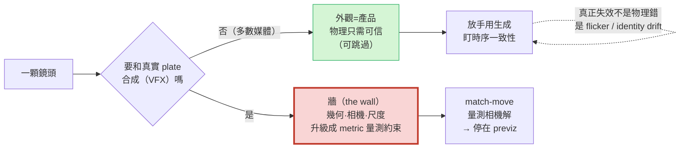

# Use Case: Media & Content

> 影片 / 廣告 / 電影 —— 物理可控生成最大的商業 vertical。但它對本手冊命題有個優雅的反轉：**媒體裡外觀就是產品，物理只需「可信」不需「正確」—— 直到你的生成像素要和真實素材合成（VFX），此時幾何與相機才變成 metric 量測約束。**

*圖：外觀是產品、物理只需可信 —— 直到撞上「與真實 plate 合成」那道牆，幾何才變 metric 約束*

## 核心命題：外觀是產品、物理只需可信（除非碰真實素材）

Physics-IQ 證明了**視覺擬真度與物理理解力不相關**（[arXiv 2501.09038](https://arxiv.org/abs/2501.09038)）——這對媒體**雙面**：① **好消息**，廣告/短影音/敘事的人類門檻是 plausibility 非 correctness，你被允許跳過物理；② **牆**，任何要真動力學或與真實 plate 合成的鏡頭就撞牆。媒體真正會踩的失效**不是「物理錯」、是「時序一致性」**（flicker / identity drift / object-permanence）。

## 商業地景（快速演進，標日期）

開源前緣（Wan 2.2 Apache-2.0、Hunyuan）是**可控性研究插入的地方**（ControlNet/VACE/LoRA 跑在開放權重上）；閉源 API（Sora/Veo/Kling）只給廠商選的槓桿。能力標記：Veo 3（1080p+4K、native audio）、Sora 2（已宣布下線 app 2026-04-26 / API 2026-09-24——當「一個世代證明了什麼可能」、非前向目標）、Kling、Seedance（native multi-shot）。

## 控制堆疊 + previz 牆

導演要的槓桿——reference/identity、first-last-frame、camera(Plücker)、in-context edit(Runway Aleph)、structure(VACE)——**都是學習式/相對控制、已成熟**。但 VFX 整合要的是 **metric 相機解**（match-move 逐幀三角化 position/rotation/lens）；生成式相機控制給不了 metric → 所以高端電影**停在 previz/augmentation**（Coca-Cola 廣告 production-real；ILM「Field Guide」自評 previz-only）。詳見 [導演的控制堆疊](./directors-control-stack.md)。

## 本區 Dissections

- [外觀與動力學的解耦](./appearance-dynamics-decoupling.md) — Physics-IQ 為什麼對媒體是好消息；那條線在哪停（流體/接觸/VFX）；時序一致性才是真失效
- [導演的控制堆疊](./directors-control-stack.md) — reference/keyframe/camera/in-context-edit 映到 5 軸；學習式 vs metric 控制；previz↔final-frame 的 match-move 牆

## 與 foundation / sister 的對應

方法錨點在 foundation [video-world-models](../../foundations/video-world-models/overview.md)（Sora/Veo/SVD）；「外觀生成、物理另接」與 [aerial 的生成航拍資料](../aerial-sim/generative-aerial-data.md) 是同一條命題的不同 vertical。

## 未來前沿

- **metric 相機輸出**：能輸出可對齊真實 plate 的 metric 相機解，是把生成影片從 previz 推到 final-frame 的關鍵。
- **時序一致性 / object permanence**：媒體真正的瓶頸，metric（World Consistency Score 等）剛起步。
- **可控性 × 開源**：哪些控制槓桿存在，部分取決於 open-vs-closed，而非只看模型質量。
