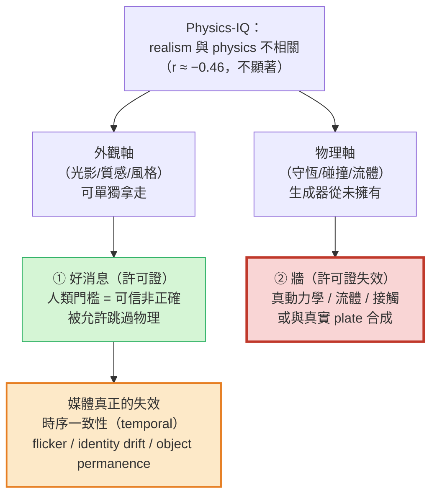
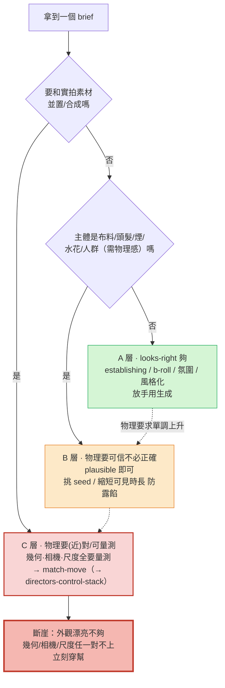

<!-- ontology-5axis output=pixel-video injection=data-only control=text temporal=clip-parallel domain=generalist -->

# 標題（外觀與動力學的解耦 —— 為什麼這對媒體是好消息 解構）

> 本篇把 handbook 中心論點翻成 **媒體 / 創作端的語言**：在當前生成影片裡，**外觀（光影、質感、風格）與動力學（真實動力學、守恆、碰撞質量感）是解耦的** —— 視覺擬真度高 ≠ 模型懂物理。為什麼進 media-and-content 錨點名單？因為這個解耦對廣告/短影音/敘事是一張 **「看起來對就夠」的許可證**：人類觀眾的驗收門檻是 **可信** 而非 **正確**，所以你能拿到漂亮可信的鏡頭，而模型根本不必「懂」流體守恆或剛體破裂。但這張許可證有牆 —— 它在你碰**真實素材合成（VFX）**或**需要真動力學**的那一刻失效。核心反直覺：解耦讓媒體成為**最寬鬆**的生成領域（你被允許跳過物理），但同一條牆讓「與真實 plate 合成」的鏡頭反而變成**幾何-物理要求最嚴**的領域。
> The thesis in media language: **appearance and dynamics are decoupled in today's video gen, and that decoupling is a license** — the human bar is plausibility, not correctness, so you ship pretty, believable footage without the model understanding physics. The license has a wall: the moment you composite against a real plate or need true dynamics, decoupling stops protecting you.
> NO-DUP 聲明：本篇 **不** 重拆 Sora / 任一 video-gen 引擎的主幹（那是 [../../foundations/video-world-models/sora.md](../../foundations/video-world-models/sora.md) 的職責）；本篇只把「解耦」這個**現象**及其對媒體的**雙面後果**講透。

## 1. 一句話總結 — 視覺擬真 ≠ 懂物理；對媒體這是「看起來對就夠」的許可證

**一句話裁決：解耦是真的，而且對媒體是好消息 —— 直到它不是。** DeepMind 的 **Physics-IQ**（arXiv [2501.09038](https://arxiv.org/abs/2501.09038)）量到的核心結論：**visual realism does not imply physical understanding**；模型的物理理解「severely limited, and unrelated to visual realism」。這句話對媒體有**兩個讀法**，缺一不可：

- **① 好消息（許可證）** —— 廣告、短影音、敘事的人類驗收門檻是**可信非正確**。觀眾不會拿守恆定律去查你的火花/煙/頭髮，只要它**看起來對**。解耦正好說：你拿得到「視覺漂亮」這一半，**而不必付「物理正確」那一半的帳**。對看起來對就夠的鏡頭，這是**白拿的好處**。
- **② 牆** —— 任何需要**真動力學**（流體守恆、碰撞的質量感、布料的真實垂墜）或需要與**真實 plate 合成**（VFX）的鏡頭，解耦反過來咬你：模型那一半「不懂物理」的事實會在合成介面暴露。

> 媒體讀者要記的不是「生成影片物理爛」（那太簡化），而是 **「外觀那一半被解耦出來、可以單獨拿走」** —— 這既是你的超能力，也是你越界時的斷崖。



*圖：同一個解耦的雙面 —— 許可證讓你跳過物理，牆在合成時補繳；但真正會退件的是時序一致性*

## 2. Physics-IQ 的硬證據（擬真度與物理不相關）

Physics-IQ 是目前把「外觀 vs 物理」解耦量得最乾淨的證據，**設計就是為了拆開這兩個軸**：

| 維度 | Physics-IQ 設定 |
|---|---|
| 任務 | 給一段 conditioning 影片，**預測接下來 5 秒** 的物理演化 |
| 資料 | **396 部真實高清影片**，專業拍攝、可重複 |
| 物理涵蓋 | **solid-mechanics（固體力學）/ fluid（流體）/ thermodynamics（熱）/ optics（光學）/ magnetism（磁）** 全跨 |
| 受測模型 | **Sora · Runway · Pika · Lumiere · Stable Video Diffusion · VideoPoet** |
| 關鍵發現 | **physical understanding 嚴重受限，且與 visual realism 無統計顯著相關** |

**這份報告的鐵錘是「相關性」而非「絕對分數」**：擬真度高的模型，物理不會跟著高。本手冊在 aerial 端對同一篇論文已落地具體數字（見 [../aerial-sim/generative-aerial-data.md](../aerial-sim/generative-aerial-data.md)）—— 視覺真實度與物理理解的相關係數 **Pearson r ≈ −0.46（不顯著）**，且**最真的影片（Sora 擬真度最高）物理分數常常最低**，最差類別正是 **solid mechanics**。

> 對媒體的翻譯：**模型是高明的「像素預測器」，不是「物理推理器」。** 它把訓練集裡常見的物理**表象**模仿得惟妙惟肖（這就餵飽了看起來對），但它沒有在解任何方程。**所以你不能用「畫面夠真」去推斷「動力學夠真」** —— 這個推論被 r≈−0.46 直接否決。
> Media takeaway: the model is a pixel predictor, not a physics reasoner. Pretty ≠ physical, and "it looks real so the dynamics must be right" is the single most expensive mistake on this page.

**為什麼這對你是好消息（不是壞消息）**：因為**像素預測器恰好就是廣告/敘事要的東西**。你要的是 establishing shot 的氛圍、b-roll 的質感、talking-head 的可信背景 —— 這些全是**外觀軸**的需求。解耦把外觀軸**單獨**交到你手上，這是領域紅利，不是缺陷。

把 Physics-IQ 的同一個結論拆成媒體要記的**雙欄帳**（許可證 vs 牆）：

| **好消息（許可證覆蓋）** | **牆（許可證失效）** |
|---|---|
| 觀眾驗收 = 可信，不查守恆 → 看起來對就過 | 任何需**真動力學**（流體守恆/碰撞質量感）的鏡頭 |
| 外觀軸（光影/質感/風格）可**單獨**拿走 | 任何與**真實 plate 合成**（VFX）的鏡頭 |
| establishing / b-roll / 氛圍 / 風格化奇幻：零物理負擔 | 跨真實/生成介面的**幾何·相機·尺度**對齊 |
| 「不懂物理」對看起來對的鏡頭**毫無代價** | 「不懂物理」在合成介面**立刻穿幫** |

> 帳本一句話：**解耦讓你白拿外觀那一半，但物理那一半的帳，會在你碰真實素材時一次補繳。**

## 3. 媒體真正會踩的失效：時序一致性 / 物件恆存（不是「物理錯」）

最常見的誤解：以為媒體的失效是「物理算錯了」。**不是。** 在看起來對就夠的工作流裡，把片子做廢的，幾乎都是**時序一致性（temporal consistency）**問題 —— 這是**外觀軸內部**的失效，跟守恆定律無關：

| 真正的失效模式 | 症狀（媒體會被退件的原因） | 不是什麼 |
|---|---|---|
| **Inter-frame flicker** | 幀與幀之間紋理/光影抖動、閃爍 | 不是物理錯，是外觀時序不穩 |
| **Identity drift** | 相鄰幀主角的臉/物件特徵漂移、變形 | 不是動力學錯，是外觀連續性崩 |
| **Object-permanence 失敗** | 物件**無故出現/消失**（手裡的杯子下一幀沒了） | 不是碰撞算錯，是世界一致性崩 |

針對這些，社區出現了**外觀軸的時序 metric**（不是物理 metric）：**Object Permanence**、**flicker penalty**、**World Consistency Score**（arXiv [2508.00144](https://arxiv.org/abs/2508.00144)）。

> 核心區分（媒體最該內化的一句）：**你的片子大概率不是死於「物理錯」，是死於「時序一致性 / 物件恆存」。** 前者是看起來對許可證**沒**覆蓋的領域（你本來就不需要），後者才是許可證**內部**的破口（你必須盯）。把驗收火力放對地方 —— 盯 flicker / identity drift / object permanence，而不是去查模型懂不懂牛頓。
> The footage rarely dies of "wrong physics"; it dies of temporal inconsistency. Spend your QC budget on flicker / identity drift / object permanence, not on whether the model knows Newton.

## 4. 那條線：什麼時候看起來對夠、什麼時候物理要(近)對

解耦給了許可證，但許可證有**邊界**。下面這條線是本篇的操作核心 —— 把鏡頭按「對物理的要求」分三層：

| 層級 | 鏡頭類型 | 物理要求 | 為什麼 |
|---|---|---|---|
| **A · 看起來對夠** | establishing shot / b-roll / 氛圍鏡 / 風格化奇幻 / talking-head 廣告 / 中性背景的產品 hero | **無** —— 純外觀，觀眾不查物理 | 解耦許可證**完全覆蓋**；放手用生成 |
| **B · 物理要可信、不必正確** | 布料 / 頭髮 / 煙 / 水花 / 人群 | **可信即可** —— 看起來合理，不需守恆 | 觀眾感知的是「物理感」，不是物理量；看起來對仍夠，但門檻略高（容易露餡） |
| **C · 物理要(近)對 / 可量測** | **任何與真實素材合成的鏡頭** —— 幾何/相機/尺度都要量測 | **(近)正確且可 metric** | 一旦與真實 plate 並置，人眼對「不貼合」極敏感；這裡需要 match-move（見 [./directors-control-stack.md](./directors-control-stack.md)） |

**牆的形狀**：A→B→C 是「物理要求」單調上升。A、B 落在解耦許可證內（你被允許跳過真物理）；**C 是斷崖** —— 在 C，外觀漂亮**不夠**，因為它要和一段**真實**影像對齊，幾何、相機內外參、尺度（scale）任何一項對不上，合成立刻穿幫。

**分層決策樹（拿到一個簡報就跑這個）**：

```
這顆鏡頭要和「實拍素材」並置/合成嗎？
   ├─ 是 ──────────────────────────────► C 層：先做 match-move + 量測相機/尺度，再生成；
   │                                       外觀漂亮不是通過條件（→ directors-control-stack）
   └─ 否
       └─ 主體是 布料/頭髮/煙/水花/人群 等需「物理感」的素材嗎？
              ├─ 是 ──────────────────► B 層：plausible 即可，但挑 seed / 縮短可見時長 防露餡
              └─ 否 ──────────────────► A 層：establishing / b-roll / 氛圍 / 風格化 —— 放手用生成
```



*圖：A→B→C 物理要求單調上升，A/B 在許可證內、C 是斷崖（同一支 30 秒廣告常三層並存）*

> 同一支 30 秒廣告常**三層並存**：開場航拍城市（A，放手生成）→ 主角風衣在風中（B，盯垂墜、多挑 seed）→ 產品擺在**真實**桌面合成（C，必須 match-move）。**錯誤是用同一把尺驗三層** —— 對 A 去查物理（白費力），或把 C 當 A（穿幫退件）。

> 反直覺收束（本篇金句）：**解耦讓媒體成為最寬鬆的生成領域 —— 直到你碰真實素材，媒體才反而變成幾何-物理要求最嚴的領域。** 同一個「外觀/動力學解耦」，在 A/B 是禮物，在 C 是你必須補課的債（match-move / 量測幾何 / 釘尺度）。
> Decoupling makes media the *loosest* gen vertical — until you touch real footage, at which point media becomes the *strictest* geometry-and-physics vertical. Same decoupling, opposite sign.

## 5. 五軸定位

本篇談的是 **generalist 像素影片生成模型這一類**（Sora / Runway / Pika / Lumiere / SVD / VideoPoet）的共同性質，故用通用座標（見 [../../cheat-sheet/ontology.md](../../cheat-sheet/ontology.md)）：

| Axis | 值 | 說明 |
|---|---|---|
| Output | `pixel-video` | 直接 decode RGB 影片 —— 這正是「外觀軸」的輸出空間 |
| Injection | `data-only` | **物理完全靠資料隱式學，零 aux-loss / 零 sim / 零硬約束** —— 這就是解耦的形式化根源：沒有任何機制把物理「綁進」生成，所以物理只能是外觀的副產品，兩軸自然解耦 |
| Control | `text` | 文字 prompt 驅動（媒體最常用入口） |
| Temporal | `clip-parallel` | 一次生固定窗口 clip —— **§3 的 flicker / identity drift / object-permanence 正是此範式的典型病** |
| Domain | `generalist` | 通用世界，無場域限定（媒體創作橫跨各題材） |

> 讀法：`injection=data-only` **就是解耦的機械解釋**。Physics-IQ 量到的「擬真度與物理不相關」不是巧合，是 `data-only` 的必然 —— 沒有物理注入通道，模型只能學外觀表象。媒體拿走的是 `output=pixel-video` 這一半；物理那一半從來沒被生成器擁有過。
> 注意 `domain=generalist`：本篇是**跨模型的現象綜述**（非單一 foundation 模型解構），故用通用框架描述這一**類**模型的共性；個別模型（Sora）的 generalist 白名單歸屬見其本篇。

## 6. 跨路線綜合（連 directors-control-stack；與 generative-aerial-data 的「外觀生成、物理另接」同源）

把這條「解耦」接回手冊的兩個鄰居 —— 它們講的是**同一件事的不同切面**：

- **媒體製作端（同倉鄰居）**：[./directors-control-stack.md](./directors-control-stack.md) 擁有「導演如何把控制權拿回來」的工程棧（match-move、相機對齊、幾何量測）。本篇與它的分工：**本篇講解耦這個現象（為什麼看起來對夠 / 何時不夠）；directors-control-stack 講當你掉進 §4 的 C 層、必須補物理/幾何時的工具**。§4 的 C 層直接交棒給它的 match-move。
- **aerial 端（同源論點）**：[../aerial-sim/generative-aerial-data.md](../aerial-sim/generative-aerial-data.md) 是**完全同源**的論點落地 —— 它的標題就是「**外觀靠生成、動力學靠物理**」。差別只在**後果的方向**：在 aerial，讓生成猜動力學會**墜機**（硬失敗），所以它**強制**把動力學外包給物理模型；在媒體，讓生成跳過動力學只會讓片子**看起來對**（軟成功），所以媒體**被允許**跳過。**同一個解耦，aerial 是約束、媒體是許可** —— 這正是兩篇互為鏡像的價值。
- **與 Sora 解構的分工（NO-DUP）**：生成器**為什麼**解耦（DiT / data-only / OOD 物理天花板）由 [../../foundations/video-world-models/sora.md](../../foundations/video-world-models/sora.md) 拆；本篇**不重複**主幹解構，只消費「它解耦」這個結論並講對媒體的後果。
- **與評測的分工**：「誰被當成物理對的生成器」由 [../../foundations/evaluation-physics/vbench-physics.md](../../foundations/evaluation-physics/vbench-physics.md) 的 benchmark 三角（VBench surface / VBench-2.0 intrinsic physics / PhysBench evaluator）決定。媒體讀者的實務含義：**§3 的時序一致性走 VBench 的 temporal-flicker / subject-consistency 維度去盯；不要用 physics benchmark 去驗一支只需要看起來對的 b-roll。**

> 收束：把「外觀/動力學解耦」放進媒體，落點是一張**有邊界的許可證**。A/B 層放手用（許可證覆蓋），C 層補課（交棒 directors-control-stack）。aerial 用同一條線當墜機紅線，媒體用它當創作自由 —— **這就是三部曲生成端對「creative-tech」這一格的結論**。

## 7. 參考

**VALIDATED — 解耦的核心證據**
- Physics-IQ — DeepMind, arXiv [2501.09038](https://arxiv.org/abs/2501.09038)（核心句「visual realism does not imply physical understanding」；物理理解「severely limited, and unrelated to visual realism」；396 部真實高清影片；跨 solid-mechanics / fluid / thermo / optics / magnetism；給 conditioning 段預測接下來 5 秒；測 Sora / Runway / Pika / Lumiere / SVD / VideoPoet）

**VALIDATED — 媒體真正的失效（時序一致性，非物理）**
- World Consistency Score / Object-Permanence / flicker penalty — arXiv [2508.00144](https://arxiv.org/abs/2508.00144)（inter-frame flicker、相鄰幀 identity drift、物件無故出現/消失的時序一致性 metric）

**同倉交叉連結**
- 媒體製作控制棧（match-move / C 層補課）：[./directors-control-stack.md](./directors-control-stack.md)
- 媒體 use-case 總覽：[./overview.md](./overview.md)
- 同源論點（外觀生成、物理另接）：[../aerial-sim/generative-aerial-data.md](../aerial-sim/generative-aerial-data.md)
- 生成器為何解耦（主幹解構，NO-DUP）：[../../foundations/video-world-models/sora.md](../../foundations/video-world-models/sora.md)
- 誰算「物理對」的生成器（評測三角）：[../../foundations/evaluation-physics/vbench-physics.md](../../foundations/evaluation-physics/vbench-physics.md)
- 五軸 ontology：[../../cheat-sheet/ontology.md](../../cheat-sheet/ontology.md)

## §8 踩坑日誌

1. **[CRITICAL · src: Physics-IQ 2501.09038] 用「畫面夠真」推斷「動力學夠真」。** Physics-IQ 量到擬真度與物理 **無統計顯著相關**（aerial 端落地 r≈−0.46，不顯著），且最真的影片物理常最爛。**繞法**：把外觀與動力學當**兩個獨立軸**驗收；任何「看起來對所以物理對」的推論一律否決。媒體只在需要真動力學/合成時才把物理拉進驗收清單（§4 C 層）。

2. **[CRITICAL · src: §3 時序 metric 2508.00144] 把驗收火力放錯地方 —— 去查「物理對不對」而忽略時序一致性。** 媒體片子的真實死因是 **flicker / identity drift / object-permanence**，不是守恆算錯。**繞法**：QC 主盯 inter-frame flicker、相鄰幀 identity、Object Permanence（物件莫名出現/消失）；用 World Consistency Score / flicker penalty 量，而非 physics benchmark。

3. **[HIGH · src: §4 那條線] 把 C 層（與真實素材合成）當 A/B 層處理。** 一旦與真實 plate 並置，外觀漂亮**不夠** —— 幾何/相機/尺度任一項對不上立刻穿幫，人眼對「不貼合」極敏感。**繞法**：C 層鏡頭走 match-move + 量測幾何 + 釘絕對尺度（交棒 [./directors-control-stack.md](./directors-control-stack.md)）；不要用「它在 b-roll 看起來很真」去推斷它能無縫合成進實拍。

4. **[HIGH · src: ontology injection=data-only] 期待「再加 10× 資料」就解開物理。** 解耦的根源是 `injection=data-only`（無物理注入通道），不是資料不夠；OOD 物理有結構性天花板（見 [../../foundations/video-world-models/sora.md](../../foundations/video-world-models/sora.md) 的 PhyWorld 結論）。**繞法**：需要真物理時，別等更大模型 —— 走外掛物理/合成（aerial 同源做法見 [../aerial-sim/generative-aerial-data.md](../aerial-sim/generative-aerial-data.md)）；data-only 的價值是看起來對，不是正確。

5. **[MEDIUM · src: §4 B 層] 把 B 層（布料/煙/水花/人群）當 A 層放鬆。** B 層門檻雖仍是可信，但**容易露餡** —— 流體/布料這類需 volumetric 演化的素材最常在「物理感」上崩（垂墜不對、煙穿模）。**繞法**：B 層鏡頭多挑幾個 seed / 縮短可見時長 / 必要時局部以模擬補；別假設它和 establishing shot 一樣零風險。

6. **[MEDIUM · src: vbench-physics.md domain blind spot] 用錯 benchmark 驗錯需求。** physics benchmark（PhyGenBench / VBench-2.0 Physics）驗的是物理常識，對一支只需看起來對的廣告 b-roll 是錯的尺。**繞法**：看起來對的鏡頭用 VBench 的 perceptual / temporal 維度（subject-consistency / temporal-flicker）；只有 §4 C 層或需真動力學的鏡頭才上 physics benchmark。

> **UNVERIFIED 標註彙整**：本篇所有承重數字/結論均附 arXiv URL（Physics-IQ 2501.09038 · 時序一致性 metric 2508.00144），且 r≈−0.46 等具體數字沿用本手冊 aerial 端已落地的同篇論文結論（[../aerial-sim/generative-aerial-data.md](../aerial-sim/generative-aerial-data.md)）。**UNVERIFIED 數 = 0**：超出上述來源的任何具體宣稱（個別商用模型在特定鏡頭的物理表現、「某模型已解決流體」等行銷敘事）一律不予引用。
