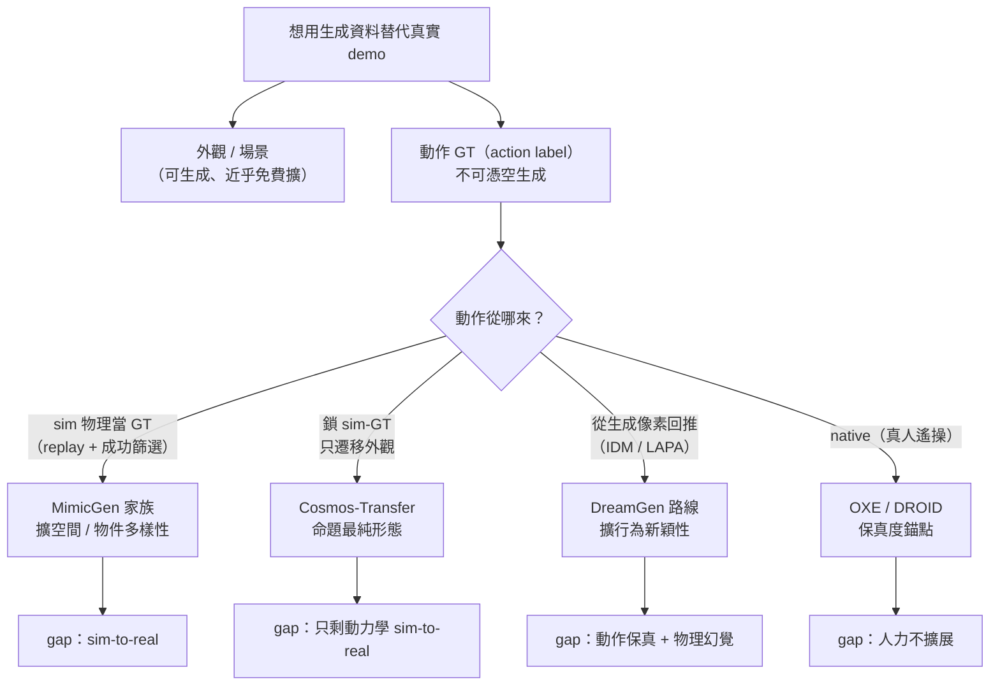
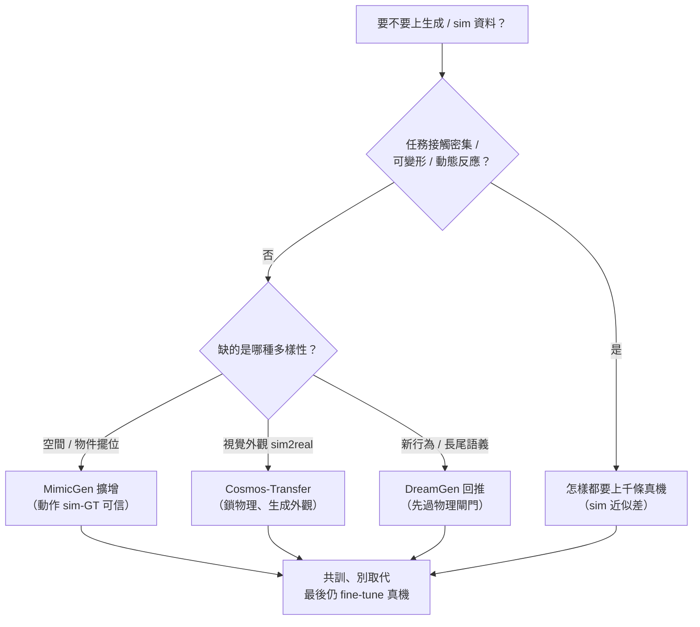

# Use Case: Robotics Data Generation

> 用生成 / 模擬補真實 demo 不足 —— VLA pre-training 最大的瓶頸就是**資料瓶頸**。但這個 use-case 把本手冊的命題逼到一個很尖的形式：**你能合成「機器人在哪、世界長什麼樣」，卻不能合成「機器人做了什麼」—— 除非物理（sim-GT）或真人（teleop）真的產生過那個動作。**

## 核心命題：外觀能生成、動作要物理或真人

機器人資料的三條供給曲線各有死穴：**真實 teleop**（動作保真度最高、native label，但人力受限不擴展）、**sim / 自動示範生成**（從幾個 human seed 幾何式擴增，但繼承 sim-to-real gap）、**生成影片 / 世界模型**（外觀/多樣性近乎免費擴，但**沒有原生動作**，label 必須**回推**——命題正是在這裡咬下去）。

對應到 ontology：這些方法在 **output 軸**上收斂（都產軌跡或影片），差異最大的是 **control 軸**——**動作從哪來：native（真人）/ sim-GT（replay）/ inferred（從生成像素回推）**。這條軸就是整個 use-case 的分水嶺。

*圖：外觀能生成、動作 GT 不能；三條路線真正的分水嶺是動作從 sim-GT、回推、還是真人來*

## 三條 sub-route（按動作來源切）

1. **自動示範生成（sim-GT 動作）** —— [MimicGen 家族](./autonomous-demo-gen.md)（MimicGen / DexMimicGen / RoboCasa / DemoGen）：把少數 human demo 用 SE(3) 物件中心變換 + 開環 replay + 成功篩選，擴成上萬條。動作是 **sim 物理裡的 ground-truth**，可信；它擴的是**空間/物件多樣性，不是行為新穎性**。
2. **生成影片當資料（inferred 動作）** —— [生成影片路線](./generative-video-as-data.md)（DreamGen/GR00T-Dreams、Cosmos、UniSim、Genie）：生成像素，再用 IDM/LAPA **回推 pseudo-action**。真機已 VALIDATED（DreamGen），但瓶頸是**生成動力學的物理合理性**；最乾淨的勝場（Cosmos Transfer）正是**鎖 sim-GT 動作、只生成外觀**。
3. **真實 teleop（native 動作，被擴增的基準）** —— Open X-Embodiment / DROID：動作保真度錨點，一切擴增都圍著它轉、不是取代它。

## 資料契約（real vs sim vs generated）

| 來源 | 動作 label 來源 | 外觀保真 | 動力學/接觸保真 | 可擴展 | 主要 gap | 最佳角色 |
|---|---|---|---|---|---|---|
| **真實 teleop**（OXE/DROID） | **native**（部署 embodiment 的 GT） | 真 | 真 | 否（人力） | 覆蓋/多樣性 | 保真度錨點、最後 fine-tune |
| **自動示範生成**（MimicGen…） | **sim-GT**（replay+成功篩） | sim render（或 text-to-img/3D 增強） | sim 物理（開環、static-scene） | 是 | **sim-to-real**、行為新穎性 | 廉價擴空間/物件/embodiment |
| **sim + 外觀生成**（Cosmos Transfer） | **sim-GT 保留**（動作/幾何不動） | **生成**（photoreal） | **sim-GT** | 是 | 只剩動力學 sim-to-real | 做對的視覺域隨機化 |
| **自由生成影片**（DreamGen/UniSim/Genie） | **inferred**（IDM/LAPA 猜） | 生成（photoreal、多樣） | **生成→可能違反物理** | 是 | **動作保真度 + 物理幻覺** | 從極小 seed 擴行為/環境 |

## 何時幫、何時傷（經驗契約）

- **共訓、別取代**：sim 共訓平均提升真機 ~38%（arXiv 2503.24361），且比例往 sim 多的方向加（精確 80/20 比 `UNVERIFIED`）。
- **真實共訓 > sim 共訓**：接觸物理要緊時，純 sim 共訓「顯著較差」（[SIMPLER](https://simpler-env.github.io/)）。
- **會傷**：可變形 / 接觸密集任務 sim 近似差，這些怎樣都要上千條真機。
- **連評測都要先閉 gap**：SIMPLER 證明「在 sim 裡評真機 policy」也得先做 green-screen（視覺）+ SysID（控制）才相關。

*圖：接觸密集先排除生成路線；其餘按缺哪種多樣性選方法，但永遠共訓而非取代真實 demo*

## 關鍵指標

- 生成資料 → 訓 policy → **真機 success rate**（最終 ground truth）
- 純合成 / 合成+少量真實 / 純真實的 **Pareto** 與 co-train 比例
- 生成影片路線額外要看 **physics-alignment**（DreamGen Bench：影片物理合理性才是瓶頸，不是回推頭）

## 本區 Dissections

- [Physical Intelligence π0 / π0.5](./physical-intelligence-pi0.md) — VLA flow model，這些合成資料的下游終點客戶
- [自動示範生成 —— MimicGen 家族](./autonomous-demo-gen.md) — sim-GT 動作、擴空間多樣性；及其 static-scene/sim-to-real 邊界
- [生成影片當機器人資料](./generative-video-as-data.md) — 像素生成、動作回推；DreamGen 的 VALIDATED 證據與物理保真度瓶頸

## 與 VLA-Handbook 的 bridge

生成端造資料、VLA 端消費資料的契約 —— 見 [`bridge-to-vla/generative-data-for-vla.md`](../../bridge-to-vla/generative-data-for-vla.md)。

## 未來前沿

- **行為新穎性**：示範生成只擴空間配置，怎麼自動生**沒被 seed 過的技能**仍未解（SkillMimicGen 等在試）。
- **可變形 / 接觸密集**：sim 接觸近似差、生成影片穿模——這類資料的可信生成是 open research。
- **物理合理性 metric**：World Consistency Score / DreamGen Bench 是起點，但「生成動力學夠不夠真到能回推動作」還沒有可靠閘門。
