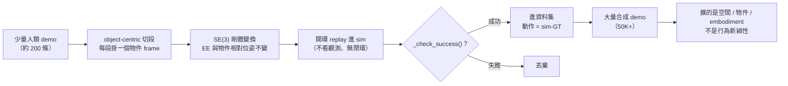

<!-- ontology-5axis output=action-seq injection=sim-in-loop-train control=trajectory|action temporal=streaming domain=robotics -->

# 自動示範生成 —— MimicGen 家族 解構

> Mandlekar, Nasiriany, Wen et al., **MimicGen: A Data Generation System for Scalable Robot Learning using Human Demonstrations**, CoRL 2023, arXiv [2310.17596](https://arxiv.org/abs/2310.17596)
> Jiang, Xie, Mandlekar et al., **DexMimicGen: Automated Data Generation for Bimanual Dexterous Manipulation via Imitation Learning**, arXiv [2410.24185](https://arxiv.org/html/2410.24185v2) (Oct 2024)
> 延伸：RoboCasa（[已有 foundation 解構](../../foundations/data-engine/robocasa.md)，本頁不重拆引擎）· [DemoGen](https://demo-generation.github.io/)
>
> **為什麼進名單**：robotics-data-gen overview 列三條 sub-route，其中「sim-augmented gen」是唯一**動作標籤自帶 ground-truth** 的一條——而 MimicGen 家族就是這條路的事實標準範式。它跟「生成影片」路線（[generative-video-as-data](./generative-video-as-data.md)）的根本差異在於：影片路線要事後用 inverse dynamics 倒推動作、賭標籤保真度；MimicGen 路線的動作從一開始就是 sim 內 replay 出來、用任務成功判定篩過的。任何想拿合成 demo 餵 [π0-class VLA](./physical-intelligence-pi0.md) 的人，第一個要評估的就是這家族擴出來的到底是什麼維度的多樣性。

---

## 1. TL;DR

**這家族的本質：在既有動作原語周圍生成新的場景配置，而不是生成新的行為。** MimicGen 拿 ~200 條人類遙操 demo，跨 18 個任務自動放大到 **50K+** 條（[2310.17596](https://arxiv.org/abs/2310.17596) 摘要原文 "over 50K demonstrations across 18 tasks ... from just ~200 human demonstrations"）。做法不是學一個生成模型，而是把每條 seed demo 切成 **物件中心（object-centric）的子任務段**，對每段施一個**保持「末端執行器↔目標物件相對位姿」不變的 SE(3) 剛體變換**，把同一套手部運動搬到新的物件擺位上，再 **開環 replay（open-loop）** 重放這串變換後的動作，最後**只保留整條軌跡通過任務 success 判定的**。

關鍵後果有三：(1) 動作是 **sim-GT** —— 在 sim 物理引擎裡 replay 出來、通過成功篩選，所以在 sim 物理範圍內可信，繼承的是 **sim-to-real gap 而不是標籤保真度問題**；(2) 它擴的是**空間 / 物件 / embodiment 多樣性**，機器人做的還是那個被 seed 的技能——**不造新的 contact dynamics**；(3) 整條 pipeline 的脆點集中在「物件位姿估計準不準」和「線性插值接合段會不會撞」。DexMimicGen 把它推到雙手 + 人形 + 靈巧手（21K demos from 60 human demos），RoboCasa 把它接到場景 / 資產生成（但生成進來的是場景不是動作），DemoGen 把場景變換從 sim 換成 3D 點雲編輯——四者共享同一個「開環 replay + 成功篩選」骨架，也共享同一條 caveat。



*圖：少量 demo 經 SE(3) 搬家加開環 replay 加成功篩選擴成上萬條；動作天生 sim-GT，但只擴空間多樣性*

---

## 2. 核心機制（MimicGen 的 SE(3) 物件中心變換 + 開環 replay + 成功篩選）

MimicGen 不訓練任何生成網絡。它是一條**確定性的軌跡變換管線**，輸入少量人類 demo，輸出大量合成 demo。四個階段：

1. **子任務切分（object-centric segmentation）**：把一條完整 demo 按「當前操作哪個物件」切成若干 subtask segment。每段都掛在一個參考物件（reference object frame）上——這是「object-centric」的字面意思。**硬需求：任務必須能做這種 object-centric 分解**（pick-place / insertion 這類好切；高度連續耦合的任務不好切）。
2. **SE(3) 變換到新場景**：在新場景裡，目標物件被擺到一個新位姿。MimicGen 對該 subtask 段施一個 SE(3) 剛體變換 `T`，使得**「末端執行器相對於該物件的位姿軌跡」在變換前後完全保持不變**。直觀講：人類在舊位置怎麼抓杯子，就把那串手部動作整體旋轉平移到新杯子的位置，相對幾何一模一樣。
3. **線性插值接合 + 開環 replay**：相鄰兩個變換後的子任務段之間，用**線性插值**補一段過渡軌跡把它們接起來，然後把整串拼好的動作 **開環重放**（不看實時觀測、不做閉環修正，純粹把 action 序列喂給控制器執行）。
4. **成功篩選（success filtering）**：sim 跑完一條 replay，用任務的 `_check_success()` 判定整條是否成功；**只有通過的才進資料集**，失敗的丟棄。這一步是動作之所以能當 GT 的根本——進資料集的每條都被 sim 物理驗證過確實完成任務。

```
   人類 seed demo (一條完整軌跡)
        │
        ▼  ① object-centric 切分
   [seg_A: 抓杯子]  [seg_B: 放到架上]   ← 每段掛一個物件 frame
        │                │
        │ 新場景: 杯子在新位姿 P'        架子在新位姿 Q'
        ▼                ▼
   ② 求 SE(3) 變換 T_A, T_B 使
      「EE ↔ 物件 相對位姿軌跡」保持不變:
                                        ┌──────────────────────────┐
        舊:  EE_t  ==(相對)==>  obj     │  T·EE_t 仍滿足同一相對位姿 │
        新:  T·EE_t ==(相對)==> obj'    │  ⇒ 同一套手部運動「搬家」  │
                                        └──────────────────────────┘
        │                │
        ▼  ③ 線性插值把 T_A·seg_A 與 T_B·seg_B 接起來
   [────── 拼接後的完整 action 序列 ──────]
        │
        ▼  ④ 開環 replay 進 sim（不看觀測、無閉環修正）
   sim rollout ──► _check_success()？
        │              │
       成功 ✓         失敗 ✗ → 丟棄
        │
        ▼
   進合成資料集（動作 = sim-GT，已被物理驗證）
```

**三個硬性前提（任一不滿足，這條路就不能用）**：
- **準確的物件位姿估計**：步驟 ② 需要知道新場景裡物件的 6-DoF 位姿才能算 `T`。sim 裡是免費的（ground-truth state 直接讀）；真機部署則依賴外部 tracker，**遮擋 / 噪聲下脆**。
- **已知的 object-centric 任務分解**：步驟 ① 要能切段並指定每段的參考物件。
- **delta / 相對末端位姿控制器**：開環 replay 變換後的動作，需要控制器吃相對位姿增量（不是絕對關節角），否則 SE(3) 搬家後的動作沒法直接執行。

---

## 3. 家族對比

| 系統 | 規模 | 動作來源 | 可變的是什麼 | 主要限制 |
|---|---|---|---|---|
| **MimicGen** ([2310.17596](https://arxiv.org/abs/2310.17596)) | 50K+ demos / 18 tasks / from ~200 human | sim replay + 成功篩選（sim-GT） | 物件位姿、場景擺位、物件實例、機器臂型號 | 線性插值在雜亂場景→碰撞；**static-scene（quasi-static）假設**，動態 / 反應式任務崩；場景覆蓋偏差 |
| **DexMimicGen** ([2410.24185](https://arxiv.org/html/2410.24185v2)) | 21K demos / 9 tasks（3 embodiment × 3 task）/ from 60 human | 同上，雙手三模式變換 | 雙臂協調（parallel / coordination / sequential）+ 雙臂 + 人形 + 靈巧手 embodiment | 無碰撞處理；subtask 配對需人工標；**手指關節只局部插值**→靈巧多樣性淺 |
| **RoboCasa** ([2406.02523](https://arxiv.org/abs/2406.02523)) | 100 任務 / 150+ 物件類 / 2,500 場景 | MimicGen 式軌跡擴增（動作仍 sim-GT） | **場景 / 資產**（text-to-3D + text-to-image + LLM 編 composite 任務） | **「生成」進來的是場景 / 資產，不是動作**；真機遷移 delta 數字 abstract 未給（見 §6） |
| **DemoGen** ([project](https://demo-generation.github.io/)) | 1 demo → 多（>20× 減少真人採集） | **3D 點雲編輯重排場景 + TAMP 改寫軌跡** | 空間配置（單 / 雙臂、夾爪 / 靈巧、剛體 + 可變形） | 擴 spatial config，**不造新的 contact dynamics**（同 MimicGen 開環 caveat） |

> **讀法**：四者的「動作來源」欄全是某種 GT（sim replay 或 TAMP），沒有一個是「網絡生成 + 倒推」。差異在「可變的是什麼」——MimicGen/DexMimicGen 變物件擺位與 embodiment，RoboCasa 變場景與資產，DemoGen 變點雲場景。**沒有一個變的是行為本身**。
>
> RoboCasa 引擎細節（RoboSuite/MuJoCo 後端、Luma/MidJourney 資產、GPT-4 task taxonomy、MJX throughput 缺口）見[既有 foundation 解構](../../foundations/data-engine/robocasa.md)，本頁不重拆。

**家族邊緣（一句帶過）**：SkillMimicGen（[2410.18907](https://arxiv.org/abs/2410.18907)）往「組合 skill」延伸、SoftMimicGen（arXiv 2603.25725，**UNVERIFIED** 編號）往可變形物體、DynaMimicGen（arXiv 2511.16223，**UNVERIFIED** 編號）往動態任務——都是試圖突破「開環 + quasi-static」這條母 caveat 的方向。

---

## 4. 五軸定位

| 軸 | 值 | 註 |
|---|---|---|
| 1. Output | `action-seq` | 輸出是 state-action 軌跡序列，供 imitation learning 直接訓練；不出像素、不出 3D 場景 |
| 2. Injection | `sim-in-loop-train` | 物理透過 sim replay + success filtering 進入**訓練資料**——sim 是 GT 來源，不是 inference 端介入 |
| 3. Control | `trajectory` + `action` | conditioning 是 seed 軌跡 + 變換後的動作串；新場景物件位姿決定 SE(3) 變換 |
| 4. Temporal | `streaming` | episodic sim rollout，連續時間 replay，無 frame-by-frame 生成概念 |
| 5. Domain | `robotics` | 操作 / 雙臂 / 人形，統一是物理機器人 |

**這條路的判斷性定位（load-bearing）**：**動作是 sim-GT（replay + 成功篩選），擴的是空間多樣性而非行為新穎性。** 對照 [ontology Axis 2](../../cheat-sheet/ontology.md)，`sim-in-loop-train` 是「訓練時可微 / 仿真 sim 提供 GT trajectory」這一格——MimicGen 用的是非可微 MuJoCo 的 forward replay + 成功判定，落在這格的「提供 GT trajectory」子義（不走 gradient，走 verified replay）。

這跟同 Output 軸的 [π0](./physical-intelligence-pi0.md)（`injection=data-only`）形成清楚對比：π0 從 10,000h 真實遙操隱式學物理；MimicGen 從 sim 顯式 replay 出物理一致的軌跡。**前者賭真實資料規模，後者賭 sim 物理可信 + 真機 gap 可控。**

**Cross-axis 檢查（per ontology Check 9b）**：`output=action-seq × injection=sim-in-loop-train` 在相容矩陣裡是 ✓ 合法格（action-seq 一整列全 ✓），無 §8 必解釋條款。`domain=robotics` 非 generalist，符合 Check 9c 白名單。

---

## 5. ⚡ 強 / ❌ 崩

### ⚡ 強

- **標籤保真度不是問題**：動作經 sim 物理 replay + success filtering，進資料集的每條都「在 sim 裡確實完成了任務」。這是相對影片生成路線（inverse-dynamics 倒推動作、誤差不可控）的**結構性優勢**。
- **採集成本斷崖式下降**：~200 human → 50K+ (MimicGen)、60 human → 21K (DexMimicGen)、1 demo → 20×+ (DemoGen)。對「遙操貴」這個 VLA 第一瓶頸是直球解法。
- **空間 / 物件泛化覆蓋**：SE(3) 變換天然窮舉物件擺位，policy 學到的是「在任意位姿抓這個物件」而非「在固定位姿抓」——這套位姿不變性對下游 VLA 很值錢。
- **real-to-sim-to-real 已驗證可行（headline 案例）**：DexMimicGen 報 Fourier GR-1 人形 can-sorting **90%（40 條生成 demo）vs 0%（單獨 4 條真人 demo）**（來源：[2410.24185](https://arxiv.org/html/2410.24185v2) 論文 / 項目頁；此數字在論文正文/項目頁，不在 abstract，標 **UNVERIFIED-from-abstract**）——這是「合成 demo 真的把真機 success rate 從 0 拉起來」的存在性證明。

### ❌ 崩

- **動態 / 反應式任務直接崩**：開環 replay + **quasi-static（static-scene）假設**意味著它假設「重放期間世界不會因為機器人以外的原因改變」。需要實時反應的任務（接住掉落物、跟動的物體、雙人協作中對方在動）——SE(3) 搬家來的開環軌跡完全失效。
- **線性插值在雜亂場景 → 碰撞 / 不可行**：步驟 ③ 的接合段是直線插值，不做碰撞檢查（DexMimicGen 明言 **無碰撞處理**）。場景一雜亂，插值段穿過障礙物，replay 失敗率飆升、有效產出率掉。
- **物件位姿估計是真機部署的命門**：sim 裡位姿免費；真機要 tracker。**遮擋 / 噪聲下 SE(3) 變換算錯 → 整段搬錯位置**。DexMimicGen 報 Threading 任務 **69.3%**（vs Can 97.3% / Box 94.7%），論文歸因第三人稱相機遮擋拉低（來源同上，**UNVERIFIED-from-abstract**）——這正是位姿可觀測性退化的直接證據。
- **靈巧多樣性是淺的**：DexMimicGen 對手指關節只做**局部插值**，不對靈巧操作的接觸序列做真正變換——所以「靈巧手」這個 embodiment 維度擴出來的多樣性，比「手臂位姿」維度淺得多。
- **場景覆蓋偏差**：生成分佈被 seed demo 的子任務結構 + 變換採樣策略決定，不是均勻覆蓋真實世界分佈——容易在 seed 沒覆蓋的 corner case 上留洞。
- **行為新穎性為零（本質限制，非 bug）**：再怎麼放大，機器人會的還是被 seed 的那幾個技能。**這家族不會教機器人新動作**，只會教它在更多場景裡做老動作。

---

## 6. 跨路線綜合（vs 生成影片路線；它的契約位置）

把這家族放進 robotics-data-gen 三條 sub-route 的座標系（[overview](./overview.md)）：

| 維度 | MimicGen 家族（本頁，sim-augment） | 生成影片路線（[generative-video-as-data](./generative-video-as-data.md)） |
|---|---|---|
| 動作標籤 | **自帶 sim-GT**（replay + 成功篩選） | 無動作標籤 → 事後 inverse dynamics 倒推 |
| 主要風險 | **sim-to-real gap**（物理引擎 ≠ 真實） | **標籤保真度 + 視覺 sim2real 雙重 gap** |
| 擴的維度 | 空間 / 物件 / embodiment 配置 | 視覺外觀 / 場景多樣性 / 長尾語義 |
| 行為新穎性 | 無（老技能搬家） | 潛在有（若影片裡出現新行為，但難倒推成可執行動作） |
| contact dynamics | 不造新的（開環、quasi-static） | 影片可「看起來」有新接觸，但物理一致性無保證 |

**它在資料契約裡的位置**：MimicGen 家族產的是**「動作可信、空間多樣」的中游燃料**。它最適合補的是「同一技能 × 海量物件擺位」這一格——這恰好是真實遙操最貴、生成影片又給不出可靠動作的格子。但它給不出「新行為」和「新接觸物理」，那兩格得靠真實遙操（π0 的 10,000h）或真正的可微 sim（Genesis 級 contact-rich gradient）去填。

**下游契約對接**：這些合成 demo 最終要餵給 [π0-class VLA](./physical-intelligence-pi0.md)，所以必須對齊下游的硬規格——action chunk 規格、normalization 規約、相機 layout、delta vs absolute 控制器約定。MimicGen 天然產 delta 末端位姿動作，與 π0 的連續控制接口相對好接；但「sim 視覺 → 真機視覺」的 domain gap 仍要靠 domain randomization 或真機 fine-tune 補。**一句話契約論斷：這家族解決的是「動作從哪來」，不解決「視覺像不像真的」——後者得另外買單。**

---

## 7. 參考

**Canonical**
- MimicGen：Mandlekar, Nasiriany, Wen, et al., "MimicGen: A Data Generation System for Scalable Robot Learning using Human Demonstrations", CoRL 2023, arXiv [2310.17596](https://arxiv.org/abs/2310.17596)
- DexMimicGen：Jiang, Xie, Mandlekar, et al., "DexMimicGen: Automated Data Generation for Bimanual Dexterous Manipulation via Imitation Learning", arXiv [2410.24185](https://arxiv.org/html/2410.24185v2)（Oct 2024）
- RoboCasa：Nasiriany et al., RSS 2024, arXiv [2406.02523](https://arxiv.org/abs/2406.02523)（引擎細節見[本倉 foundation 解構](../../foundations/data-engine/robocasa.md)）
- DemoGen：項目頁 [demo-generation.github.io](https://demo-generation.github.io/)

**家族邊緣（編號待核）**
- SkillMimicGen：arXiv [2410.18907](https://arxiv.org/abs/2410.18907)
- SoftMimicGen：arXiv 2603.25725（**UNVERIFIED** 編號）
- DynaMimicGen：arXiv 2511.16223（**UNVERIFIED** 編號）

**本倉 cross-link**
- 下游消費者：[π0 / π0.5](./physical-intelligence-pi0.md)
- 路線總覽：[robotics-data-gen overview](./overview.md)
- 對照路線：[生成影片作為資料](./generative-video-as-data.md)
- 引擎解構：[RoboCasa foundation](../../foundations/data-engine/robocasa.md)
- 五軸定義：[ontology cheat-sheet](../../cheat-sheet/ontology.md)

---

## §8 踩坑日誌

> 嚴重度標尺：🔴 blocker · 🟠 major · 🟡 minor。來源逐條附連結；超出本頁 grounding 來源的推論標 UNVERIFIED。

### §8.1 🔴 動態 / 反應式任務不能用（[2310.17596](https://arxiv.org/abs/2310.17596) 開環 + quasi-static 假設）

開環 replay + static-scene 假設是這家族的母 caveat。任何「世界在 replay 期間會自己變」的任務（接落體、追動目標、對手在動的協作）——搬家來的開環軌跡無實時修正能力，直接失效。**繞法**：這類任務不要用 MimicGen 路線；改走閉環 RL / 真機遙操，或等 DynaMimicGen 式動態延伸成熟（編號 UNVERIFIED）。

### §8.2 🔴 真機物件位姿估計是命門（[2310.17596](https://arxiv.org/abs/2310.17596) 依賴 tracker）

SE(3) 變換需要新場景物件的 6-DoF 位姿。sim 裡 ground-truth 免費，真機靠外部 tracker，**遮擋 / 噪聲下算錯 → 整段搬錯位置**。DexMimicGen Threading 69.3%（vs Can 97.3%）論文歸因第三人稱相機遮擋（[2410.24185](https://arxiv.org/html/2410.24185v2) 正文 / 項目頁，**UNVERIFIED-from-abstract**）就是這個失效模式的證據。**繞法**：保證 tracker 可觀測性（多相機 / 腕部相機 / marker），或把 SE(3) 變換限制在位姿可靠的場景子集。

### §8.3 🟠 線性插值接合段無碰撞檢查（DexMimicGen 明言無碰撞處理，[2410.24185](https://arxiv.org/html/2410.24185v2)）

子任務段之間的線性插值過渡不做碰撞檢查。場景一雜亂，插值段穿障礙物 → replay 失敗、有效產出率掉。**繞法**：對接合段加 motion-planning（RRT / TAMP）取代直線插值——DemoGen 走的 TAMP 改寫路線正是針對此痛點；或在密集場景降低變換幅度。

### §8.4 🟠 subtask 配對需人工標（DexMimicGen，[2410.24185](https://arxiv.org/html/2410.24185v2)）

雙手三模式（parallel / coordination / sequential）的子任務配對與參考物件指定需人工標註，不是全自動。**繞法**：把標註成本攤進前期 seed 準備；同類任務複用 subtask schema 模板。

### §8.5 🟠 靈巧多樣性是假的深度（DexMimicGen 手指只局部插值，[2410.24185](https://arxiv.org/html/2410.24185v2)）

「靈巧手」embodiment 維度看似擴了多樣性，但手指關節只做局部插值、不對接觸序列做真正 SE(3) 變換——靈巧操作的接觸多樣性其實很淺。**繞法**：靈巧 in-hand 操作別指望這家族補足；需要 contact-rich 的真實示範或可微 sim（SoftMimicGen 方向，編號 UNVERIFIED）。

### §8.6 🟡 「200 生成 ≈ 200 真人」等值說法是 secondary 來源（UNVERIFIED）

坊間常引「MimicGen 生成的 200 條 ≈ 200 條真人 demo」與「每任務生成成功率 X%」這類等值 / 比率數字——這些**不在 [2310.17596](https://arxiv.org/abs/2310.17596) abstract**，屬 secondary 轉述。**繞法**：引用前回原論文 table 核實具體任務的 success-rate-vs-demo-count 曲線，不要直接用坊間等值說法當結論。

### §8.7 🟡 RoboCasa 真機遷移 delta 數字 abstract 未給（[2406.02523](https://arxiv.org/abs/2406.02523)，UNVERIFIED）

RoboCasa 論文談 scaling trend / promise，但 sim→real 的具體遷移提升 delta 數字在 abstract 層級沒有明確給出。**繞法**：把 RoboCasa 當「場景 / 資產生成 + 軌跡擴增的 long-tail 燃料」看待，真機 ROI 需查論文正文實驗 table 或等第三方複現，別把「scaling trend」誤讀成「真機 success rate 已驗證」。引擎本身細節見[本倉 foundation 解構](../../foundations/data-engine/robocasa.md)。

### §8.8 🟡 行為新穎性為零是設計邊界，不是缺陷（[2310.17596](https://arxiv.org/abs/2310.17596) 機制推論）

把這家族當「行為資料引擎」用會失望——它放大的是場景配置，機器人會的還是被 seed 的技能。**繞法**：資料配方上明確分工——MimicGen 家族補「老技能 × 海量場景」，新技能靠真實遙操（[π0](./physical-intelligence-pi0.md) 路線）或 skill-level 擴展（SkillMimicGen [2410.18907](https://arxiv.org/abs/2410.18907)）。
