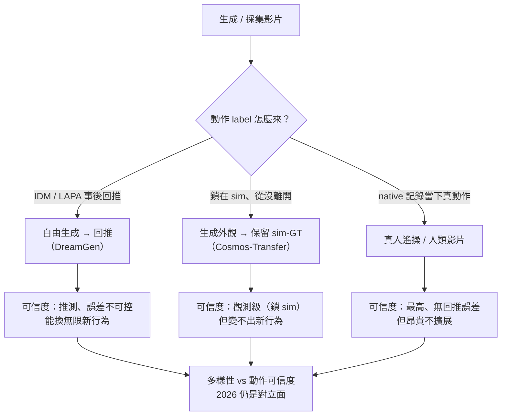
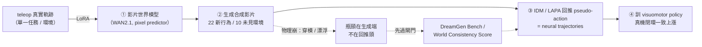

<!-- ontology-5axis output=pixel-video injection=data-only control=text|image-init|action temporal=autoregressive domain=robotics -->

# 生成影片當機器人資料 —— 像素生成、動作要回推 解構

> **DreamGen / GR00T-Dreams**（NVIDIA）· arXiv [2505.12705](https://arxiv.org/html/2505.12705v1)（May 2025）· [VALIDATED, 本篇主軸]
> **Cosmos** 平台論文 · arXiv [2501.03575](https://arxiv.org/abs/2501.03575)（Jan 2025）—— Predict（未來幀）+ Transfer（sim-to-real 增廣）
> **UniSim** arXiv [2310.06114](https://arxiv.org/abs/2310.06114) · **Genie** (DeepMind 11B) arXiv [2402.15391](https://arxiv.org/abs/2402.15391) · 物理保真度批判 arXiv [2601.17067](https://arxiv.org/abs/2601.17067)
>
> 為什麼進名單：這篇是整本手冊命題對機器人的**主戰場**——「生成像素 (pixels)，但動作 (ACTIONS) 必須被回推 (recovered)」。Cosmos / Genie / V-JEPA 都被當「世界模型」談，但對 VLA practitioner 唯一不自欺的問句是：**生成出來的那段影片，能不能反推出一條可信的 action label，拿去訓出真機跑得動的 policy？** DreamGen 第一次給了真機閉環的正面數字，但同一篇論文也把命題的兩個結構性裂縫攤在桌上。本篇給契約 (contract) 與誠實的 VALIDATED-vs-DEMO 分界。

---

## 1. TL;DR（核心張力：影片有了，動作是「猜」出來的）

**生成影片→真機 policy 在 2026 已經是 VALIDATED，不再是 demo——但這個勝利的形狀，反過來給命題打了兩個洞。**

正面證據是 DreamGen：從**單一 pick-place 任務、單一環境**出發，產出 **22 個新行為**、泛化到 **10 個未見環境**；真機閉環在三種 embodiment 上一致上漲（GR1 37%→46.4%、Franka 23%→37%、SO-100 21%→45.5%，[2505.12705](https://arxiv.org/html/2505.12705v1)）。這不是模擬器數字，是真機 success rate。

但**像素是生成的，動作不是觀測來的，是事後「猜」出來的**。自由生成影片沒有 native action label——DreamGen 必須**用 IDM（inverse dynamics model）或 latent-action 模型 (LAPA) 回推 pseudo-actions**，再在這些「**neural trajectories**」上訓 visuomotor policy。兩個 caveat 直接反證命題：

1. **🔴 瓶頸是生成端的物理合理性，不是回推頭的準度。** DreamGen 自己提出 **DreamGen Bench**（Instruction Following + Physics Alignment）就是因為主要 failure 來自影片品質/物理崩壞，而非 IDM 解錯。換句話說，把 IDM 換成更強的也救不了——錯在上游的像素。
2. **🔴 最乾淨的勝場根本沒在「自由生成」。** Cosmos Transfer 的 sim-to-real 增廣**保留 geometry 與 robot motion，只變光照/材質/外觀**——也就是**動作 ground-truth 從頭到尾被鎖在 sim 裡，從沒被「猜」過**（[NVIDIA R²D² blog](https://www.edge-ai-vision.com/2025/08/r%C2%B2d%C2%B2-boost-robot-training-with-world-foundation-models-and-workflows-from-nvidia-research/)）。生成的只是 pixel 外觀，物理被釘死。

**一句話契約**：像素 (pixel) 可以放心生成；動作 (action) 的可信度取決於它是**被觀測 (sim-GT / 真人 native)** 還是**被推測 (IDM/LAPA)**。這條分界，就是本篇的智力核心。



*圖：影片外觀都能生成，差別全在動作 label 是回推、鎖 sim-GT、還是真人 native；新行為與動作可信度互斥*

---

## 2. 核心機制（DreamGen 4 階段為主軸）

DreamGen 把「生成影片→回推動作→訓 policy」拆成四階段管線。關鍵在**③回推**這一步：影片世界模型本身不吐 action，pseudo-action 是另一個模型從相鄰幀「逆解」出來的。

```ascii
  ┌─ ① fine-tune 影片世界模型 ───────────────────────────────────┐
  │   WAN2.1 (主用)  ◄── LoRA  ◄── teleop 真實軌跡 (單一任務/環境)  │
  └──────────────────────────────┬───────────────────────────────┘
                                 │  世界模型 = pixel predictor
                                 ▼
  ┌─ ② 生成合成影片 ─────────────────────────────────────────────┐
  │   initial frame (★人工給) + language instruction              │
  │            │                                                  │
  │            ▼                                                  │
  │   synthetic video  ── 22 個新行為 / 10 個未見環境              │
  └──────────────────────────────┬───────────────────────────────┘
                                 │  ⚠ 只有像素，無 action label
                                 ▼
  ┌─ ③ 回推 pseudo-action（命題裂縫所在）────────────────────────┐
  │   synthetic video ──► [ IDM  或  latent-action(LAPA) ] ──► â   │
  │                          逆動力學猜動作      latent 猜動作       │
  │   → 「neural trajectories」= (frame, â) 配對，動作是推測非觀測 │
  └──────────────────────────────┬───────────────────────────────┘
                                 │
                                 ▼
  ┌─ ④ 訓 visuomotor policy ─────────────────────────────────────┐
  │   在 neural trajectories 上做 imitation → 真機部署             │
  │   真機閉環: GR1 37→46.4 · Franka 23→37 · SO-100 21→45.5 (%)   │
  └──────────────────────────────────────────────────────────────┘

  ╳ 反證點：失敗主因落在 ②（影片物理崩），不是 ③（IDM 解錯）
            → DreamGen Bench 量的是 ② 的 Instruction Following + Physics Alignment
```



*圖：生成影片到回推動作到訓 policy 的閉環；瓶頸在 ② 生成的物理合理性，回推頭升級救不了上游崩壞的像素*

要點：

- **①世界模型主用 WAN2.1**，以 LoRA 在單任務 teleop 軌跡上微調；它是 pixel predictor，**不是經驗證的動力學引擎**。
- **②生成需人工給 initial frame**——不是全自動 text-to-trajectory；這是成本與可擴展性的隱藏約束。
- **③回推是命題的薄弱環**：IDM 從 (frame_t, frame_{t+1}) 逆解動作；LAPA 在 latent 空間做。兩者都把「②的視覺誤差」翻譯成「錯誤但自洽」的 action label。
- **④neural trajectories** 是 DreamGen 的核心名詞——強調這些軌跡是「神經網路做的夢」，不是真機採的。

---

## 3. 三種動作來源的契約

命題的全部張力在「**動作 label 從哪來**」。同樣是「生成的影片」，三條路線的動作可信度天差地別。下表是 VLA practitioner 該帶走的契約。

| 路線 | 代表 | 影片怎麼來 | **動作 label 怎麼來** | 可信度 | 物理保證 | 證據等級 |
|---|---|---|---|---|---|---|
| **自由生成影片 → 回推** | [DreamGen](https://arxiv.org/html/2505.12705v1) / [Cosmos Predict](https://arxiv.org/abs/2501.03575) | 世界模型 (WAN2.1) 從 init frame + language 生成 | **IDM / LAPA 事後推測** | 🔴 推測，誤差不可控 | ⚡ VALIDATED（真機數字）但動作是猜的 |
| **生成外觀 → 保留 sim-GT** | [Cosmos Transfer](https://www.edge-ai-vision.com/2025/08/r%C2%B2d%C2%B2-boost-robot-training-with-world-foundation-models-and-workflows-from-nvidia-research/) | 只變光照/材質/外觀，**geometry+motion 不動** | **sim ground-truth 被保留** | 🟢 觀測級（鎖在 sim） | ⚡ 命題最純形態：生成外觀、保留物理 |
| **真人示範** | teleop / 人類影片 | 真實採集 | **native（記錄當下的真動作）** | 🟢 觀測，最可信 | 基準線（昂貴但無回推誤差） |

**讀法**：可信度由上往下遞增，但「自由生成」恰恰是最 sexy（無限多樣性、零真機成本）也最危險的一格——它的動作是**推測 (inference)**，不是**觀測 (observation)**。Cosmos Transfer 之所以是「命題最純形態」，是因為它**根本繞開了回推**：既然動作從沒離開 sim，那就沒有「猜」這回事，代價是它只能增廣外觀、不能憑空變出新行為（geometry 被鎖死）。真人示範則是無回推誤差的金標準，但正是它太貴，才逼出整條生成路線。

> **契約的殘酷推論**：你想要的「無限新行為」（DreamGen 那 22 個）只在「自由生成」這格拿得到，而這格的動作必然是猜的；你想要的「動作絕對可信」（Cosmos Transfer / 真人）只在「物理被鎖死或真實採集」拿得到，而這兩格變不出新行為。**多樣性與動作可信度，在 2026 仍是對立面。**

---

## 4. ⚡ VALIDATED 證據 / ❌ 物理保真度瓶頸

### ⚡ VALIDATED（真機閉環，非模擬器）

- **DreamGen 真機增益（3 embodiment, [2505.12705](https://arxiv.org/html/2505.12705v1)）**：GR1 37%→**46.4%**、Franka 23%→**37%**、SO-100 21%→**45.5%**。這是把 neural trajectories 喂進 policy 後的真機 success rate，跨三種硬體一致為正。
- **行為/環境泛化**：baseline（GR00T N1 僅 pick-place）在新行為 **0%**；DreamGen **43.2%（seen 環境）/ 28.5%（unseen 環境）**。從單任務種子長出 **22 行為 / 10 未見環境**。
- **Cosmos Transfer（sim-GT 保留）**：X-Mobility 在 hybrid（sim + Cosmos）資料上**勝過 sim-only**（[NVIDIA blog](https://www.edge-ai-vision.com/2025/08/r%C2%B2d%C2%B2-boost-robot-training-with-world-foundation-models-and-workflows-from-nvidia-research/)）。意義：保留物理、只生成外觀的增廣，是 sim2real 視覺 gap 的有效解。

### ❌ 物理保真度瓶頸（不會因 scale 自動解）

- **🔴 瓶頸在生成端，不在回推頭**。DreamGen 自承提出 **DreamGen Bench**（Instruction Following via VLM + **Physics Alignment via VideoCon-Physics**），正是因為**主要瓶頸是影片品質/物理合理性、不是 IDM 準度**。把回推頭升級救不了上游崩壞的像素。
- **🔴 auto-evaluator 自己會幻覺**：DreamGen 明說 auto-evaluator「**評物理真實性時偶爾幻覺**」——連「物理對不對」的裁判都不可靠，這對「自動化大規模生成資料」是元級 (meta) 風險。
- **🔴 標準感知 metric 偵測不到致命的物理錯誤**（[2601.17067](https://arxiv.org/abs/2601.17067)）：生成機器人影片常**夾爪穿過物件、物件漂浮 / 憑空出現**；FVD / PSNR 這類 metric 看不出來，但對動作回推是致命的（IDM 會把「穿模」逆解成一個荒謬但自洽的 action）。該文提新 metric「**World Consistency Score**」查 物件恆存 / 關係穩定 / 因果。
- **🔴 命題層級的框定**：[WorldModelBench](https://arxiv.org/abs/2502.20694) 與 [From Generative Engines to Actionable Simulators](https://arxiv.org/abs/2601.15533) 把核心 blocker 框成「**instruction following 差 + 違反物理的幻覺**」——這兩條正好對應 DreamGen Bench 的兩個軸，是跨論文共識，不是單點抱怨。
- **任務偏簡單 + 成本高**：DreamGen 的成功任務偏簡單，且需**人工給 initial frame**；生成成本 **240k RoboCasa 樣本 = 54 小時 × 1500 顆 L40**——不是免費午餐。

> **誠實結論**：生成影片→真機 policy 是 **VALIDATED**（DreamGen 真機數字撐得住），但這不等於命題成立。命題的乾淨版本（「自由生成像素、放心回推動作」）被兩件事反證：① 瓶頸是生成動力學/物理合理性，回推頭不是罪魁；② 最乾淨的勝場（Cosmos Transfer）正是**動作鎖 sim-GT、只生成外觀**，等於承認「自由生成的動作不可信」。

---

## 5. 五軸定位（control 軸 = 動作來源，是區分軸）

本篇標的是「自由生成影片→回推」這條主路線（DreamGen 式），五軸如下。**Axis 3 (control) 是這篇的區分軸**：`action` 出現在 control 軸，意味著動作是「條件/回推」進來的訊號，而非 native 觀測——這正是與 Cosmos Transfer（不靠 action 回推）和真人 teleop（native action）拉開的地方。

| Axis | 本篇（DreamGen 自由生成線） | 註 |
|---|---|---|
| 1. Output | `pixel-video` | 世界模型 (WAN2.1) decode 出 RGB frame；動作不是直接輸出 |
| 2. Injection | `data-only` | 物理隱式從 teleop + 生成 prior 學；無 PDE / 無 hard constraint / 無 sim-in-loop |
| 3. Control | `text` + `image-init` + `action` ★ | text instruction + 人工 initial frame；**`action` = IDM/LAPA 回推的 pseudo-action**，是區分軸 |
| 4. Temporal | `autoregressive` | 一幀 condition 上一幀往前生成；drift / exposure bias 是物理崩壞主因 |
| 5. Domain | `robotics` | 機器人操作（GR1 / Franka / SO-100），非 generalist |

**同軸鄰居（output=pixel-video, domain=robotics）對比動作來源**

| 鄰居 | 動作來源差異 | 對比要點 |
|---|---|---|
| [Cosmos Transfer](https://www.edge-ai-vision.com/2025/08/r%C2%B2d%C2%B2-boost-robot-training-with-world-foundation-models-and-workflows-from-nvidia-research/) | **sim-GT 保留**（不回推） | 同 output/domain，但動作從沒離開 sim → 命題最純形態；代價=不能變新行為 |
| [Genie](https://arxiv.org/abs/2402.15391) (DeepMind 11B) | **latent action, 無任何 GT** | unlabeled 網路影片 + latent action model；動作是 latent、**未錨定任何真實 embodiment**——命題問題的最純陳述（見 §6） |
| [UniSim](https://arxiv.org/abs/2310.06114) | action-in / video-out（predictor） | 通用模擬器，但它是 **predictor 不是經驗證動力學引擎**；純 sim 訓 agent→真機仍是 DEMO 級主張 |

**Cross-axis（per Check 9b/9c）**：`output=pixel-video + injection=data-only` 在相容矩陣是 ✓ 合法格，無 §8 必解釋條款。`control` 含 `action` 在 `domain=robotics` 合法（ontology Axis 5 robotics anchor 即 action-conditioned）。`domain=robotics` 非 generalist，符合 Check 9c 白名單（不在 Sora/Veo/Cosmos-Predict 之列，明確宣告具體 domain）。

---

## 6. 跨路線綜合（連 autonomous-demo-gen 與 bridge-to-vla）

把這篇放回手冊的兩條線：

- **連 [autonomous-demo-gen.md](./autonomous-demo-gen.md)（自動示範生成）**：那條線問「能不能讓系統自己生成示範、自己標動作、自己訓自己」。本篇是它的 **reality check**：自動化的瓶頸不在「能不能生成」，而在「生成的動作能不能信」。DreamGen 證明閉環可行，但 auto-evaluator 自己會幻覺、標準 metric 偵測不到穿模——**自動示範生成的天花板，是物理保真度的可驗證性，不是生成量**。

- **連 [physical-intelligence-pi0.md](./physical-intelligence-pi0.md)（下游終點客戶）**：所有生成路線最終都要回答「π0-class policy 真機 success rate 漲多少」。DreamGen 的 GR1/Franka/SO-100 數字就是這類 ground-truth 的範本——但 PI 自己不走純生成 video 路線，本篇的 caveat 解釋了為什麼：自由生成的動作可信度，目前還不足以單獨替代真實 teleop。

- **連 [bridge-to-vla/generative-data-for-vla.md](../../bridge-to-vla/generative-data-for-vla.md)（兩端契約）**：bridge 篇把 generation 端與 action 端的契約寫成 interface table（action label 是 grounded 還是反推、座標系對齊、contact fidelity）。本篇是該契約在「pixel-video 路線」上的具體實例化：**自由生成這格的 action label 永遠是反推的，這就是 bridge 篇標 🔴 的那一行的真身**。

- **不重拆引擎**：Cosmos / Genie 的引擎本體已在 [foundations/foundation-physics-models/cosmos-wfm.md](../../foundations/foundation-physics-models/cosmos-wfm.md) 與 [foundations/latent-world-models/genie-2.md](../../foundations/latent-world-models/genie-2.md) 解構；本篇只引用其**動作來源契約**，不重述架構。Genie 在本篇是「命題最純的反例」——它生成 action-controllable 世界**但無 GT 動作**，動作是 latent、未錨定任何真實 embodiment，是「動作要回推」這個問題去到極限的樣子。

**一句話 take-away（給 VLA practitioner）**：要無限多樣性就接受動作是猜的（DreamGen，先過 DreamGen Bench / World Consistency Score 篩掉穿模幀再餵 IDM）；要動作絕對可信就鎖 sim-GT 只增廣外觀（Cosmos Transfer）或回去收真人 teleop。**2026 沒有第三條路同時給你兩者。**

---

## 7. 參考

**Canonical**
- DreamGen / GR00T-Dreams — NVIDIA, *DreamGen: Unlocking Generalization in Robot Learning through Video World Models*, arXiv [2505.12705](https://arxiv.org/html/2505.12705v1)（May 2025）[VALIDATED 真機數字]
- Cosmos World Foundation Model Platform — NVIDIA, arXiv [2501.03575](https://arxiv.org/abs/2501.03575)（Jan 2025）—— Predict（未來幀）+ Transfer（外觀增廣、保留 motion/geometry）
- Cosmos Transfer 動作-GT 保留與 X-Mobility hybrid 勝場 — NVIDIA R²D² blog [edge-ai-vision.com](https://www.edge-ai-vision.com/2025/08/r%C2%B2d%C2%B2-boost-robot-training-with-world-foundation-models-and-workflows-from-nvidia-research/)
- UniSim — *Learning Interactive Real-World Simulators*, arXiv [2310.06114](https://arxiv.org/abs/2310.06114)（predictor，非經驗證動力學引擎）
- Genie — DeepMind (11B), *Generative Interactive Environments*, arXiv [2402.15391](https://arxiv.org/abs/2402.15391)（latent action，無 GT 動作）

**物理保真度批判（命題的智力核心）**
- 生成機器人影片物理保真度 + World Consistency Score — arXiv [2601.17067](https://arxiv.org/abs/2601.17067)（夾爪穿模 / 物件漂浮 / 標準 metric 偵測不到）
- WorldModelBench — arXiv [2502.20694](https://arxiv.org/abs/2502.20694)（instruction following + 違反物理幻覺）
- From Generative Engines to Actionable Simulators — arXiv [2601.15533](https://arxiv.org/abs/2601.15533)（核心 blocker 框定）

**Cross-links（同倉相對）**
- [autonomous-demo-gen.md](./autonomous-demo-gen.md)（forward-ref）· [physical-intelligence-pi0.md](./physical-intelligence-pi0.md) · [overview.md](./overview.md)
- [../../foundations/foundation-physics-models/cosmos-wfm.md](../../foundations/foundation-physics-models/cosmos-wfm.md) · [../../foundations/latent-world-models/genie-2.md](../../foundations/latent-world-models/genie-2.md)
- [../../bridge-to-vla/generative-data-for-vla.md](../../bridge-to-vla/generative-data-for-vla.md) · [../../cheat-sheet/ontology.md](../../cheat-sheet/ontology.md)

---

## §8 踩坑日誌

> Severity 標尺：🔴 blocker · 🟠 major · 🟡 minor。

### §8.1 🔴 動作是「猜」的，不是觀測的（[2505.12705](https://arxiv.org/html/2505.12705v1)）

自由生成影片無 native action；pseudo-action 由 IDM/LAPA 從相鄰幀逆解。**根因**：世界模型只 decode 像素，不吐 action。**後果**：影片的視覺誤差被翻譯成「錯誤但自洽」的 action label，policy 學到自洽的錯。**Workaround**：能用 sim-GT（Cosmos Transfer）就別回推；非回推不可時，先過 physics 篩再餵 IDM（見 §8.3）。

### §8.2 🔴 瓶頸在生成端的物理合理性，不在回推頭（[2505.12705](https://arxiv.org/html/2505.12705v1)）

DreamGen 提 DreamGen Bench（Instruction Following + Physics Alignment via VideoCon-Physics）正因主要 failure 是**影片物理崩**，非 IDM 解錯。**後果**：升級回推頭 ROI 低，錢要花在生成保真度。**Workaround**：把生成器評測（DreamGen Bench / World Consistency Score）擺在資料管線**最前面**當閘門，不要等下游 policy 失敗才回頭查。

### §8.3 🔴 標準感知 metric 偵測不到致命物理錯誤（[2601.17067](https://arxiv.org/abs/2601.17067)）

夾爪穿過物件、物件漂浮/憑空出現，FVD/PSNR 看不出來，卻對動作回推致命。**根因**：感知 metric 量「像不像」，不量「物理對不對」。**Workaround**：上 **World Consistency Score**（物件恆存 / 關係穩定 / 因果）做幀級過濾，丟掉穿模幀再回推；別讓穿模幀進 IDM。

### §8.4 🟠 auto-evaluator 自己會幻覺（[2505.12705](https://arxiv.org/html/2505.12705v1)）

DreamGen 明說 auto-evaluator「評物理真實性時偶爾幻覺」。**後果**：自動化大規模生成資料時，連「物理對不對」的裁判都不可靠 → 錯誤資料可能整批漏過。**Workaround**：對 Physics Alignment 判定保留人工抽檢；對高風險（contact-rich）任務不要全自動信任 auto-evaluator。

### §8.5 🟠 需人工給 initial frame + 任務偏簡單（[2505.12705](https://arxiv.org/html/2505.12705v1)）

DreamGen 不是全自動 text→trajectory：每段生成要**人工給 initial frame**，且成功任務偏簡單。**後果**：可擴展性與「自動示範生成」的願景有落差。**Workaround**：把 initial frame 來源（真機快照 / sim render）納入管線設計成本；複雜 long-horizon 任務先別期待純生成覆蓋。

### §8.6 🟠 生成成本不是免費午餐（[2505.12705](https://arxiv.org/html/2505.12705v1)）

240k RoboCasa 樣本 = **54 小時 × 1500 顆 L40**。**後果**：「生成資料比收真實 demo 便宜」不是無條件成立，要算 GPU 帳。**Workaround**：做 ROI 對比時把生成 compute 與「同預算多收真實 teleop」放天平兩端（連 [physical-intelligence-pi0.md](./physical-intelligence-pi0.md) 的 ground-truth 比法）。

### §8.7 🟡 命題最純的反例是 Genie：動作未錨定任何 embodiment（[2402.15391](https://arxiv.org/abs/2402.15391)）

Genie 從 unlabeled 網路影片學 latent action，生成 action-controllable 世界**但無 GT 動作**，latent action 未對應任何真實機器人。**後果**：看起來「可控」，但那個「動作」拿不到真機去用。**Workaround**：把 Genie 類 latent-action 世界模型當「表徵 / 多樣性來源」，不要當「可直接部署的 action 來源」；真機落地仍需 grounding（IDM 對齊真實 action space，或回到 sim-GT / 真人）。

---

> Cross-axis descriptive notes（per ontology v2 9-Descriptive）：本條 `injection=data-only` 與 `temporal=autoregressive` 完全相容（autoregressive 是 data-only video FM 的標準 paradigm）；`control` 含 `action` 在 `domain=robotics` 範圍內合法（robotics anchor 即 action-conditioned，不需額外解釋條款）。本篇不在 generalist 白名單（Check 9c），明確標 robotics。
