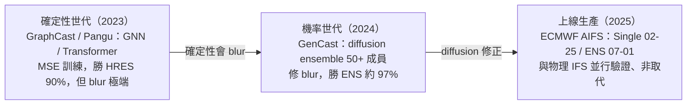
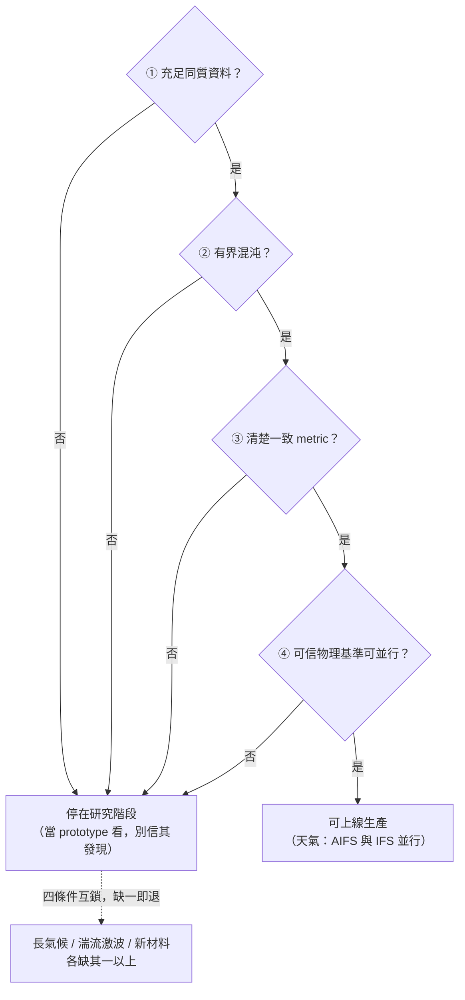

# 使用案例：科學發現

> 神經代理 / 生成式物理用於科學模擬 —— 本倉與「純 AI」最遠的一角，卻是**唯一真正上線生產**的角落（天氣預報已在 ECMWF 業務運行）。這個使用案例的問題很實際：**快，但是對嗎？什麼時候對、什麼時候崩？**

*圖：唯一從 research 一路走到 24/7 業務管線的代理路線 —— 確定性會 blur，diffusion 修正，最後以「與物理並行」上線。*

## 核心命題：唯一上線生產的代理，但契約嚴格

神經代理用「學出來的快速前向」換掉昂貴的數值求解器。它在**天氣**上已經成熟到上線——但成熟的形態是**與物理模型並行驗證、不是取代**（ECMWF AIFS 與 IFS 互補）。離開天氣那套「資料充足 + 有界混沌 + 清楚指標 + 可驗證物理基準」的舒適圈，代理就退化。**快不保證對，更不保證真新。**

## 三條線

1. **天氣 / 氣候（已上線）** —— [天氣神經代理](./weather-surrogates.md)：GraphCast/Pangu（確定性，<1 分鐘勝 HRES 90%）→ **GenCast diffusion ensemble**（修確定性的 blur，勝 ENS ~97%）→ **ECMWF AIFS 業務運行**。本手冊唯一上線的代理成功。
2. **PDE / neural operator** —— FNO（解析度無關、~1000× 快，已有 [foundation 解構](../../foundations/neural-surrogates/fno.md)）/ FourCastNet（FNO 基底的天氣）。把「in-distribution 求解加速」做到極致，但 shocks/非週期邊界條件/高維是邊界。
3. **材料 / 分子發現** —— MLIP（MACE/NequIP，把 DFT 精度帶到 force-field 速度，最乾淨的「代理取代昂貴求解器」）；GNoME（2.2M 預測晶體）——但**發現宣稱有虛胖爭議**。

## 代理契約：哪裡可信、哪裡崩

詳見 [代理的契約](./surrogate-limits-and-discovery.md)：

| 可信（已驗證/部署） | 會崩 |
|---|---|
| 業務中程天氣（AIFS 上線、GenCast SOTA ensemble） | **長程不穩**（年長度 rollout：blow-up/drift/失去季節性） |
| in-distribution PDE 求解（FNO ~1000×） | **守恆律違反**（autoregressive 跳步違反質量守恆） |
| DFT 級能量（MLIP，~100 個參考即可） | **OOD / 極端事件**（低估熱/風極端量級） |
| 近地面 T/風的短中程極端 | **模糊回歸氣候態**（MSE double-penalty 驅動） |

**為什麼天氣成功（可轉移的四條件）**：① 充足同質資料（數十年 ERA5）；② 有界混沌（~2 週可預測度）；③ 清楚一致的技巧指標（RMSE/ACC/CRPS）；④ 可信物理基準（IFS）可並行驗證。更難的域缺其一以上 → 停在研究階段。

*圖：四條件轉移閘 —— 互鎖式 AND 閘，全綠才能上線；缺任一條就退回研究階段。*

## 本區解構

- [天氣神經代理](./weather-surrogates.md) — GraphCast / GenCast / AIFS：唯一上線生產的代理成功，確定性→diffusion 轉折，業務並行驗證
- [代理的契約 —— 哪裡可信、哪裡崩、發現宣稱的虛胖](./surrogate-limits-and-discovery.md) — 四種失效 + 天氣成功四條件 + GNoME 虛胖爭議 vs MLIP 乾淨案

## 與 foundation 的對應

天氣/PDE 的方法錨點在 foundation：[GraphCast](../../foundations/neural-surrogates/graphcast.md) · [GenCast](../../foundations/neural-surrogates/gencast.md) · [FNO](../../foundations/neural-surrogates/fno.md) · [PINN](../../foundations/physics-conditioning/pinn.md)（物理約束的姊妹）。本使用案例綜合它們、加部署與契約角度。

## 未來前沿

- **長程穩定 + 守恆**：把守恆律以 hard-constraint / aux-loss 注入代理（injection 軸的進階），是讓代理離開天氣舒適圈的關鍵。
- **發現的可信度閘門**：GNoME 爭議顯示「快速生成候選 ≠ 驗證過的發現」——novelty/credibility/utility 的自動驗證還沒有。
- **OOD 極端**：代理對未見極端的低估，是氣候/災害應用的硬阻斷。
