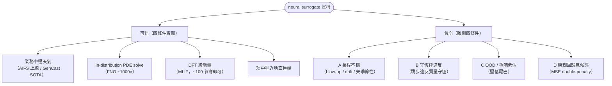
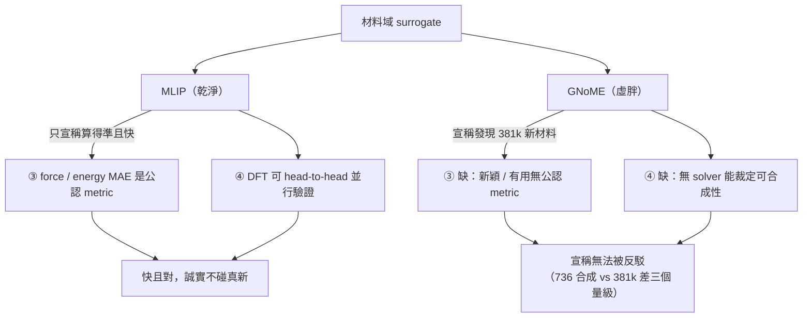

<!-- ontology-5axis output=field injection=data-only control=param temporal=autoregressive domain=weather -->

# 神經代理的契約 —— 哪裡可信、哪裡崩、發現宣稱的虛胖 解構

> **定位**：本篇不解構單一模型，而是橫切整個 use-case 的一張 **trust contract**（信任契約）—— 把「neural surrogate 取代昂貴 solver」這件事拆成「**哪四個條件齊備時可信、離開哪條就崩、宣稱『發現』時又如何虛胖**」。Persona：做 ML-for-science 的人，心裡的問題是「**快是真的快，但是不是對？什麼時候會崩？**」
>
> **為什麼進名單**：scientific-discovery 是本倉「最 productionized 的一角」（見 [overview.md](./overview.md)），天氣已經上線（ECMWF AIFS 跑 GraphCast/GenCast 線）。但「上線」這件事正在被**錯誤外推**到所有科學域 —— 從「天氣 surrogate 能打 IFS」滑到「AI 已能發現新材料」。這兩個宣稱的**可證偽程度差了一個量級**：天氣有 head-to-head 的 RMSE/ACC 與並行跑的物理基準，材料發現的「新」與「有用」卻多半**沒被獨立合成驗證**。這篇就是把那條滑坡上的縫補回來 —— 它是讀完 [fno.md](../../foundations/neural-surrogates/fno.md) / [pinn.md](../../foundations/physics-conditioning/pinn.md) 兩條方法線後，回答「**那這些方法，整體在科學上能信到哪？**」的那一篇。

---

## 1. TL;DR：快不等於對；天氣成功是因為四個條件齊備

一句話：**神經代理（neural surrogate）的可信度不是模型屬性，是「域屬性 + 評測屬性」**。天氣之所以成為 surrogate 的旗艦案例，不是因為 transformer 比 PDE solver 聰明，而是因為它**剛好同時擁有四個條件**：① 充足同質資料、② 有界混沌、③ 清楚一致的 skill metric、④ 可信且可並行驗證的物理基準。**這四條是契約的全部條款。**

- **快是真的**：FNO 比 pseudo-spectral solver 快 ~1000×（見 [fno.md](../../foundations/neural-surrogates/fno.md) §4）；MLIP 把 DFT 精度帶到 force-field 速度（§4）；GraphCast 在單 GPU 上分鐘級出全球預報，IFS 要超算機時。
- **對是有條件的**：一旦離開上述四條件 —— **長程外推、守恆敏感、OOD 極端、發現宣稱** —— surrogate 系統性退化，而且**退化方式可預測**（見 §2 四個崩）。
- **「發現」最危險**：天氣的宣稱（「7 天 RMSE 打贏 IFS」）可以被獨立 reproduce；材料發現的宣稱（「找到 38 萬個新穩定晶體」）**多數沒有被外部合成驗證**，於是「快但是不是對、是不是真新」的張力在這裡被放到最大（見 §4 GNoME 爭議）。

> **本篇的核心斷言**：把同一個 neural surrogate 從天氣搬到「長氣候 / 湍流激波 / 新材料合成」，崩的不是模型，是**它賴以可信的四個條件少了一個以上**。所以判斷一個 surrogate 宣稱該不該信，**先檢查四條件，再看 benchmark 數字**。

*圖：神經代理的信任契約 —— 左半可信都有金標準裁判，右半會崩都源於 autoregressive-from-data 的結構性後果。*

---

## 2. 哪裡崩：四個系統性失效模式

這四個崩**不是實作 bug，是 autoregressive-from-data 範式的結構性後果**。它們在 [fno.md](../../foundations/neural-surrogates/fno.md) §8（drift / 守恆不嚴）與 [pinn.md](../../foundations/physics-conditioning/pinn.md)（chaotic long-horizon 是公認未解）已分頭出現；這裡把它們**統一成一張表**，並補上 2024-2026 的天氣域實證。

| 崩 | 機制 | 實證 | 嚴重度 |
|---|---|---|---|
| **A 長程不穩 / 漂移** | autoregressive 是**非收斂的數值積分**：每步把上一步輸出當輸入，誤差傳播 + spectral bias 疊加 | arXiv [2605.30184](https://arxiv.org/abs/2605.30184)：9 個 SOTA AI 天氣模型跑**年長度 rollout**，出現三種失效 **blow-up / drift / loss-of-seasonality** | high |
| **B 守恆律違反** | autoregressive「跳步」直接吐下一狀態，不解約束方程 → 質量不守恆、地轉 / 靜力平衡不滿足 | Bonavita arXiv [2309.08473](https://arxiv.org/abs/2309.08473) + GRL 2024：**違反質量守恆**，產生**不真實的垂直運動與降水** | high |
| **C 極端事件低估** | MSE-type loss 獎勵「往均值靠」；尾端樣本稀少 → 模型壓低尾巴 | GMD 2024（[17/7915](https://gmd.copernicus.org/articles/17/7915/2024/)）：**低估熱 / 風極端的量級**（尤其長 lead）；IFS HRES 在冷極端（南極 / 澳紐）仍勝；降水變異被壓抑 | high（科學 / 防災） |
| **D 模糊回歸氣候態** | 同樣是 MSE blur：deterministic surrogate 在可預測度耗盡後**退化成輸出「平均天氣」** | GMD 2024 結論「**mixed results**」：資料驅動在地面 T / 風極端可 competing，但 **5-7 天後因 blur 退化** | medium-high |

**A 的機制細節（本篇最值得記的一條）**：arXiv 2605.30184 指出穩定性取決於模型對**小尺度時空分量的處理** —— **不穩的模型放大高頻能量**（噪聲自我餵養→blow-up），**穩的模型行為像 denoiser**（每步把高頻壓掉）。這跟 [fno.md](../../foundations/neural-surrogates/fno.md) 裡 **PDE-Refiner 用 diffusion-style refinement 修高頻**把 stable horizon 拉長一個量級，是**同一個 insight 的兩面**：long-rollout 穩不穩，取決於你**主動去噪還是放任高頻積累**。

> **B vs A 的分工**：A 是「會不會炸 / 漂走」（dynamical instability），B 是「就算不炸，物理量也對不上帳」（physical inconsistency）。一個系統可以 A 穩（不 blow-up）卻 B 崩（質量帳簿漂移）—— 這正是 [fno.md](../../foundations/neural-surrogates/fno.md) §8.5 對 `injection=hard-constraint` 標籤的 caveat：FNO 不是 by-construction 守恆，long rollout 質量 / 能量會漂。

> **per-model 數字 UNVERIFIED**：arXiv 2605.30184 是 2026 新文，本篇只讀摘要；**三種失效模式的方向確定**，但「哪個模型在第幾天 blow-up」的逐模型數字未核（UNVERIFIED）。

---

## 3. 為什麼天氣是成功案例：四個條件（可轉移的教訓）

把天氣的成功**反向工程**成四條，就得到一張「**判斷任何 surrogate 宣稱能不能信**」的 checklist。**這四條缺一，就退回研究階段。**

| # | 條件 | 天氣為何滿足 | 缺了會怎樣 |
|---|---|---|---|
| ① | **充足同質資料** | 數十年 **ERA5** 再分析，固定網格、同一物理一致 | 缺 → 材料合成 / 罕見湍流：樣本稀、異質、無一致 ground truth |
| ② | **有界混沌** | 可預測度 ~2 週，且在**已刻畫的 regime** 內（大氣動力學成熟） | 缺 → 長氣候漂移、湍流 / 激波在未刻畫 regime → A 崩 |
| ③ | **清楚一致的 skill metric** | **RMSE / ACC / CRPS** 對 HRES / ENS 是社群標準目標 → 可證偽 head-to-head | 缺 → 材料「新穎度 / 有用度」沒有公認 metric → 宣稱無法被反駁（§4） |
| ④ | **可信物理基準可並行驗證** | **IFS**（ECMWF）每天並行跑，是可信、可驗證、能即時對打的 baseline | 缺 → 沒有「金標準 solver」當裁判 → surrogate 自說自話 |

**為什麼這四條是「契約」而非「清單」**：它們**互鎖**。沒有 ④ 物理基準，③ 的 metric 沒有對打對象；沒有 ② 有界，① 的資料再多也覆蓋不到外推區；沒有 ① 資料，④ 的基準也訓不出 surrogate。天氣是少數**四條同時亮綠燈**的科學域 —— 所以它上線了，而**長氣候 / 湍流激波 / 新材料合成各缺其一以上，所以停在研究階段**。

> **可轉移教訓（本篇給 ML-for-science 的可操作結論）**：拿到一個「AI 取代 solver」的 pitch，**先問四條件**：資料夠不夠同質？域是不是有界且已刻畫？有沒有大家都認的 metric？有沒有可信 solver 能並行當裁判？**四條全綠 → 可考慮上線；任一缺 → 當研究 prototype 看，別信它的「發現」。**

---

## 4. 材料發現：surrogate 取代 solver（MLIP，乾淨）vs 發現宣稱虛胖（GNoME，爭議）

材料域同時上演契約的**最乾淨案例**與**最虛胖案例**，正好把「快 / 對 / 真新」三件事拆開。

*圖：同一材料域，MLIP 滿足契約 ③④ 故乾淨，GNoME 缺 ③④ 故虛胖 —— 差別不在模型強弱，在域與評測。*

### 4a. MLIP：本倉最乾淨的「surrogate 取代昂貴 solver」案 ⚡

**MLIP（Machine-Learning Interatomic Potential）** 把 **DFT 精度**帶到 **classical force-field 速度** —— 這是契約**完全滿足**的案例，因為它**沒有宣稱發現任何東西**，只宣稱「**算得跟 DFT 一樣準但快幾個數量級**」，而這個宣稱**可以對 DFT head-to-head 驗證**（④ 物理基準齊備）。

- **NequIP / MACE / Allegro**（等變 GNN，E(3)-equivariant）是 **accuracy-vs-cost 的 Pareto 前緣** —— 對應本倉 ontology axis 2 的 `hard-constraint`（架構天然滿足等價性，見 [ontology.md](../../cheat-sheet/ontology.md) Axis 2）。
- **資料效率驚人**：NequIP 從 **<1000（甚至 ~100）個 DFT 參考**即可訓出可用 potential —— 因為等變性把對稱性 baked in，不必用資料去學對稱（這跟 [pinn.md](../../foundations/physics-conditioning/pinn.md) 的 aux-loss「軟約束」相對：MLIP 是**硬約束省資料**）。
- **為什麼乾淨**：它的契約四條件齊備 —— ① DFT 軌跡是同質資料；② 勢能面在訓練覆蓋區是有界的；③ force / energy MAE 是公認 metric；④ DFT 本身就是可並行的物理基準。**所以 MLIP 是「快且對」的典範，且它誠實地不碰「真新」。**

### 4b. GNoME：發現宣稱的虛胖 ★ 本篇核心張力

DeepMind **GNoME**（Nature 2023，[s41586-023-06735-9](https://www.nature.com/articles/s41586-023-06735-9)）的 headline：

- **2.2M** 預測穩定晶體；
- **381k** 新穩定材料（把已知穩定材料庫從 ~48k 擴到 ~421k）;
- **736** 個被外部實驗室獨立合成（concurrent work）。

數字很大，但 **381k 宣稱 vs 736 驗證**之間有三個量級的缺口 —— 而**爭議正卡在這個缺口的本質**。

**★ Cheetham & Seshadri 反駁**（Chem. Mater. 2024，[10.1021/acs.chemmater.4c00643](https://pubs.acs.org/doi/10.1021/acs.chemmater.4c00643)）系統檢視後直指：符合 **novelty（真新）+ credibility（可信）+ utility（有用）三重標準**的，**「scant evidence」（證據稀薄）**。具體質疑：

- 多為**已知材料的瑣碎改寫**（trivial substitution，換個元素位點，不是新化合物）；
- 含**放射性 / 無用組成**（理論穩定 ≠ 可合成 ≠ 有用）；
- **僅晶態無機物**（crystalline inorganic only）—— 覆蓋面遠小於「材料發現」的口號。

> **這正是本篇的張力一句話**：GNoME 是「**快**」（GNN 篩百萬候選秒級）但**不一定「對」**（理論穩定 ≠ 真能合成）、更**不一定「真新」**（多為已知物瑣碎改寫）。它**缺契約的 ③ 與 ④**：材料「新穎 / 有用」沒有公認可證偽 metric（③ 缺），也沒有「金標準 solver」能對每個候選並行裁定可合成性（④ 缺，DFT 只能算理論穩定，不能算「能不能被人做出來、做出來有沒有用」）。**於是宣稱無法被有效反駁 —— 虛胖由此而生。**

> **對照 AlphaFold（一句）**：AlphaFold（Nature 2021）CASP14 median **GDT_TS 92.4**，後擴到 ~200M 結構 —— 它之所以**不虛胖**，是因為 CASP 是**盲測、有實驗結構當裁判**（④ 齊備）、GDT_TS 是公認 metric（③ 齊備）。**同樣是「AI 預測」，AlphaFold 滿足契約、GNoME 缺兩條 —— 差別不在模型強弱，在域與評測。**

---

## 5. 五軸定位 + 契約一句話

本篇橫切多模型，但以**天氣 surrogate 的主流形態**標 5 軸（與 [graphcast.md](../../foundations/neural-surrogates/graphcast.md) / [fno.md](../../foundations/neural-surrogates/fno.md) 對齊）：

| 軸 | 值 | 說明 |
|---|---|---|
| output | `field` | 連續氣象場（風 / 溫 / 壓 / 濕） |
| injection | `data-only` | 主流 AI 天氣模型物理靠大量 ERA5 隱式學會，**無守恆架構保證** —— 這正是 §2-B 守恆違反的根源（對比 MLIP 的 `hard-constraint` / PINN 的 `aux-loss`） |
| control | `param` | IC / 邊界 / 物理參數作為輸入 |
| temporal | `autoregressive` | 一幀一幀往前，下一狀態 condition 上一狀態 —— **§2-A 漂移與 §2-B 守恆違反的結構根源** |
| domain | `weather` | 旗艦成功域；離開它（長氣候 / 材料）即缺契約條件 |

> **★ 契約一句話**：**神經代理在「有充足資料、有界、有清楚 metric、有物理基準可並行驗證」的域（天氣）上可信且已上線；離開這四條件 —— 長程外推、守恆敏感、OOD 極端、發現宣稱 —— 就退化。快不保證對，更不保證真新。**

---

## 6. 跨路線綜合

- **連 [weather-surrogates.md](./weather-surrogates.md)（同 use-case，方法落地）**：那篇講 GraphCast 怎麼上 ECMWF prod；**本篇講「上 prod 的四個前提條件 + 離開條件時的四個崩」** —— 兩篇互為正反面。weather-surrogates 是「成功怎麼做到」，本篇是「成功的邊界在哪、為什麼別的域複製不了」。
- **連 [overview.md](./overview.md)（use-case 全景）**：overview 列四子場（weather / climate / molecular / engineering CFD）；本篇給一把**橫切四子場的契約尺**：weather ④ 全綠（上線）、molecular 分裂（MLIP 綠 / GNoME 缺 ③④）、climate 缺 ②（長程漂移）、CFD 缺 ②（高 Re 湍流未刻畫，見 [fno.md](../../foundations/neural-surrogates/fno.md) §8.6）。
- **連 [fno.md](../../foundations/neural-surrogates/fno.md)（方法：spectral operator）**：FNO 是 surrogate 的**方法樣本**，本篇的 §2-A / §2-B 在 fno.md §8.1 / §8.5 有 PDE 域的對應實證；**本篇不重拆 FNO**，只把它的失效**抬升到「域 + 評測」層級**並補天氣域 2024-2026 證據。
- **連 [pinn.md](../../foundations/physics-conditioning/pinn.md)（方法：aux-loss 軟約束）**：PINN 的 Krishnapriyan / NTK failure 是「soft constraint 在 chaotic / 偏離 trivial regime 崩」；本篇的 §2-A 長程不穩、§3-② 有界混沌條件，就是那組 failure 在**天氣 / 氣候尺度**的放大版。**NO-DUP**：PINN（aux-loss）/ FNO（spectral operator）已各有 foundation 頁深拆方法機制，本篇只引用、不重拆，專注「契約 + 虛胖」這個 foundation 頁沒涵蓋的角度。
- **連 [ontology.md](../../cheat-sheet/ontology.md)（5 軸全景）**：本篇是「**同一條 `output=field` `temporal=autoregressive` 線，injection 從 `data-only`（天氣，會崩）→ `hard-constraint`（MLIP，乾淨）的可信度光譜**」的活教材 —— injection 訊號越強，§2 的崩越少，但域越窄（呼應 ontology Axis 2 的 Pareto：fidelity↑ generalization↓）。

---

## 7. 參考

**Canonical（surrogate 成功側）**

1. Li, Z. et al. *Fourier Neural Operator for Parametric PDEs.* arXiv [2010.08895](https://arxiv.org/abs/2010.08895), ICLR 2021. —— surrogate 取代 solver 的速度宣稱來源。
2. Jumper, J. et al. *Highly accurate protein structure prediction with AlphaFold.* Nature 2021. —— 滿足契約四條件的「AI 預測」對照組（CASP14 GDT_TS 92.4）。
3. Batzner, S. et al. *E(3)-Equivariant Graph Neural Networks for Data-Efficient and Accurate Interatomic Potentials (NequIP).* Nat. Commun. 2022. —— MLIP 資料效率（<1000 DFT 參考）。MACE / Allegro 同線。

**Canonical（崩 / 爭議側）**

4. *Can AI Weather Models Predict Beyond Two Weeks?* arXiv [2605.30184](https://arxiv.org/abs/2605.30184)（2026，**只讀摘要**）—— 9 模型年長度 rollout，blow-up / drift / loss-of-seasonality；機制 = spectral bias + 誤差傳播。**per-model 數字 UNVERIFIED。**
5. Bonavita, M. *On some limitations of current machine learning weather prediction models.* arXiv [2309.08473](https://arxiv.org/abs/2309.08473)（+ GRL 2024）—— autoregressive 跳步違反質量守恆、地轉 / 靜力平衡不滿足。
6. Olivetti, E. / Pasche, O. et al. *Do data-driven models beat numerical models in forecasting weather extremes?* GMD 2024, [gmd.copernicus.org/articles/17/7915/2024](https://gmd.copernicus.org/articles/17/7915/2024/) —— 低估熱 / 風極端量級；IFS HRES 冷極端（南極 / 澳紐）仍勝；除 GraphCast 外多數資料驅動模型不出降水。
7. Merchant, A. et al. *Scaling deep learning for materials discovery (GNoME).* Nature 2023, [s41586-023-06735-9](https://www.nature.com/articles/s41586-023-06735-9) —— 2.2M 預測 / 381k 新穩定 / 736 外部合成。
8. ★ Cheetham, A. K., Seshadri, R. *Artificial Intelligence Driving Materials Discovery? Perspective on the Article: Scaling Deep Learning for Materials Discovery.* Chem. Mater. 2024, [10.1021/acs.chemmater.4c00643](https://pubs.acs.org/doi/10.1021/acs.chemmater.4c00643) —— 「scant evidence」符合 novelty + credibility + utility 三重；多為瑣碎改寫 / 含放射性無用組成 / 僅晶態無機物。

**Boundary（方法線，本倉內，不重拆）**

- 方法：spectral operator surrogate → [../../foundations/neural-surrogates/fno.md](../../foundations/neural-surrogates/fno.md)
- 方法：aux-loss 軟約束失效 → [../../foundations/physics-conditioning/pinn.md](../../foundations/physics-conditioning/pinn.md)
- 落地：天氣 surrogate 上 prod → [weather-surrogates.md](./weather-surrogates.md) · use-case 全景 → [overview.md](./overview.md)
- 5 軸全景 → [../../cheat-sheet/ontology.md](../../cheat-sheet/ontology.md)

---

## §8 踩坑日誌

- **§8.1 把「天氣成功」當「surrogate 普世成功」**（severity: high）。最常見的誤讀 —— 看到 GraphCast 打 IFS 就以為任何域都能複製。**根因**：忽略契約四條件（§3）互鎖。**自查**：搬域前逐條打勾資料 / 有界 / metric / 物理基準；缺一就當研究 prototype。
- **§8.2 只看 single-step / 短 lead 的 RMSE**（severity: high）。短期 skill 漂亮會掩蓋 §2-A 長程崩。**根因**：autoregressive 誤差指數累積，t 小時看不出。**自查**：強制看年長度 rollout 的 energy spectrum drift 與 seasonality（arXiv 2605.30184 的測法），別只報 headline RMSE（與 [fno.md](../../foundations/neural-surrogates/fno.md) §8.1「別只看 single-step MSE」同源）。
- **§8.3 把「理論穩定」讀成「發現新材料」**（severity: high，材料域）。GNoME 虛胖的核心。**根因**：DFT-穩定 ≠ 可合成 ≠ 真新 ≠ 有用，四者被混為一談。**自查**：要求 novelty + credibility + utility 三重證據，且看**外部獨立合成數**（GNoME 736 vs 宣稱 381k 差三個量級）而非預測數。
- **§8.4 `data-only` 天氣模型被當守恆系統用**（severity: high，科學 / 防災）。下游拿 AI 預報算水 / 能收支會對不上帳。**根因**：injection=`data-only` 無守恆架構（§5 + §2-B）。**自查**：需要守恆帳簿時，補後處理投影或改用帶 `hard-constraint` / `aux-loss` 的模型（對比 MLIP / PINN）；別預期 autoregressive 跳步自動守恆。
- **§8.5 用 deterministic surrogate 預測極端事件**（severity: high）。MSE-blur 系統性低估尾端（§2-C/D）。**根因**：deterministic + MSE 獎勵回歸均值。**自查**：極端 / 尾端風險評估改用 ensemble / 機率模型（CRPS 而非 RMSE），並在長 lead 對 IFS HRES 校準（GMD 2024 顯示物理模型在冷極端仍勝）。
- **§8.6 拿不可證偽的 metric 自證**（severity: medium-high）。材料「新穎度 / 有用度」無公認 metric 時，任何數字都「好看」。**根因**：契約 ③ 缺失（§3）→ 宣稱無法被反駁。**自查**：報告 surrogate 成果時，明示用的是哪個社群標準 metric、對哪個物理基準並行驗證；若兩者都拿不出，標註為「研究階段、未驗證宣稱」。
- **§8.7 per-model 失效數字當定論引用**（severity: low-medium，本篇自身）。arXiv 2605.30184 為 2026 新文、本篇只讀摘要。**自查**：引用「三種失效模式」方向可用（已確認），但「哪個模型第幾天 blow-up」屬 **UNVERIFIED**，待讀全文 / 等同儕複核再升級為定論。

---

[← Back to Scientific Discovery](./overview.md)
